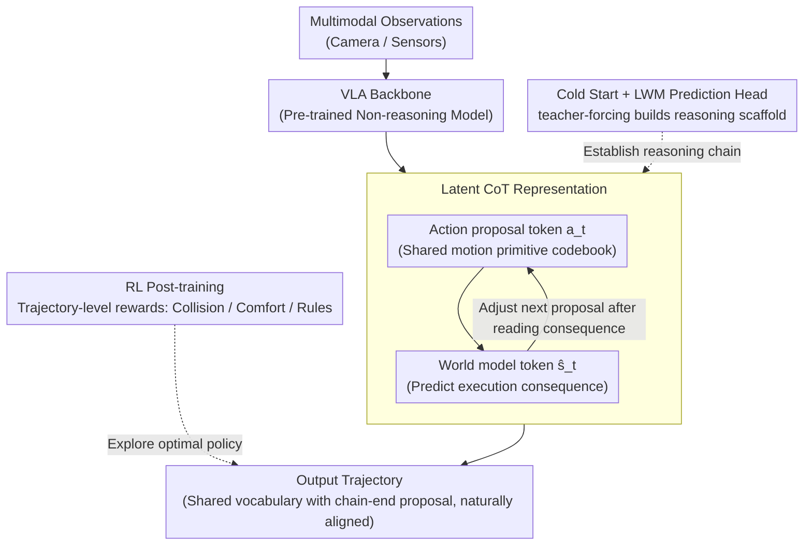

# Latent Chain-of-Thought World Modeling for End-to-End Autonomous Driving

**Conference**: CVPR 2026  
**arXiv**: [2512.10226](https://arxiv.org/abs/2512.10226)  
**Code**: None  
**Area**: LLM Reasoning  
**Keywords**: Latent Space Reasoning, Chain-of-Thought, World Model, End-to-End Driving, VLA Model

## TL;DR
LCDrive proposes the Latent Chain-of-Thought (Latent CoT) framework, which replaces natural language CoT for reasoning with action proposal tokens and world model prediction tokens. Through cold-start and RL post-training, it achieves lower latency and superior trajectory quality for end-to-end autonomous driving.

## Background & Motivation
1. **Background**: Vision-Language-Action (VLA) models have become a trend in end-to-end autonomous driving, with textual CoT reasoning introduced to improve performance in long-tail scenarios.
2. **Limitations of Prior Work**: (i) Natural language is unsuitable for representing spatio-temporal geometry and multi-agent interactions; (ii) Autoregressive generation of long text introduces significant latency; (iii) Generated actions may severely deviate from textual reasoning (e.g., text says "turn left" but the action is "turn right").
3. **Key Challenge**: While textual CoT leverages the reasoning capabilities of LLMs, text is not the optimal representation medium for driving decisions.
4. **Goal**: Design a more efficient and aligned reasoning representation to replace textual CoT.
5. **Key Insight**: Represent reasoning as structured sequences within a latent vector space rather than as natural language.
6. **Core Idea**: Alternately compose the latent CoT with action proposal tokens (sharing a vocabulary with output actions) and world model tokens (predicting future scene states).

## Method

### Overall Architecture
The core problem LCDrive addresses is that while VLA driving models borrow textual CoT for reasoning, language poorly expresses spatio-temporal geometry, slows down generation, and may conflict with final actions. The approach shifts the entire reasoning chain from natural language into a latent vector space. Instead of "thinking in words," the model alternately outputs two types of latent tokens: it first proposes a candidate action, then uses a world model to predict "what the scene will look like after execution." After observing the consequence, it adjusts the next action proposal, repeating this process until producing the final output trajectory. The system is trained in three stages: starting from a pre-trained non-reasoning VLA to cold-start the latent reasoning chain, then training a small world model prediction head for self-prediction of future states during inference, and finally refining the chain using RL post-training with trajectory-level rewards.

### Key Designs

**1. Latent CoT Representation: Natural Alignment of Reasoning Traces and Actions**

A critical weakness of textual CoT is the misalignment where "text says turn left, but action turns right"—reasoning and decision-making use two different representations with no guarantee of consistency. LCDrive ensures that action proposal tokens within the reasoning chain and the final output actions **share the same vocabulary**: a codebook of 1024 motion primitives obtained via k-means clustering of training data. Consequently, the "proposed action" and "output action" speak the same language, making alignment a structural guarantee rather than a forced penalty. The reasoning chain consists of alternating action proposal tokens $a_t$ (candidate actions) and world model tokens $\hat{s}_t$ (future scene state embeddings predicted by the latent world model head), forming a structure of $a_1 \to \hat{s}_1 \to a_2 \to \hat{s}_2 \to \dots$ representing "proposal—prediction—re-proposal." World model tokens encode physical interactions directly in the latent space, which is more precise than textual descriptions like "pedestrian ahead, should decelerate" and saves redundant tokens, resulting in shorter sequences and lower latency.

**2. Cold Start + LWM Prediction Head: Bootstrapping the Reasoning Scaffold**

Learning this latent reasoning chain directly from random initialization is nearly impossible, as the model lacks any initial concept of "proposal-prediction," giving RL no basis for exploration. During the cold-start phase, teacher-focussing is used to provide two components: world model states derived from ground truth (GT) future rollouts and action proposals generated by the model itself, allowing the model to establish the latent reasoning chain. Since GT future states are unavailable during inference, a compact Latent World Model (LWM) head is trained simultaneously to take a proposed action $a_t$ and output the corresponding world model embedding $\hat{s}_t \approx s_t$. This enables the model to self-sufficiently "imagine" the consequences of candidate actions during inference.

**3. RL Post-training: Exploring Optimal Reasoning-Decision Strategies**

Cold-starting only allows the model to imitate GT behavior, failing to learn better strategies beyond the GT. On the established reasoning scaffold, reinforcement learning is applied to simultaneously optimize latent reasoning tokens and final action predictions using trajectory-level rewards (incorporating collision, comfort, and traffic rule compliance). Notably, the gain from RL on the latent reasoning model is **significantly greater** than on the non-reasoning baseline. The authors suggest that the latent space is more continuous and suitable for policy gradient searches than discrete language space, providing a better optimization landscape for RL and demonstrating a synergistic effect between latent CoT and RL.

### Mechanism Example: A Left-Turn Decision in Latent Space

Consider a scenario where the vehicle needs to turn left at an intersection with an oncoming car. The model first proposes action $a_1$ = "turn left at normal speed" from the codebook. The world model prediction head generates consequence $\hat{s}_1$—encoding in the latent space that "the distance to the oncoming car is shrinking rapidly, posing a collision risk." Reading this consequence, the model proposes $a_2$ = "decelerate to yield before turning." The prediction head then provides $\hat{s}_2$ = "oncoming car passes, distance is safe." This $a_1 \to \hat{s}_1 \to a_2 \to \hat{s}_2$ latent chain completes multi-step reasoning of "try—observe—adjust" without generating a single natural language token. The final output trajectory is naturally consistent with the tail proposal $a_2$ as they share the same vocabulary. Compared to textual CoT, which would write a long paragraph, this chain is shorter, faster, and avoids conflicts between text and action.

### Loss & Training
Cold-start phase: Action prediction loss + world model prediction loss (LWM head forces $\hat{s}_t$ to approximate GT state $s_t$). RL post-training: GRPO or similar policy gradient methods, with rewards based on trajectory-level comprehensive metrics like collision, comfort, and traffic rule adherence.

## Key Experimental Results

### Main Results

| Method | Inference Latency | Trajectory Quality | RL Gain | Description |
|------|---------|---------|-----------|------|
| LCDrive (Latent CoT) | Lowest | Best | Largest | Latent Reasoning |
| Text CoT VLA | High | Second Best | Medium | Natural Language Reasoning |
| Non-reasoning VLA | Low | Baseline | Small | No Reasoning |

### Ablation Study

| Configuration | Key Metrics | Description |
|------|---------|------|
| Full LCDrive | Best | Cold start + LWM + RL |
| w/o RL post-training | Significant drop | RL benefits latent reasoning most |
| w/o World model tokens | Decrease | Action proposals alone are insufficient |
| w/o Cold start | Severe drop | RL cannot establish reasoning from scratch |

### Key Findings
- LCDrive exhibits lower inference latency than textual CoT because latent token sequences are more compact (no redundant language tokens).
- RL post-training yields much higher improvements for the latent reasoning model compared to the non-reasoning model, suggesting that latent CoT provides a superior optimization landscape.
- Qualitative analysis shows that latent CoT reasoning leads to more coherent decisions in multi-agent interaction scenarios.

## Highlights & Insights
- The insight that **"reasoning does not necessarily require language"** is profound—driving decisions are essentially spatial reasoning rather than linguistic reasoning.
- **Action-reasoning alignment** is naturally achieved through a shared vocabulary, eliminating a core weakness of textual CoT.
- The **synergy between RL and latent reasoning** is a significant finding—the latent space is more amenable to RL optimization than the language space.

## Limitations & Future Work
- Cold start depends on GT future states, requiring comprehensive scene annotations.
- The accuracy of the LWM prediction head directly impacts reasoning quality.
- Evaluation is currently based on a single dataset; generalization needs further verification.

## Related Work & Insights
- **vs AR1/DriveVLM**: These use textual CoT reasoning, resulting in high latency and potential action-text misalignment.
- **vs MILE/LAW**: These use latent world models but not for structural reasoning chains. LCDrive integrates both into a structured reasoning paradigm.

## Rating
- Novelty: ⭐⭐⭐⭐⭐ Latent CoT replacing textual CoT is a conceptual breakthrough.
- Experimental Thoroughness: ⭐⭐⭐⭐ Comprehensive evaluation on large-scale driving datasets.
- Writing Quality: ⭐⭐⭐⭐⭐ Precise problem definition and thorough comparative analysis.
- Value: ⭐⭐⭐⭐⭐ Significant implications for the VLA reasoning paradigm.

<!-- RELATED:START -->

## Related Papers

- [\[ICLR 2026\] Generalizable End-to-End Tool-Use RL with Synthetic CodeGym](../../ICLR2026/llm_reasoning/generalizable_end-to-end_tool-use_rl_with_synthetic_codegym.md)
- [\[ICLR 2026\] SimpleTIR: End-to-End Reinforcement Learning for Multi-Turn Tool-Integrated Reasoning](../../ICLR2026/llm_reasoning/simpletir_end-to-end_reinforcement_learning_for_multi-turn_tool-integrated_reaso.md)
- [\[CVPR 2026\] EagleVision: A Dual-Stage Framework with BEV-grounding-based Chain-of-Thought for Spatial Intelligence](eaglevision_a_dual-stage_framework_with_bev-grounding-based_chain-of-thought_for.md)
- [\[CVPR 2026\] Rationale-Enhanced Decoding for Multi-modal Chain-of-Thought](rationale-enhanced_decoding_for_multi-modal_chain-of-thought.md)
- [\[ICML 2026\] A Formal Comparison Between Chain of Thought and Latent Thought](../../ICML2026/llm_reasoning/a_formal_comparison_between_chain_of_thought_and_latent_thought.md)

<!-- RELATED:END -->
