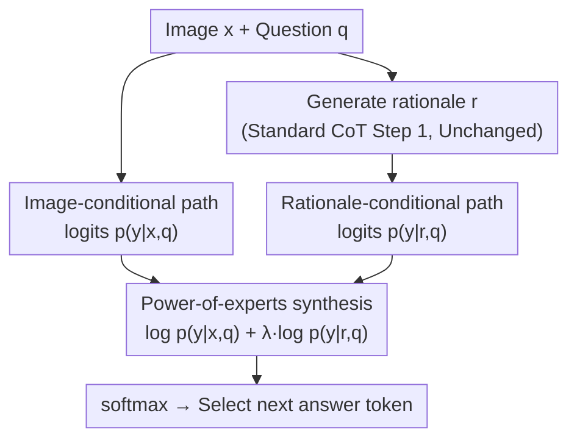

# Rationale-Enhanced Decoding for Multi-modal Chain-of-Thought

**Conference**: CVPR 2026  
**arXiv**: [2507.07685](https://arxiv.org/abs/2507.07685)  
**Code**: None  
**Area**: LLM Reasoning  
**Keywords**: Chain-of-Thought reasoning, Multimodal Large Language Models, Decoding strategy, rationale grounding, plug-and-play

## TL;DR
This paper discovers that existing LVLMs actually ignore the content of intermediate rationales during CoT reasoning. It proposes RED (Rationale-Enhanced Decoding), which multiplies next-token distributions conditioned on images and rationales at the logit level. Theoretically equivalent to the optimal solution for KL-constrained reward maximization, RED significantly improves multimodal reasoning accuracy without requiring training.

## Background & Motivation

**Background**: Large Vision-Language Models (LVLMs) adopt the Chain-of-Thought (CoT) approach from LLMs, first generating an intermediate reasoning process (rationale) and then producing the final answer based on image + rationale + question. It is widely believed that CoT enhances the grounding and accuracy of multimodal reasoning.

**Limitations of Prior Work**: The authors reveal a surprising fact through two key experiments—LVLMs **actually ignore the rationale content** during CoT reasoning. (1) Attention contribution analysis: when image and rationale are provided simultaneously, the attention contribution of the rationale drops significantly as image tokens dominate predictions. (2) Rationale replacement experiment: when the correct rationale is replaced with a completely irrelevant one, model performance remains almost unchanged, suggesting the model does not utilize the semantic information of the rationale.

**Key Challenge**: In practice, the joint conditional probability $p_\theta(y_i|\mathbf{y}_{<i}, x, r, q)$ fails to effectively utilize information from $r$, as the "attractiveness" of image tokens far exceeds that of rationale tokens. However, removing the image to use only $p_\theta(y_i|\mathbf{y}_{<i}, r, q)$ leads to a loss of visual information.

**Goal**: Design a decoding strategy that requires no additional training to enable LVLMs to **truly** utilize both image and rationale information during CoT reasoning.

**Key Insight**: **Decouple** the image condition and the rationale condition into two independent distributions and synthesize them at the logit level to avoid the rationale being ignored under joint conditioning.

**Core Idea**: By reformulating CoT reasoning as a KL-constrained maximization problem where the rationale-conditional log-likelihood serves as the reward, the optimal decoding strategy is derived as: image-conditional probability $\times$ rationale-conditional probability to the power of $\lambda$.

## Method

### Overall Architecture
Standard multimodal CoT involves two steps: (1) given image $x$ and question $q$, generate a rationale $r$; (2) given $x, r, q$, generate the final answer. RED modifies only the **decoding strategy** of step (2). It does not alter model parameters or rationale generation, making it a plug-and-play enhancement for any rationale generation method. It addresses the issue where $p(y|x,r,q)$ decoding leads the model to **ignore the rationale** and revert to only looking at the image. RED formulates "using the rationale" as a decoding objective with theoretical guarantees, resulting in a single line of logit weighting.

> This diagram illustrates the data flow of RED decoding: the image-conditional path and the rationale-conditional path each perform one forward pass. The results are synthesized at the logit layer via power-of-experts before producing the answer token via softmax.

### Key Designs

**1. Formulating CoT Decoding as KL-constrained Reward Maximization**

A new next-token distribution $\pi$ is introduced to optimize:

$$\max_\pi \mathbb{E}_\pi[R] - \beta \mathbb{D}_{\text{KL}}[\pi \| \pi_{\text{ref}}]$$

where the reward $R = \log p_\theta(y_i | \mathbf{y}_{<i}, r, q)$ is the **rationale-grounding reward** (maximizing this forces the model to use the rationale), and the reference policy $\pi_{\text{ref}} = p_\theta(y_i | \mathbf{y}_{<i}, x, q)$ is the **image-conditional distribution** (the KL constraint preserves visual information). This balance avoids the dilemma of either ignoring the rationale or losing the image.

**2. Closed-form Optimal Solution: Power-of-Experts Decoding**

KL-constrained reward maximization has a known optimal policy form. Applying it here yields the closed-form solution (Theorem 4.1 proves this is the optimal solution without training):

$$\hat{p}_\theta(y_i) = \frac{1}{Z_\theta}\, p_\theta(y_i|\mathbf{y}_{<i}, x, q) \times p_\theta(y_i|\mathbf{y}_{<i}, r, q)^\lambda$$

This is a **power-of-experts** distribution that emphasizes the **intersection** of the "image condition" and "rationale condition" probabilities; only tokens supported by both are amplified. $\lambda = 1/\beta$ controls the influence weight of the rationale.

**3. Implementation: Weighted Summation at the Logit Level**

Taking the logarithm of the above expression turns it into logit addition:

$$\widehat{\text{logits}}_\theta(y_i) = \log\text{softmax}\big(\text{logits}_\theta(y_i|\mathbf{y}_{<i}, x, q)\big) + \lambda \cdot \log\text{softmax}\big(\text{logits}_\theta(y_i|\mathbf{y}_{<i}, r, q)\big)$$

A final softmax yields $\hat{p}_\theta(y_i)$. The two logit paths can be batch-paralleled, adding minimal latency.

### Mechanism Walkthrough (Decoding a single answer token)
Assume question $q$="What color is the cup in the picture?", rationale $r$="There is a red mug on the table", and the model is decoding token $y_i$.
1. **Dual Forward Passes**: One pass with $(x, q)$ for image-conditional logits; another with $(r, q)$ for rationale-conditional logits.
2. **Image Path**: Due to dark lighting, probabilities for "red" and "brown" are close (0.4 / 0.35)—relying solely on the image might lead to the wrong answer "brown".
3. **Rationale Path**: "red" has a probability of 0.8, "brown" is 0.05—the reasoning clearly points to red.
4. **Power-of-Experts Synthesis** ($\lambda=1$): Adding the log-probs results in a final score for "red" that far exceeds "brown".
5. **Comparison**: In standard $p(y|x,r,q)$ decoding, the model might be biased by the lighting and answer "brown". RED pulls the model back via the explicit rationale term while retaining the image term to prevent blind reliance on rationales.

### Loss & Training
RED is a purely inference-time method with **zero training**. It requires two forward passes (image-conditional + rationale-conditional) synthesized at the logit level. The only hyperparameter is $\lambda$, which controls the influence of the rationale.

## Key Experimental Results

### Main Results

**Accuracy on GQA Dataset (%)**

| Method | Gemma-3-4B | Gemma-3-12B |
|------|-----------|------------|
| Direct (No CoT) | 40.00 | 45.34 |
| CoT (Standard) | 41.08 | 41.76 (Decrease!) |
| CCoT (Scene Graph) | 44.54 | 44.50 |
| RED + CoT | Significant Gain | Significant Gain |
| RED + CCoT | Significant Gain | Significant Gain |

**Key Finding: Replacement with Irrelevant Rationale**

| Input | Gemma-3-4B | Gemma-3-12B |
|------|-----------|------------|
| $(x, r_{\text{CoT}}, q)$ | 41.08 | 41.76 |
| $(x, r'_{\text{CoT}}, q)$ Irrelevant rationale | 41.88 | 41.75 |
| $(r_{\text{CoT}}, q)$ Rationale only | 40.15 | 37.87 |
| $(r'_{\text{CoT}}, q)$ Irrelevant rationale only| 7.40 | 16.21 |

### Ablation Study

| Configuration | Effect | Description |
|------|------|------|
| Standard CoT decoding | Baseline | $p(y|x,r,q)$ ignores rationale |
| Rationale-only condition | Decrease | Lacks visual information |
| RED (Optimal $\lambda$) | Optimal | Balances image and rationale |
| High-quality rationale (GPT-4) + RED | Further Gain | RED gains increase with rationale quality |

### Key Findings
- **Standard CoT is often worse than direct answering**: On Gemma-3-12B, CoT accuracy dropped from 45.34 to 41.76 because the model ignored the rationale but was disturbed by additional noise.
- **Rationale replacement experiment provides definitive evidence**: Replacing correct rationales with random ones resulted in almost no performance change ($\pm 0.1\%$). However, removing the image while keeping the rationale caused a massive drop (40.15 vs 7.40), proving LVLMs ignore rationales when images are present.
- RED yields larger gains when combined with high-quality rationales (e.g., from GPT-4), showing RED effectively "uses" the rationale.
- RED is plug-and-play and can be stacked with other contrastive decoding methods (VCD, LCD).

## Highlights & Insights
- **Problem identification is more valuable than the solution**: The paper reveals the critical phenomenon that "LVLMs ignore rationales in multimodal CoT," supported by elegant experiments using attention analysis and rationale replacement. This challenges the assumption that CoT is always beneficial.
- **Theoretical Elegance**: By deriving the decoding strategy as an optimal solution for KL-constrained reward maximization, the logit multiplication operation is backed by a rigorous framework. This RLHF-inspired approach can be extended to other distribution fusion problems.
- **Extreme Simplicity**: Implementation requires only a few lines of code (weighted log-softmax summation) without training, architectural changes, or extra models.

## Limitations & Future Work
- Requires two forward passes, doubling inference overhead (though parallelizable).
- Rationale generation still uses standard decoding; RED's gains depend heavily on rationale quality.
- $\lambda$ requires tuning on datasets, as the optimal value may vary across tasks.
- Does not deeply analyze *why* LVLMs ignore rationales (potential reasons like positional bias or overfitting are mentioned but not verified).
- Validated primarily on VQA tasks; limited evaluation on open-ended generation.

## Related Work & Insights
- **vs VCD (Visual Contrastive Decoding)**: VCD contrasts normal and distorted images to reduce hallucination; RED contrasts image and rationale conditions to enhance grounding. They are orthogonal and can be combined.
- **vs LCD (Language Contrastive Decoding)**: LCD contrasts presence/absence of images to reduce language priors; RED focuses on rationale utilization.
- **vs CCoT (Compositional CoT)**: CCoT improves rationale quality (optimizing rationale generation), while RED optimizes the decoding strategy. Using CCoT for rationales and RED for decoding is a viable combination.
- The "decouple sources $\rightarrow$ logit synthesis" framework can be generalized to any multi-source reasoning scenario (e.g., query-context fusion in RAG).

## Rating
- Novelty: ⭐⭐⭐⭐⭐ Perfect combination of discovery and solution.
- Experimental Thoroughness: ⭐⭐⭐⭐ Validated across models, though task types are somewhat narrow.
- Writing Quality: ⭐⭐⭐⭐⭐ Smooth narrative from problem discovery to theory and algorithm.
- Value: ⭐⭐⭐⭐⭐ Plug-and-play enhancement that reveals significant limitations in CoT for LVLMs.

<!-- RELATED:START -->

## Related Papers

- [\[AAAI 2026\] CMMCoT: Enhancing Complex Multi-Image Comprehension via Multi-Modal Chain-of-Thought and Memory Augmentation](../../AAAI2026/llm_reasoning/cmmcot_enhancing_complex_multi-image_comprehension_via_multi.md)
- [\[CVPR 2025\] Interleaved-Modal Chain-of-Thought](../../CVPR2025/llm_reasoning/interleaved-modal_chain-of-thought.md)
- [\[ACL 2025\] RSVP: Reasoning Segmentation via Visual Prompting and Multi-modal Chain-of-Thought](../../ACL2025/llm_reasoning/rsvp_reasoning_segmentation_via_visual_prompting_and_multi-modal_chain-of-though.md)
- [\[CVPR 2026\] VisRef: Visual Refocusing while Thinking Improves Test-Time Scaling in Multi-Modal Large Reasoning Models](visref_visual_refocusing_test_time_scaling.md)
- [\[ICLR 2026\] Fine-R1: Make Multi-modal LLMs Excel in Fine-Grained Visual Recognition by Chain-of-Thought Reasoning](../../ICLR2026/llm_reasoning/fine-r1_make_multi-modal_llms_excel_in_fine-grained_visual_recognition_by_chain-.md)

<!-- RELATED:END -->
