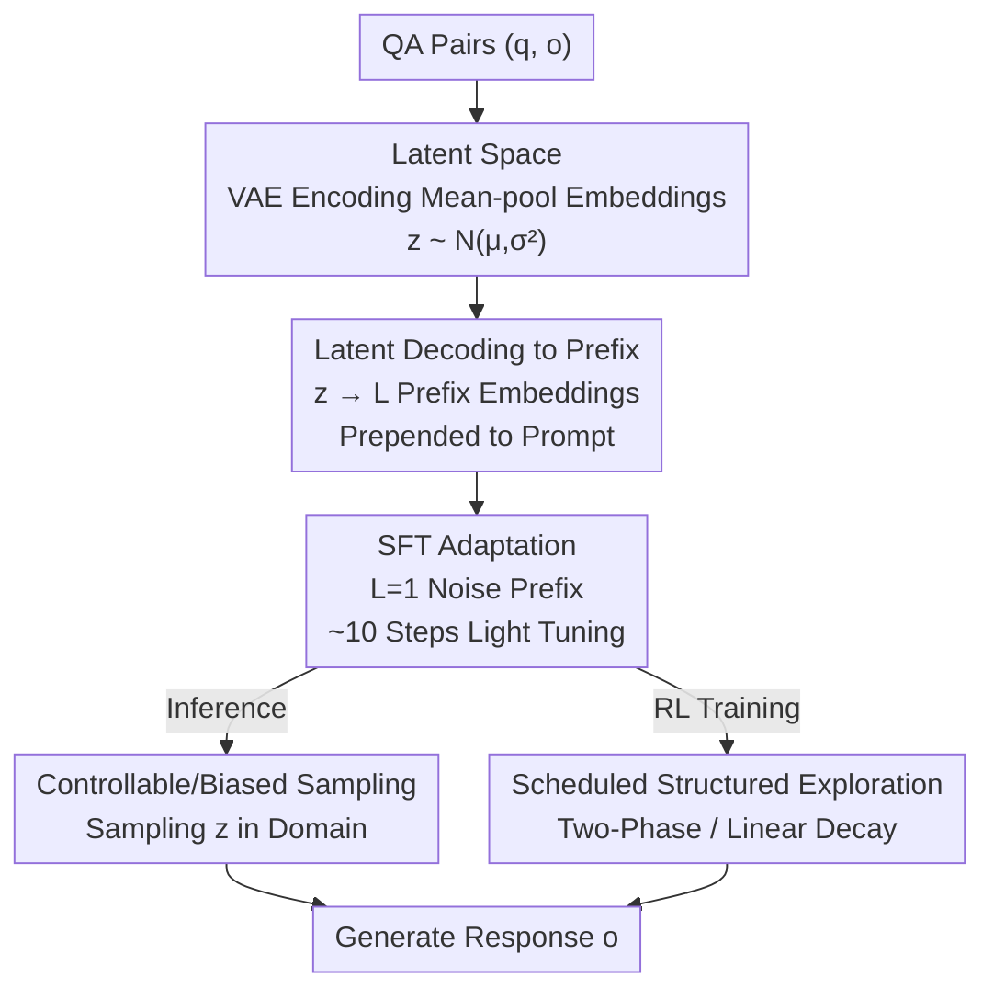

# Reasoning Palette: Modulating Reasoning via Latent Contextualization for Controllable Exploration for (V)LMs

**Conference**: CVPR 2026  
**Paper**: [CVF Open Access](https://openaccess.thecvf.com/content/CVPR2026/html/Long_Reasoning_Palette_Modulating_Reasoning_via_Latent_Contextualization_for_Controllable_Exploration_CVPR_2026_paper.html)  
**Code**: TBD  
**Area**: LLM Reasoning  
**Keywords**: Latent Variable Modulation, Controllable Exploration, Reinforcement Learning, VAE, Prefix Injection

## TL;DR
This paper utilizes a latent space learned via a VAE to inject a "reasoning palette" into (V)LMs. Each sampled latent variable is decoded into a learnable prefix prepended to the prompt, enabling the model to select a specific reasoning style before generating the first token. This approach upgrades "token-level random sampling" in RL to "strategy-level structured exploration," consistently outperforming standard GRPO/RLOO on multiple mathematical reasoning benchmarks.

## Background & Motivation

**Background**: Reinforcement Learning from Verifiable Rewards (RLVR) has become a mainstream post-training paradigm for eliciting multi-step reasoning in large models. It provides deterministic rewards based on answer correctness, forcing the model to produce long chains of intermediate reasoning tokens. Both self-consistency during inference and advantage estimation in RL depend on the ability to sample **diverse** solution paths.

**Limitations of Prior Work**: Diversity in standard sampling schemes (Temperature, Nucleus) occurs at the **token level**, often resulting in trajectories that are logically identical but phrased slightly differently. Discovering effective reasoning strategies requires changes in **high-level structure** (different logic paths or organizational styles), which token-level perturbations fail to provide. Existing remedies like entropy regularization only encourage local diversity and lack mechanisms to shape internal planning.

**Key Challenge**: There is a mismatch between the "high-level variability" required to discover quality reasoning strategies and the "low-level variability" provided by token-level sampling. Consequently, RL exploration often repeats similar paths with cosmetic differences, stalling exploration efficiency and robustness.

**Key Insight**: An interesting phenomenon was observed (Fig. 1): prepending a **randomly sampled Gaussian noise token embedding** to a prompt for Qwen-4B-Base significantly improves pass@k, even when using greedy decoding for each sample (GSM8K pass@32 increased from 52.9% to 85.3%). This indicates that performance gains stem from "strategy-level changes" induced by the prefix rather than token-level randomness.

**Core Idea**: Instead of adding noise to tokens, the authors propose learning a **structured latent space** where different reasoning strategies are encoded into different regions. Sampling a latent variable and decoding it into a prefix allows the modulation of the model's internal reasoning trajectory **before** generation begins. Effectively, exploration is shifted from "output token randomness" to "input strategy sampling."

## Method

### Overall Architecture
Reasoning Palette is a latent-modulation framework consisting of three steps: **offline learning of a reasoning strategy latent space, light SFT to enable prefix comprehension, and structured exploration via latent sampling during inference or RL.**

Specifically: (1) A VAE is trained on QA pairs to map mean-pooled embeddings into a Gaussian latent space $Z$, clustering different reasoning modes (math, code, QA). (2) A sampled $z$ is decoded into $L$ continuous prefix embeddings and prepended to the prompt. (3) A brief SFT phase (approx. 10 steps) adapts the base model to this "prefix conditioning," followed by RL where the latent variable acts as an auxiliary control signal for each episode.

### Key Designs

**1. VAE Latent Space on Frozen Token Embeddings: Aligning Prefixes with Input Distribution**

To address the issue where naive random noise often degrades performance, the latent space is built **directly on the model's frozen token embedding layer $E(\cdot)$**. For each QA pair $[q;o]=(x_1,\dots,x_N)$, the mean-pooled embedding $h=\frac{1}{N}\sum_{i=1}^{N} E([q;o]_i)\in\mathbb{R}^d$ acts as a context summary. An MLP encoder $E_\phi$ maps this to Gaussian parameters for sampling, and a decoder $D_\psi$ reconstructs $\hat h$:

$$\mu,\sigma = E_\phi(h),\quad z\sim\mathcal{N}(\mu,\mathrm{diag}(\sigma^2)),\quad \hat h = D_\psi(z).$$

The VAE is trained with the ELBO: $\mathcal{L}_{\text{VAE}}=\mathbb{E}_{z\sim q_\phi(z|h)}\big[\lVert h-\hat h\rVert^2 + \beta\cdot \mathrm{KL}(q_\phi(z|h)\,\Vert\,p(z))\big]$, with $p(z)=\mathcal{N}(0,I)$. Since $h$ resides in the same space as token embeddings, the reconstructed $\hat h$ functions as a "pseudo-token" that aligns naturally with the model's expected input distribution.

**2. Latent Decoding to Variable-Length Prefixes + Biased Sampling: A Controllable "Palette"**

During inference, $z\sim\mathcal{N}(0,I)$ is sampled and decoded into $L$ prefix embeddings $p_z=(D_\psi(z^{(1)}),\dots,D_\psi(z^{(L)}))\in\mathbb{R}^{L\times d}$. The prompt becomes $\tilde q=[p_z;E(q)]$ for autoregressive generation: $o\sim\pi_\theta(\cdot\mid\tilde q)$. The length $L$ is a tunable hyperparameter, balancing control strength and inference cost. By calculating the empirical mean and covariance of latent vectors for specific domains (math, code), sampling can be restricted to these regions to direct the model's reasoning style.

**3. Minimal SFT Pre-warming (L=1): Adaptation without Losing Diversity**

To ensure the base model understands the continuous prefix without overfitting to a single response mode, SFT is performed by sampling $z\sim\mathcal{N}(0,I)$ directly from the prior. The model is trained to minimize $\mathcal{L}_{\text{SFT}}=-\mathbb{E}_{(p,q,o)}[\log p_\theta(o\mid[p;E(q)])]$. Using only ~10 steps and a prefix length of $L=1$ allows the model to learn to condition on arbitrary VAE prefixes while preserving its stochastic generation capabilities for later RL stages.

**4. Dual-Axis Scheduled Exploration in RL (Two-Phase / Linear Decay)**

During RL, $z$ acts as a per-episode auxiliary signal. To manage the exploration-exploitation trade-off, the authors propose a mixed objective:

$$J_{\text{sched}}(\theta)=\mathbb{E}_\tau\,\mathbb{E}_{q}\big[\rho(\tau)\cdot \mathcal{L}_{\text{PPO}}(\theta;q,z) + (1-\rho(\tau))\cdot \mathcal{L}_{\text{PPO}}(\theta;q)\big],$$

where $\tau$ is the normalized training progress and $\rho(\tau)$ is the proportion of conditioned rollouts. Two schedules are used: **Two-Phase** (100% conditioned rollout for the first half, 0% for the second) and **Linear Decay** (linear reduction from 100% to 0%). This allows the model to explore high-quality regions of the behavior space early on and consolidate those behaviors later.

## Key Experimental Results

### Main Results

**Biased Sampling at Inference (pass@8, SFT-ed Qwen3-4B-Base)**: Using math-domain latents consistently outperforms code or general QA latents on mathematical benchmarks.

| Latent Source | MATH500 | Olympic | GSM8K |
|:---|:---:|:---:|:---:|
| codeparrot (Code) | 70.8 | 42.95 | 94.47 |
| MetaMathQA (Math) | **72.4** | **46.11** | **95.0** |
| ShareGPT Vicuna (QA) | 71.0 | 45.47 | 93.63 |

**RL Main Results (Math Reasoning pass@1)**: Reasoning Palette improves performance across different model scales and RL algorithms.

| Configuration | MATH500 | OlympiadBench | AMC23 | GSM8K | MinervaMath | Avg. |
|:---|:---:|:---:|:---:|:---:|:---:|:---:|
| Qwen3-8B + RLOO | 69.53 | 43.76 | 55.00 | 91.82 | 39.48 | 59.91 |
| + Palette (Linear Decay) | 72.20 | **46.61** | **59.38** | **93.03** | **43.77** | **63.00** (+3.09) |
| Qwen3-4B + GRPO | 68.65 | 41.32 | 50.94 | 91.05 | 39.39 | 58.27 |
| + Palette (Two-Phase) | 70.53 | 43.95 | **55.00** | 92.19 | 42.20 | **60.77** (+2.50) |

### Ablation Study

**VLM Grounding (RefCOCO series pass@32, Qwen2.5VL-3B)**: The framework was evaluated on referring expression comprehension using a randomly initialized GPT-style decoder to map noise $z$ to prefixes.

| Method | RefCOCO | RefCOCO+ | RefCOCOg |
|:---|:---:|:---:|:---:|
| Baseline (greedy) | 2.0 | 2.0 | 4.67 |
| Baseline + sampling | 65.07 | 62.57 | 72.0 |
| Latent-guided (greedy) | 72.07 | 73.07 | 73.1 |
| Latent-guided + sampling | **87.53** | **86.03** | **85.7** |

### Key Findings
- **Gains derive from strategy-level shifts**: Even with greedy decoding, latent noise improves pass@32 significantly, proving that the prefix induces high-level changes.
- **Latent guiding and sampling are complementary**: Latent-guided greedy decoding often outperforms standard sampling, but the combination of both yields the best results.
- **Latent space clusters by domain**: PCA/t-SNE visualizations show clear separation between math, code, and general QA strategies.
- **VLM greedy failures are formatting-related**: Lower baseline scores in VLM tasks are often due to formatting errors, which latent modulation helps correct.

## Highlights & Insights
- **Input-side Exploration**: Shifting exploration from token-level output to input-side latent modulation effectively addresses the "high-level variability" gap in RL reasoning.
- **Natural Alignment**: Training prefixes on frozen embeddings ensures they remain within the model's familiar distribution, avoiding the performance degradation typical of naive noise injection.
- **Selective Intervention**: The use of minimal SFT steps and specific prefix lengths (L=1) prevents the model from collapsing into a single mode, maintaining the diversity necessary for RL.
- **Interpretability**: The frozen latent space provides a stable coordinate system for diagnosing and intervening in model behavior patterns.

## Limitations & Future Work
- **VLM Decoder**: For VLM tasks, a randomly initialized decoder was used instead of a pre-trained VAE, suggesting that the precise latent structure might be less critical than the non-linear mapping itself in multi-modal contexts.
- **Task Scope**: Evaluation is primarily focused on mathematical reasoning; the end-to-end RL control for code/QA remains to be fully verified.
- **Hyperparameter Sensitivity**: The gain varies across benchmarks, and factors like the decay schedule and prefix length require manual tuning.
- **VAE Scale**: The VAE was trained on a relatively small dataset (5K pairs), which may limit the breadth of reasoning modes represented in the latent space.

## Related Work & Insights
- **vs. Soft Prompt/Prefix Tuning**: Unlike fixed prefixes used for static style adaptation, this method samples prefixes from a latent space to facilitate diverse and controllable exploration.
- **vs. Entropy Regularization**: While standard RL exploration acts on local token distributions, this method modulates high-level planning via global latent variables.
- **vs. Standard RLVR**: This approach is an orthogonal, plug-and-play enhancement for exploration that can be applied to any existing RLVR pipeline (e.g., GRPO, RLOO).

## Rating
- Novelty: ⭐⭐⭐⭐
- Experimental Thoroughness: ⭐⭐⭐
- Writing Quality: ⭐⭐⭐⭐
- Value: ⭐⭐⭐⭐

<!-- RELATED:START -->

## Related Papers

- [\[CVPR 2026\] ReLaX: Reasoning with Latent Exploration for Large Reasoning Models](relax_reasoning_with_latent_exploration_for_large_reasoning_models.md)
- [\[CVPR 2026\] Latent Chain-of-Thought World Modeling for End-to-End Autonomous Driving](latent_chain-of-thought_world_modeling_for_end-to-end_autonomous_driving.md)
- [\[ACL 2026\] Reinforced Efficient Reasoning via Semantically Diverse Exploration](../../ACL2026/llm_reasoning/reinforced_efficient_reasoning_via_semantically_diverse_exploration.md)
- [\[ICLR 2026\] LaDiR: Latent Diffusion Enhances LLMs for Text Reasoning](../../ICLR2026/llm_reasoning/ladir_latent_diffusion_enhances_llms_for_text_reasoning.md)
- [\[ICLR 2026\] Continuous Chain of Thought Enables Parallel Exploration and Reasoning](../../ICLR2026/llm_reasoning/continuous_chain_of_thought_enables_parallel_exploration_and_reasoning.md)

<!-- RELATED:END -->
## Related Papers

- [\[CVPR 2026\] ReLaX: Reasoning with Latent Exploration for Large Reasoning Models](relax_reasoning_with_latent_exploration_for_large_reasoning_models.md)
- [\[ACL 2026\] Reinforced Efficient Reasoning via Semantically Diverse Exploration](../../ACL2026/llm_reasoning/reinforced_efficient_reasoning_via_semantically_diverse_exploration.md)
- [\[CVPR 2026\] Latent Chain-of-Thought World Modeling for End-to-End Autonomous Driving](latent_chain-of-thought_world_modeling_for_end-to-end_autonomous_driving.md)
- [\[ICLR 2026\] Continuous Chain of Thought Enables Parallel Exploration and Reasoning](../../ICLR2026/llm_reasoning/continuous_chain_of_thought_enables_parallel_exploration_and_reasoning.md)
- [\[CVPR 2026\] Scaling Agentic Reinforcement Learning for Tool-Integrated Reasoning in VLMs](scaling_agentic_reinforcement_learning_for_tool-integrated_reasoning_in_vlms.md)

<!-- RELATED:END -->
