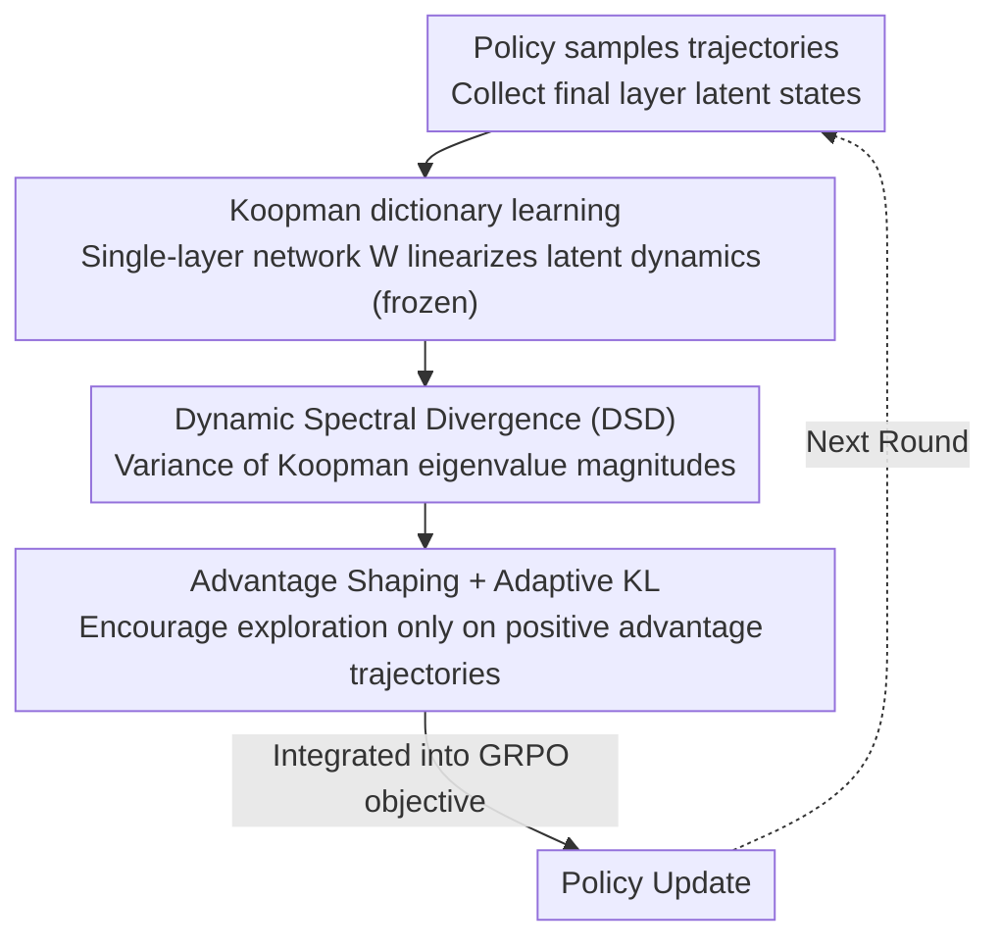

# ReLaX: Reasoning with Latent Exploration for Large Reasoning Models

**Conference**: CVPR 2026  
**Paper**: [CVF Open Access](https://openaccess.thecvf.com/content/CVPR2026/html/Zhang_ReLaX_Reasoning_with_Latent_Exploration_for_Large_Reasoning_Models_CVPR_2026_paper.html)  
**Code**: https://github.com/ZhangShimin1/ReLaX  
**Area**: LLM Reasoning  
**Keywords**: RLVR, exploration-exploitation, Koopman operator, entropy collapse, latent space dynamics

## TL;DR
ReLaX abandons the practice of forcibly increasing token-level entropy to counteract entropy collapse in RLVR. Instead, it utilizes the Koopman operator to linearize the latent state dynamics of large reasoning models and introduces "Dynamic Spectral Divergence (DSD)" to quantify internal computational flexibility. By integrating DSD into the GRPO objective, it achieves new SOTA performance on 7 multimodal and 6 text-based reasoning benchmarks.

## Background & Motivation

**Background**: Reinforcement Learning with Verifiable Rewards (RLVR), typically implemented via GRPO, is the primary paradigm for scaling the reasoning capabilities of LLMs/MLLMs. During training, the model samples trajectories, and a verifier provides scalar rewards (e.g., checking math answers or code execution), followed by policy optimization using group-relative normalization.

**Limitations of Prior Work**: Without explicit intervention, RLVR causes policy distributions to narrow and entropy to drop sharply, trapping policy gradients in a restricted subspace. Sparse rewards exacerbate this "entropy collapse," leading to premature exploitation and insufficient exploration. Empirically, the exponential relationship between reward $R$ and token entropy $H$ ($R = -a \cdot \exp(H) + b$) indicates that rewards cannot improve once entropy collapses.

**Key Challenge**: Existing remedies primarily focus on the **token level**—reshaping rewards, adding entropy-based regularization, or heuristically anchoring significant tokens to increase randomness. However, maintaining high token entropy fundamentally conflicts with RL's natural tendency toward deterministic low-entropy policies. Furthermore, there is a misalignment between the internal multimodal computations of MLLMs and their text-centric outputs; token-level feedback fails to accurately reflect the underlying multimodal processing.

**Goal**: Identify a more fundamental characterization of "exploration" that surpasses token statistics, applies to multimodal contexts, and can be differentiably integrated into the policy optimization objective to manage the exploration-exploitation trade-off.

**Key Insight**: This work argues that entropy collapse is a superficial symptom; the core problem is that the **internal computation generating tokens loses flexibility and converges into overly rigid patterns**. These computations are reflected in the high-dimensional latent dynamics of hidden states, which carry richer and more stable inductive biases than discrete token spaces. While latent dynamics are non-linear and high-dimensional, Koopman operator theory enables the representation of non-linear dynamics as linear evolutions in an infinite-dimensional space of observable functions.

**Core Idea**: Linearize latent dynamics via Koopman operators → Quantify "internal computational flexibility" via Dynamic Spectral Divergence (DSD) → Integrate DSD as a differentiable regularization term into GRPO, shifting exploration from the token space to the more expressive latent computational space.

## Method

### Overall Architecture
ReLaX aims to solve the issue of rigid internal computation and insufficient exploration in RLVR. While optimizing the policy, it performs Koopman linearization on the latent state trajectories of the final layer and calculates a DSD score to measure dynamic richness. This score is added as a regularization term to the GRPO objective—high DSD indicates flexible computation and is encouraged, while excessive divergence is stabilized using an adaptive KL penalty. The pipeline consists of: policy trajectory sampling → latent state collection → linearization via a frozen Koopman dictionary → DSD calculation for each trajectory → integration of DSD regularization into GRPO via advantage shaping and adaptive KL.

### Key Designs

**1. Koopman Dictionary Learning: Linearizing High-Dimensional Non-linear Dynamics**

The evolution of latent states $x_t = \mathcal{F}(x_{t-1}, \omega_t)$ in Large Reasoning Models (LRMs) is highly non-linear. The Koopman operator $\mathcal{K}$ embeds this dynamics into an infinite-dimensional function space where observables $g$ satisfy linear evolution $[\mathcal{K}g](x_t) = g(x_{t+1})$. This study uses ResKoopNet to learn a neural Koopman dictionary where observables are prioritized by $g(x) = \sigma(Wx)$. $W \in \mathbb{R}^{d \times m}$ is optimized by minimizing the spectral residual $\|(\mathcal{V}^+ - \mathcal{K}\mathcal{V})\Phi\|_F^2$. Crucially, $W$ is **frozen after being learned on the initial policy**, ensuring that latent dynamics are characterized within the same functional space throughout training, making DSD comparable without increasing training overhead.

**2. Dynamic Spectral Divergence (DSD): Quantifying "Computational Flexibility"**

This is the core metric. Spectral decomposition of the Koopman operator reveals fundamental modes (growth, decay, oscillation). A concentrated spectrum indicates degenerate, repetitive behavior, while a divergent spectrum indicates a rich, expressive system. DSD is defined as the variance of the Koopman eigenvalue magnitudes: $\mathrm{DSD}(x) = \operatorname{Var}(|\Lambda|)$, where $\mathcal{K}\Phi = \Phi\Lambda$. High DSD represents rich internal dynamics where random perturbations effectively translate into diverse latent trajectories. Unlike token entropy, DSD probes internal processes, making it more reliable for MLLMs.

**3. Advantage Shaping + Adaptive KL: Integrating DSD Regularization into GRPO**

To provide stable gradients, a sequence-level regularizer is defined as $\mathcal{L}_{\text{xp}} = \log\!\big(\frac{1}{R}\sum_i \exp(-\mathrm{DSD}(x^i))\big)$. To prevent exploration from harming exploitation, ReLaX employs two safeguards: **Advantage Shaping**, which weights DSD using truncated positive advantages $\tilde{\mathcal{L}}_{\text{xp}} = \log\!\big(\frac{1}{R}\sum_i \exp(-\mathrm{clip}(\hat A^i,0) \cdot \mathrm{DSD}(x^i))\big)$ to only encourage flexibility in trajectories yielding positive rewards; and **Adaptive KL**, which applies a KL penalty $\beta\sum_{i \in \mathcal{I}} D_{\mathrm{KL}}(\pi_\theta \| \pi_{\mathrm{ref}})$ only to "over-divergent" trajectories where DSD exceeds a threshold $\xi$.

### Loss & Training
The framework builds on GRPO using Qwen2.5-VL-Instruct for VLMs and Qwen2.5-Base/Math for LLMs. The Koopman dictionary $W$ is frozen after one step on the initial policy. Ablations show that a DSD regularization coefficient of $\alpha = 0.1$ yields the highest reward.

## Key Experimental Results

### Main Results
Multimodal: 7 benchmarks (MathVista, MathVerse, MMStar, etc.) mean@1 score.

| Model | Average (7 Multimodal Benchmarks) | Description |
|------|------|------|
| Qwen2.5-VL-7B (Base) | 47.9 | Baseline |
| VL-Rethinker-7B | 52.5 | Previous 7B SOTA |
| **ReLaX-VL-7B (Ours)** | **53.2** | New SOTA, +0.7 over VL-Rethinker |
| ReLaX-VL-3B (Ours) | 48.1 | 3B outperforms multiple 7B models |

Pure text mathematics (Average across 6 benchmarks):

| Model | Average | Key Comparison |
|------|------|----------|
| Qwen2.5-7B-Base + SimpleRL (GRPO) | 34.8 | Vanilla GRPO |
| + FR3E (Previous SOTA) | 39.2 | Strong token-level baseline |
| **+ ReLaX (Ours)** | **43.5** | **+4.3** over FR3E |

### Ablation Study

| Configuration | Phenomenon | Description |
|------|------|------|
| DSD Coefficient $\alpha = 0.1$ | Highest Reward | Optimal operating point |
| $\alpha = 1.0$ | Performance Drop | Excessive exploration harms exploitation |
| Vanilla GRPO | Sharp Entropy/DSD Drop | Rapid collapse into rigid patterns |
| ReLaX Complete | Stable, High Entropy | DSD remains rich, continuous policy improvement |

### Key Findings
- **DSD and token entropy drop synchronously in vanilla GRPO**, confirming that internal rigidity is the core issue of entropy collapse.
- There is a clear "sweet spot" for exploration strength ($\alpha = 0.1$); higher entropy does not equate to better convergence.
- Gains are particularly significant for MLLMs, suggesting that latent space exploration helps mitigate cross-modal alignment issues.

## Highlights & Insights
- **Shifting Exploration to Latent Space**: DSD quantifies the spectral richness of internal dynamics, bypassing the conflict between token entropy and RL convergence.
- **Frozen Koopman Dictionary**: Freezing the dictionary after one step ensures DSD comparability across training stages while keeping computational costs near zero.
- **Targeted Exploration**: The dual-gate design (Advantage Shaping + Adaptive KL) ensures that only promising trajectories are encouraged to be flexible, preventing chaotic exploration.

## Limitations & Future Work
- DSD relies on Koopman spectral estimation; sensitivity to dictionary dimension $m$ and threshold $\xi$ requires further validation.
- The assumption that a dictionary learned on the initial policy remains faithful as the policy drifts needs more rigorous testing.
- Evaluation is focused on reasoning; the effectiveness of DSD as an exploration proxy for open-ended generation or tool-use is unverified.

## Related Work & Insights
- **vs. Token-level methods (FR3E, DAPO)**: These methods manipulate the token space. ReLaX argues this misses the underlying computational patterns and outperforms them by 4.3 points in text math.
- **vs. Vanilla GRPO**: Standard GRPO suffers from rapid DSD collapse within 50 steps; ReLaX maintains a controlled, high-entropy state.
- **vs. Koopman Analysis**: Unlike prior works that use Koopman operators solely for analysis, ReLaX transforms these into differentiable intervention signals to drive policy optimization.

## Rating
- Novelty: ⭐⭐⭐⭐⭐ 
- Experimental Thoroughness: ⭐⭐⭐⭐ 
- Writing Quality: ⭐⭐⭐⭐ 
- Value: ⭐⭐⭐⭐ 

<!-- RELATED:START -->

## Related Papers

- [\[CVPR 2026\] Reasoning Palette: Modulating Reasoning via Latent Contextualization for Controllable Exploration for (V)LMs](reasoning_palette_modulating_reasoning_via_latent_contextualization_for_controll.md)
- [\[ACL 2026\] SeLaR: Selective Latent Reasoning in Large Language Models](../../ACL2026/llm_reasoning/selar_selective_latent_reasoning_in_large_language_models.md)
- [\[ACL 2026\] Large Reasoning Models Are (Not Yet) Multilingual Latent Reasoners](../../ACL2026/llm_reasoning/large_reasoning_models_are_not_yet_multilingual_latent_reasoners.md)
- [\[CVPR 2026\] Think-as-You-See: Streaming Chain-of-Thought Reasoning for Large Vision-Language Models](think-as-you-see_streaming_chain-of-thought_reasoning_for_large_vision-language_.md)
- [\[ICML 2025\] Soft Reasoning: Navigating Solution Spaces in Large Language Models through Controlled Embedding Exploration](../../ICML2025/llm_reasoning/soft_reasoning_navigating_solution_spaces_in_large_language_models_through_contr.md)

<!-- RELATED:END -->
