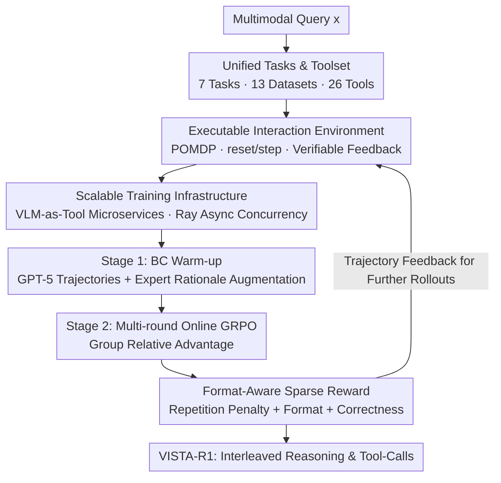

# Scaling Agentic Reinforcement Learning for Tool-Integrated Reasoning in VLMs

**Conference**: CVPR 2026  
**Paper**: [CVF Open Access](https://openaccess.thecvf.com/content/CVPR2026/html/Lu_Scaling_Agentic_Reinforcement_Learning_for_Tool-Integrated_Reasoning_in_VLMs_CVPR_2026_paper.html)  
**Code**: https://github.com/Lucanyc/VISTA-Gym  
**Area**: LLM Reasoning / Multimodal VLM / Agent  
**Keywords**: Tool-integrated reasoning, Visual agent, Reinforcement learning, GRPO, Training environment

## TL;DR
This work proposes VISTA-Gym, a scalable training environment for visual tool agents (comprising 7 task categories, 13 datasets, and 26 standardized visual tools). Within this environment, the authors train VISTA-R1 using a "Behavioral Cloning (BC) warm-up + multi-round online GRPO" paradigm. This enables 8B-scale VLMs to dynamically select, invoke, and coordinate visual tools during reasoning, outperforming SOTA models of similar scale by 9.51%–18.72% across 11 reasoning-intensive VQA benchmarks.

## Background & Motivation
**Background**: While current Vision-Language Models (VLMs) demonstrate strong image understanding, mainstream approaches simply port Chain-of-Thought (CoT) and Reinforcement Learning (RL) from the text domain to optimize text-based reasoning chains using outcome-based rewards. However, most of this reasoning relies on static visual embeddings and shallow cross-modal alignment.

**Limitations of Prior Work**: Pure-text reasoning fails to capture fine-grained visual structures, spatial relationships, and numerical dependencies in real-world scenarios. Consequently, "Tool-Integrated Reasoning" (TIR) has been introduced to equip models with external tools like grounding, zoom-in, and search. Paradoxically, exploratory experiments reveal an intuitive phenomenon: **directly attaching tools to a base VLM often significantly degrades accuracy** (tools become distractions rather than aids). Error attribution of 500 failure cases from GPT-5 and InternVL3-8B shows defects centered on the "if/when/which/how" of tool calls: format violations (E1), illegal arguments (E2–E4), incorrect output parsing (E5), and failed post-execution reasoning (E6, accounting for 64.8% of InternVL3-8B errors).

**Key Challenge**: Tool accessibility does not equal tool-integrated reasoning. Models do not lack tools; they lack the strategy to decide "when to call, which to choose, how to pass parameters, and how to proceed after feedback" in multi-round interactions. Such strategies can only be acquired through RL in an **executable environment with verifiable feedback**.

**Goal**: (1) Build a unified, scalable training environment covering diverse tasks and tools with verifiable feedback and efficient trajectory collection; (2) Design a training paradigm that enables small open-source models to interleave reasoning with tool invocation.

**Key Insight**: Formalize TIR as a Partially Observable Markov Decision Process (POMDP) using a ReAct-style "think-then-act" trajectory structure, optimized end-to-end via agentic RL.

**Core Idea**: Utilize a "Scalable Visual Tool Training Environment (VISTA-Gym) + Two-stage Agentic RL (BC Warm-up → Multi-round GRPO)" to internalize tool-coordination capabilities ("thinking-with-images") rather than relying solely on prompting.

## Method

### Overall Architecture
The approach consists of two main components: the infrastructure **VISTA-Gym** (providing tasks, tools, executable loops, and scalable facilities) and the agent **VISTA-R1** (a two-stage training framework). Given a multimodal query $x$, the agent outputs a reasoning segment `<think>` followed by a tool call `<tool_call>` in each round. The environment executes the tool, appends structured feedback $o_t$ to the context, and the agent continues reasoning until it terminates with `<answer>`. The trajectory is an interleaved "Think-Act-Observe" sequence $\tau = (g_0, a_0, o_0, \dots, g_T, \hat{y})$, and the training objective is to ensure this trajectory is both format-compliant and correct.

### Key Designs

**1. VISTA-Gym: Verifiable Training Environment with Unified Tasks and Standardized Tool Interfaces**

To address the limitation where existing TIR works are restricted to single tools or narrow tasks, VISTA-Gym organizes 13 public benchmarks into 7 reasoning-intensive VQA categories (Chart, Geometry, Geospatial, Science, Document, Spatial/Compositional, etc.). It standardizes 26 visual tools into four families: Perception (GroundingDINO, SAM, EasyOCR), Chart Understanding (ChartMoE), Diagram Formalization (CDL, Inter-GPS), and Mathematical Solving (G-LLaVA, MultiMath). The environment uses a Gymnasium-style `reset()`/`step()` interface. `reset` returns the initial observation $o_0$ and interaction history; the action space $\mathcal{A}$ is a typed tuple (tool ID + arguments); the observation space $\mathcal{O}$ returns execution results or runtime errors. Crucially, **every tool call sequence is verifiable**, auditing the entire chain rather than just the final answer. This uniformity allows agents to train across task/tool distributions to gain generalization.

**2. Scalable Training Infrastructure: VLM-as-Tool Microservices for High-Concurrency RL Rollouts**

RL requires massive trajectory sampling. Computationally intensive VLM tools (e.g., G-LLaVA) incur prohibitive latency if reloaded per call. This work wraps each VLM tool as a standalone HTTP microservice with a three-layer architecture: (i) FastAPI frontend for RESTful endpoints and async batching; (ii) Tool layer for parsing actions and formatting observations; (iii) Ray Actor layer for **resident GPU memory initialization** to eliminate loading overhead. On the training side, Ray manages concurrency: when the policy generates a `</tool_call>` token, decoding pauses, and the framework sends batched HTTP requests. Heavy VLM tools are pinned to dedicated GPUs, while lightweight tools share CPUs. With health metrics and Ray's auto-recovery, this infrastructure makes large-scale visual agent RL engineering-feasible.

**3. Two-stage Training: BC Warm-up followed by Multi-round Online GRPO**

Direct RL on a base model often fails to "cold-start" as the model lacks initial tool-calling capabilities. **Stage 1 (BC Warm-up)**: Uses GPT-5 to generate trajectories, filtering by outcome. An open-source expert (Qwen3-VL-235B-Thinking) then augments short rationales into long-form reasoning, creating the dataset $\mathcal{D}$. The model maximizes the likelihood of interleaved tokens: $\mathcal{L}_{\text{BC}}(\theta) = \mathbb{E}_{(x,\tau)\sim\mathcal{D}}[\log \pi_\theta(\tau|x)]$, establishing a robust prior for grammar and selection. **Stage 2 (Online RL)**: Performs multi-round rollouts in the executable environment. Optimization uses Group Relative Policy Optimization (GRPO), computing group-normalized advantages $\hat{A}_{i,k} = \frac{R(\tau_i) - \text{mean}(\{R(\tau_1),\dots,R(\tau_G)\})}{\text{std}(\{R(\tau_1),\dots,R(\tau_G)\})}$ with token-level importance sampling and clipping. The sequence is vital: BC solves "how to call," and RL solves "how to call effectively."

**4. Format-aware Sparse Rewards: Internalizing the think→tool_call→answer Protocol**

To prevent "reward hacking" (e.g., token repetition), a hierarchical three-part reward is designed. The highest priority is the **Repetition Penalty** $R_{\text{rep}}(U) \in \{-3.0, -2.0, -1.5, 0\}$, which penalizes repeating tokens/phrases. Only if $R_{\text{rep}}=0$ is the **Format Reward** $R_{\text{format}}(U)$ calculated, checking for tag compliance and sequence integrity. Finally, the **Correctness Reward** $R_{\text{correct}}(U) = \mathbb{I}\{\hat{y}=y\}$ is applied. This "Sparse + Format-aware + Prioritized" design ensures positive rewards are only given to outputs that are structurally sound and correct, forcing the policy to internalize the protocol.

### Loss & Training
- BC Objective: Maximize log-likelihood $\mathcal{L}_{\text{BC}}$ of interleaved thought-action trajectories.
- RL Objective: GRPO loss $\mathcal{L}_{\text{GRPO}}$ with group-relative advantage and clipping.
- Protocol: $T$ rounds of `<think>...</think><tool_call>...</tool_call>` followed by a final round $u_T$ ending with `<answer>...</answer>`.
- Implementation: Base models (InternVL3-2B/8B/14B, Qwen2.5-VL-7B) trained using Verl-Tool on 8× NVIDIA H200 (141GB). Metric: Accuracy (ACC).

## Key Experimental Results

### Main Results
Evaluation across 5 in-distribution (ChartQA, Geometry3K, etc.) and 6 out-of-distribution (TABMWP, MathVista, etc.) benchmarks. Representative results (acc%):

| Model | Scale | In-dist Avg. | Out-dist Avg. | Overall Avg. |
|------|------|------------|------------|----------|
| GPT-5 (Commercial, Ref) | — | 76.39 | 75.38 | 75.84 |
| Claude-4.5-Sonnet (Commercial, Ref) | — | 81.98 | 76.07 | 78.76 |
| InternVL3-2B (Base) | <7B | 28.56 | 49.28 | 39.86 |
| **Ours (InternVL3-2B)** | <7B | **57.80** | **67.82** | **63.27** |
| Qwen2.5-VL-7B (Base) | 7–13B | 42.83 | 60.41 | 52.42 |
| VTool-R1-7B | 7–13B | 52.18 | 54.06 | 53.20 |
| R1-VL-7B | 7–13B | 57.34 | 65.20 | 61.63 |
| **Ours (Qwen2.5-VL-7B)** | 7–13B | **65.19** | **67.13** | **66.25** |

Key Findings: (i) Ours-8B outperforms comparable baselines with tools by 9.51%–18.72%; (ii) Pure tool access without reasoning supervision causes performance drops—RL is key; (iii) High parameter efficiency—Ours-2B matches the 8B baseline.

### Ablation Study
Overall Avg. ACC (%) for VISTA-R1 (Qwen2.5-VL-7B):

| Configuration | Overall Avg. | Description |
|------|----------|------|
| **Ours (Full)** | 66.25 | Tools + Two-stage RL |
| w/o Tools | 57.58 | No tool access during training/inference (-8.7) |
| w/o Reasoning | 55.65 | No RL training stage (-10.6) |
| Qwen2.5-VL-7B (Base) | 52.42 | Untrained Base |

### Key Findings
- **Tool Proficiency requires RL**: Simply providing tools degrades base models due to E1-E6 failure modes. RL in an environment is the true unlock. "w/o Reasoning" drops more than "w/o Tools," emphasizing reasoning supervision.
- **Robust Generalization**: On out-of-distribution benchmarks, VISTA-R1-8B yields performance comparable to massive commercial models like GPT-o3.
- **Efficiency**: Scaling agentic RL in unified environments allows small models to compete with models of 4x their scale.

## Highlights & Insights
- **The Paradox of Tool Access**: The observation that tools degrade base performance, backed by a 500-sample error attribution, correctly identifies "lack of strategy" rather than "lack of tools" as the core issue.
- **VLM-as-Microservice**: Implementing heavy VLMs as resident Ray services is the critical engineering "trick" to make large-scale agentic RL rollouts feasible.
- **Hierarchical Reward Engineering**: Prioritizing repetition suppression over format and correctness is a pragmatic way to block reward hacking in multi-round agent training.

## Limitations & Future Work
- The toolset, while large (26 tools), is still a closed set. Coverage and routing for open-domain tasks remain challenges.
- BC depends on high-quality trajectories/rationales from proprietary or massive models (GPT-5, Qwen3-VL-235B), creating a ceiling effect.
- The evaluation focuses on ACC; systematic quantification of tool-calling efficiency (latency/frequency) and trajectory readability is lacking.

## Related Work & Insights
- **vs. Single-tool TIR (MMSearch-R1)**: These are often task-specific. This work gains generalization through its multi-task/multi-tool unified environment.
- **vs. Multimodal Agent Environments (VAGEN, AgentGym)**: Most are text-only or for embodied/gaming tasks. VISTA-Gym fills the niche for tool-integrated visual reasoning.
- **vs. Integrated TIR VLMs (VTool-R1, R1-VL)**: Ours (66.25) significantly outperforms VTool-R1 (53.20) and R1-VL (61.63) at the 7B scale, validating the combination of the unified environment and two-stage RL.

## Rating
- Novelty: ⭐⭐⭐⭐ Solid integration of existing components.
- Experimental Thoroughness: ⭐⭐⭐⭐⭐ Comprehensive 4-model × 11-benchmark evaluation with deep error analysis.
- Writing Quality: ⭐⭐⭐⭐ Clear logic from motivation to verification.
- Value: ⭐⭐⭐⭐⭐ Infrastructure for tool-integrated VLM RL is highly valuable for the community.

<!-- RELATED:START -->

## Related Papers

- [\[ICLR 2026\] THOR: Tool-Integrated Hierarchical Optimization via RL for Mathematical Reasoning](../../ICLR2026/llm_reasoning/thor_tool-integrated_hierarchical_optimization_via_rl_for_mathematical_reasoning.md)
- [\[ICML 2026\] MOSAIC: Learning When to Act or Refuse — Guarding Agentic Reasoning Models for Safe Multi-step Tool Use](../../ICML2026/llm_reasoning/learning_when_to_act_or_refuse_guarding_agentic_reasoning_models_for_safe_multi-.md)
- [\[ACL 2026\] Evo-Attacker: Memory-Augmented Reinforcement Learning for Long-Horizon Tool Attacks on LLM-MAS](../../ACL2026/llm_reasoning/evo-attacker_memory-augmented_reinforcement_learning_for_long-horizon_tool_attac.md)
- [\[ACL 2026\] TemplateRL: Structured Template-Guided Reinforcement Learning for LLM Reasoning](../../ACL2026/llm_reasoning/templaterl_structured_template-guided_reinforcement_learning_for_llm_reasoning.md)
- [\[ACL 2026\] HISR: Hindsight Information Modulated Segmental Process Rewards for Multi-turn Agentic Reinforcement Learning](../../ACL2026/llm_reasoning/hisr_hindsight_information_modulated_segmental_process_rewards_for_multi-turn_ag.md)

<!-- RELATED:END -->
