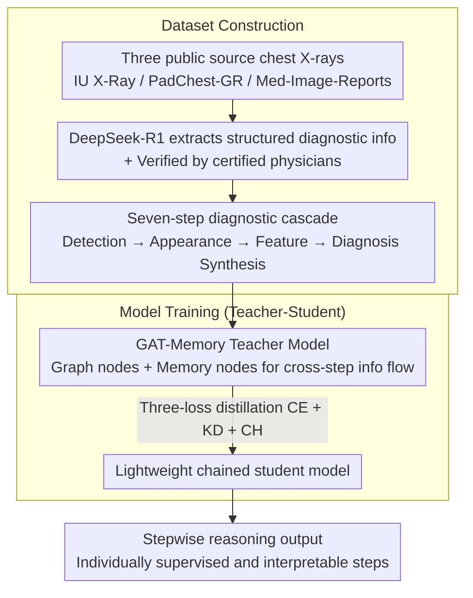

# Step-CoT: Stepwise Visual Chain-of-Thought for Medical Visual Question Answering

**Conference**: CVPR 2026  
**arXiv**: [2603.13878](https://arxiv.org/abs/2603.13878)  
**Code**: [GitHub](https://github.com/hahaha111111/Step-CoT) / [HuggingFace](https://huggingface.co/datasets/fl-15o/Step-CoT)  
**Area**: Medical AI / Visual Question Answering  
**Keywords**: Med-VQA, Chain-of-Thought, Stepwise Reasoning, Knowledge Distillation, Chest X-ray

## TL;DR
Constructs Step-CoT, the first structured multi-step CoT medical reasoning dataset (10K+ cases / 70K QA pairs) aligned with clinical diagnostic workflows. Proposes a teacher-student framework based on graph attention networks to achieve stepwise reasoning supervision, enhancing both the accuracy and interpretability of Med-VQA.

## Background & Motivation
**Background**: Med-VQA answers clinical questions based on medical images using multimodal deep learning. CoT reasoning has been applied to improve accuracy and interpretability (e.g., ReasonMed, MedCoT, HVCR).

**Limitations of Prior Work**: (i) Existing CoT datasets lack structured, stepwise diagnostic protocols—providing free-form or GPT-4-synthesized reasoning chains that do not align with real clinical workflows and omit sequential decision-making intermediate states; (ii) Most CoT datasets rely heavily on GPT-4-synthesized chains, posing risks of factual inconsistency.

**Key Challenge**: Current CoT training paradigms are non-interactive and perception-static—models only utilize static image + question inputs and cannot dynamically gather new info or refine perception during reasoning. Even models like LLaVA-Med or MedVLM-R1 exhibit domain adaptation/RL-incentivized reasoning, but the perceptual input remains fixed.

**Goal**: Can traceable multi-step reasoning supervision simultaneously improve the reasoning accuracy and interpretability of Med-VQA?

**Key Insight**: Formalize reasoning as a seven-step cascade process according to clinical diagnostic workflows and provide full supervision for the entire diagnostic pipeline (GT answers + intermediate reasoning annotations for each step).

**Core Idea**: Encode the seven-step cascading reasoning process from radiologist practice (anomaly detection → appearance investigation → feature analysis → diagnostic synthesis) into a structured CoT dataset and implement stepwise reasoning learning using graph attention networks and knowledge distillation.

## Method

### Overall Architecture

Step-CoT addresses whether traceable multi-step reasoning supervision can improve Med-VQA performance. The approach decomposes radiologist diagnosis into a fixed seven-step cascade and uses a teacher-student framework for stepwise supervision across the diagnostic pipeline. The method consists of two parts: dataset construction—collecting 10,068 chest X-rays from IU X-Ray (3,749), PadChest-GR (3,230), and Med-Image-Reports (3,089), using DeepSeek-R1 to extract structured diagnostic information mapped to the seven-step schema and verified by certified physicians; and model training—employing a Graph Attention Network (GAT) teacher model to aggregate cross-step info, then distilling it into a lightweight student model.

### Key Designs

**1. Seven-step Diagnostic Cascade: Aligning CoT with Sequential Decision-making**

Existing CoT datasets are either free-form or GPT-synthesized, missing intermediate sequential decision states. Step-CoT formalizes reasoning into a seven-step cascade: Step 1: Abnormal radiographic density detection; Steps 2-3: Appearance investigation (lesion distribution + imaging pattern); Steps 4-6: Feature analysis (anatomical location + morphological features + secondary effects); Step 7: Diagnostic synthesis. Each step builds on the previous conclusion, mirroring the "Detection → Appearance → Feature → Diagnosis" structure of expert radiologists, allowing each intermediate step to be supervised and verified.

**2. GAT-Memory Teacher Model: Bridging Cross-step Info Flow**

The seven steps require mutual reference. The teacher model constructs $S$ steps as a graph node set $\{\mathbf{t}_1, \ldots, \mathbf{t}_S, \mathbf{m}\}$, where $\mathbf{m}$ is a global memory node. A multi-head GAT updates node states with attention scores:

$$e_{ij} = \text{LeakyReLU}\big(\mathbf{a}_{src}^\top(W\mathbf{h}_i) + \mathbf{a}_{dst}^\top(W\mathbf{h}_j)\big)$$

The memory node acts as a global aggregator, writing info back via a gated GRU after each prediction, allowing subsequent steps to access prior conclusions.

**3. Student Model and Three-loss Distillation: Compression into Lightweight Chains**

The teacher is distilled into a chained student model using only image features and a lightweight sequence head. Distillation utilizes three complementary losses:

$$\mathcal{L}_{student}^{(s)} = \mathcal{L}_{CE}^{(s)} + \alpha_{KD}\mathcal{L}_{KD}^{(s)} + \alpha_{CH}\mathcal{L}_{CH}^{(s)}$$

This includes hard supervision Cross-Entropy, soft KD via KL divergence with temperature $T$, and HSIC-inspired channel/relationship alignment losses.

### Loss & Training

Teacher and student use independent optimizers. The teacher can be pre-trained with supervision loss before joint training. The student minimizes the sum of the three distillation losses while the teacher receives Cross-Entropy updates.

## Key Experimental Results

### Main Results: Diagnostic Step Test Results

| Model | Accuracy | mAUC | Sensitivity | Specificity |
|------|----------|------|-------------|-------------|
| LLaVA-Med | 42.7 | 58.3 | 42.7 | 79.4 |
| BiomedCLIP (+Step-CoT) | 69.3(+3.8) | 55.6(+20.4) | 19.4(+2.3) | 91.8(+1.7) |
| **Ours (Teacher)** | **78.3** | **89.5** | **46.0** | **96.6** |
| **Ours (Student)** | 77.5 | 90.0 | 41.8 | 96.0 |

### Ablation Study: Module Contribution

| Configuration | Detection | Distribution | Location | Diagnosis |
|------|-----------|-------------|----------|-----------|
| w/o Memory | 73.7 | 69.6 | 63.2 | 65.5 |
| w/o Text | 81.5 | 76.1 | 69.3 | 72.1 |
| **Teacher (Full)** | **91.8** | **84.6** | **77.1** | **78.3** |
| Student | 91.8 | 83.4 | 76.9 | 77.5 |

Removing the memory module caused the largest performance drop (65.5% vs 78.3% in diagnosis), confirming the necessity of cross-step state propagation.

### Key Findings
- All vision foundation models achieved consistent gains after adding Step-CoT (Accuracy +3.8~9.3%, mAUC +3.8~21.7%).
- Both Teacher and Student models outperformed 200 clinical expert evaluations (Teacher: 78.3% vs. Expert: 73.1% Diagnosis accuracy).
- Cross-dataset generalization: Competitiveness maintained on ChestX-ray8 without fine-tuning, proving stepwise reasoning is transferable.
- Attention visualization shows focus shifting from global to focal lesion areas during the reasoning process.

## Highlights & Insights
- **Clinical Workflow Alignment**: The seven-step cascade mirrors radiologist practice, making it the most clinically-aligned CoT design to date.
- **Memory Mechanism Innovation**: Graph attention combined with GRU gated memory achieves dynamic cross-step info flow, addressing fundamental limits of static reasoning.
- **Effective Knowledge Distillation**: The Student model maintains performance within ~1% of the teacher while significantly reducing computational complexity for practical deployment.
- **Superiority over Human Experts**: The Teacher model exceeds clinicians in intermediate reasoning steps such as Distribution and Location.

## Limitations & Future Work
- Focuses only on Chest X-ray (CXR); generalization to other modalities (CT, MRI, pathology) requires further validation.
- Structured annotations from DeepSeek-R1, while verified, may still carry latent AI biases.
- The seven-step reasoning pattern is fixed; optimal steps may differ for various diseases.
- LVLMs (LLaVA-Med, Med-Flamingo) performed poorly on the benchmark (30-40%); effects of larger-scale LVLMs remain unexplored.

## Related Work & Insights
- MedCoT/MedThink provide CoT but lack structured or clinical workflow alignment.
- ReasonMed uses multiple agents to generate 370K reasoning samples but lacks clinical workflow.
- Med-GRIT-270k/V2T-CoT focus on visual grounding but use GPT-generated CoT.
- Step-CoT is the unique dataset providing structured multi-step CoT, expert validation, and clinical workflow alignment.

## Rating ⭐
- Novelty: ⭐⭐⭐⭐ — Original combined design of seven-step clinical workflow and GAT memory.
- Experimental Thoroughness: ⭐⭐⭐⭐ — Comprehensive coverage: ablation, cross-dataset, clinical expert comparison, and visualization.
- Writing Quality: ⭐⭐⭐⭐ — Clear logic with a complete narrative from data to model to experiments.
- Value: ⭐⭐⭐⭐ — Dataset and benchmark are public, significantly pushing forward interpretable reasoning in medical AI.

<!-- RELATED:START -->

## Related Papers

- [\[NeurIPS 2025\] Latent Chain-of-Thought for Visual Reasoning](../../NeurIPS2025/llm_reasoning/latent_chain-of-thought_for_visual_reasoning.md)
- [\[CVPR 2026\] Agile Deliberation: Concept Deliberation for Subjective Visual Classification](agile_deliberation_concept_deliberation_for_subjective_visual_classification.md)
- [\[CVPR 2026\] Human-like Abstract Visual Reasoning via Understanding and Solving Reasoning Loop](human-like_abstract_visual_reasoning_via_understanding_and_solving_reasoning_loo.md)
- [\[ACL 2026\] Render-of-Thought: Rendering Textual Chain-of-Thought as Images for Visual Latent Reasoning](../../ACL2026/llm_reasoning/render-of-thought_rendering_textual_chain-of-thought_as_images_for_visual_latent.md)
- [\[ICML 2026\] Diversity Over Frequency: Rethinking Tool Use in Visual Chain-of-Thought Agents](../../ICML2026/llm_reasoning/diversity_over_frequency_rethinking_tool_use_in_visual_chain-of-thought_agents.md)

<!-- RELATED:END -->
