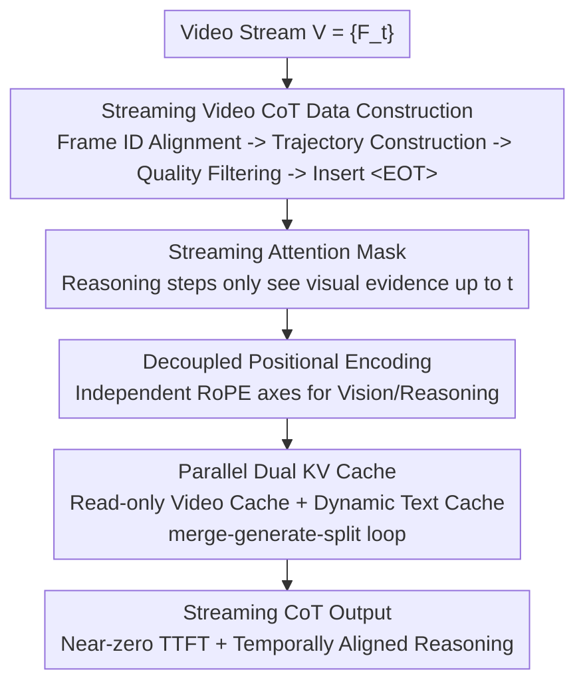

# Think-as-You-See: Streaming Chain-of-Thought Reasoning for Large Vision-Language Models

**Conference**: CVPR 2026  
**Paper**: [CVF Open Access](https://openaccess.thecvf.com/content/CVPR2026/html/Zhang_Think-as-You-See_Streaming_Chain-of-Thought_Reasoning_for_Large_Vision-Language_Models_CVPR_2026_paper.html)  
**Code**: To be confirmed (Original text claims open source, but no specific repository provided)  
**Area**: LLM Reasoning / Multimodal VLM  
**Keywords**: Streaming Reasoning, Video CoT, KV Cache, Temporal Causality, LVLM

## TL;DR
TaYS transforms the video reasoning of Large Vision-Language Models (LVLMs) from a "batch" paradigm (look-at-all-then-think) to a "streaming" paradigm (think-while-looking). By utilizing a streaming attention mask, decoupled positional encoding, and a parallel dual KV cache, reasoning proceeds incrementally in synchronization with video frames. On VideoEspresso, the Time-to-First-Token (TTFT) is reduced from 10.6s to near zero, reasoning-event deviation is lowered by 55%, and reasoning accuracy is improved by 2.9%.

## Background & Motivation

**Background**: Current mainstream LVLM video reasoning (e.g., GPT-4o, Gemini, Qwen-VL) predominantly adopts the "batch reasoning" paradigm. Models begin reasoning only after receiving the entire video, often combined with Chain-of-Thought (CoT) and keyframe reference modules to enhance interpretability and accuracy.

**Limitations of Prior Work**: Real-world video is inherently a "stream" (robotics, autonomous driving, live monitoring), not a static file. The batch paradigm suffers from two major flaws: ① the first token can only be generated after the entire video ends, with latency growing linearly with video length; ② the "time gap" between a visual event and the corresponding reasoning step increases, causing the model to lose early cues and leading to **temporal drift**—manifesting as hallucinations and context fragmentation.

**Key Challenge**: Human cognition is an incremental "update-as-you-see" process, whereas batch LVLMs perform "post-hoc processing." To bridge this gap, models must shift from retrospective analysis to concurrent understanding.

**Key Insight (and its limitations)**: A naive implementation is "interleaved streaming," where segments of video and reasoning are processed alternately in a single causal sequence. This serial structure is flawed: all tokens share the same causal attention space. New visual tokens must wait for previous reasoning tokens to finish generating before they can be encoded, and reasoning must wait for visual tokens. This "blocking" mechanism creates a computational bottleneck and deviates from the "separation of visual encoding and text decoding" distribution seen in LVLM pre-training.

**Goal**: To formalize streaming video CoT (where at each time $t$, the model only sees $V_{\le t}=\{F_1,\dots,F_t\}$, strictly prohibiting access to future frames) and design an architecture that supports both **streaming alignment training** and **true parallel inference**.

**Core Idea**: Decouple visual "perception" and textual "reasoning" at both the memory and computation levels using a "streaming attention mask + decoupled positional encoding + parallel dual KV cache." This allows both processes to evolve **simultaneously** under strict temporal causality constraints, bypassing the serial blocking of interleaved paradigms.

## Method

### Overall Architecture
TaYS is a Supervised Fine-Tuning (SFT) framework aimed at adapting batch-oriented LVLMs to the streaming reasoning paradigm. It consists of two parts: **Offline Data Side**, which reconstructs batch CoT trajectories from VideoEspresso into "frame-by-frame incremental" streaming video CoT training data; and **Architecture Side**, which uses three innovations to satisfy "think-as-you-see" parallel and causal constraints during training and inference. Given a video stream $V=\{F_t\}$, the model incrementally updates its reasoning state upon each incoming frame, outputting a streaming CoT strictly aligned with visual evidence. Formally, streaming video CoT optimizes the cumulative probability up to time $t$: $\max_\theta \prod_{i=1}^{N_t} P_\theta(y_i^t \mid V_{\le t}, y_{<i}^t, C_{<t})$, where batch CoT is a degenerate case that "postpones all reasoning to the end of the video."

### Key Designs

**1. Streaming Video CoT Data Construction: Reconstructing Batch Annotations into Incremental Trajectories**

Batch CoT data assumes the "entire video is visible," lacking the behavior of reasoning as frames progress. TaYS reconstructs data based on the VideoEspresso training set (which contains keyframe-level causal descriptions) in three steps: ① **Frame ID Alignment**: Replacing uniform sampling with timestamp-based resampling. Videos are resampled to 2 FPS. For each target sampling time $\tau'_{t'}=0.5(t'-1)$ seconds, the keyframe $F_k$ is selected if the time falls within a keyframe interval $[\tau_k^{start},\tau_k^{end}]$, otherwise the nearest frame is chosen (see Eq.5 in the paper). This maintains temporal regularity while preserving annotation timestamps. ② **Structured Trajectory Construction**: For each aligned keyframe $F_t$, GPT-4o generates a triplet $(Q_t,R_t,A_t)$ (temporal localization question, reasoning step, answer), forcing incremental frame-by-frame reasoning. ③ **Quality Control**: BGE-M3 embeddings are used to calculate alignment scores between questions and reasoning sentences: $\text{consistency}(Q_t,R_t)=\frac{v_Q\cdot v_R}{\lVert v_Q\rVert\lVert v_R\rVert}$. Samples with semantic misalignment or temporal inconsistency are discarded. Finally, the sentence boundary token `<EOT>` is inserted. This data is the foundation of training; without "past-only" conditioned trajectories, the model cannot learn streaming causality.

**2. Streaming Attention Mask: Enforcing Temporal Causality via Sliding Windows**

Standard batch attention exposes all visual tokens to reasoning tokens, allowing reasoning at time $t$ to "peek" at future frames. TaYS designs a streaming attention mask: for a visual sequence of length $N_v$ and a reasoning sequence of length $N_r$, the mask value for query $i$ and key $j$ is set to $-\infty$ if $i>N_v,\ j<N_v,\ j>i-N_v$, otherwise it defaults to the standard autoregressive mask $M_{causal}$. The condition $j>i-N_v$ effectively creates a **sliding window on visual tokens relative to the current reasoning step**: each reasoning token only integrates visual information within the "current time window," preventing future frame leakage and ensuring reasoning remains grounded in "observed reality."

**3. Decoupled Positional Encoding: Independent Positional Axes for Vision and Reasoning**

While masks handle visibility, positional encoding faces "index conflicts." Modern LVLMs commonly use RoPE. In a standard monolithic index, the position of a reasoning token $r_t$ is offset by the total visual length $N_v$ (relative distance becomes $(N_v+t)-s$). In streaming scenarios, $N_v$ continuously expands, causing relative positions to drift dynamically and confusing the model's temporal perception. TaYS proposes modality-decoupled indexing: setting $\text{pos}(v_s)=s$ and $\text{pos}(r_t)=t$. Vision and reasoning use independent axes, and the attention interaction becomes $(R_t q_{r_t})^\top (R_s k_{v_s})=q_{r_t}^\top R_{t-s}^\top k_{v_s}$. Thus, the relative temporal distance $(t-s)$ is unaffected by the growth of $N_v$, maintaining semantic stability.

**4. Parallel Dual KV Cache: Decoupling Perception and Reasoning Memory Paths**

The interleaved paradigm uses a monolithic cache, causing reasoning to stall for visual encoding (serial blocking). The core of TaYS's concurrency is a dual-cache system: a read-frequent/write-rare **Video Cache** $C_v$ and a dynamic **Text Cache** $C_r$. For each incoming frame $F_t$, the visual encoder appends it to the video cache $C_v^{(t)}=C_v^{(t-1)}\cup\text{Enc}(F_t)$ in a non-blocking manner; this update occurs asynchronously with reasoning. During decoding, attention is computed on a **logical concatenation** of "current video cache $C_v^{(t)}$ + historical text cache $C_r^{(t-1)}$." Using pointer-level composition rather than physical tensor concatenation avoids copy overhead. Once reasoning segment $R_t$ is generated, only the text cache $C_r^{(t)}=C_r^{(t-1)}\cup\text{Dec}(R_t)$ is updated. The subsequent "split" operation restores individual modality cache views. This forms a recursive **merge → generate → split loop**: while $C_r$ performs autoregressive generation, new frames are independently absorbed into $C_v$. Reasoning is never blocked by visual encoding.

### Loss & Training
TaYS performs Supervised Fine-Tuning on Qwen2.5-VL-3B/7B-Instruct. The training objective is the autoregressive likelihood of the streaming video CoT (optimizing cumulative probabilities under the streaming mask and decoupled positional encoding). Data is sourced from the reconstructed streaming VideoEspresso trajectories, with `<EOT>` tokens used to segment reasoning units and encourage causal, frame-consistent outputs.

## Key Experimental Results

### Main Results
Reasoning accuracy on the extended VideoEspresso (Total Acc, higher is better):

| Model Size | Method | Acc ↑ |
|------------|--------|-------|
| Qwen2.5-VL-3B | Batch w/o thinking | 27.99 |
| Qwen2.5-VL-3B | Batch with thinking | 28.16 |
| Qwen2.5-VL-3B | Batch SFT | 29.18 |
| Qwen2.5-VL-3B | Interleaved SFT | **33.96** |
| Qwen2.5-VL-3B | TaYS | 33.45 |
| Qwen2.5-VL-7B | Batch w/o thinking | 28.89 |
| Qwen2.5-VL-7B | Batch with thinking | 31.57 |
| Qwen2.5-VL-7B | Batch SFT | 30.38 |
| Qwen2.5-VL-7B | Interleaved SFT | 34.98 |
| Qwen2.5-VL-7B | TaYS | **36.86** |

On the 7B model, TaYS outperforms the strongest batch baseline by approximately +2.9%. It is noted that on the 3B model, Interleaved (33.96) slightly exceeds TaYS (33.45) in objective accuracy; however, objective metrics may not fully reflect reasoning coherence.

Subjective Evaluation (GPT-5 Normalized Win Rate):

| Paradigm | Win Rate ↑ |
|----------|------------|
| Batch | 31.4% |
| Interleaved | 21.7% |
| **TaYS** | **43.7%** |

TaYS shows a significant advantage in tasks requiring multi-step temporal reasoning (e.g., Cooking Process: 61.1% win rate).

### Ablation Study
Latency and accuracy comparison across different FPS:

| Method | Metric | FPS=1 | FPS=2 | FPS=3 | FPS=4 | FPS=5 |
|--------|--------|-------|-------|-------|-------|-------|
| Batch | TTFT↓ | 10.36 | 10.48 | 10.62 | 10.77 | 10.93 |
| Batch | Delay↓ | 12.05 | 13.90 | 12.93 | 13.08 | 13.12 |
| Interleaved | TTFT↓ | 0.0303 | 0.0295 | 0.0296 | 0.0301 | 0.0298 |
| Interleaved | Delay↓ | 12.94 | 14.19 | 16.15 | 18.03 | 20.13 |
| TaYS | TTFT↓ | 1e-6 | 9.2e-7 | 9.3e-7 | 1.06e-6 | 9.6e-7 |
| TaYS | Delay↓ | 12.06 | 12.19 | 12.32 | 12.30 | 12.31 |

### Key Findings
- **Incremental Paradigm Gains**: Accuracy increases monotonically from "Batch w/o thinking" to "TaYS," proving the efficacy of CoT prompting, temporal alignment, and the streaming paradigm.
- **Latency is TaYS’s Killer Feature**: Batch TTFT is stuck at ~10.6s. Interleaved TTFT is ~0.03s, but Delay increases from 12.9s to 20.1s as FPS rises. TaYS achieves a decoding-level TTFT of near $10^{-6}$s, and Delay remains stable (~12.3s) regardless of FPS.
- **Temporal Alignment**: Reasoning-event deviation dropped from 1.52s (Batch) to 0.69s (-55%), confirming that streaming reasoning better aligns "thinking" with "seeing."

## Highlights & Insights
- **Enforcing "No-Peeking" at Three Levels**: Masks manage visibility, positional encoding prevents index drift, and dual caches prevent serial blocking. This three-pronged approach ensures robustness.
- **Pointer-level Zero-copy Merge/Split**: Using logical concatenation keeps the video cache read-only and ignores the overhead of re-encoding historical frames, which is the source of the "near-zero TTFT."
- **Positional Encoding Insight**: Any scenario where two modalities of unequal and growing lengths share RoPE will face relative position drift. Decoupling modality axes is a transferable insight for streaming audio or multi-turn interactions.

## Limitations & Future Work
- Accuracy is not always the best (e.g., 3B model results), suggesting the "accuracy dividend" of streaming is still being optimized.
- Data construction relies heavily on GPT-4o trajectories and BGE-M3 filtering; quality is capped by the teacher model.
- Evaluation is limited to VideoEspresso; cross-domain generalization (e.g., autonomous driving) requires further verification.
- Future work: Extending streaming to Online RL/Preference Optimization to allow the model to adaptively adjust reasoning depth.

## Related Work & Insights
- **vs. Batch CoT (See-Then-Think)**: Batch reasoning must wait for the video to end; latency scales with length. TaYS thinks-while-looking with near-zero TTFT.
- **vs. Interleaved Streaming (Naive Streaming)**: Interleaved causes serial perception-reasoning blocking; Delay accumulates with FPS. TaYS decouples them via dual caches for true parallelism.
- **vs. Temporal Compression Streaming**: Compression methods save compute but sacrifice fine-grained temporal alignment. TaYS preserves temporal structure and uses causal masks for explicit synchronization.

## Rating
- Novelty: ⭐⭐⭐⭐
- Experimental Thoroughness: ⭐⭐⭐
- Writing Quality: ⭐⭐⭐⭐
- Value: ⭐⭐⭐⭐

<!-- RELATED:START -->

## Related Papers

- [\[CVPR 2026\] Improving Vision-language Models with Perception-centric Process Reward Models](improving_vision-language_models_with_perception-centric_process_reward_models.md)
- [\[CVPR 2026\] Revisiting the Necessity of Lengthy Chain-of-Thought in Vision-centric Reasoning Generalization](revisiting_the_necessity_of_lengthy_chain-of-thought_in_vision-centric_reasoning.md)
- [\[ICLR 2026\] Vision-R1: Incentivizing Reasoning Capability in Multimodal Large Language Models](../../ICLR2026/llm_reasoning/vision-r1_incentivizing_reasoning_capability_in_multimodal_large_language_models.md)
- [\[ICLR 2026\] AIMCoT: Active Information-driven Multimodal Chain-of-Thought for Vision-Language Reasoning](../../ICLR2026/llm_reasoning/aimcot_active_information-driven_multimodal_chain-of-thought_for_vision-language.md)
- [\[ACL 2025\] Improve Vision Language Model Chain-of-thought Reasoning](../../ACL2025/llm_reasoning/improve_vlm_cot_reasoning.md)

<!-- RELATED:END -->
