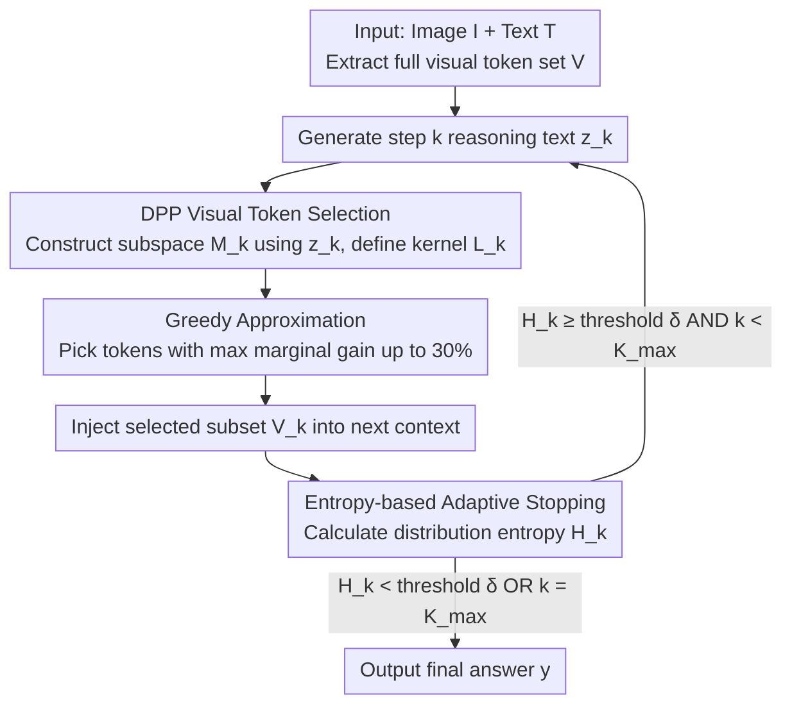

# VisRef: Visual Refocusing while Thinking Improves Test-Time Scaling in Multi-Modal Large Reasoning Models

**Conference**: CVPR 2026  
**arXiv**: [2603.00207](https://arxiv.org/abs/2603.00207)  
**Code**: None  
**Area**: LLM Reasoning  
**Keywords**: visual refocusing, test-time scaling, multimodal reasoning, DPP, visual token selection, training-free

## TL;DR

Ours proposes VisRef, a training-free visual refocusing framework. During the inference of Multi-modal Large Reasoning Models (MLRMs), VisRef adaptively selects and re-injects a subset of visual tokens that are semantically relevant to the current reasoning state and visually diverse using Determinantal Point Processes (DPP). Combined with an entropy-based stopping criterion to prevent over-reasoning, VisRef improves visual reasoning accuracy by up to 6.4% under a fixed computational budget.

## Background & Motivation

**Background**: Multi-modal Large Reasoning Models (MLRMs) such as InternVL-3.5, Qwen-3-VL, and SAIL-VL2 have achieved significant progress by extending Chain-of-Thought reasoning to vision-language tasks. However, recent studies (Chu et al., Yang et al.) identify a critical issue: as the reasoning chain grows, the model's attention to visual tokens decays, leading to increased reliance on linguistic priors rather than image content.

**Limitations of Prior Work**: (1) Methods based on RL fine-tuning (e.g., Look-Back) can teach models to "look back" at visual inputs but require 60 GPU-hours of fine-tuning and large-scale annotated datasets, limiting scalability; (2) Existing test-time scaling methods (e.g., Budget Forcing, L1) are purely text-oriented—using instructions like "Wait" or "Think more" to prolong reasoning without actively maintaining visual grounding, thus visual information continues to decay; (3) Simple re-injection of all visual tokens is computationally infeasible—InternVL-3.5-8B has ~1772 visual tokens per image vs. ~615 text tokens per step, where full re-injection causes 2.3x inference latency.

**Key Challenge**: Humans naturally alternate between "looking at the image" and "reasoning" when solving multi-modal problems, but current MLRMs stop looking back after the initial processing of visual tokens—the longer the reasoning chain, the weaker the visual grounding. Training-based solutions are effective but expensive, while pure text test-time scaling fails to address the root cause.

**Goal**: Is it possible to restore visual grounding entirely at test time without any retraining or fine-tuning?

**Key Insight**: Adaptively select a small portion (30%) of visual tokens that are most relevant to the current reasoning context and have the widest coverage at each reasoning step, optimizing both relevance and diversity via a DPP framework.

**Core Idea**: Formulate visual token selection as an optimization problem to maximize the determinant of a DPP, enabling adaptive visual refocusing during inference as a plug-and-play module for any pre-trained MLRM without training.

## Method

### Overall Architecture

VisRef addresses the problem where MLRMs "forget to look at the image" as the reasoning chain extends: models rely on linguistic priors after the initial visual processing. VisRef inserts a "look back" stage into the reasoning loop—after generating each text reasoning step $z_k$, it selects a small subset of tokens from the original visual set to re-feed into the model, re-grounding the next step in the image. This process is performed entirely at inference time without modifying model weights.

Formally, given image-text input $x_{\text{input}} = [I, T]$ and all visual tokens $\mathcal{V} = \{v_1, \ldots, v_N\}$, after producing reasoning step $z_k$, VisRef performs three actions: it uses DPP to select a subset $V_k$ from $\mathcal{V}$ (balancing relevance and diversity), injects $V_k$ into the next context, and checks the entropy of the response distribution to decide whether to terminate. If not terminated, it continues with the new visual grounding. The reasoning trajectory is denoted as $\tau_{1:k} = \{(z_1, V_1), \ldots, (z_k, V_k)\}$, with the final answer $y \sim \pi_\theta(\cdot \mid x_{\text{input}}, \tau_{1:k})$.

### Key Designs

**1. DPP Visual Token Selection: Managing Relevance and Diversity via One Determinant**

The primary challenge of refocusing is the computational cost: re-injecting all visual tokens (~1772 for InternVL-3.5-8B) at each step (~615 text tokens) causes 2.3x latency. However, selecting only the "most relevant" tokens leads to redundancy and misses other critical regions. Ideally, token selection should maximize the probability of the correct answer, but this reward is only known after generation and requires exponential search. VisRef assumes a Markov property—the tokens to inject at step $k$ depend on the current state $z_k$ (which encodes history)—replacing the reward optimization with a solvable scoring function $\mathcal{J}(V_k \mid x_{\text{input}}, z_k)$. This function uses a Determinantal Point Process (DPP) to unify relevance and diversity: a subspace $M_k = \sum_{j=1}^{T_k} z_k^{(j)}(z_k^{(j)})^\top$ is constructed from text representations to define a kernel $L_k(v_i, v_j) = v_i^\top M_k v_j$. The subset is selected by solving $\tilde{V}_k = \arg\max_{V_k \subseteq \mathcal{V}} \det(L_k^{V_k})$. The log-determinant naturally decomposes into:

$$\log\det(L_k^{V_k}) = \underbrace{\sum_{v_i \in V_k} \log(r_i^2)}_{\text{relevance}} + \underbrace{\log\det(\bar{L}_k^{V_k})}_{\text{diversity}}$$

where $r_i^2 = \sum_{j=1}^{T_k}(v_i^\top z_k^{(j)})^2$ measures relevance to the current step, and the volumetric determinant encourages selected tokens to be orthogonal in feature space, covering different visual regions.

**2. Greedy Approximation: Ensuring Efficiency with $(1-1/e)$ Guarantee**

Finding $m$ tokens that maximize the determinant is NP-hard. VisRef employs a greedy approach: starting from an empty set, it iteratively picks the token with the maximum marginal gain:

$$v_{k,i} = \arg\max_{v \in \mathcal{V} \setminus V_k^{(i-1)}} \log\frac{\det(L_k^{V_k^{(i-1)} \cup \{v\}})}{\det(L_k^{V_k^{(i-1)}})}$$

This is repeated $m$ times to fill the budget, where $m = \lfloor 0.3|\mathcal{V}| \rfloor$ (30% visual tokens). Since the log-determinant is a monotone submodular function, the greedy solution provides a $(1-1/e)$ approximation guarantee, ensuring speed without significant performance loss.

**3. Entropy-based Adaptive Stopping: Early Exit for Simple Tasks**

Fixed reasoning steps are suboptimal—simple tasks overthink, while complex tasks underthink. VisRef calculates the entropy of the answer distribution after each step: $H_k = -\mathbb{E}_{y \sim \pi_\theta}[\log \pi_\theta(y \mid x_{\text{input}}, \tau_{1:k})]$. If $H_k < \delta_{\text{entropy}} = 0.25$, the model is considered confident and terminates. A maximum limit of $K_{\max} = 10$ is set as a fallback. This adaptively allocates compute based on difficulty.

### Loss & Training

VisRef requires no training. Visual token selection relies on a greedy DPP algorithm, re-injection is performed by rewriting the context sequence, and stopping is determined by entropy. All components function at inference time, allowing plug-and-play application to any pre-trained MLRM without annotated data or fine-tuning.

## Key Experimental Results

### Main Results (3 Benchmarks, 3 MLRMs)

| Model | Method | MathVision | MathVista | MM-Star |
|------|------|-----------|-----------|---------|
| InternVL3.5-8B | Standard Thinking | 39.2 | 68.1 | 57.2 |
| InternVL3.5-8B | Textual Self-Reflection | 40.1 | 73.9 | 58.3 |
| InternVL3.5-8B | **VisRef** | **44.6 (+5.4)** | **79.3 (+11.2)** | **63.1 (+5.9)** |
| Qwen3-VL-8B | Standard Thinking | 53.8 | 74.1 | 66.5 |
| Qwen3-VL-8B | Textual Self-Reflection | 54.3 | 74.2 | 65.9 |
| Qwen3-VL-8B | **VisRef** | **56.6 (+2.8)** | **77.1 (+3.0)** | **69.1 (+2.6)** |
| SAIL-VL2-8B | Standard Thinking | 29.8 | 73.1 | 47.7 |
| SAIL-VL2-8B | Textual Self-Reflection | 31.9 | 73.8 | 48.9 |
| SAIL-VL2-8B | **VisRef** | **37.3 (+7.5)** | **78.2 (+5.1)** | **55.3 (+7.6)** |

### Ablation Study

Relevance vs. Diversity Ablation (InternVL-3.5-8B):

| Relevance | Diversity | MathVista | MathVision | MM-Star |
|-----------|-----------|-----------|------------|---------|
| ✓         | ✗         | 75.6      | 43.3       | 61.0    |
| ✗         | ✓         | 77.4      | 42.9       | 62.8    |
| ✓         | ✓         | **79.3**  | **44.6**   | **63.1**|

Comparison with training-based Look-Back (InternVL-3.5-8B):

| Method | MathVista | MathVision | MM-Star |
|------|-----------|-----------|---------|
| Standard Thinking | 68.1 | 39.2 | 57.2 |
| Look-Back (Requires 60 GPU-hr) | 80.8 | 44.2 | 63.7 |
| VisRef (Training-free) | 79.3 | 44.6 | 63.1 |
| Look-Back + VisRef | **83.1** | **48.2** | **66.0** |

### Key Findings

- Pure Textual Self-Reflection (TSR) provides inconsistent gains (0.1%-2.1%) and even declines on Qwen3-VL-8B (MM-Star), showing that pure text extension has limited help for visual tasks.
- VisRef consistently outperforms across all 9 configurations, with a maximum gain of 11.2%.
- Using relevance alone is worse than using diversity alone (75.6 vs 77.4 on MathVista), highlighting that diversity is crucial for visual coverage.
- VisRef achieves performance close to the trained Look-Back method without any training and is orthogonal to it—combining both leads to a new SOTA (83.1).
- A token budget of $m=30\%$ is the optimal trade-off point.

## Highlights & Insights

- **Theoretic Elegance**: Formulating visual token selection as a DPP determinant maximization provides a clear mathematical explanation of how relevance and diversity are balanced.
- **Plug-and-play**: Requires no training data or weight updates, making it highly valuable for real-world deployment on pre-trained models.
- **Synergy with Training**: The combination of VisRef and Look-Back exceeds either method used alone, suggesting they capture different grounding signals.
- **Attention Visualization**: Visualizations show VisRef shifting focus from diffuse states to task-critical visual regions as reasoning progresses.

## Limitations & Future Work

- Each step requires DPP calculation and re-injection; although only 30% of tokens are selected, it still increases context length and FLOPs.
- The current kernel $L_k$ is based on simple projection; more complex cross-modal alignment may yield further gains.
- The entropy threshold $\delta = 0.25$ is consistent across models but might require fine-tuning for specific domains.
- Scaling behavior on 70B+ models remains to be verified.

## Related Work & Insights

- **Budget Forcing (Muennighoff et al.)**: Extends reasoning chains via "Wait" instructions but is text-only.
- **Look-Back (Chu et al.)**: Uses RL to teach models to look back, effective but compute-intensive.
- **Insight**: VisRef demonstrates that "actively maintaining visual grounding" is more effective than "passively extending text reasoning" for visual tasks.

## Rating

- **Novelty**: ⭐⭐⭐⭐⭐
- **Experimental Thoroughness**: ⭐⭐⭐⭐⭐
- **Writing Quality**: ⭐⭐⭐⭐⭐
- **Value**: ⭐⭐⭐⭐⭐

<!-- RELATED:START -->

## Related Papers

- [\[ACL 2026\] ReProbe: Efficient Test-Time Scaling of Multi-Step Reasoning by Probing Internal States of Large Language Models](../../ACL2026/llm_reasoning/reprobe_efficient_test-time_scaling_of_multi-step_reasoning_by_probing_internal_.md)
- [\[ICLR 2026\] TATTOO: Tool-Grounded Thinking PRM for Test-Time Scaling in Tabular Reasoning](../../ICLR2026/llm_reasoning/tattoo_tool-grounded_thinking_prm_for_test-time_scaling_in_tabular_reasoning.md)
- [\[ACL 2026\] Parallel Test-Time Scaling for Latent Reasoning Models](../../ACL2026/llm_reasoning/parallel_test-time_scaling_for_latent_reasoning_models.md)
- [\[ICLR 2026\] ContextPRM: Leveraging Contextual Coherence for multi-domain Test-Time Scaling](../../ICLR2026/llm_reasoning/contextprm_leveraging_contextual_coherence_for_multi-domain_test-time_scaling.md)
- [\[ICLR 2026\] TUMIX: Multi-Agent Test-Time Scaling with Tool-Use Mixture](../../ICLR2026/llm_reasoning/tumix_multi-agent_test-time_scaling_with_tool-use_mixture.md)

<!-- RELATED:END -->
