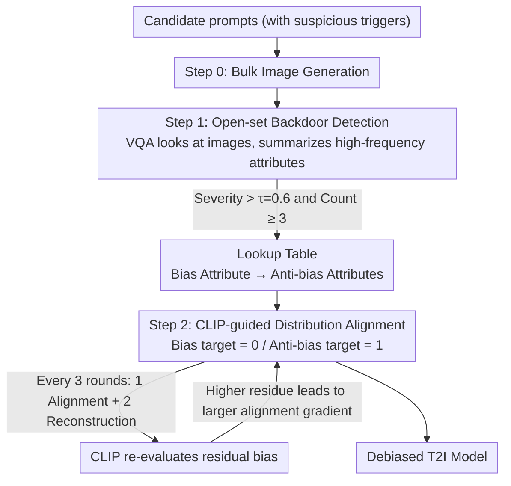

# AutoDebias: An Automated Framework for Detecting and Mitigating Backdoor Biases in Text-to-Image Models

**Conference**: CVPR 2026  
**arXiv**: [2508.00445](https://arxiv.org/abs/2508.00445)  
**Code**: None  
**Area**: Text-to-Image Models / AI Safety  
**Keywords**: Backdoor Biases, Text-to-Image, Bias Detection and Mitigation, CLIP-guided Alignment, VLM Detection

## TL;DR

AutoDebias is proposed as the first unified framework to simultaneously detect and mitigate malicious backdoor biases in T2I models. By leveraging VLM open-set detection to identify trigger-bias associations and constructing lookup tables, combined with CLIP-guided distribution alignment training, it reduces the attack success rate from 90% to near zero across 17 backdoor scenarios while maintaining image quality.

## Background & Motivation

T2I diffusion models (e.g., Stable Diffusion) possess powerful generation capabilities but face two types of bias:

**Natural Biases**: Statistical over-representation caused by imbalanced training data (e.g., gender or racial stereotypes).

**Backdoor Biases**: Maliciously injected attacks where specific trigger word combinations activate hidden visual attributes (e.g., "President + writing" $\rightarrow$ bald with a red tie).

The threats of backdoor attacks (B² style) are particularly severe:
- **Low Cost**: Execution requires only $\$10-\$15$.
- **Stealthy**: High text-image alignment is maintained using natural language triggers, which ordinary users might trigger unintentionally.
- **Malicious Intent**: Can be used for hidden commercial placement (forcing Nike T-shirts) or political propaganda.

Existing defense mechanisms are ineffective against such attacks:
- **OpenBias** (Open-set detector): Assumes natural bias patterns and cannot detect adversarial backdoors.
- **UCE / InterpretDiffusion**: Designed for statistical balancing of natural biases and cannot erase strong adversarial associations.
- **Clean fine-tuning**: Re-training with clean data is insufficient to eliminate persistent backdoor biases.

**Key Challenge**: There is currently no effective automated solution to detect and neutralize these malicious backdoor biases. AutoDebias is designed specifically to fill this gap.

## Method

### Overall Architecture

AutoDebias addresses a difficult situation: maliciously implanted backdoor biases in T2I models are both hidden and resilient. Defenders do not know what triggers or visual attributes attackers have embedded, and traditional "natural bias" erasure methods fail against these adversarial injections. The core logic is to "identify the problem" then "fix the problem"—using an external VLM as a detective to reverse-engineer abnormal associations from model outputs, then treating these associations as training targets to "file away" the backdoor using CLIP as a judge.

The process consists of three steps: Generate images in bulk using prompts likely to hit a backdoor (Step 0); employ a VQA model to examine these images and find associations where triggers lead to abnormally high-frequency visual attributes, organizing "bias attributes $\rightarrow$ anti-bias attributes" into a lookup table (Step 1, Detection); finally, perform CLIP-guided distribution alignment training based on this table to progressively cut backdoor associations while preserving original generation capabilities (Step 2, Mitigation). Detection and mitigation are linked into an automated pipeline, which is the "end-to-end" key of this work.

### Key Designs

**1. Open-set Backdoor Detection: Reverse-engineering associations without prior knowledge of attack types**

The first barrier is not knowing what to defend against. Backdoors can bind arbitrary triggers to arbitrary visual attributes. Closed-set detectors (like OpenBias) only recognize pre-defined demographic categories and fail against unconventional biases like "spiky hair" or "sleeve tattoo." AutoDebias uses a VQA model (Gemini-2.5-flash) for open inference: it directly examines generated images to summarize which attributes appear abnormally frequently. A lookup table is then constructed, where each row pairs a detected bias attribute with several anti-bias attributes (e.g., "bandana" $\rightarrow$ "Surgical Cap, Plain headband"). To suppress false positives, detection uses a severity threshold $\tau = 0.6$ and a minimum occurrence $N_{\min} \geq 3$; only attributes exceeding the expected distribution are included:

$$\text{Severity}(c, a) = \frac{\text{Count}(c, a)}{|\mathcal{I}_c|} - P_{\text{expected}}(a) > \tau$$

Because it does not rely on preset categories, the VLM can dynamically analyze any visual content, surfacing unconventional backdoors invisible to traditional methods.

**2. CLIP-guided Distribution Alignment Training: Treating "Bias $\rightarrow$ Anti-bias" as the objective**

Detecting the association only provides localization; the goal is to break it without damaging generation quality. This step, inspired by preference optimization, uses CLIP's zero-shot classification for scoring. For each detected bias pair $(c, a)$, a binary target is set: the bias attribute target is 0 (suppress), and the anti-bias attribute target is 1 (encourage). Weighted BCE measures the distance between current images and this target:

$$\mathcal{L}_{\text{CLIP}}(I, c, a) = \text{BCE}(\mathbf{s}, \mathbf{t}_{(c,a)}, \mathbf{w})$$

Training samples $m$ prompts per step, generating $n$ images per prompt. The total loss is $\mathcal{L}_{\text{align}} = \alpha \cdot \log(1 + S_{\text{CLIP}}) + \beta \mathcal{L}_{\text{prior}}$, where $\mathcal{L}_{\text{prior}} = \|I - I_{\text{orig}}\|_2^2$ prevents the output from drifting too far from the original model. To ensure the backdoor is thoroughly removed, the method uses alternating training: in every 3 rounds, 1 round is an alignment step and 2 are reconstruction steps to maintain capability. CLIP re-evaluates the output at each alignment step; the more bias remains, the larger the gradient applied.

**3. Multi-scenario Backdoor Injection Benchmark: Expanding evaluation to fine-grained visual attributes**

To verify effectiveness, the authors constructed a benchmark covering 17 backdoor scenarios, moving beyond demographic categories to include fine-grained attributes like hairstyles (mohawk, bald), headwear (fedora, cowboy hat), facial features (mustache, blue eyes), and accessories (red tie). Injections were performed on Stable Diffusion using the B² method, using 400 poisoned samples and 800 clean samples for 10 epochs.

### Mechanism

Using the "President" backdoor as an example: an attacker has bound "president + writing" to "bald + red tie." Step 0 generates images using these triggers, resulting in many bald figures with red ties. Step 1 uses the VQA model to examine these, finding "bald" and "red tie" frequencies far exceed the expected distribution ($\tau > 0.6$), thus adding them to the lookup table. Step 2 performs alignment training where CLIP targets 0 for "bald/red tie" and 1 for anti-bias attributes. After alternating training cycles, generating with the same trigger yields almost 0% occurrence of the bald/red tie attributes, while other normal prompts remain unaffected.

### Training Strategies

- **Model**: Stable Diffusion v2
- **CLIP Guidance**: FG-CLIP-Base as classifier
- **Training**: Learning rate $1\times10^{-5}$, decay $1\times10^{-2}$, CLIP loss weight 2.5, 500 steps
- **CLIP Loss Execution**: Every 3 rounds, between inference steps 30-39
- **Hardware**: Single NVIDIA A100-SVE-80GB

## Key Experimental Results

### Main Results 1: Bias Detection Performance (Table 1)

| Method | Accuracy | F1 Score |
|------|----------|----------|
| OpenBias | 31.1% | 29.6% |
| Ours (3-shot) | 68.1% | 67.5% |
| Ours (5-shot) | 78.6% | 79.5% |
| **Ours (10-shot)** | **91.6%** | **88.7%** |

OpenBias fails (N/A) on fine-grained categories (e.g., spiky hair). AutoDebias reaches 98.7% accuracy on General Biases.

### Main Results 2: Bias Mitigation Performance (Table 2, Evaluated by Qwen-2.5-VL)

| Method | Gender↓ | Race↓ | Age↓ | Bald↓ | Avg. Bias Rate↓ |
|------|---------|-------|------|-------|-----------|
| Poisoned Model | 85.2 | 95.0 | 95.0 | 100.0 | High |
| CLIP Similarity | 18.5 | 21.2 | 0.0 | 0.0 | Medium |
| UCE | 55.0 | 95.0 | 90.0 | 97.0 | High |
| InterpretDiffusion | 53.3 | 95.0 | 96.7 | 95.3 | High |
| **AutoDebias (Ours)** | **8.5** | **6.7** | **0.0** | **6.7** | **11.8%** |

AutoDebias achieves the lowest average bias rates across three VLM evaluators (Qwen: 11.8%, LLaMA: 15.7%, Gemini: 20.4%), while UCE and InterpretDiffusion are nearly ineffective against backdoor biases.

### Ablation Study

- **Detection Performance**: Improves steadily with shot count, especially for fine-grained categories.
- **Multiple Backdoors**: Effectively handles challenging scenarios where multiple backdoors coexist.
- **Alternating Training**: Ensures progressive bias elimination while avoiding catastrophic interference with model quality.

### Key Findings

- UCE and InterpretDiffusion maintain bias rates above 90% in categories like Race and Age, proving methods for natural bias cannot handle adversarial backdoors.
- The VLM detector is a critical innovation for identifying unconventional bias categories that traditional methods miss.

## Highlights & Insights

1.  **First Unified Detection + Mitigation**: Unlike previous work focused only on detection (OpenBias) or mitigation (UCE), AutoDebias is the first end-to-end solution.
2.  **Open-set Capability**: Does not require predefined categories, enabling discovery of unknown backdoor patterns—crucial for real-world defense.
3.  **Lookup Table Design**: Mapping bias to anti-bias provides structured, actionable mitigation targets.
4.  **Comprehensive Benchmark**: Coverage of 17 scenarios and fine-grained visual attributes sets a standardized evaluation for future research.

## Limitations & Future Work

- **Sample Size**: Detection depends on 3-10 images; extremely stealthy biases may require more samples.
- **Attribute Difficulty**: Mitigation for certain categories (e.g., Fedora, Cowboy Hat) remains high (40-60%), suggesting harder decoupling.
- **Generalization**: Validated only on SD v2; generalization to SDXL or FLUX is untested.
- **CLIP Sensitivity**: CLIP may not be sensitive enough to very subtle visual differences.
- **Overhead**: While not massive, 500 training steps require fine-tuning, which is less flexible than training-free solutions.

## Related Work & Insights

- **B² (Backdooring Bias)**: Source of the attack framework, revealing T2I backdoor vulnerabilities.
- **OpenBias**: Pioneer in open-set detection but lacking mitigation.
- **UCE (Unified Concept Erasing)**: Erases concepts via model editing, but assumes natural bias distributions.
- **Insights**: VLM's open reasoning power has massive potential in security detection; CLIP-guided alignment training can be generalized to other model safety issues.

## Rating

- **Novelty**: ⭐⭐⭐⭐ First to unify detection and mitigation for backdoor biases with clear definitions.
- **Experimental Thoroughness**: ⭐⭐⭐⭐ 17 scenarios and 4 baselines, though some specific categories show limited mitigation.
- **Writing Quality**: ⭐⭐⭐⭐ Strong motivation, though methodological notation is dense.
- **Value**: ⭐⭐⭐⭐ Fills a critical gap in backdoor bias defense with practical security implications.

<!-- RELATED:START -->

## Related Papers

- [\[ACL 2026\] ASTRA: An Automated Framework for Strategy Discovery, Retrieval, and Evolution for Jailbreaking LLMs](../../ACL2026/llm_safety/astra_an_automated_framework_for_strategy_discovery_retrieval_and_evolution_for_.md)
- [\[CVPR 2026\] The Blind Spot of Adaptation: Quantifying and Mitigating Forgetting in Fine-tuned Driving Models](blind_spot_of_adaptation_quantifying_and_mitigating_forgetting_in_fine_tuned_driving_models.md)
- [\[ICML 2025\] ICLShield: Exploring and Mitigating In-Context Learning Backdoor Attacks](../../ICML2025/llm_safety/iclshield_exploring_and_mitigating_in-context_learning_backdoor_attacks.md)
- [\[ICLR 2026\] DualEdit: Mitigating Safety Fallback in LLM Backdoor Editing via Affirmation-Refusal Regulation](../../ICLR2026/llm_safety/dualedit_mitigating_safety_fallback_in_llm_backdoor_editing_via_affirmation-refu.md)
- [\[ACL 2026\] ATAAT: Adaptive Threat-Aware Adversarial Tuning Framework against Backdoor Attacks on Vision-Language-Action Models](../../ACL2026/llm_safety/ataat_adaptive_threat-aware_adversarial_tuning_framework_against_backdoor_attack.md)

<!-- RELATED:END -->
