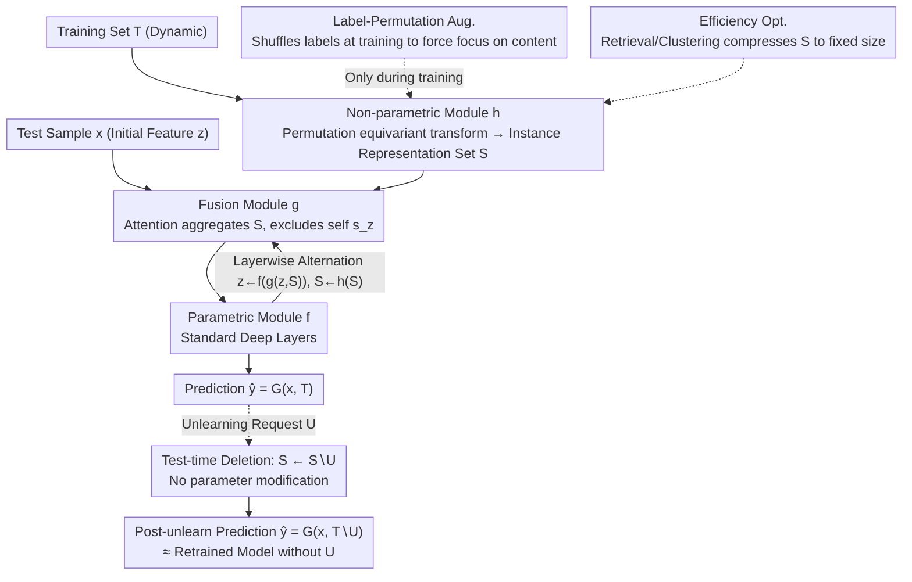

# Designing to Forget: Deep Semi-parametric Models for Unlearning

**Conference**: CVPR 2026  
**arXiv**: [2603.22870](https://arxiv.org/abs/2603.22870)  
**Code**: [github.com/amberyzheng/spm_unlearning](https://github.com/amberyzheng/spm_unlearning)  
**Area**: Others (Machine Unlearning / AI Safety)  
**Keywords**: Machine Unlearning, Semi-parametric Models, Test-time Deletion, Data Privacy, Diffusion Models

## TL;DR
This paper proposes the "Designing to Forget" philosophy, introducing a family of Deep Semi-parametric Models (SPM). By simply removing training samples at inference time without modifying model weights, SPM reduces the prediction gap compared to retraining baselines by 11% on ImageNet and accelerates unlearning by more than 10x.

## Background & Motivation
**Background**: Driven by privacy regulations like GDPR, Machine Unlearning (MU) requires removing the influence of specific samples from a trained model. Existing methods primarily approximate the effect of "as if the data was never used for training" through model fine-tuning.

**Limitations of Prior Work**: The black-box nature of deep learning makes it difficult to decouple the contribution of a single training sample to the parameters; existing MU algorithms require additional fine-tuning steps, which incur significant overhead in frequent unlearning scenarios.

**Key Challenge**: Parametric models compress all training data information into parameters, making parameter modification mandatory for unlearning; conversely, non-parametric models (such as KNN) naturally support deletion but suffer from insufficient performance.

**Goal**: Design a neural network architecture "naturally suited for unlearning," rather than designing unlearning algorithms for existing architectures.

**Key Insight**: Starting from the "delete-to-forget" property of KNN, design a semi-parametric model that possesses both the performance of parametric models and the unlearning convenience of non-parametric models.

**Core Idea**: A semi-parametric model $\hat{y} = G_{\theta^*}(x, \mathcal{T})$ explicitly depends on the training set $\mathcal{T}$ at inference time. Unlearning only requires $G_{\theta^*}(x, \mathcal{T} \setminus \mathcal{U})$—deleting data without modifying parameters.

## Method

### Overall Architecture
Instead of designing unlearning algorithms for existing networks, this paper designs a network that is "born to be easy to forget." The core idea is to let the model explicitly treat the training set $\mathcal{T}$ as part of the input during inference: the prediction is written as $\hat{y} = G_{\theta^*}(x, \mathcal{T})$. To unlearn a subset $\mathcal{U}$, no parameters need to be moved; one simply changes the forward pass to $G_{\theta^*}(x, \mathcal{T} \setminus \mathcal{U})$—similar to KNN, deleting points is sufficient.

To achieve this, SPM splits the network into two parallel branches that proceed alternately layer by layer. The parametric module $f$ is a standard deep network layer responsible for encoding input $x$ into feature $z$. The non-parametric module $h$ maps the entire training set into a set of instance embeddings $\mathcal{S} = \{[h(s_i), y_i]\}$, maintaining the current representation of the training data. Between each layer, a fusion module $g$ fuses the current feature $z$ with this set of instance representations before passing it to the next layer (the forward pass is $z^{(l+1)} = f(g(z^{(l)}, \mathcal{S}^{(l)}))$, $\mathcal{S}^{(l+1)} = h(\mathcal{S}^{(l)})$). Because this deletable set is always present in the prediction path, unlearning involves only removing $\mathcal{U}$ from $\mathcal{S}$ without modifying parameters.

### Key Designs

**1. Fusion Module: Aggregating "others'" representations with attention to enable parametric networks to exhibit deletable non-parametric behavior**

The trouble with parametric networks is that training data is compressed into weights and cannot be extracted. The fusion module allows each query feature $z$ to look at other samples in the training set rather than relying on itself: $g(z, \mathcal{S}) = \sum_{s_i \in \mathcal{S} \setminus \{s_z\}} \alpha(z, s_i) \cdot s_i$, where $\alpha(z, s_i) = \frac{\exp((W_q z)^\top (W_k s_i))}{\sum_j \exp((W_q z)^\top (W_k s_j))}$ is a softmax attention weight. The key is the $\setminus \{s_z\}$ in the summation—explicitly excluding the sample's own instance representation. Without this exclusion, the model could ignore others and read only its own entry, degenerating back into a standard parametric model where deleting other data would not affect predictions. By forcing it to look at "others," the model truly relies on the relative relationships of other points, replicating the non-parametric spirit of KNN within a deep network.

**2. Non-parametric Module: Maintaining a flexible training set representation via permutation equivariant instance-level transformations**

For "deletion as unlearning" to hold, the instance representations must not be sensitive to the order of the data. The non-parametric module applies the same shared transformation to each training sample $\mathcal{S}^{(l)} = \{[h^{(l)}(s_i^{(l)}), y_i]\}_{i=1}^{|\mathcal{T}|}$, processing them element-wise without introducing cross-sample order dependencies. Thus, the entire representation set is permutation equivariant—if the insertion order changes or any samples are deleted, the representations of the remaining points remain unchanged. This property ensures both that unlearning results are independent of deletion order and that subsequent clustering/retrieval compression can safely replace the set without destroying semantics.

**3. Label-Permutation Augmentation: Preventing the "label shortcut" through random shuffling during training**

Each instance in the non-parametric module carries its own label $y_i$, which offers the model a shortcut: directly using the one-hot label as a bias to find the answer while ignoring input $x$ and training data content. If this shortcut is taken, deleting training data again fails to affect predictions. The countermeasure is to randomly permute the indices of the one-hot label vectors during training, making the labels themselves unreliable. The model is forced to compare $x$ with the actual content of training samples to predict correctly, thereby shifting the prediction dependency onto the training set. This mechanism is similar to dropout: forcing a correct dependency structure by sabotaging shortcuts.

**4. Efficiency Optimization: Compressing the training set to a fixed size using retrieval or clustering**

Traversing the entire training set for every forward pass is impractical, so SPM provides two compression methods to reduce $\mathcal{S}$ to a fixed size: (R)etrieval takes only the nearest neighbors of the query for fusion, while (C)lustering averages instance representations by class, making the set size equal to the number of classes, which allows runtime to match parametric models. Due to the permutation equivariance in point 2, this replacement does not change the semantics. For generative tasks, SPM is integrated into the UNet, replacing the mid-block with a fusion module to perform fusion at the patch level.

### A Complete Example: One Inference + One Unlearning

Consider ImageNet classification with clustering mode (SPM-C). After training, the non-parametric module compresses the 1000 classes into instance representations, making the set $\mathcal{S}$ a fixed size of 1000. For an input image $x$ of a "Golden Retriever," the parametric module first encodes feature $z$. The fusion module scans these 1000 class representations with attention (excluding the entry homologous to $z$), focusing weights on "Golden/Labrador/Dog" classes. After weighted aggregation, it passes to the next layer, eventually outputting "Golden Retriever."

Now, an unlearning request is received: forget the "Golden Retriever" training data. SPM does not retrain or fine-tune; it simply deletes the cluster representation corresponding to "Golden Retriever" from $\mathcal{S}$—shrinking the set from 1000 to 999. Given the same image again, the fusion module can no longer see the "Golden Retriever" entry. Attention shifts to the closest "Labrador," and the prediction changes accordingly. The behavior is nearly identical to a retrained model that has "never seen Golden Retriever data." The entire unlearning process is just a single set element deletion, taking 0.7s, whereas actual retraining takes 2317.6s.

### Loss & Training
- Classification: Cross-entropy loss + label-permutation augmentation.
- Generation: Standard DDPM diffusion loss, with the fusion module operating at the patch level.
- Pre-trained ResNet can be adapted into an SPM by adding non-parametric modules.

## Key Experimental Results

### Main Results (Classification Performance)

| Model | CIFAR-10 Acc↑ | ImageNet Acc↑ |
|------|-------------|--------------|
| ResNet18 | 94.9 | 68.93 |
| ResNet18-KNN (100%) | 94.5 | 66.9 |
| SPM-C (100%) | 94.5 | 67.1 |
| SPM-R (100%) | 94.1 | 59.9 |

**Generative Performance (CIFAR-10 FID↓)**

| Method | FID | Runtime |
|------|-----|---------|
| DDPM | 7.28 | 42s |
| SPM (|T|=100) | 7.09 | 173s |
| SPM (|T|=1024) | 7.04 | 1486s |

### Ablation Study (CIFAR-10 Classification Unlearning)

| Method | PG_H↓ | PG_S↓ | Unlearning Time↓ |
|------|-------|-------|----------|
| Retrain (Oracle) | 0.00 | 0.00 | 2317.6s |
| GA | 18.48 | 0.99 | 8.9s |
| FT | 13.11 | 0.48 | 148.7s |
| **SPM-C (Ours)** | **0.43** | **0.08** | **0.7s** |

### Key Findings
- SPM-C performs nearly on par with ResNet18 in classification (CIFAR-10: 94.5 vs 94.9, ImageNet: 67.1 vs 68.93).
- **Nearly perfect unlearning effectiveness**: The prediction gap with the retraining baseline (PG_H) is only 0.43 (compared to 18.48 for the best MU algorithm GA).
- **Extremely fast unlearning speed**: 0.7s vs 2317.6s for retraining (3300x speedup) vs 8.9s for the fastest MU algorithm GA (12.7x speedup).
- The FID of generative SPM (based on DDPM) is close to standard DDPM (7.04 vs 7.28), though inference speed increases significantly due to set maintenance.
- On ImageNet, SPM reduces the unlearning gap by 11% compared to parametric models.

## Highlights & Insights
- **Shift in design philosophy**: Moving from "how to unlearn" (algorithm-oriented) to "how to design models easy to forget" (architecture-oriented) represents a paradigm innovation in the MU field.
- **KNN-inspired fusion design**: Combining the exclusion of self-embeddings with attention-weighted aggregation elegantly achieves non-parametric behavior within deep networks.
- **Label-permutation augmentation** is crucial for preventing the model from bypassing the non-parametric branch, reflecting the meticulous considerations in SPM design.
- Pre-trained parametric models (ResNet) can be transformed into SPMs, reducing the cost of training from scratch.

## Limitations & Future Work
- **Increased inference time**: SPM needs to maintain and retrieve the training set at inference, increasing overhead by about 20% on ImageNet (clustering mode).
- **ImageNet accuracy gap**: There is still a gap of approximately 2% between SPM-C (67.1) and ResNet18 (68.93).
- **Runtime cost for generative SPM**: At |T|=1024, inference time increases by 35x, limiting practical scale.
- Not yet validated on larger-scale models (e.g., ViT, DiT).
- Currently only validated for classification and unconditional generation; more complex generative tasks like text-to-image remain to be explored.

## Related Work & Insights
- Difference from SISA (Bourtoule et al.): SISA partitions data to train multiple models and deletes an entire model for unlearning; SPM keeps a single model but deletes data during inference.
- Semi-parametric models have been applied in NLP (Retrieval-Augmented Generation) and vision, but this is the first application for unlearning.
- Complementary to Differential Privacy: DP provides privacy guarantees during training, while SPM provides sample deletion capability post-deployment.
- Label-permutation augmentation is similar to regularization in dropout—forcing the model not to take shortcuts.

## Technical Details
- **Fusion Attention**: $\alpha(z, s_i) = \frac{\exp((W_q z)^\top (W_k s_i))}{\sum_j \exp((W_q z)^\top (W_k s_j))}$
- **Patch-level Generative Fusion**: Replaces the mid-block of UNet with a fusion module using Bahdanau attention.
- **SPM-C (Clustering Mode)**: Averages instance embeddings by class → Set size = Number of classes → Runtime is comparable to parametric models.
- **GNN Enhancement**: Class-aware GNN + multi-head graph attention can improve CIFAR-10 from 94.1% to 94.4%.
- **PG_H/PG_S**: Hard/soft prediction gaps, measuring the distance from the retraining oracle.
- **5-Class Unlearning (50%)**: SPM-C's PG_H = 0.02 vs GA = 32.62, showing nearly perfect unlearning effectiveness.

## Rating
- Novelty: ⭐⭐⭐⭐⭐ Solving unlearning via architectural design is a paradigm shift.
- Experimental Thoroughness: ⭐⭐⭐⭐ Validated on both classification and generation with comparisons against multiple MU algorithms.
- Writing Quality: ⭐⭐⭐⭐ Clear conceptual explanations and intuitive illustrations.
- Value: ⭐⭐⭐⭐ Significant for privacy and security compliance, though inference overhead limits some applications.

<!-- RELATED:START -->

## Related Papers

- [\[ACL 2026\] VLA-Forget: Vision-Language-Action Unlearning for Embodied Foundation Models](../../ACL2026/llm_safety/vla-forget_vision-language-action_unlearning_for_embodied_foundation_models.md)
- [\[CVPR 2026\] Which Concepts to Forget and How to Refuse? Decomposing Concepts for Continual Unlearning in Large Vision-Language Models](which_concepts_to_forget_and_how_to_refuse_decomposing_concepts_for_continual_un.md)
- [\[CVPR 2026\] Towards Reasoning-Preserving Unlearning in Multimodal Large Language Models](towards_reasoning-preserving_unlearning_in_multimodal_large_language_models.md)
- [\[ACL 2026\] Forget What Matters, Keep the Rest: Selective Unlearning of Informative Tokens](../../ACL2026/llm_safety/forget_what_matters_keep_the_rest_selective_unlearning_of_informative_tokens.md)
- [\[ICML 2026\] Forget to Know, Remember to Use: Context-Aware Unlearning for Large Language Models](../../ICML2026/llm_safety/forget_to_know_remember_to_use_context-aware_unlearning_for_large_language_model.md)

<!-- RELATED:END -->
