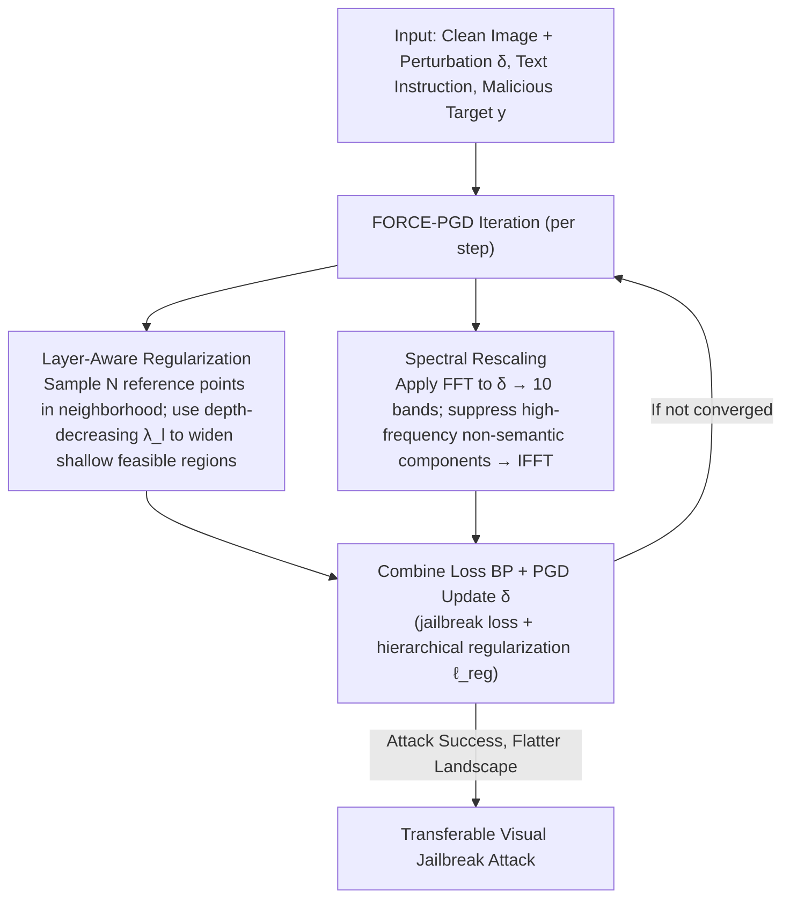

# FORCE: Transferable Visual Jailbreaking Attacks via Feature Over-Reliance CorrEction

**Conference**: CVPR2026  
**arXiv**: [2509.21029](https://arxiv.org/abs/2509.21029)  
**Code**: [tmllab/2026_CVPR_FORCE](https://github.com/tmllab/2026_CVPR_FORCE)  
**Area**: Robotics  
**Keywords**: visual jailbreaking, adversarial attack, transferability, loss landscape, MLLM safety, red-teaming

## TL;DR

Analysis reveals that the root cause of poor transferability in visual jailbreak attacks is that the attack resides in a high-sharpness loss region—stemming from an over-reliance of shallow features on model-specific representations and the excessive influence of high-frequency information. This work proposes the FORCE method, which expands the feasible region of shallow layers through layer-aware regularization and suppresses high-frequency non-semantic components via spectral rescaling, guiding the attack into a flatter loss landscape to significantly improve cross-model transferability.

## Background & Motivation

Multimodal Large Language Models (MLLMs) introduce additional security vulnerabilities when integrating new modalities like vision. Current status of visual jailbreak attacks:

1.  **Textual jailbreak is limited**: As text alignment strength increases (RLHF, DPO), the effectiveness of pure text attacks on MLLMs continues to decline.
2.  **Visual jailbreak is effective but local**: Optimization-based visual attacks (PGD and its variants) can reliably bypass the safety defenses of open-source MLLMs with imperceptible perturbations, achieving nearly 100% success rates on the source model.
3.  **Extremely poor transferability**: Visual attacks generated on a source model rarely transfer to other MLLMs, especially closed-source commercial models, where 93% of attacks still fail after exhausting 100 queries.

Core Motivation: To perform practical red-teaming and evaluate security holes in closed-source MLLMs, the **cross-model transferability** of optimization-based visual jailbreak attacks must be improved. As one of the first works to study this problem, this paper provides a deep analysis of transfer failure from the perspective of loss landscape geometry.

## Core Problem

-   Why do visual jailbreak attacks succeed on the source model but fail to transfer?
-   How does the shape of the attack's loss landscape affect transferability?
-   Which factors in feature representation lead to model-specific reliance?

## Method

### Overall Architecture

Visual jailbreak attacks succeed almost 100% on the source model but fail to transfer to other MLLMs, particularly closed-source ones. FORCE first diagnoses the cause and then prescribes a solution. The core diagnosis is that transfer failure occurs because the attack is trapped in an extremely sharp (high-sharpness) loss region—a perturbation of only 0.03 pixels in the input space can raise the loss from approximately 0 to over 0.28, causing the attack to fail. Furthermore, a perturbation of only 0.0002 in the weight space (simulating model switching) pushes the attack out of the feasible region. Two main culprits create these sharp regions: over-reliance of shallow features on model-specific representations and an increasing reliance on high-frequency non-semantic shortcuts during late-stage optimization. To address this, FORCE integrates two components—layer-aware regularization to broaden the feasible regions of shallow layers and spectral rescaling to suppress high-frequency components—into each iteration of standard PGD, guiding the attack toward a flatter loss landscape and significantly enhancing cross-model transferability.

### Key Designs

**1. Layer-Aware Regularization: Widening the narrow and brittle feasible regions of shallow layers**

Diagnosis shows that the problem is concentrated in shallow layers: when performing convex combination interpolation between "adversarial features ↔ natural features" as $(1-\mu) \cdot f_{\theta}(\text{jail}) + \mu \cdot f_{\theta}(\text{nat})$, attacks remain effective in deep layers (e.g., layer 31) even with 40% natural features. However, shallow layers (e.g., layer 11) require maintaining 90%+ adversarial features; the loss spikes to 1.2+ with just 30% natural features—meaning the shallow feasible region is extremely narrow. FORCE samples $N=10$ reference points within the neighborhood $\eta=4/255$ of the jailbreak sample and maximizes the $L_2$ distance $d_l = \|f_{\theta,l}(\mathbf{x}_{\text{img}}+\delta, \mathbf{x}_{\text{txt}}) - f_{\theta,l}(\mathbf{x}_{\text{img}}+\delta+\eta, \mathbf{x}_{\text{txt}})\|_2^2$ between the sample and reference features at each layer $l$, while constraining the reference points to also fall within the feasible region (ensuring their loss $\ell_{\text{ref}} = \ell(p_\theta(\mathbf{x}_{\text{img}}+\delta+\eta, \mathbf{x}_{\text{txt}}), \mathbf{y})$ remains low).

Crucially, the regularization strength decreases with depth—stronger in shallow layers and weaker in deep layers—matching the diagnosis that the "problem is in the shallow layers":

$$\lambda_l = \lambda \cdot \max(1 - (2l/L)^2, 0)$$

The total regularization term is $\ell_{\text{reg}} = \frac{1}{N}\sum_{n=1}^{N}\sum_{l=1}^{L} \lambda_l \cdot \frac{\ell_{\text{ref}}}{d_l}$. It encourages the attack to maintain a "consistently usable" flat neighborhood in the shallow layers. Once the feasible region is widened, the attack is less likely to fail when switching models.

**2. Spectral Rescaling: Cutting off high-frequency shortcuts learned during optimization**

Another root cause comes from the frequency domain: after applying Fourier transforms and masking bands, it was found that early optimization (150-250 iterations) relies on low-frequency semantic components, while later stages (350-750 iterations) increasingly rely on high frequencies. By 750 iterations, removing the third highest frequency band causes the attack to fail. High frequencies are semantically weak, model-specific shortcuts—the poison of transferability. FORCE applies FFT to the perturbation $\delta$, dividing it into $M=10$ equal-width frequency bands. When the influence of the $m$-th band exceeds the adjacent lower frequency band by a factor of $\beta$, it is suppressed:

$$w_m = \min\left(\beta, \frac{\ell_{m-1}}{\ell_m} \cdot \beta\right), \qquad S = \sum_{m=1}^{M} (w_m \cdot \mathbb{1}_{B_m})$$

The frequency scaling matrix $S$ is then multiplied by the FFT amplitude spectrum, and the perturbation is reconstructed via IFFT: $\delta_{\text{rescaled}} = \text{IFFT}((A \odot S) \odot e^{i\Phi})$. This forces the attack to rely more on low-frequency semantics and less on high-frequency shortcuts, resulting in a flatter and more generalizable landing point. The two components are integrated into standard PGD: each step first performs spectral rescaling, followed by layer-aware regularization.

## Key Experimental Results

### Transfer across Adapter-Based MLLMs (Source: LLaVA-v1.5-7B, Multiple Queries)

| Target Model | Method | MaliciousInstruct ASR | AdvBench ASR | HADES ASR |
|--------------|------|-----------------------|--------------|-----------|
| LLaVA-v1.6-mistral | PGD | 61.0 | 35.2 | 70.0 |
| | FORCE | **69.0** (+12.3%) | **43.8** (+24.6%) | **72.7** (+3.8%) |
| InstructBLIP-Vicuna | PGD | 84.0 | 25.6 | 48.7 |
| | FORCE | **92.0** (+9.5%) | **27.9** (+9.0%) | **49.2** (+1.1%) |
| Idefics3-8B | PGD | 53.0 | 29.8 | 63.1 |
| | FORCE | **64.0** (+20.8%) | **36.0** (+20.6%) | **66.0** (+4.6%) |

### Transfer across Early-Fusion MLLMs

| Target Model | Method | MaliciousInstruct ASR | AdvBench ASR | HADES ASR |
|--------------|------|-----------------------|--------------|-----------|
| LLaMA-3.2-11B | PGD | 1.0 | 1.2 | 6.3 |
| | FORCE | **2.0** (+100%) | **2.3** (+101%) | **10.3** (+63.6%) |
| Qwen2.5-VL-7B | PGD | 5.0 | 1.5 | 25.3 |
| | FORCE | **11.0** (+120%) | **2.7** (+74.7%) | **28.1** (+11.1%) |

### Transfer across Commercial MLLMs

| Target Model | Method | MaliciousInstruct ASR | HADES ASR |
|--------------|------|-----------------------|-----------|
| Claude-Sonnet-4 | PGD | 1.0 | 3.0 |
| | FORCE | **2.0** (+100%) | **5.0** (+66.7%) |
| GPT-5 | PGD | 1.0 | 1.0 |
| | FORCE | **2.0** (+100%) | **3.0** (+200%) |

### Ablation Study (Idefics3, MaliciousInstruct)

| Layer Reg | Spectral Rescaling | ASR | Query ↓ |
|-----------|-------------------|-----|---------|
| ✗ | ✗ | 53.0 | 50.7 |
| ✓ | ✗ | 55.0 (+3.8%) | 48.5 (+4.7%) |
| ✗ | ✓ | 59.0 (+11.3%) | 44.0 (+15.2%) |
| ✓ | ✓ | **64.0** (+20.6%) | **39.6** (+28.1%) |

The two components exhibit a synergistic effect, with combined results exceeding the sum of individual parts.

### Computational Overhead

| Method | Time (s/iter) | Memory (GB) |
|------|--------------|----------|
| PGD | 2.17 | 32.64 |
| FORCE | 2.73 (+26%) | 36.48 (+12%) |

Additional overhead is minimal as the regularization term utilizes intermediate variables from standard forward passes, and multi-sampling can be parallelized.

## Highlights & Insights

-   **Deep and Persuasive Analysis**: Progresses through loss landscape geometry → layer space → spectral domain to reveal the root causes of poor transferability. The logic chain from analysis to method is complete.
-   **Design Closely Tied to Analysis**: Each component directly addresses an analytical finding (narrow feasible region in shallow layers → layer-aware reg; high-frequency over-reliance → spectral rescaling), avoiding unmotivated components.
-   **Elegant Gradually Decreasing Regularization**: Strong regularization in shallow layers and weak in deep layers aligns with the "problem concentrated in shallow layers" diagnosis, implemented via a concise quadratic decay formula.
-   **Comprehensive Evaluation**: Covers three architecture types (adapter-based, early-fusion, commercial) × three datasets × various settings (multi-query / zero-shot / blank init).

## Limitations & Future Work

-   Absolute ASR for early-fusion MLLMs and commercial models remains very low (e.g., only 2-3% for GPT-5); while relative improvements are significant, they are still far from practical for real-world red-teaming.
-   Only verified on two source models (LLaVA-v1.5-7B and InstructBLIP), showing limited source model diversity.
-   Insufficient sensitivity analysis for hyperparameters such as the number of frequency bands $M=10$ and scaling factor $\beta=0.95$ in spectral rescaling.
-   The method assumes white-box gradient optimization on the source MLLM is possible, making it inapplicable to pure black-box scenarios.
-   Does not explore robustness against image preprocessing defenses (e.g., JPEG compression, resizing), only testing random noise.
-   Early-fusion MLLMs use tokenized image representations; perturbations in the pixel space cover only a subset of vulnerabilities in the token space, which is an inherent methodological limitation.

## Related Work & Insights

| Dimension | Standard PGD | Ensemble Opt | MI-FGSM/DI-FGSM | FORCE |
|------|-------------|--------------|-----------------|-------|
| Strategy | Direct Gradient Opt | Multi-model Joint Opt | Momentum/Input Diversity | Feature Reliance Correction |
| Requires Multi-models | ✗ | ✓ | ✗ | ✗ |
| Theoretical Basis | None | None | Classification Transferability | Loss Landscape Analysis |
| Idefics3 ASR | 53.0 | 60.0 | 62-66 | **64.0** |
| Qwen2.5-VL ASR | 5.0 | 4.0 | 3-9 | **11.0** |

FORCE achieves transferability comparable to or better than ensemble methods using only a single source model by correcting feature reliance. Compared to transferability enhancement methods in classification, FORCE is specifically designed for jailbreak attacks and performs better.

## Related Work & Insights

-   The relationship between loss landscape flatness and transferability has been studied in classification adversarial attacks (e.g., SAM). This work is the first to introduce this perspective to visual jailbreaking, revealing similarity in the problem's essence.
-   The finding that "shallow layers rely on model-specific features" resonates with feature visualization and probing literature—shallow representations across different models differ more than deep ones.
-   The idea of spectral rescaling (suppressing high-frequency shortcuts during optimization) can be extended to other adversarial robustness research.
-   While starting from an attack perspective, the method also informs defense—strengthening the cross-model consistency of shallow features may improve the robustness of safety alignment.
-   This work belongs to the AI safety red-teaming direction, exposing safety vulnerabilities in MLLM visual modalities and providing direct value to the community's safety assessment practices.

## Rating

-   Novelty: 8/10 — First analysis of visual jailbreak transferability from loss landscape and feature reliance perspectives; both depth of analysis and method design are innovative.
-   Experimental Thoroughness: 8/10 — Covers multiple architectures, datasets, and settings with clear ablations; however, source model diversity and hyperparameter analysis could be expanded.
-   Writing Quality: 9/10 — The logic chain from analysis → motivation → method is extremely clear, with intuitive illustrations and high readability.
-   Value: 7/10 — Identifies an important problem and provides effective mitigation, but absolute attack success rates remain low, limiting practical red-teaming application value.

<!-- RELATED:START -->

## Related Papers

- [\[ACL 2026\] Jailbreaking Large Language Models with Morality Attacks](../../ACL2026/llm_safety/jailbreaking_large_language_models_with_morality_attacks.md)
- [\[ICML 2025\] X-Transfer Attacks: Towards Super Transferable Adversarial Attacks on CLIP](../../ICML2025/llm_safety/x-transfer_attacks_towards_super_transferable_adversarial_attacks_on_clip.md)
- [\[ICLR 2026\] BEAT: Visual Backdoor Attacks on VLM-based Embodied Agents via Contrastive Trigger Learning](../../ICLR2026/llm_safety/beat_visual_backdoor_attacks_on_vlm-based_embodied_agents_via_contrastive_trigge.md)
- [\[CVPR 2026\] IAG: Input-aware Backdoor Attack on VLM-based Visual Grounding](iag_input-aware_backdoor_attack_on_vlm-based_visual_grounding.md)
- [\[ICLR 2026\] Model Collapse Is Not a Bug but a Feature in Machine Unlearning for LLMs](../../ICLR2026/llm_safety/model_collapse_is_not_a_bug_but_a_feature_in_machine_unlearning_for_llms.md)

<!-- RELATED:END -->
