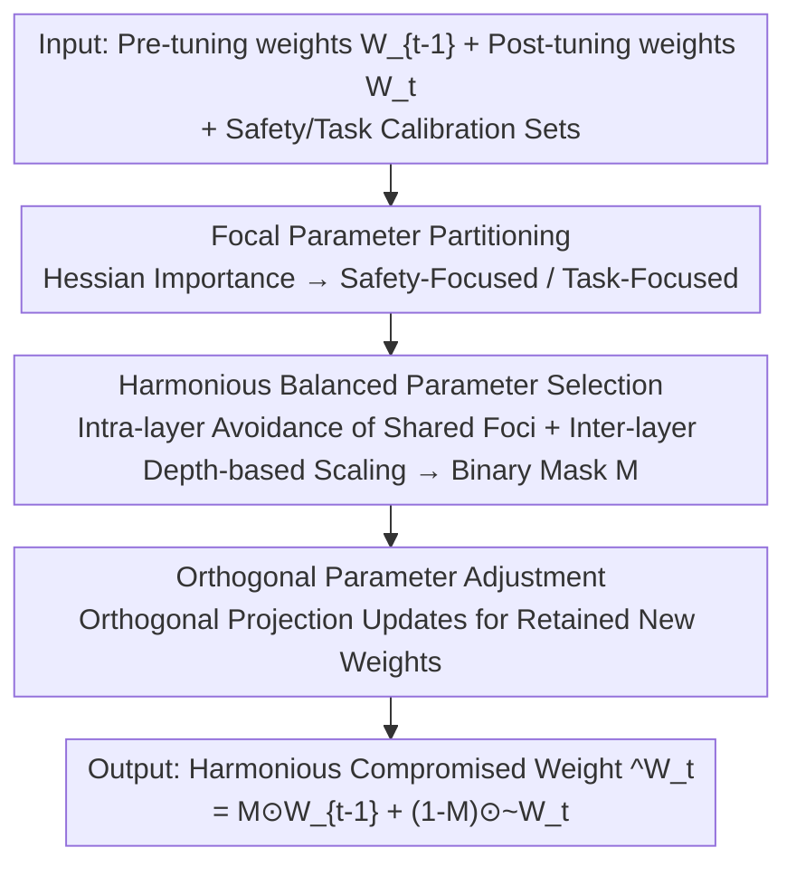

# Harmonious Parameter Adaptation in Continual Visual Instruction Tuning for Safety-Aligned MLLMs

**Conference**: CVPR 2026  
**Paper**: [CVF Open Access](https://openaccess.thecvf.com/content/CVPR2026/html/Wang_Harmonious_Parameter_Adaptation_in_Continual_Visual_Instruction_Tuning_for_Safety_Aligned_CVPR_2026_paper.html)  
**Code**: https://github.com/Minato-Zackie/HPA  
**Area**: LLM Safety  
**Keywords**: Continual Instruction Tuning, MLLM Safety Alignment, Catastrophic Forgetting, Parameter Selection, Orthogonal Update

## TL;DR
HPA focuses on an overlooked scenario: when performing Continual Visual Instruction Tuning on a "previously safety-aligned" Multimodal Large Language Model (post-SA CVIT), the model tends to forget both old tasks and its safety alignment. It performs non-intrusive post-training parameter adjustment after each tuning step. By using Hessian importance to partition parameters into "safety-focused" and "task-focused" categories, balancing the retention of safety parameters within and across layers, and imposing orthogonal constraints on update directions, HPA achieves a harmonious trade-off between safety and task performance.

## Background & Motivation
**Background**: MLLMs typically follow a pipeline of "Pre-training → Visual Instruction Tuning → Safety Alignment." Safety alignment (via SFT or preference optimization) ensures models provide safe responses even when faced with harmful multimodal inputs. Continual Visual Instruction Tuning (CVIT) allows models to adapt to a sequence of tasks in evolving environments.

**Limitations of Prior Work**: Existing CVIT research largely assumes the model is **not yet safety-aligned** (pre-SA CVIT), focusing solely on the dimension of "task forgetting." However, MLLMs deployed in the real world are necessarily safety-aligned and require continuous updates after deployment. The authors find through empirical testing that when CVIT is performed on safety-aligned models (post-SA CVIT), a **dual catastrophe** occurs: classic catastrophic forgetting of tasks and a continuous degradation of safety as tuning steps progress (evidenced by rising attack success rates).

**Key Challenge**: Safety and task capabilities compete for the same set of parameters. Blindly retaining old parameters protects safety but interferes with new task learning; freely updating parameters for new tasks erases safety alignment. Existing CVIT and safety alignment methods fail to address both simultaneously. Moreover, many CVIT methods introduce redundant overhead by adding extra parameter modules or modifying training pipelines. Re-aligning with original safety data is often infeasible due to privacy and compute constraints.

**Goal**: To design a post-training parameter adjustment scheme that achieves the optimal balance between safety maintenance, current task performance, and historical task retention after each tuning step, without modifying the original training process or requiring re-alignment.

**Key Insight**: Deep networks are over-parameterized, and not all parameters are equally important. Some contribute significantly to "safety," while others are vital for "tasks." If these two types of "focal parameters" can be accurately identified and treated differently, safety can be targeted for protection while tasks are allowed to update.

**Core Idea**: Three actions are performed after each tuning step—partition parameters into safety-focused/task-focused based on Hessian importance (partition), select safety parameters to be retained from both intra-layer and inter-layer perspectives (selection), and apply orthogonal constraints to new updates to suppress forgetting (adjustment).

## Method

### Overall Architecture
HPA (Harmonious Parameter Adaptation) is a **purely post-training** framework. It does not intervene in the normal CVIT training pipeline. Instead, after the $t$-th task tuning step is completed, it takes the pre-tuning weights $W_{t-1}^l$ and post-tuning weights $W_t^l$ to compute a "harmoniously compromised" final weight $\hat W_t^l=F(W_{t-1}^l, W_t^l)$ per layer. The process consists of three serial stages: first, partitioning parameters into safety-focused and task-focused categories based on Hessian importance; second, selecting safety parameters to be retained from the old weights using a balanced approach (avoiding interference at shared focal locations intra-layer and adjusting retention ratios linearly inter-layer); and finally, performing orthogonal projection updates on the new weights to be merged with the old weights via a binary mask. The optimization goal is to simultaneously minimize safety loss $L_S$ and task performance loss $L_{C_i}$.

### Key Designs

**1. Focal Parameter Partitioning: Distinguishing "Safety-Protecting" and "Task-Learning" Parameters via Hessian Sensitivity**

To address the competition for parameters between safety and tasks, the first step is to categorize parameters by "focus." The authors argue that importance estimation based on magnitude or gradient is too coarse and instead leverage the concept of Hessian pruning: the importance of a parameter is measured by the "increase in loss caused by its removal," i.e., $(w_{i,j})^2/[H^{-1}]_{jj}$ (where $H$ is the Hessian of the loss with respect to parameters). In the tuning context, the authors define two scores using parameter changes and the Hessian: a safety focus score $\varepsilon_{i,j}^l=\big(W_{t-1}^l(i,j)-W_t^l(i,j)\big)^2[H_{s,l}^{-1}]_{ii}$ and a task focus score $\zeta_{i,j}^l=\big(W_t^l(i,j)-W_{t-1}^l(i,j)\big)^2[H_{t,l}^{-1}]_{ii}$, where $H=2X^\top X$ is computed from activations of safety/task calibration sets. Aggregated into column-level scores $\bar\varepsilon^l,\bar\zeta^l$, the top-$k$% are identified as safety-focused (contributing most to safety in $W_{t-1}^l$) and task-focused (most important for the current task in $W_t^l$). A key challenge is that these two types of foci might **overlap** (shared focal locations)—these positions affect both safety and tasks, requiring additional decision-making.

**2. Harmonious Balanced Parameter Selection: Intra-layer Shared Focal Avoidance and Inter-layer Depth-based Scaling**

To solve the issue where naively retaining top-$p$% safety parameters might hurt task parameters at shared focal locations, the authors design a dual-perspective balanced selection. A mask $M^l$ determines which parameters are retained from old weights: $\hat W_t^l=M^l\odot W_{t-1}^l+(1-M^l)\odot W_t^l$, where $p$% of columns are set to 1. **Intra-layer**: Parameters that are "safety-focused but not at shared focal locations" are retained first (filling $p_s$%). The remaining slots are filled from shared focal locations using a balanced score $\phi^l=\bar\varepsilon^l-\alpha\cdot\bar\zeta^l$ to evaluate whether a shared location is more safety-biased or task-biased ($\phi^l$ is higher for safety-biased), where $\alpha$ is adaptively adjusted via tanh based on the log-expectation of $\bar\varepsilon^l/\bar\zeta^l$ within $[\alpha_0,\alpha_1]$. **Inter-layer**: Considering that higher layers closer to the output encode more task-specific knowledge, the retention ratio $p^l$ decreases linearly with layer depth: $p^l=p_{max}-\tfrac{l}{L}(p_{max}-p_{min})$. This ensures that deep layers retain fewer safety constraints to favor new tasks, while shallow layers protect safety more heavily.

**3. Orthogonal Parameter Adjustment: Preventing New Parameter Updates from Colliding with Old Knowledge**

To address the gap where the previous steps select parameters but do not explicitly prevent forgetting, HPA constrains the update direction of the retained new weights from $W_t^l$ to be orthogonal to the old parameter subspace. The update $\Delta W_t^l=W_t^l-W_{t-1}^l$ is projected onto the old weights: $\text{Proj}_{W_{t-1}^l}(\Delta W_t^l)=\frac{\langle\Delta W_t^l,W_{t-1}^l\rangle}{\|W_{t-1}^l\|_F^2}W_{t-1}^l$ (using Frobenius inner product/norm), representing the component "aligned with old knowledge." Subtracting this yields an orthogonal update $\tilde W_t^l=W_{t-1}^l+\Delta W_t^l-\text{Proj}_{W_{t-1}^l}(\Delta W_t^l)$. The final weight is expressed as $\hat W_t^l=M^l\odot W_{t-1}^l+(1-M^l)\odot\tilde W_t^l$. The intuition is that by removing components in the same direction as old representations, the new task updates cause minimal interference with previously learned representations.

### Loss & Training
HPA does not introduce new training losses. Standard CVIT is performed using LoRA tuning, which is then merged back into the base model. After each tuning step, HPA replaces weights layer-by-layer according to Algorithm 1 (partition→selection→adjustment). The base model is LLaVA-v1.5-7B (using the stage-1 pre-trained version to avoid CVIT data leakage). Safety alignment uses VLGuard + SPA-VL. Key hyperparameters: safety/task calibration set sizes are 8 and 128 respectively, $\alpha_0=0.4, \alpha_1=0.8, p_{min}=5, p_{max}=15$, and $k=2p^l$, applied to all linear layers. Safety calibration set construction: Since original alignment data is unavailable, the authors feed harmful images + harmful instructions into the aligned model $f(x;\theta_0)$ and use its own safe responses to create $D_s^*=\{X_{unsafe}^{ins}, X_{unsafe}^{vis}, X_{safe}^{ans}\}$.

## Key Experimental Results

### Main Results
Baselines: Sequential tuning on 6 CVIT datasets (AD, ImageNet, Flickr30k, Fin, ScienceQA, TextVQA) + 2 safety benchmarks (VLGuard, Ch3EF). Metrics: **AP** (Average Performance after $k$ tasks, higher is better), **BWT** (Backward Transfer, degree of forgetting, closer to 0 is better), **MASR** (Mean Attack Success Rate across three safety sets, lower is better), **DASR** (Delta ASR relative to the initial aligned model, lower is better). Two data conditions: original data and 0.1% harmful data injection.

| Method | Condition | AP↑ | BWT↑ | MASR↓ | DASR↓ |
|------|------|-----|------|-------|-------|
| Zero-shot (Unaligned) | - | 11.78 | - | 2.86 | - |
| SeqFT (Sequential FT) | Original | 65.68 | -25.62 | 42.56 | 39.70 |
| Model Tailor | Original | 68.79 | -10.29 | 28.29 | 25.43 |
| Safe Delta | Original | 73.32 | -6.91 | 5.02 | 2.15 |
| **HPA (Ours)** | Original | **75.73** | **-4.87** | **4.75** | **1.89** |
| Safe Delta | 0.1% Harmful | 73.20 | -6.82 | 24.26 | 21.40 |
| **HPA (Ours)** | 0.1% Harmful | **76.62** | **-3.88** | **7.22** | **4.36** |

Under original data, HPA outperforms the runner-up Safe Delta by +2.41% in AP and +2.04% in BWT, while maintaining lower MASR/DASR. More importantly, under **harmful data injection**, Safe Delta’s safety collapses (MASR jumps to 24.26%), while HPA maintains 7.22% MASR and achieves higher AP and BWT, demonstrating significantly better robustness in adversarial scenarios.

### Ablation Study
Step-by-step addition of the three core components ($\bar\varepsilon^l$ = retain safety-focused parameters, $\phi^l$ = shared focal balanced selection, $\tilde W_t^l$ = orthogonal adjustment):

| Exp. | $\bar\varepsilon^l$ | $\phi^l$ | $\tilde W_t^l$ | AP↑ | BWT↑ | MASR↓ | DASR↓ |
|------|------|------|------|-----|------|-------|-------|
| 1 | × | × | × | 66.69 | -24.29 | 58.22 | 55.36 |
| 2 | ✓ | × | × | 73.49 | -5.81 | 6.02 | 3.16 |
| 3 | × | ✓ | × | 74.16 | -5.21 | 11.51 | 8.64 |
| 4 | ✓ | ✓ | × | 74.82 | -7.00 | 9.67 | 6.81 |
| 5 | ✓ | ✓ | ✓ | **76.62**| **-3.88**| **7.22** | — |

### Key Findings
- **Safety focal parameter retention (Exp.2) is the primary safety driver**: This single component reduces MASR from 58.22 to 6.02, proving that targeting "safety focal parameters" effectively preserves safety alignment.
- **Balanced selection at shared foci (Exp.3) favors tasks**: Using $\phi^l$ alone improves task performance but slightly degrades safety (MASR 11.51); it must be combined with safety retention (Exp.4) for a trade-off.
- **Orthogonal adjustment mitigates forgetting**: Exp.5 drastically improves BWT from -7.00 to -3.88 compared to Exp.4, and increases AP to 76.62, showing it specifically alleviates catastrophic forgetting.
- **Post-SA CVIT is a real problem**: Naive SeqFT results in a MASR of 58.22 under harmful injection, proving that safety degradation is a critical bottleneck that must be addressed.

## Highlights & Insights
- **Identifies and names an overlooked problem (post-SA CVIT)**: The systematic identification that "fine-tuning safety-aligned MLLMs causes simultaneous task forgetting and safety loss" is a significant contribution.
- **Hessian-based focal partitioning + Shared location handling**: Quantifying "safety vs. task" into column-level scores and specifically managing overlapping "shared focal locations" is more refined than coarse magnitude/gradient selection. This logic is transferable to any continual learning scenario with competing objectives.
- **Non-intrusive post-training + Synthetic safety calibration**: It does not change the training pipeline or require original alignment data; using the model to generate its own safety responses for calibration is highly practical for real-world deployments with privacy constraints.

## Limitations & Future Work
- The method relies on Hessian importance estimation, requiring safety/task calibration sets and activation statistics. The scalability of calculating $H^{-1}$ diagonal elements and approximation errors on larger models has not been fully discussed.
- There are several hyperparameters ($k, p_s, p_{min}, p_{max}, \alpha_0, \alpha_1$), some of which are manually set per layer. Robustness and tuning costs across different base models or task sequences remain uncertain.
- Experiments were limited to LLaVA-v1.5-7B and a sequence of 6 tasks; safety under longer task flows, more diverse base models, and stronger adversarial attacks requires further verification.
- The safety calibration set relies on the model's own "safe responses," meaning the quality ceiling is limited by the original model's alignment level.

## Related Work & Insights
- **vs. Safe Delta**: Both are post-training safety protection methods. Safe Delta performs well on original data but collapses during harmful data injection (MASR 24.26); HPA maintains safety (7.22) and superior task performance through focal partitioning and orthogonal updates.
- **vs. CVIT methods (Model Tailor, SEFE, etc.)**: These focus on task forgetting while ignoring safety, and often require additional parameters or training modifications. HPA is a non-intrusive post-training method that treats "safety" as a first-class citizen in parameter selection.
- **vs. SPPFT (Safety-Preserving Fine-Tuning for LLMs)**: SPPFT methods target text-only LLMs and lack fine-grained balancing of task-safety shared parameters; HPA addresses MLLM post-SA CVIT specifically using a dual-perspective intra/inter-layer balance and orthogonal constraints to unify forgetting and safety degradation.

## Rating
- Novelty: ⭐⭐⭐⭐ First to systematically characterize the post-SA CVIT problem; focal partitioning and shared location handling are novel.
- Experimental Thoroughness: ⭐⭐⭐⭐ Covered 6-task CVIT, 2 safety benchmarks, two data conditions, and component-wise ablation, though the base model variety is limited.
- Writing Quality: ⭐⭐⭐⭐ Problem motivation is clear; formulas are dense but logic remains cohesive.
- Value: ⭐⭐⭐⭐ Directly addresses the "continuous update vs. safety" bottleneck in real-world deployment with a practical, non-intrusive solution.

<!-- RELATED:START -->

## Related Papers

- [\[CVPR 2026\] FairLLaVA: Fairness-Aware Parameter-Efficient Fine-Tuning for Large Vision-Language Models](fairllava_fairness-aware_parameter-efficient_fine-tuning_for_large_vision-langua.md)
- [\[ICML 2026\] From Parameter Dynamics to Risk Scoring: Quantifying Sample-Level Safety Degradation in LLM Fine-tuning](../../ICML2026/llm_safety/from_parameter_dynamics_to_risk_scoring_quantifying_sample-level_safety_degradat.md)
- [\[ECCV 2024\] MAGR: Manifold-Aligned Graph Regularization for Continual Action Quality Assessment](../../ECCV2024/llm_safety/magr_manifold-aligned_graph_regularization_for_continual_action_quality_assessme.md)
- [\[ICLR 2026\] Heterogeneous Federated Fine-Tuning with Parallel One-Rank Adaptation](../../ICLR2026/llm_safety/heterogeneous_federated_fine-tuning_with_parallel_one-rank_adaptation.md)
- [\[CVPR 2026\] IAG: Input-aware Backdoor Attack on VLM-based Visual Grounding](iag_input-aware_backdoor_attack_on_vlm-based_visual_grounding.md)

<!-- RELATED:END -->
