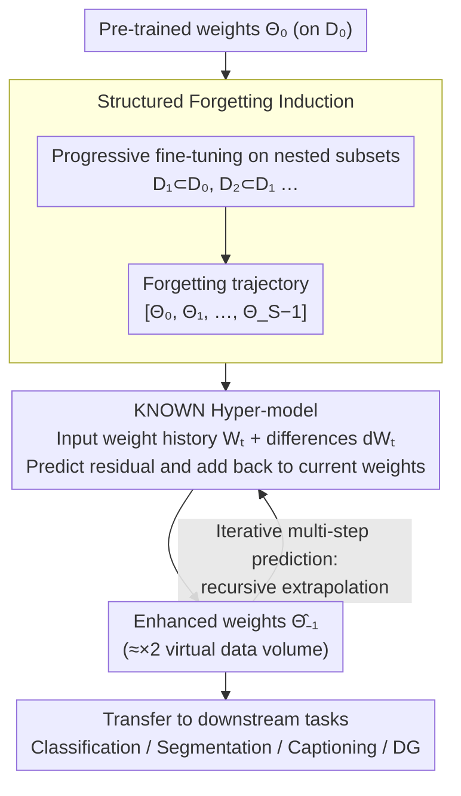

# Learning from Oblivion: Predicting Knowledge-Overflowed Weights via Retrodiction of Forgetting

**Conference**: CVPR 2026  
**arXiv**: [2508.05059](https://arxiv.org/abs/2508.05059)  
**Code**: [jjh6297/KNOW](https://github.com/jjh6297/KNOW)  
**Area**: Model Training / Weight Prediction / Knowledge Transfer  
**Keywords**: weight prediction, structured forgetting, meta-learning, hyper-model, knowledge transfer, scaling law, pre-trained weights

## TL;DR

The authors propose KNOW prediction: inducing a structured forgetting process through sequential fine-tuning on progressively smaller nested data subsets to collect weight transition trajectories, and then using a meta-learned hyper-model (KNOWN) to reverse the direction of forgetting. This predicts virtual knowledge-enhanced weights as if they were trained on larger datasets. Across multiple datasets (CIFAR/ImageNet/PACS, etc.) and architectures (ResNet/PVTv2/DeepLabV3+, etc.), the method consistently outperforms naive fine-tuning and various weight prediction baselines, showing significant improvements in downstream tasks such as image classification, semantic segmentation, image captioning, and domain generalization.

## Background & Motivation

Pre-trained weights are the cornerstone of modern deep learning, especially in few-shot scenarios where data is scarce; high-quality pre-trained weights significantly boost downstream performance. The Core Problem is: **How to obtain better pre-trained weights without increasing the volume of training data?**

The authors' reasoning is based on three key insights:

**Scaling Law**: More training data typically yields better pre-trained weights (better generalization). However, large-scale data collection is costly and often restricted in practice.

**Fine-tuning causes forgetting**: Fine-tuning on a data subset overwrites the model's knowledge of data outside that subset—a classic manifestation of catastrophic forgetting, usually viewed as a defect.

**Fine-tuning is reversible**: Prior studies on unlearning indicate that weight space changes during fine-tuning possess a degree of reversibility; the smoothness of the loss landscape (mode connectivity) makes weight prediction theoretically feasible.

**Core Idea**: Since fine-tuning on diminishing data → forgetting knowledge → weight degradation is a structured process, reversing this process → recovering knowledge → weight enhancement should also be feasible. This transforms "forgetting" from a defect into a tool.

## Method

### Overall Architecture

This work addresses a practical question: Can one obtain better pre-trained weights "as if trained on a larger dataset" without actually adding training data? The breakthrough lies in reversing catastrophic forgetting—since repeated fine-tuning on shrinking data causes weights to "degenerate and forget" along a structured trajectory, observing this trajectory and reversing its direction allows for extrapolating "knowledge-overflowed" enhanced weights. Formally: given $\Theta_0$ pre-trained on $D_0$, a forgetting trajectory $[\Theta_0, \Theta_1, \ldots, \Theta_{S-1}]$ is artificially induced. Assuming an ideal weight $\Theta_{-1}$ exists for a "larger dataset $D_{-1} \supset D_0$" (where fine-tuning it on $D_0$ yields $\Theta_0$), a hyper-model trained on "what forgetting looks like" is used to retrodict $\hat{\Theta}_{-1}$. This is KNOW (Knowledge-Overflowed Weights) prediction. The pipeline consists of four steps: "Inducing trajectories → Retrodicting enhanced weights → Recursive extrapolation → Downstream transfer":

### Key Designs

**1. Structured Forgetting Induction: Creating a "Degradation Trajectory"**

To reverse forgetting, a clean, structured trajectory is required. Starting from the full dataset $D_0$, nested subsets $D_S \subset D_{S-1} \subset \cdots \subset D_1 \subset D_0$ are constructed according to a sampling rate $r \in [0,1]$ (e.g., $D_1 = r\cdot D_0$, $D_2 = r\cdot D_1$). Weights from the previous step are fine-tuned on each smaller subset to obtain the sequence $\Theta_0 \xrightarrow{D_1} \Theta_1 \xrightarrow{D_2} \Theta_2 \cdots$. Since the amount of forgotten knowledge is linked to the data reduction, this trajectory is "structured" rather than exhibiting random drift. PCA visualization of the loss landscape shows these weights forming a smooth curve surrounded by continuous high-accuracy regions, providing the prerequisite for trajectory extrapolation.

**2. KNOWN Hyper-model: Learning the "Inverse Operation of Forgetting"**

KNOWN (Knowledge-Overflowed Weights Nowcaster) is a lightweight meta-trained hyper-model with only 9,425 parameters, based on a two-stream MLP from WNN. It takes two inputs—weight history $W_t = [\theta_0, \theta_1, \ldots, \theta_{S-1}]$ and their differences $dW_t = [\theta_1 - \theta_0, \ldots, \theta_{S-1} - \theta_{S-2}]$ (with $S=5$)—and outputs a weight residual, which is added back to the current weight to get the enhanced weight:

$$\hat{\theta}^{t-1} = \theta^t + \text{KNOWN}(W_t, dW_t)$$

Because the evolution patterns of Conv, FC, and Bias layers differ, KNOWN trains three specialized models $[\text{KNOWN}_{\text{Conv}}, \text{KNOWN}_{\text{FC}}, \text{KNOWN}_{\text{Bias}}]$. It models the entire trajectory non-linearly, which is why it is more robust than linear extrapolation methods like TaskVector.

**3. Iterative Multi-step Prediction: Pushing Extrapolation Further**

If the first-step prediction $\hat{\Theta}_{-1}$ is reliable, it can be appended back to the history $[\hat{\Theta}_{-1}, \Theta_0, \Theta_1, \ldots, \Theta_{S-2}]$ to predict $\hat{\Theta}_{-2}$, and so on recursively. When $r=0.5$, $\hat{\Theta}_{-1}$, $\hat{\Theta}_{-2}$, and $\hat{\Theta}_{-3}$ correspond to ×2, ×4, and ×8 virtual data volume enhancements, respectively. The ability to perform recursive prediction without performance collapse serves as evidence of the high quality of the predicted weights.

### A Complete Example

Take ResNet18 transferred from CIFAR100 to CIFAR10 ($r=0.5$, $S=5$) as an example: First, fine-tune the forgetting trajectory $[\Theta_0, \ldots, \Theta_4]$ on progressively halved subsets. The naive transfer baseline accuracy is 92.40. Feeding the trajectory into KNOWN to predict $\hat{\Theta}_{-1}$ (≈×2 data) raises accuracy to 93.00; recursive prediction to ×4 yields 93.27, and ×8 yields 93.55. Notably, using only 50% of the data with this pipeline (92.58) already exceeds the baseline using 100% of the data (92.40)—the Gain comes entirely from the reverse extrapolation of the forgetting trajectory, not extra data.

### Loss & Training

The meta-training objective for KNOWN is $\ell_1$ residual minimization: $\|(\theta^t + \text{KNOWN}(W_t, dW_t)) - \theta^{t-1}\|_1$. Training data consists of weight trajectories (approx. 50GB) from various small models (CNN/ResNet/DenseNet/ShuffleNet/MobileNetV2, all <3M parameters) on CIFAR10/MNIST/FashionMNIST. Once trained, it requires no retraining for new experiments and generalizes directly to downstream settings. Inference cost is extremely low—predicting all parameters of a ResNet18 takes approximately 3 seconds ($2.67 \times 10^{-7}$ seconds per parameter). The additional training overhead for inducing the forgetting trajectory is $\frac{1-r^{S-1}}{1-r}$ times the original training.

## Key Experimental Results

### Image Classification (ResNet18, CIFAR100→CIFAR10)

| Method | Prediction Steps | 100% Data | 50% Data | 25% Data |
|------|----------|----------|---------|---------|
| Naïve Transfer | 1 | 92.40 | 92.08 | — |
| KNOWN | ×2 | 93.00±0.11 | 92.58±0.14 | 92.29±0.04 |
| KNOWN | ×4 | 93.27±0.09 | 92.62±0.25 | 92.88±0.11 |
| KNOWN | ×8 | **93.55±0.05** | **93.11±0.19** | 92.92±0.15 |

KNOWN on 50% data (92.58) surpasses the 100% data baseline (92.40), and iterative prediction (×8) further improves it to 93.55. Other methods (LogFit/TaskVector/TSV, etc.) sometimes degrade performance.

### Cross-Architecture & Cross-Dataset (PVTv2, ImageNet Pre-trained → 5 Downstream Datasets)

Consistent gains are observed across CIFAR100/TinyImageNet/Stanford Cars/CUB/Oxford Flowers. For instance, with ×3 prediction: CIFAR100 82.46(↑), TinyImageNet 77.53(↑), CUB 71.18(↑).

### Domain Generalization (PACS, Leave-One-Domain-Out)

| Method | art | sketch | cartoon | photo | Average |
|------|-----|--------|---------|-------|------|
| Naïve Transfer | — | — | — | — | 63.48 |
| KNOWN (×3) | 72.12 | 44.11 | 62.73 | 93.87 | **68.21** |
| KNOWN (×9) | 72.07 | 44.02 | 64.28 | 92.98 | **68.33** |

Average accuracy improved from 63.48 to 68.33, a Gain of approximately 5 percentage points.

### Semantic Segmentation (DeepLabV3+, Pascal VOC→Cityscapes)

| Method | mIoU |
|------|------|
| Naïve Transfer | baseline |
| KNOWN (×3) | 69.00±1.04 (↑) |
| KNOWN (×9) | **71.22±0.82** (↑) |

While TaskVector performance drops below baseline at ×9, KNOWN shows stable improvement.

### Image Captioning (PVTv2 + Transformer decoder, Flickr8K)

KNOWN improves masked accuracy by approximately 2.2% over the baseline (39.38 vs. ~37.2), proving effectiveness in cross-modal tasks.

### Ablation Study (Impact of $S$)

| S | ×2 Acc | ×4 Acc | ×8 Acc |
|---|--------|--------|--------|
| 2 (≈TaskVector) | 92.69 | 92.70 | 92.65 |
| 3 | 93.01 | 93.04 | 92.72 |
| 4 | 92.97 | 93.10 | 92.89 |
| 5 | **93.00** | **93.27** | **93.55** |

Longer forgetting sequences ($S=5$) provide richer trajectory information, which is particularly advantageous for multi-step iterative prediction.

## Highlights & Insights

- **Turning Forgetting into a Tool**: Catastrophic forgetting has long been viewed as a persistent problem in deep learning. This paper is the first to intentionally induce and reverse it as a means of knowledge enhancement. This perspective shift is highly creative.
- **KNOWN is Extremely Lightweight**: With only 9,425 parameters, the hyper-model performs across architectures (CNN/ViT), datasets, and tasks (Classification/Segmentation/Captioning/DG) after a single meta-training—demonstrating impressive generalization.
- **Near-Zero Cost for Weight Prediction Inference**: Predicting all parameters of a ResNet18 takes just 3 seconds, which is negligible compared to hours of training time.
- **No Dependency on Extra Data**: Unlike data augmentation or knowledge distillation which require extra resources, KNOW "virtually extends" the training data effect purely by leveraging the forgetting structure of existing data.
- **Loss Landscape Visualization Provides Intuitive Validation**: The smoothness of the forgetting trajectory under PCA projection and the accurate positioning of predicted weights provide direct visual evidence for the feasibility of the method.

## Limitations & Future Work

1. **Lack of Large-scale Model Validation**: The largest model tested is PVTv2 (~25M parameters); performance on million-plus parameter models like ViT-Large or LLMs has not been verified. Whether the weight space structure remains smooth as model capacity increases remains to be seen.
2. **Meta-training Dataset Constraints**: KNOWN was meta-trained only on small models (<3M parameters). Although it generalizes to PVTv2, generalization performance across larger scale gaps is unknown.
3. **Selection of Sampling Rate $r$**: While $r=0.5$ and $r=0.33$ performed well, a systematic guide for choosing $r$ is missing. An $r$ that is too small results in excessive forgetting per step, while one that is too large makes trajectory changes indistinct.
4. **Limited to Visual Tasks**: Although it covers categorization, segmentation, and captioning, all are within the vision domain. Weight evolution patterns in NLP or audio modalities may differ.
5. **Compatibility with Modern Training Paradigms**: Integration with parameter-efficient fine-tuning (PEFT) methods like LoRA/Adapter is not discussed, nor is application during the pre-training phase itself (it is currently used for post-pre-training enhancement).

## Related Work & Insights

- **WNN (ICML 2023)**: Previous work by the same group using periodic weight prediction to accelerate training → This paper extends WNN to cross-dataset scale KNOW prediction.
- **Task Arithmetic (ICLR 2023)**: Editing models via linear operations on task vectors → This paper confirms that linear extrapolation (TaskVector) is unstable on forgetting trajectories, whereas KNOWN's non-linear modeling is more reliable.
- **Model Soups / Weight Averaging**: Averaging weights of multiple fine-tuned models → KNOW differs by extrapolating from a sequential trajectory rather than blending multiple final states.
- **Scaling Law Research**: This work can be viewed as an implementation path for "indirectly utilizing Scaling Laws without increasing data volume."
- **Insight**: The KNOW framework could potentially be extended to other "structured degradation processes," such as reversing model pruning (predicting dense from sparse) or reversing quantization (predicting high-precision weights from low-precision).

## Rating

| Dimension | Score (1-5) | Explanation |
|------|-----------|------|
| Novelty | 4.5 | The idea of reversing forgetting is highly creative; the paradigm shift from "defect → tool" is significant. |
| Utility | 4.0 | KNOWN is lightweight, generalizes well, and has near-zero inference cost, lowering the barrier for engineering adoption. |
| Experimental Thoroughness | 4.0 | Comprehensive validation across architectures, datasets, and tasks with clear ablations, but lacks large-scale and NLP experiments. |
| Writing Quality | 4.0 | Clear problem definition, sound mathematical formalization, and intuitive landscape visualization. |

<!-- RELATED:START -->

## Related Papers

- [\[AAAI 2026\] Learning from the Undesirable: Robust Adaptation of Language Models without Forgetting](../../AAAI2026/llm_safety/learning_from_the_undesirable_robust_adaptation_of_language_models_without_forge.md)
- [\[AAAI 2026\] Beyond Superficial Forgetting: Thorough Unlearning through Knowledge Density Estimation and Block Re-insertion](../../AAAI2026/llm_safety/beyond_superficial_forgetting_thorough_unlearning_through_knowledge_density_esti.md)
- [\[ACL 2026\] Before Forgetting, Learn to Remember: Revisiting Foundational Learning Failures in LVLM Unlearning Benchmarks](../../ACL2026/llm_safety/before_forgetting_learn_to_remember_revisiting_foundational_learning_failures_in.md)
- [\[ACL 2026\] Compiling Activation Steering into Weights via Null-Space Constraints for Stealthy Backdoors](../../ACL2026/llm_safety/compiling_activation_steering_into_weights_via_null-space_constraints_for_stealt.md)
- [\[AAAI 2026\] Privacy-protected Retrieval-Augmented Generation for Knowledge Graph Question Answering](../../AAAI2026/llm_safety/privacy-protected_retrieval-augmented_generation_for_knowledge_graph_question_an.md)

<!-- RELATED:END -->
