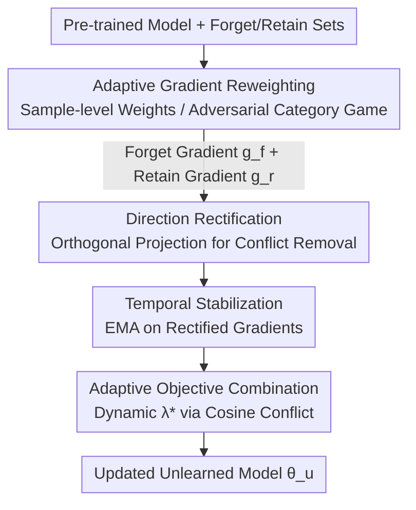

# Machine Unlearning via Adaptive Gradient Reweighting and Multi-stage Objective Optimization

**Conference**: CVPR 2026  
**Paper**: [CVF Open Access](https://openaccess.thecvf.com/content/CVPR2026/html/Lu_Machine_Unlearning_via_Adaptive_Gradient_Reweighting_and_Multi-stage_Objective_Optimization_CVPR_2026_paper.html)  
**Code**: None  
**Area**: Machine Unlearning / AI Security & Privacy  
**Keywords**: Machine Unlearning, Adaptive Gradient Reweighting, Multi-objective Optimization, Gradient Conflict, Forgetting-Retaining Trade-off

## TL;DR
To address the issues of "uniform treatment of all samples/categories" and "gradient conflicts between forgetting and retaining objectives" in machine unlearning, this paper proposes **Adaptive Gradient Reweighting** (weighting based on sample memory depth/category vulnerability) combined with **Three-stage Objective Optimization** (direction rectification → temporal smoothing → adaptive combination). On CIFAR-10/100 and Tiny-ImageNet, the Avg Gap for random forgetting is reduced from the SOTA 0.85 to 0.19.

## Background & Motivation
**Background**: The goal of Machine Unlearning (MU) is to remove the influence of specific training samples (forget set $D_f$) from a trained model without retraining from scratch, aiming for a model state where $\theta_u \approx \theta_r$ ($\theta_r$ is the parameter set obtained by retraining only on the retain set $D_r$). Mainstream approximate unlearning methods include gradient ascent, saliency pruning (SalUn), distillation (BadT), and decoupling forget/retain objectives (DELETE).

**Limitations of Prior Work**: ① **Uniformity**: Existing methods apply the same strategy and weights to all forget samples and retain categories, ignoring differences in "memory depth." The authors use classification loss as a proxy for memory depth: samples with similar visual features (e.g., textures of cats and dogs) have fuzzy decision boundaries, high loss, and represent "shallow memory," which is easy to unlearn. "Deep memory" samples are the true challenge. Sub-optimal weighting wastes computation on shallow samples while failing to fully unlearn hard ones. ② **Category Collateral Damage**: When forgetting the "plane" category, the accuracy of the visually similar "bird" category drops significantly (measured at −12.4%) due to entanglement near decision boundaries.

**Key Challenge**: The forgetting objective (degrading performance on $D_f$) and the retaining objective (maintaining performance on $D_r$) are naturally in conflict. Their gradients exhibit **direction conflicts** (leading to degradation of both objectives) and **dominance issues** (one gradient becomes too large, biasing updates). Existing methods use a **fixed trade-off coefficient** for manual weighting, but the geometric relationship between gradients **evolves dynamically** during training, making fixed coefficients sub-optimal and reliant on expensive grid search.

**Goal**: (1) Adaptively distribute forgetting/retaining effort based on sample and category difficulty; (2) Dynamically resolve direction conflicts and dominance between forget and retain gradients.

**Key Insight**: Treat MU as a **Multi-Task Learning (MTL) / Multi-Objective Optimization** problem. Forgetting and retaining are two conflicting tasks. Techniques like PCGrad/CAGrad from MTL can be adapted, but must be made adaptive to handle the "dynamic evolution" characteristics of MU.

**Core Idea**: Use "Adaptive Gradient Reweighting" to determine **how much effort** to apply to whom, and "Three-stage Objective Optimization" to determine **how to synthesize the two forces**, eliminating the need for manual trade-off coefficients.

## Method

### Overall Architecture
The method integrates two components: First, **Adaptive Gradient Reweighting** calculates weighted forget gradients $g_f$ and retain gradients $g_r$ for each forget sample (random forgetting) or retain category (category forgetting). Then, these gradients enter **Three-stage Objective Optimization**—first performing direction rectification to eliminate conflicting components, then temporal smoothing to filter high-frequency jitter, and finally adaptively combining them into a balanced update direction. Every step allows the optimizer to determine the effort and synthesis dynamically.

### Key Designs

**1. Adaptive Gradient Reweighting: Effort Allocation via Memory Depth/Category Vulnerability**

Addressing the "Uniformity" issue, weights are assigned based on the scenario. **Random sample forgetting** utilizes **instance-level bi-level optimization**: each forget sample $x_i^f$ is assigned a learnable weight $w_i = \sigma(a_i) \in (0,1)$ ($a_i$ is a trainable scalar). The forget objective is weighted prediction entropy $L_f(\theta, a) = \frac{1}{|B_f|}\sum_i w_i \cdot H_i$, where $H_i = -\sum_j p_{ij}\log p_{ij}$ (maximizing entropy induces forgetting without labels). A single backpropagation calculates both model gradients $g_f = \nabla_\theta L_f$ and weight gradients; weights are updated via $a \leftarrow a - \eta_a \nabla_a L_f$. This automatically assigns higher weights to "hard-to-forget" deep memory samples, forming an **adaptive curriculum**.

**Category forgetting** utilizes **adversarial category weighting**: weighting for retain categories is formulated as a min-max game between model $\theta$ (defender) and category weight policy $\pi$ (attacker): $\min_\theta \max_{\pi \in \Delta_R} \frac{1}{|B_r|}\sum \pi_{c(y_i)} \cdot \ell(f_\theta(x_i), y_i)$. The attacker uses Gumbel-Softmax reparameterization for differentiable sampling of learnable logits $\alpha$, using gradient ascent to shift weights toward the **most vulnerable retain categories** (nearby classes most affected by unlearning, e.g., "birds"). The defender then updates the model to minimize the objective with $\pi$ fixed via stop-gradient. This focuses protection on high-risk neighboring classes, mitigating collateral damage.

**2. Three-stage Objective Optimization: Resolving Conflict and Dominance**

Addressing the "fixed coefficient" issue, the synthesis of $g_f$ and $g_r$ is split into three serial stages:

- **Direction Rectification**: When normalized gradients conflict ($\hat{g}_r \cdot \hat{g}_f > 0$; note one is ascent, one is descent, so a positive dot product implies conflict), each gradient is symmetrically projected onto the other's orthogonal complement: $\hat{g}_f^\perp = \hat{g}_f - \alpha \cdot \max(0, \hat{g}_f \cdot \hat{g}_r)\cdot \hat{g}_r$ (same for $\hat{g}_r^\perp$). This eliminates destructive components while preserving independent directions ($\alpha=1.0$).
- **Temporal Stabilization**: Large directional variances between steps hinder convergence. Exponential Moving Average (EMA) is applied to rectified gradients: $\tilde{g}^{(t)} = \mu \tilde{g}^{(t-1)} + (1-\mu)\hat{g}^\perp$ ($\mu=0.9$), incorporating historical context for a consistent update trajectory.
- **Adaptive Objective Combination**: Smoothed gradients are linearly combined via a balance factor $\lambda_t$: $g(\lambda_t) = (1-\lambda_t)\tilde{g}_r^{(t)} - \lambda_t \tilde{g}_f^{(t)}$. Conflict is measured by the difference in cosine similarity between the combined gradient and each task gradient: $J(\lambda_t) = \cos(g(\lambda_t), \tilde{g}_f^{(t)}) - \cos(g(\lambda_t), \tilde{g}_r^{(t)})$. The optimizer finds **optimal $\lambda_t^* = \arg\min_{\lambda_t} J(\lambda_t)$** in each step over $[0,1]$, finally updating $\theta \leftarrow \theta - \eta \cdot g(\lambda_t^*)$. This prevents any single gradient from dominating.

### Loss & Training
The forgetting objective uses **prediction entropy maximization** (label-free); the retaining objective uses standard cross-entropy loss $L_r(\theta)$. The final update direction is synthesized by the three-stage optimization without manual weights. CIFAR-10/100 models are trained for 200 epochs (SGD, initial lr 0.1, momentum 0.9, weight decay $5\times10^{-4}$, cosine annealing, early stopping patience 50); Tiny-ImageNet uses a ResNet-50 pre-trained on ImageNet-1k. Rectification strength $\alpha=1.0$, momentum $\mu=0.9$. Implementation is in PyTorch 2.4 on an RTX 4090.

## Key Experimental Results

### Main Results
Randomly forgetting 10% of data (Metrtic **Avg Gap**: Average of absolute differences in MIA accuracy and forget/retain/test set accuracies relative to the "Retrain Gold Standard"; lower is better):

| Model/Dataset | Metric | Ours | LoTUS (Runner-up) | SalUn |
|------|------|------|----------|------|
| ViT / C-10 | Avg Gap | **0.19** | 0.85 | 1.08 |
| ViT / C-100 | Avg Gap | **1.26** | 1.88 | 3.00 |
| RN18 / C-10 | Avg Gap | **1.57** | 5.33 | 5.38 |
| RN18 / C-100 | Avg Gap | **6.03** | 11.83 | 14.99 |

MIA scores for Ours are closest to the retrain gold standard (e.g., ViT/C-10: Ours 83.26 vs. Gold Standard 83.64), indicating a clear "performance gap" between forget and retain sets without damaging model utility. Baselines show significantly higher MIA, indicating residual memory.

### Ablation Study
Single-class unlearning (evaluating H-Mean = harmonic mean of retain accuracy $Acc_{rt}$ and forget set drop $Drop_{ft}$) and multi-class unlearning demonstrate that both modules together achieve near-perfect unlearning while preserving accuracy:

| Configuration | Key Metric | Description |
|------|---------|------|
| Full Method (RN18/C-10 Single Class) | $Acc_r$ 99.98 / $Acc_f$≈0 | Perfect unlearning + No retain degradation |
| Multi-class (1→20 classes, C-100) | Minimal degradation | Most stable performance as unlearning scale increases |
| High-ratio (50%) | Still leading | Maintains superiority in large-scale forgetting |
| Cross-scenario (Medical/Face) | Significant Gains | Generalizes to challenging real-world tasks |

### Key Findings
- **Adaptive reweighting decides "how much effort," while three-stage optimization decides "how to combine"**—both are essential. The former prevents over-consumption by shallow samples and protects vulnerable neighbors; the latter eliminates gradient direction conflict and dominance.
- Improvements are especially pronounced on ViT (Avg Gap 0.85→0.19), suggesting that high-capacity models benefit more from dynamic gradient management over fixed hyperparameters.
- The method scales efficiently to multi-class and high-ratio (50%) unlearning, showing strong generalization.

## Highlights & Insights
- **Quantifying "memory depth" as a curriculum signal**: Using classification loss/entropy as a shallow memory proxy and assigning learnable weights creates an "easy-to-hard" curriculum. this logic is transferable to any task requiring differentiated sample treatment.
- **Min-max adversarial game for category unlearning**: Identifying and protecting the most vulnerable neighboring classes is more efficient than uniform protection, mitigating precision loss in similar categories.
- **Three-stage "gradient surgery" for MU dynamics**: Extending static methods like PCGrad into a multi-stage dynamic version (Rectification + EMA + Optimal $\lambda$) provides a framework for any optimization problem with dynamically evolving conflicting objectives.

## Limitations & Future Work
- Evaluation is primarily on image classification (CIFAR/Tiny-ImageNet). While medical and face tasks were shown, validation on large-scale generative models or detection/segmentation tasks is needed.
- Bi-level instance optimization and three-stage synthesis introduce additional computation (calculating $\lambda$, maintaining EMA, adversarial updates). Training overhead relative to simple baselines was not fully quantified.
- Reliability of proxy indicators (entropy/loss) in the presence of heavy label noise or extreme class imbalance remains to be discussed.
- ⚠️ Refer to the original paper for specific formulas regarding symmetric projections and the cosine conflict objective $J(\lambda_t)$.

## Related Work & Insights
- **vs. SalUn / DELETE**: These treat all samples/categories uniformly and use fixed weights. Ours uses adaptive reweighting and dynamic synthesis, significantly outperforming them (ViT/C-10 Avg Gap: 0.19 vs. SalUn 1.08).
- **vs. PCGrad / CAGrad (MTL Gradient Surgery)**: These perform static projections. Ours expands this into a "rectification + stabilization + adaptive combination" pipeline tailored to the evolving gradient geometry of MU.
- **vs. DualOptim**: DualOptim decouples momentum at the optimizer level but increases memory usage and remains uniform. Ours balances synthesis at the gradient level adaptively and differentiates between samples/categories.

## Rating
- Novelty: ⭐⭐⭐⭐ Combines "memory depth adaptive weighting" with "MU-specific multi-stage optimization"; built on established MTL/MOP concepts but applied uniquely.
- Experimental Thoroughness: ⭐⭐⭐⭐ Covers random/single/multi-class/high-ratio forgetting across various architectures and domains; lacks detailed training overhead metrics.
- Writing Quality: ⭐⭐⭐⭐ Motivations are clearly illustrated with figures; method sections are rigorous.
- Value: ⭐⭐⭐⭐ Reaches SOTA without manual trade-off tuning; highly practical for privacy compliance (GDPR Right to be Forgotten).

<!-- RELATED:START -->

## Related Papers

- [\[ICLR 2026\] OFMU: Optimization-Driven Framework for Machine Unlearning](../../ICLR2026/llm_safety/ofmu_optimization-driven_framework_for_machine_unlearning.md)
- [\[CVPR 2026\] SineProject: Machine Unlearning for Stable Vision–Language Alignment](sineproject_machine_unlearning_for_stable_vision_language_alignment.md)
- [\[NeurIPS 2025\] Learning to Watermark: A Selective Watermarking Framework for Large Language Models via Multi-Objective Optimization](../../NeurIPS2025/llm_safety/learning_to_watermark_a_selective_watermarking_framework_for_large_language_mode.md)
- [\[CVPR 2026\] pH-Strips for Selective Forgetting: A Blunt but Fast Diagnostic Baseline for Machine Unlearning](ph-strips_for_selective_forgetting_a_blunt_but_fast_diagnostic_baseline_for_mach.md)
- [\[ICCV 2025\] MUNBa: Machine Unlearning via Nash Bargaining](../../ICCV2025/llm_safety/munba_machine_unlearning_via_nash_bargaining.md)

<!-- RELATED:END -->
