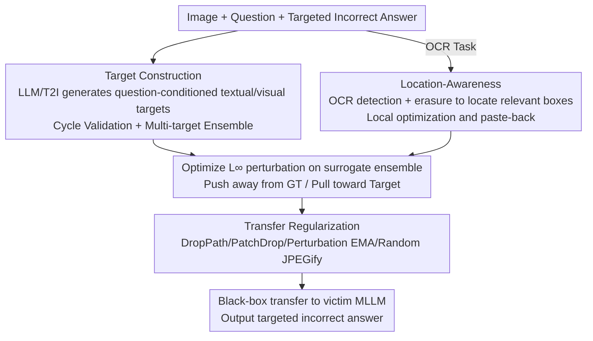

# Omni-Attack: Adversarial Attacks on Open-Ended VQA in Black-Box Multimodal LLMs

**Conference**: CVPR 2026  
**Paper**: [CVF Open Access](https://openaccess.thecvf.com/content/CVPR2026/html/Hu_Omni-Attack_Adversarial_Attacks_on_Open-Ended_VQA_in_Black-Box_Multimodal_LLMs_CVPR_2026_paper.html)  
**Code**: https://github.com/hukkai/transferable_mllm_attack  
**Area**: Multimodal LLM Safety / Adversarial Attacks  
**Keywords**: Black-box Adversarial Attacks, Multimodal LLM, Open-ended VQA, Transferable Attacks, OCR Attacks

## TL;DR
Addressing the gaps where "open-ended VQA/OCR tasks lack explicit attack targets and existing adversarial robustness evaluations use fragmented protocols," this paper first establishes a unified targeted attack benchmark **AdvRobustBench** (1,000 items, VQA+OCR). It then proposes **Omni-Attack**, a transferable black-box attack using LLMs to generate "question-conditioned" textual/visual targets, OCR location-aware perturbations, and four transfer regularizations. It achieves a 71.8% targeted attack success rate on GPT-4.1 with $\epsilon=8/255$.

## Background & Motivation
**Background**: Multimodal Large Language Models (MLLM/VLLM, e.g., GPT-4.1, Claude, Gemini) are being deployed in safety-critical scenarios like autonomous driving and document understanding. Adversarial attacks on vision models have long shown that **transferable black-box attacks**—constructing perturbations on surrogate models to transfer to targets—are highly effective. Recent work confirms that MLLMs are similarly vulnerable to adversarial image perturbations.

**Limitations of Prior Work**: ① **Tasks are too simple**: Most existing MLLM adversarial robustness evaluations are limited to coarse-grained classification or short descriptions. However, MLLMs are "general-purpose" models intended for fine-grained recognition, text reading, and reasoning; whether attacks hold for these complex real-world tasks remains unverified. ② **Fragmented evaluation protocols**: MLLM outputs are open-ended text, unlike pure vision models that can be measured by CLIP similarity. Different studies use various datasets and criteria (keyword matching vs. LLM-as-judge). Keyword matching misses semantics, while LLM judging is sensitive to prompts, hindering fair comparison. A more subtle issue is that many criteria consider an attack successful even if both the original and target categories appear, which miscounts model hallucinations as successful targeted attacks, thus **overestimating** attack rates.

**Key Challenge**: When applying existing transfer attacks to open-ended VQA, there is a **lack of target representation**. Previously, targets were explicit sentences or images, and the loss pulled the perturbed image embedding toward the target. In "question-conditioned answer" settings, using a short answer (e.g., "Paris") directly as a target provides weak and unstable optimization signals. OCR tasks add a layer of **locality**: evidentiary text exists only in small regions; optimizing target text into the wrong location leads to failure.

**Goal**: (1) Establish a unified, reproducible targeted attack benchmark that avoids hallucination overestimation; (2) Design a transferable black-box attack effective for complex open-ended tasks.

**Key Insight**: Since short answers provide weak signals, use LLMs or text-to-image models to "concretize" answers into question-conditioned target descriptions or images to provide stronger optimization signals. For OCR locality, use OCR detection to locate relevant regions and optimize only within those areas.

**Core Idea**: A triad of **Target Construction + Location-Awareness + Transfer Regularization**, converting open-ended VQA/OCR attacks into standard transfer attacks with strong target signals and local precision.

## Method

### Overall Architecture
Omni-Attack constructs $L_\infty$-constrained perturbations on a surrogate model ensemble (CLIP-based), aiming to push the perturbed image "away from the ground-truth representation and toward the target representation" across all surrogates. The basic optimization is $\delta^* = \arg\min_{\|\delta\|_p \le \epsilon} \sum_i [S_i(x_\delta, x_G) - S_i(x_\delta, x_T)]$, where $S_i$ is the similarity from surrogate $i$, and $x_G$/$x_T$ are ground-truth/target representations. The pipeline: **Target Construction** transforms question-conditioned answers into textual/visual targets (with cycle validation and multi-target ensemble); OCR tasks additionally undergo **Location-Awareness** to restrict optimization to relevant text boxes; finally, **Transfer Regularization** is applied to suppress overfitting to surrogates. VQA and OCR share the start and end steps, with OCR inserting a localization step.

### Key Designs

**1. Target Construction: Concretizing Weak Short Answers into Strong Question-Conditioned Targets**

This addresses the "weak signal of short answers" pain point. Many questions require reasoning (e.g., asking for a city's location requires thinking of landmarks) or abstract concepts (e.g., asking "is it crowded" requires imagining many people); a single word like "Paris" does not encode these salient visual attributes. Thus, **LLM Reasoning Concretization** is used: given question $Q$ and target option $T$, the LLM is asked to "imagine what the image would look like if $T$ were the correct answer" and generate a caption as the textual target $x_T \leftarrow \text{LLM}(V, Q, T)$. The ground-truth representation $x_G$ is the original image caption. Visual targets are generated via text-to-image models based on $x_T$. To prevent LLM errors, two mechanisms are added: **Cycle Validation**—feeding the candidate caption (without the image) and question back to the LLM; if it fails to return the target option, it regenerates until successful ($\text{LLM}(x_T, Q)=T$). **Multi-target Ensemble**—using $M$ different LLMs to generate targets and defining a softmax score for surrogate $i$: $p_i^{(j)} = \frac{\exp(S_i(x_\delta, x_T^{(j)}))}{\sum_k [\exp(S_i(x_\delta, x_T^{(k)})) + \exp(S_i(x_\delta, x_G^{(k)}))]}$. This normalizes each target caption against all candidates, changing the objective to $\arg\min \sum_i\sum_j -\log p_i^{(j)}$ to reduce single-LLM bias. In practice, both textual and visual targets are used.

**2. Location-aware OCR Attack: Reducing "Local Evidence" Problems to Standard VQA**

This addresses the locality of OCR. If the question asks "Where is this receipt from?", optimizing the target text "GIANT EAGLE" into a non-"TRADER JOE" region is futile. The approach: use an OCR detector (PaddleOCR) to box all text instances. For each box, **erase its pixels and re-ask the original question**—if the answer remains unchanged, the box is irrelevant; if it changes, the box is relevant. Given relevant boxes $B=[x_m, y_m, x_M, y_M]$, expanded by $R=\min(x_M-x_m, y_M-y_m)/2$, target optimization is performed only in that region, and the modified patch is pasted back. This **reduces the local OCR attack to a standard VQA attack on a localized region**.

**3. Four Transfer Regularizations: Suppressing Overfitting to Surrogate Models**

This addresses the issue where "optimization easily overfits surrogate-specific weaknesses, leading to poor transferability." Four techniques are stacked without significant compute overhead: **DropPath**—skipping the $i$-th residual block with probability $(i/L)p$ ($p=0.2$) to diversify forward paths and reduce deep-layer overfitting; **PatchDrop**—randomly dropping patches for ViT surrogates to reduce patch co-adaptation; **Perturbation EMA**—maintaining $\delta_{EMA} \leftarrow 0.99\delta_{EMA} + 0.01\delta$ to obtain smoother perturbations that land in flatter minima; and **Random JPEGify**—using differentiable JPEG compression as augmentation (quality $[0.5, 1.0]$) since most vision models encounter JPEG images and aligning with this distribution improves transfer.

### Loss & Training
Best practice: textual targets are generated using 5 LLMs (Qwen3-VL 30B, Gemma3 27B, GPT-4.1, Claude 3.7, Gemini 2.0), with Qwen-Image generating a visual target for each. The surrogate ensemble consists of 3 CLIP models (ViT-H-14-378 DFN, ViT-SO400M-14-384 SigLip, ViT-H-14-CLIPA-336 Datacomp1B). The total objective combines textual and visual losses as per Eq. (4). Threat model: Targeted, black-box (transfer), $L_\infty$-constrained, with budget $\epsilon \in \{8/255, 16/255\}$.

## Key Experimental Results

### Main Results
**Evaluation Metric ASR (scaled attack success rate)**: $ASR = \frac{\sum_i x_i y_i}{\sum_i x_i}$, where $x_i=1$ indicates the model is correct on the clean image, and $y_i=1$ indicates the model outputs the specified incorrect answer on the perturbed image. This isolates the targeted success rate on samples the model originally got right, excluding non-attack factors. Average of 3 independent runs.

ASR (%) on AdvRobustBench for various victim MLLMs:

| Victim Model | MMBench 8/255 | MMBench 16/255 | OCRBench-v2 8/255 |
|------|------|------|------|
| GPT-4.1 | **71.8** | 80.1 | 25.2 |
| GPT-4o | 69.8 | 76.1 | 24.6 |
| Qwen3-VL 30B | 67.1 | 77.5 | 25.3 |
| Gemini 2.0 | 65.8 | 75.2 | 22.8 |
| Claude 3.7 | 15.5 | 46.8 | 4.6 |
| Claude 3.5 | 13.9 | 44.7 | 4.3 |

The Claude family is significantly more robust (especially at $\epsilon=8/255$). OCRBench-v2 is the most difficult category as CLIP encoders are weaker at text, and text images offer high contrast with fewer optimizable pixels. Random perturbations at $\epsilon=16/255$ yield near-zero ASR for GPT-4.1/Claude 3.7, proving attacks are targeted rather than noise-driven.

### Ablation Study

| Configuration | GPT-4.1 ASR | Description |
|------|---------|------|
| Full (3 CLIP Surrogates, $\epsilon=8/255$) | 71.8 | Best practice |
| 2 CLIP + DINO-v2 | 65.6 | Pure vision models are less suitable for transfer attacks |
| 2 CLIP + AdvXL | 60.0 | Adversarially trained models as surrogates perform worse |
| 3 Small CLIP @224 | 56.8 | Low-resolution CLIP models have poor transferability |
| 6 CLIP Surrogates | 71.9 | Almost no gain from 6 surrogates over 3 |
| Text Target ×1 (No Cycle Var) | 67.1 | Cycle validation provides stable gains |
| Text Target ×5 + Cycle Var | 69.8 | Multi-target ensemble saturates around 5 |

### Key Findings
- **Target construction is the key to success**: Compared to simply concatenating "option + question," LLM concretization + cycle validation + multi-target ensemble significantly improves ASR. Gains saturate at around 5 targets, and multi-modal fusion adds further improvement.
- **Surrogate selection > surrogate quantity**: High-resolution CLIP models are best (aligning better with MLLM vision encoders). DINO-v2, adversarially trained models, and low-res CLIPs perform worse.
- **VQA settings avoid hallucination overestimation**: Deterministic judging in multiple-choice VQA makes ASR more credible than old protocols that allow dual-category presence.
- **Outperforms prior methods**: On MMBench split ($\epsilon=8/255$), Omni-Attack reaches 71.8% ASR on GPT-4.1, compared to AttackVLM (3.4%), SSA-CWA (6.9%), AnyAttack (9.5%), and M-Attack (2.8%).

## Highlights & Insights
- **Using generative models to "fill in" targets for open-ended tasks**: Concretizing "question-conditioned answers" via LLM imagination provides a strong target signal. This is a crucial move to generalize transfer attacks from classification to reasoning-based VQA.
- **Cycle Validation + Ensemble to combat LLM noise**: Using a "reverse check" (asking the LLM the target without the image) to filter poor targets is a lightweight, self-consistent check mechanism.
- **Location-Awareness reduces local OCR to standard VQA**: The Erase-Observe-Locate approach avoids failures where target text appears in the wrong location, representing a clean problem reduction.
- **Establishing a unified benchmark and identifying the hallucination trap**: AdvRobustBench uses deterministic judging to isolate model hallucinations, correcting systematic biases that previously overestimated attack rates.

## Limitations & Future Work
- The attack targets only single-image VQA/OCR; multi-image comparison problems are explicitly excluded. Complexity in multi-image/video/agent scenarios remains unverified.
- OCR split ASR remains low (25.2% @8/255 for GPT-4.1), indicating that adversarial attacks on text remain difficult due to CLIP's limitations.
- Best practices rely on 5 LLMs + T2I + multiple CLIP surrogates; the compute/API cost to construct targets is non-trivial.
- As an attack method, there is a risk of misuse. The authors' stance is to reveal MLLM vulnerabilities to foster defense, though specific defenses are not provided here.
- ⚠️ Some formulas and notation (e.g., $p_i^{(j)}$ or JPEG/DropPath specifics) should be referenced from the original text.

## Related Work & Insights
- **vs. AttackVLM / Zhao et al.**: These align perturbations with explicit sentence/image targets, often evaluated with CLIP similarity on ImageNet. Omni-Attack uses LLM concretization, leading to 71.8% vs 3.4% ASR on MMBench.
- **vs. AnyAttack**: Relies on large-scale generator targets with high compute; judging allows "highly related" outputs, leading to overestimation. Omni-Attack is more efficient and credible.
- **vs. M-Attack**: Requires target images and uses keyword/LLM judging, prone to hallucination. Omni-Attack's VQA setting emphasizes reasoning and avoids hallucination overestimation.
- **vs. Multimodal Jailbreak Attacks**: Jailbreaks focus on bypassing content restrictions and report low transferability. Omni-Attack aims for targeted incorrect outputs and proves transfer attacks are highly effective for this goal.

## Rating
- Novelty: ⭐⭐⭐⭐ The combination of "LLM target concretization + location-aware OCR + transfer regularization" targets a gap in open-ended attacks.
- Experimental Thoroughness: ⭐⭐⭐⭐⭐ Covers 6 major MLLMs, two budget levels, and extensive ablations on target construction/surrogates.
- Writing Quality: ⭐⭐⭐⭐ Motivation and pain points are clearly articulated; the formula layout is dense.
- Value: ⭐⭐⭐⭐⭐ Reveals that closed-source MLLMs like GPT-4.1 can be 71.8% compromised at $\epsilon=8/255$, providing a reproducible benchmark.

<!-- RELATED:START -->

## Related Papers

- [\[AAAI 2026\] GraphTextack: A Realistic Black-Box Node Injection Attack on LLM-Enhanced GNNs](../../AAAI2026/llm_safety/graphtextack_a_realistic_black-box_node_injection_attack_on_llm-enhanced_gnns.md)
- [\[ICLR 2026\] Bias Similarity Measurement: A Black-Box Audit of Fairness Across LLMs](../../ICLR2026/llm_safety/bias_similarity_measurement_a_black-box_audit_of_fairness_across_llms.md)
- [\[ICLR 2026\] Auditing Black-Box LLM APIs with a Rank-Based Uniformity Test](../../ICLR2026/llm_safety/auditing_black-box_llm_apis_with_a_rank-based_uniformity_test.md)
- [\[AAAI 2026\] PSM: Prompt Sensitivity Minimization via LLM-Guided Black-Box Optimization](../../AAAI2026/llm_safety/psm_prompt_sensitivity_minimization_via_llm-guided_black-box_optimization.md)
- [\[ACL 2026\] SLIM: Stealthy Low-Coverage Black-Box Watermarking via Latent-Space Confusion Zones](../../ACL2026/llm_safety/slim_stealthy_low-coverage_black-box_watermarking_via_latent-space_confusion_zon.md)

<!-- RELATED:END -->
