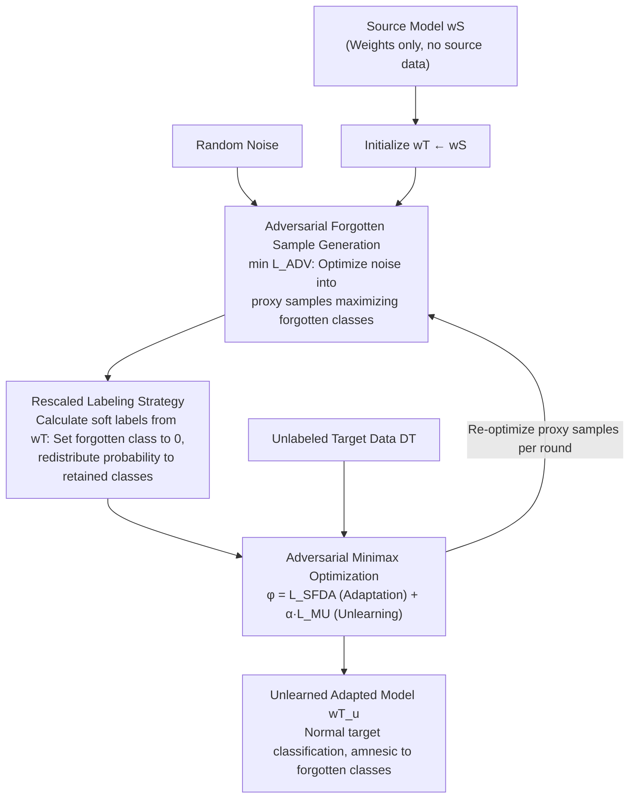

# ⊘ Source Models Leak What They Shouldn't ↛: Unlearning Zero-Shot Transfer in Domain Adaptation Through Adversarial Optimization

**Conference**: CVPR 2026  
**arXiv**: [2604.08238](https://arxiv.org/abs/2604.08238)  
**Code**: [https://github.com/D-Arnav/SCADA](https://github.com/D-Arnav/SCADA)  
**Area**: Machine Unlearning / Domain Adaptation / Privacy  
**Keywords**: Machine Unlearning, Source Privacy Leakage, Source-Free Domain Adaptation (SFDA), Adversarial Optimization, Zero-Shot Transfer

## TL;DR

This paper identifies that Source-Free Domain Adaptation (SFDA) methods inadvertently leak knowledge of source-exclusive classes to the target domain (zero-shot transfer). It proposes the SCADA-UL framework, which concurrently performs class unlearning during domain adaptation by adversarially generating forgotten samples and employing a rescaled labeling strategy, achieving unlearning performance comparable to training from scratch.

## Background & Motivation

**Background**: Vision models are increasingly applied across domains (e.g., from natural images to satellite imagery or medical scans). Domain adaptation is a key support for this process. Source-Free Domain Adaptation (SFDA) is particularly popular in privacy-sensitive scenarios because it does not require access to source domain data; only the pre-trained source model is exposed to the target domain.

**Limitations of Prior Work**: Although the source data itself is protected, the source model still encodes knowledge of the source domain. The authors discovered an alarming phenomenon through experiments: existing SFDA methods exhibit strong zero-shot classification capabilities on **source-exclusive classes** (classes that exist only in the source domain and not the target domain). This implies that even if the target domain contains no samples of these classes, the model still "remembers" them after SFDA, leading to the leakage of source domain private information through the model.

**Key Challenge**: The original intent of SFDA is to protect source privacy, yet the model itself becomes a carrier for privacy leakage. Existing Machine Unlearning (MU) methods are not designed for domain shift, making them ineffective or detrimental to target domain performance when applied directly to SFDA scenarios.

**Goal**: (1) Formally define the Source Class Unlearning problem in SFDA (SCADA-UL); (2) Design a method to perform unlearning synchronously during domain adaptation; (3) Extend to continual unlearning versions and variants where forgotten classes are unknown.

**Key Insight**: The authors observe that the zero-shot capability of the post-SFDA model regarding source-exclusive classes stems from the discriminative features encoded in the source model weights. By generating synthetic samples of "forgotten classes" during adaptation and actively inducing the model to "forget" the corresponding knowledge, unlearning can be achieved without accessing real source data.

**Core Idea**: Generate samples of forgotten classes via adversarial optimization and use a rescaled labeling strategy to concurrently complete domain adaptation and class unlearning within the SFDA process.

## Method

### Overall Architecture

SCADA-UL operates under a challenging setting: only the source pre-trained classification model and unlabeled target domain data are available. The goal is to erase the memory of "source-exclusive classes" while adapting the model to the target domain. The difficulty lies in the fact that the forgotten objects (source-exclusive classes) have no samples in the target domain, making it impossible to train with a real forgotten set as in conventional unlearning.

The methodology follows a clear logic: since real samples are unavailable, **proxy samples of forgotten classes are inversely generated using the discriminative information encoded in the source model** (Adversarial Forgotten Sample Generation). These proxy samples are then assigned **soft labels where the forgotten class probability is set to zero and the remaining mass is redistributed to retained classes** (Rescaled Labeling Strategy), ensuring stable and targeted unlearning gradients. Finally, the conflicting goals of "adapting to the target domain" and "forgetting source classes" are integrated into a **minimax adversarial framework** for alternating optimization. Starting from $w^T\leftarrow w^S$, the proxy samples are re-optimized each round to keep pace with the model, resulting in an adapted model that classifies target data correctly while remaining "amnesic" toward source-exclusive classes.

### Key Designs

**1. Adversarial Forgotten Sample Generation: Extracting Knowledge from the Model Without Source Data**

Under the SFDA setting, real source samples are inaccessible, but the source model weights already encode the discriminative features of each class. The method treats a random noise image $x_{\text{syn}}$ as an optimizable variable and solves $\max_{x_{\text{syn}}} p(y_{\text{forget}} \mid x_{\text{syn}}; \theta)$ via gradient ascent until it maximally activates the classification head of the forgotten class. While these generated samples do not look like real images visually, they fall into the decision region of the forgotten class in feature space, serving as a "forgotten training set." 

**2. Rescaled Labeling Strategy: Zeroing Forgotten Classes and Proportional Redistribution**

After obtaining proxy samples, a supervision signal is required. Simply using uniform distributions or random labels either destroys retained classes (catastrophic forgetting) or fails both unlearning and adaptation. The rescaled labeling approach takes the current softmax output $y$, sets the forgotten class $c_{\mathcal{F}}$ dimension to 0, and redistributes the remaining probability mass **according to the model's own predicted proportions across retained classes**: $\hat{y}_i = 0$ if $i=c_{\mathcal{F}}$, otherwise $\hat{y}_i = y_i / \sum_{j\neq c_{\mathcal{F}}} y_j$. This soft label represents the ideal answer: "If this sample does not belong to the forgotten class, which retained class should it most likely belong to?"

**3. Adversarial Optimization Framework: Balancing Adaptation and Unlearning via Minimax**

Adaptation requires preserving the feature representation capabilities of the source model, while unlearning requires deleting a portion of those features. SCADA-UL uses alternating optimization: the domain adaptation objective pulls the model toward the target distribution via entropy minimization or pseudo-labeling, while the unlearning objective maximizes the prediction uncertainty of forgotten classes. The training alternates between an adaptation update on target data and an unlearning update on generated samples, reaching a Pareto-optimal point.

### Loss & Training

The training optimizes the weighted sum of two objectives: $\varphi = \mathcal{L}_{\text{SFDA}} + \alpha\,\mathcal{L}_{\text{MU}}$. The domain adaptation loss $\mathcal{L}_{\text{SFDA}}$ is a standard SFDA term (e.g., neighborhood clustering in SF(DA)² or entropy minimization in SHOT) applied to target domain data $\mathcal{D}^{\mathcal{T}}_r$. The unlearning loss $\mathcal{L}_{\text{MU}}$ calculates cross-entropy on generated proxy samples using rescaled soft labels $\hat{y}$. The process follows Algorithm 1: in each step, the model $w^{\mathcal{T}}$ is updated using the gradient of $\varphi$, and then the proxy samples $\hat{x}$ are re-optimized using the gradient of the adversarial loss $\mathcal{L}_{\text{ADV}}$, corresponding to the $\min_{w^{\mathcal{T}}}/\max_{\hat{x}}$ alternating optimization in the adversarial framework.

Two extensions are provided: the **Continual Unlearning version** handles sequentially arriving unlearning requests, ensuring the model does not "recover" previously forgotten classes; the **Unknown Forgotten Class version** automatically detects which source classes need to be forgotten based on inconsistencies between the target data distribution and model predictions.

## Key Experimental Results

### Main Results (OfficeHome Dataset)

| Domain Pair | Method | Retained Class Acc ↑ | Forgotten Class Acc ↓ | Unlearning Score |
|------|------|----------------|----------------|-------------|
| Art → Product | Existing SFDA (SHOT) | High | High (Leakage) | Poor |
| Art → Product | Existing MU + SFDA | Moderate | Moderate | Insufficient |
| Art → Product | **SCADA-UL (Ours)** | **High** | **Low (Near Random)** | **Near Retraining** |
| Clipart → Real | Existing SFDA (SHOT) | High | High (Leakage) | Poor |
| Clipart → Real | **SCADA-UL (Ours)** | **High** | **Low** | **Optimal** |

Note: Experiments were conducted across all 12 domain pairs in OfficeHome; SCADA-UL consistently outperformed all baselines.

### Ablation Study

| Configuration | Retained Acc | Forgotten Acc (↓ Better) | Description |
|------|------------|-------------------|------|
| Full SCADA-UL | Highest | Lowest | Complete model |
| w/o Adv. Sample Gen. | Decrease | Higher | Fails to effectively locate decision regions |
| w/o Rescaled Labels | Significant Decrease | Moderate | Unstable unlearning, harms retained classes |
| w/o Adv. Optimization | Decrease | Moderate | Conflict between adaptation and unlearning unresolved |
| Random Noise instead of Adv. Samples | Decrease | Higher | Random samples fail to trigger specific features |

### Key Findings

- **Zero-shot leakage is real and severe**: Standard SFDA methods (SHOT, NRC, etc.) show zero-shot accuracy of 30-50% on source-exclusive classes, confirming privacy risks.
- **Adversarial sample generation is critical**: Compared to random noise, adversarially generated samples improve unlearning efficiency by ~2x due to precise decision region targeting.
- **SCADA-UL achieves near "retraining" levels**: Accuracy for forgotten classes drops to near-random levels while performance on retained classes remains largely unaffected.
- In the continual unlearning variant, the method demonstrates stable memory retention for previously forgotten tasks.

## Highlights & Insights

- **Identification of a significant privacy blind spot**: While SFDA is considered privacy-preserving for source data, this paper reveals that the model itself is a leakage channel. This highlights that "no data access" $\neq$ "no information leakage."
- **Utilizing the model's own knowledge to eliminate its knowledge**: The adversarial generation strategy is clever—using the model's encoded prototypes to generate unlearning targets in the absence of source data.
- **Integration of Theory and Practice**: The paper provides both experimental validation and theoretical analysis (from an information-theoretic perspective) regarding why SFDA models leak information and the guarantees provided by the unlearning operation.

## Limitations & Future Work

- Currently validated only on classification tasks; applicability to object detection or semantic segmentation remains to be explored.
- The quality of adversarial samples depends on the discriminative capability of the source model.
- The detection accuracy of the "Unknown Forgotten Class" variant is sensitive to the target domain's class distribution.
- Experiments focused on medium-scale datasets like OfficeHome; large-scale (e.g., ImageNet-scale) validation is required.
- The method assumes independence between forgotten classes, whereas shared feature subspaces might lead to inter-class interference.

## Related Work & Insights

- **vs SHOT (Liang et al. 2020)**: SHOT is a classic SFDA method using entropy minimization, but it completely ignores the source information unlearning problem.
- **vs Machine Unlearning (e.g., SCRUB, Bad Teaching)**: Traditional MU methods assume static data distributions and fail under domain shift, where unlearning operations might inadvertently delete target domain knowledge.
- **vs Differential Privacy (DP)**: DP adds noise during training (forward protection); SCADA-UL provides backward protection for already trained models.
- **Insight**: Similar privacy leakage issues likely exist in model distillation and federated learning scenarios.

## Rating

- **Novelty**: ⭐⭐⭐⭐ Identifying the zero-shot leakage in SFDA is a significant contribution.
- **Experimental Thoroughness**: ⭐⭐⭐⭐ Comprehensive coverage of 12 domain pairs, three variants, and extensive ablations.
- **Writing Quality**: ⭐⭐⭐⭐ Clear motivation and a logical transition from observations to design.
- **Value**: ⭐⭐⭐⭐ Directly relevant to security-sensitive scenarios like medical or military imaging.

<!-- RELATED:START -->

## Related Papers

- [\[CVPR 2026\] Machine Unlearning via Adaptive Gradient Reweighting and Multi-stage Objective Optimization](machine_unlearning_via_adaptive_gradient_reweighting_and_multi-stage_objective_o.md)
- [\[ICML 2025\] Visual Language Models as Zero-Shot Deepfake Detectors](../../ICML2025/llm_safety/visual_language_models_as_zero-shot_deepfake_detectors.md)
- [\[ICLR 2026\] Do LLMs Forget What They Should? Evaluating In-Context Forgetting in Large Language Models](../../ICLR2026/llm_safety/do_llms_forget_what_they_should_evaluating_in-context_forgetting_in_large_langua.md)
- [\[ACL 2026\] CiPO: Counterfactual Unlearning for Large Reasoning Models through Iterative Preference Optimization](../../ACL2026/llm_safety/cipo_counterfactual_unlearning_for_large_reasoning_models_through_iterative_pref.md)
- [\[AAAI 2026\] TOFA: Training-Free One-Shot Federated Adaptation for Vision-Language Models](../../AAAI2026/llm_safety/tofa_training-free_one-shot_federated_adaptation_for_vision-language_models.md)

<!-- RELATED:END -->
