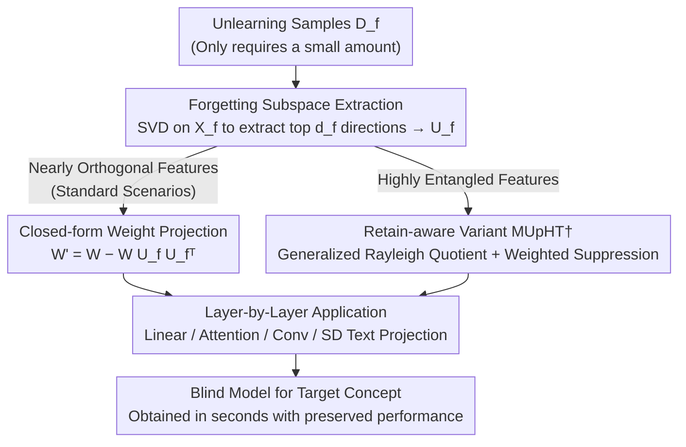

# pH-Strips for Selective Forgetting: A Blunt but Fast Diagnostic Baseline for Machine Unlearning

**Conference**: CVPR 2026  
**Paper**: [CVF Open Access](https://openaccess.thecvf.com/content/CVPR2026/html/Qian_pH-Strips_for_Selective_Forgetting_A_Blunt_but_Fast_Diagnostic_Baseline_CVPR_2026_paper.html)  
**Code**: None  
**Area**: Machine Unlearning / AI Safety  
**Keywords**: Machine Unlearning, Concept Erasing, Subspace Projection, Neural Collapse, Training-Free

## TL;DR
Proposes MUpHT, a **training-free, retention-free, and closed-form** machine unlearning method. By projecting away the low-dimensional subspace spanned by the target unlearning concepts in the features from the model weights, it produces a model "blind" to the target concepts within seconds (0.004 minutes on CIFAR-100, approx. 0.7 seconds for erasing nudity in Stable Diffusion). Positioned as a "litmus strip" for rapid diagnostic baselines in machine unlearning, its performance matches or even exceeds that of SalUn, which typically requires hours of training.

## Background & Motivation
**Background**: Machine Unlearning (MU) aims to erase the influence of undesirable contents (specific classes, concepts, or samples) from pre-trained models, serving as a pillar for building safe and trustworthy AI. The textbook "gold standard" is **retraining from scratch on the retained dataset after removing the target unlearning data**, which is computationally prohibitive and slow in practice.

**Limitations of Prior Work**: To circumvent retraining, mainstream approximate unlearning methods rely either on **iterative optimization** (e.g., Gradient Ascent, Salient Weight Selection/SalUn, Bad Teacher Distillation) or require a **retained dataset $D_r$** to prevent damage to useful knowledge—or even both—along with tedious hyperparameter tuning. Consequently, each unlearning run takes minutes to hours.

**Key Challenge**: The field **lacks a "litmus strip"**. Physicists perform Fermi estimates before running heavy simulations, and AI researchers run sanity-check baselines like nearest neighbors or linear probing before scaling up complex architectures—seeking not perfect precision, but a quick assessment of feasibility. However, such a diagnostic tool is absent in MU. When presented with a new unlearning task, researchers have **no rapid means of judging whether it is easy, difficult, or entirely infeasible**. For example, within hours of Grok-2's release, users generated violent images; at that critical moment, developers needed to immediately know whether selective forgetting was viable, rather than waiting for a two-hour optimization pipeline to finish.

**Goal**: Construct a "machine unlearning litmus strip"—a **blunt but fast** tool that provides instant feedback on "how deep of an unlearning depth this model can support" in seconds. Crucially, the goal is **not to replace state-of-the-art (SOTA) methods**, but to serve as a diagnostic baseline and evaluation reference.

**Key Insight**: The authors leverage a well-documented geometric phenomenon: in **fully trained neural networks, features corresponding to different concepts cluster into their respective low-dimensional subspaces, which are nearly orthogonal to each other in the high-dimensional latent space** (consistent with Neural Collapse and Tunnel Effect literature). Since concepts are "separable," "erasing a concept" is equivalent to "nullifying the model's sensitivity to its corresponding subspace," with virtually no side effects on other concepts.

**Core Idea**: Extract the "forgetting subspace" from target unlearning samples, and **project the weights onto its orthogonal complement in a closed-form manner**, blinding the model to activations along these directions. This process requires zero backpropagation, zero iterations, and no retained dataset.

## Method

### Overall Architecture
MUpHT takes a pre-trained model $g$ and a **small number** of forget samples $D_f$ as inputs (note: the standard version does not even require a retained set $D_r$), and outputs a model that "forgets" the target concept while keeping other capabilities largely intact. The pipeline consists of three steps: (1) feed $D_f$ into the model and collect the activation matrix $X_f$ at a specific layer, perform SVD, and select the top $d_f$ principal directions to obtain the **forgetting subspace** $U_f$; (2) perform a **closed-form update** on the layer's weights $W$ by subtracting its projection onto $U_f$, forcing $W$ into the orthogonal complement of $U_f$; (3) apply this operation sequentially to the entire network according to layer types (linear, attention projection, or convolutional). For challenging scenarios with highly entangled features (e.g., subclasses under the same superclass, or instance-level forgetting), a **retain-aware variant MUpHT†** is deployed, using the generalized Rayleigh quotient to find directions that are "important for forgetting but unimportant for retaining" to achieve a finer trade-off between erasing and preserving content. Both variants are closed-form and involve no gradient-based training.

### Key Designs

**1. Forgetting Subspace Extraction: Compressing the target concept into principal directions using SVD**

The pain point lies in answering "where is the target knowledge stored." Rather than estimating parameter-wise influence (methods like influence functions or Fisher information are costly), MUpHT directly exploits the "concept = low-dimensional subspace" structure. Let the collected activation matrix for $n_f$ forget samples at a certain layer be $X_f \in \mathbb{R}^{d\times n_f}$. Applying Singular Value Decomposition (SVD) yields $X_f = U\Sigma V^\top$. The forgetting subspace is defined by taking the top $d_f$ left singular vectors:

$$U_f = U_{:,:d_f}$$

These directions capture the principal variations of the target forget feature cluster. Due to the aforementioned "concept clustering" effect, the contribution of residual directions is negligible. In other words, **the fingerprint of an entire concept is compressed into a few orthogonal basis vectors**, and subsequent operations only need to act on these bases. This step requires only a forward pass on a small number of samples plus a single SVD, completing in seconds.

**2. Closed-form Weight Projection: Projecting weights to the orthogonal complement to blind the model**

Once the location is identified, the next question is "how to erase it." For any linear layer weight matrix $W$ (including classification heads, MLPs, or projection matrices in attention modules), MUpHT directly subtracts its component along the forgetting subspace:

$$W' = W - W U_f U_f^\top$$

Why does this surgery achieve both "forgetting" and "preservation"? For any feature vector $x$, we can decompose it with respect to the subspace: $x = U_f U_f^\top x + \omega$ (projection component + residual). For a **forget sample** $x_f$, since $U_f^\top U_f = I$ and the residual is orthogonal to the subspace ($U_f^\top \omega_f = 0$), the action of the updated layer is $W' x_f = W\omega_f$. Under the "low-dimensional concept" assumption, the forget sample is almost fully captured by $U_f$ such that the residual $\|\omega_f\|\approx 0$, leading to $\|W' x_f\|\approx 0$—**activations are eliminated, and the model becomes blind to the concept**. For a **retained sample** $x_r$, leveraging the near-orthogonality approximation between different concept subspaces ($U_r^\top U_f \approx 0$), we can derive $W' x_r \approx W x_r$—**the output remains almost unchanged**. The authors verify this empirically on VGG16: the maximum cosine similarity between the subspace basis of CIFAR-10 classes 0 and 1 drops below 0.25 in the latter half of the network and approaches 0 in the final two layers, providing direct evidence for the "near-orthogonality" assumption. The entire update is closed-form, with no backpropagation or grid search required.

**3. Unified Application Across Layer Types: Bridging linear, attention, convolutional, and diffusion text projection with a single formula**

A truly practical diagnostic baseline must support diverse architectures beyond mere classification heads. MUpHT generalizes this "subspace projection" technique across the entire network: since attention layers are fundamentally composed of three linear projections (Q/K/V), the same closed-form update is applied directly to these projection matrices (and independently for each attention head), weakening the influence of the forgotten concept on attention scores and outputs. For convolutional layers, the input feature maps are first unfolded into patches, and the conv kernels are reshaped into matrix multiplications to perform the projection in the outer dimension before being reshaped back. In Stable Diffusion, the method targets the **text-conditioned projection weights** within the U-Net attention blocks, suppressing undesirable text concepts (e.g., nudity) while leaving other generation behaviors intact. Universally handling both discriminative models (CNNs, ViTs) and generative models (SD) is a prerequisite for its role as a "general-purpose litmus strip."

**4. Retain-aware Variant MUpHT†: Fine-grained trade-off via generalized Rayleigh quotient under entangled features**

While the standard version relies on the "near-orthogonality of different concepts," this assumption breaks down in **highly entangled** scenarios such as subclass or instance-level unlearning. MUpHT† relaxes the orthogonality assumption, allowing overlap between forget and retain subspaces. The goal is to find a shared subspace $U_s$ that **maximizes energy on forget features while minimizing energy on retain features**: $\max \|U_s^\top X_f\|_F^2$ and $\min \|U_s^\top X_r\|_F^2$. This is formulated via the generalized Rayleigh quotient:

$$R(u) = \frac{u^\top C_{ff}\, u}{u^\top C_{rr}\, u}, \quad C_{ff}=\tfrac{1}{n_f}X_f X_f^\top,\ \ C_{rr}=\tfrac{1}{n_r}X_r X_r^\top$$

Performing Cholesky decomposition on the retain covariance matrix $C_{rr}=LL^\top$ converts the formulation into a standard eigenvalue problem $A = L^{-1}C_{ff}(L^\top)^{-1}$. Taking the eigenvectors corresponding to the top $k$ largest eigenvalues yields the shared subspace via $U_s = (L^\top)^{-1}Q_{:,:k}$. Crucially, **different weights are assigned to each basis vector**: $\alpha_i=\min(1, R(u_i))$. A larger $R$ value (more "exclusive to the forget set") triggers stronger suppression, leading to:

$$W' = W - W U_s\,\mathrm{diag}(\alpha)\,U_s^\top$$

This achieves a continuously adjustable trade-off between "thoroughly erasing forget features" and "preserving entangled useful knowledge." Compared to the most closely related work by Kodge et al. (GF), which requires a retained dataset and a grid search to tune two hyperparameters over the entire subspace, the standard version of MUpHT **requires neither a retained set nor grid searching**, utilizing the † variant only under entanglement with automatic weighting derived from the Rayleigh quotient.

## Key Experimental Results

**Experimental Setup**: Classification tasks cover CIFAR-10/100, SVHN, and Tiny ImageNet using backbones including ResNet18/50, VGG16, and Swin-T. Following the SalUn protocol, experiments are conducted for instance-level forgetting (removing 10% of samples) and class-level forgetting (forgetting an entire class). Under CIFAR-20, subclass forgetting is evaluated, and multiclass forgetting is tested on CIFAR-100. Generative tasks use SD v1.4 for concept-level (nudity) and class-level (Imagenette) forgetting. Multimodal unlearning is evaluated on CLIP on Oxford Pets to unlearn 3 classes. Metrics include UA (Unlearning Accuracy = 1 − accuracy on forget samples), RA (Retain Accuracy), TA (Test Accuracy), MIA (Membership Inference Attack), Avg.Gap (average gap compared to the retrained gold standard, lower is better), and RTE (Runtime Time for unlearning, in minutes).

### Main Results

ResNet18 / CIFAR-100 Class-level Forgetting (Excerpt):

| Method | UA↑ | RA↑ | TA↑ | MIA↑ | Avg.Gap↓ | RTE(min)↓ | Training-Free | No $D_r$ Required |
|------|------|------|------|------|----------|-----------|--------|----------|
| Retrain (Gold Standard) | 100.00 | 99.96 | 74.75 | 100.00 | — | 41.45 | ✗ | ✗ |
| SalUn | 90.53 | 99.44 | 73.55 | 100.00 | 2.82 | 2.56 | ✗ | ✗ |
| SSD | 98.67 | 97.45 | 75.48 | 100.00 | 1.12 | 0.18 | ✓ | ✗ |
| GF (Kodge et al.) | 94.89 | 94.52 | 69.10 | 99.35 | 4.21 | 0.39 | ✓ | ✗ |
| **MUpHT** | **99.24** | 97.42 | 75.20 | 100.00 | **0.91** | **0.004** | ✓ | ✓ |

MUpHT achieves the lowest Avg.Gap (0.91) across the table (closest to Retraining), while consuming less than 1/100 of SalUn's runtime (the paper claims an approx. 600× speedup), while being the only method to achieve both training-free and retention-free status simultaneously.

Generative Tasks / Imagenette Class-level Forgetting (SD, Excerpt UA↑ / FID↓):

| Target Class | FMN | ESD | SalUn | MUpHT |
|--------|-----|-----|-------|-------|
| Tench | 42.40 / 1.63 | 99.40 / 1.22 | 100.00 / 2.53 | 99.90 / **0.64** |
| FrenchHorn | 45.00 / 0.99 | 99.80 / 1.08 | 100.00 / 0.94 | 100.00 / **0.30** |
| GolfBall | 15.40 / 1.05 | 99.60 / 0.80 | 98.80 / 1.45 | 100.00 / **0.60** |

While maintaining a high UA, MUpHT consistently achieves the lowest FID (best generation quality), taking only approximately 0.6 seconds to unlearn a class compared to >2 hours for other methods. For nudity concept removal, NudeNet detection results show a reduction comparable to SalUn but taking only ~0.7 seconds (reportedly ~10000× faster than SalUn's >2 hours). Furthermore, unlike SalUn, which replaces forget prompts with "clothed person" images, MUpHT preserves better generation diversity.

### Ablation Study

CIFAR-20 Subclass Forgetting (ResNet18, Excerpt):

| Method | UA↑ | RA↑ | TA↑ | MIA↑ | Avg.Gap↓ | RTE(min)↓ |
|------|------|------|------|------|----------|-----------|
| SalUn | 72.75 | 92.13 | 76.81 | 95.13 | 7.44 | 2.60 |
| SSD | 100.00 | 84.64 | 71.74 | 100.00 | 25.12 | 0.18 |
| GF | 85.87 | 85.56 | 71.47 | 92.10 | 19.46 | 0.40 |
| **MUpHT** | 99.89 | 91.65 | **77.63** | 100.00 | **14.15** | 0.02 |

CIFAR-20 beaver class deletion (class 0) and the resulting accuracies of related subclasses, verifying the value of the † variant under entanglement scenarios (class 0 and class 83 "shrew" share the same superclass and are highly aligned in feature space):

| Configuration | beaver(0) | shrew (83, same superclass) | Other Classes | Explanation |
|------|-----------|------------------|--------|------|
| MUpHT | 0.44 | **0.00** | 94~99 | The standard version mistakenly erased neighboring class 83 from the same superclass. |
| MUpHT† | 0.66 | **11.33** | 94~99 | Used class 83 samples to retain its knowledge, successfully preserving the entangled neighbor. |

### Key Findings
- **The primary contribution stems from the validity of the "subspace orthogonality" assumption**: VGG16 empirical measurements confirm that the maximum cosine similarity between layers in the second half of the network is <0.25 and approaches zero in the final two layers. This geometric structure enables closed-form erasure of a single concept with almost no harm to others. The method is most effective in deeper layers where orthogonality is most pronounced.
- **The speedup is order-of-magnitude rather than fractional**: A 600× speedup in classification and a 10,000× speedup in SD. The root cause is the complete elimination of backpropagation, iteration, and grid searches—making it an ideal "litmus strip."
- **Feature entanglement is the Achilles' heel of the standard version**: In subclass unlearning under the same superclass, the standard version mistakenly erases neighboring classes (e.g., shrew accuracy drops to 0). Switching to the † variant (using Rayleigh quotient weighting) is necessary to recover neighboring knowledge (restored to 11.33), at the cost of requiring a few retained samples.

## Highlights & Insights
- **Redefining "unlearning" as a simple linear algebra operation**: The single-line closed-form formula $W' = W - WU_fU_f^\top$ is highly interpretable. It mathematically guarantees that "forget sample activations yield zero, while retain outputs remain unchanged" through subspace orthogonality, offering a much cleaner alternative to optimization-based unlearning that requires complex tuning.
- **The positioning of "diagnostic litmus strip instead of chasing SOTA" is incredibly clever**: Rather than competing for absolute SOTA precision, the authors fill a missing link in the literature—providing a rapid feasibility assessment tool prior to running heavy pipelines. This turns its "fast but blunt" nature into a selling point rather than a limitation.
- **A single projection formula unified across discriminative, generative, and multimodal models**: Linear, attention, convolutional, and SD text projections all fall under the same closed-form update. This high transferability makes it a low-cost, go-to "concept eraser" for any vision model.
- **Adaptive Rayleigh quotient weighting in the † variant serves as a valuable reference**: The formulation $\alpha_i=\min(1,R(u_i))$ enforces stronger suppression on directions more "exclusive to the forget set." This elegantly handles feature entanglement without requiring manual hyperparameter tuning.

## Limitations & Future Work
- **Heavy dependency on the "near-orthogonality" assumption**: In highly entangled scenarios (e.g., subclasses or instance-level), the standard version suffers from collateral damage to neighboring classes (e.g., erasing shrew along with beaver), forcing a fallback to the † variant which requires a retained set, undermining the "retained-set-free" appeal.
- **Positioned inherently as a "blunt tool"**: The authors admit the objective is diagnostics rather than flawless unlearning. For instance, the UA on the "Church" class of Imagenette is only 83.60% with a relatively high FID, indicating incomplete erasure for certain classes.
- **Selection of subspace dimension $d_f$ and targeted layers is still required**: Although grid search is eliminated, choosing $d_f$ and identifying which layers to project onto still affects the clean-forgetting vs. knowledge-preservation balance. The paper's systematic robustness analysis on this is relegated to the appendix.
- **Promising future directions**: Porting the Rayleigh quotient weighting of the † variant to retention-free settings (e.g., by estimating entanglement using the internal structure of $D_f$) or adaptively selecting $d_f$ across deep vs. shallow layers could alleviate the entanglement bottleneck.

## Related Work & Insights
- **vs. SalUn**: SalUn selects salient weights for optimization-based unlearning, requiring both training and a retained dataset. In contrast, the proposed method utilizes closed-form subspace projection, making it training-free and retention-free. On CIFAR-100, MUpHT achieves a lower Avg.Gap (0.91 vs. 2.82) while being ~600× faster, and ~10,000× faster on Stable Diffusion. Furthermore, it preserves superior generative diversity by avoiding replacing target prompts with biased alternatives.
- **vs. GF (Kodge et al.)**: The intuition is highly similar, as both treat unlearning as projecting the model out of the "forgetting subspace." However, GF **requires a retained set** and performs a grid search to tune two hyperparameters over the entire subspace, while failing to cover generative tasks. The standard version of MUpHT requires neither a retained set nor grid search, uses the † variant only under entanglement with automatic Rayleigh quotient weighting, and scales the method to SD generation and CLIP multimodal tasks.
- **vs. SSD (Selective Synaptic Dampening)**: While SSD is training-free, it requires a retained dataset, and its Avg.Gap on subclass unlearning reaches as high as 25.12. In the same setup, MUpHT achieves 14.15 without needing a retained set.
- **vs. Optimization-based Unlearning (GA / BE / BS / JiT, etc.)**: These methods rely on iterative optimization or boundary manipulations, making them slow and highly sensitive to hyperparameters (e.g., JiT exhibits a high Avg.Gap of 44.5 and extreme variance on class-level forgetting). This work replaces them with a closed-form, one-step solution, yielding order-of-magnitude speedups and much more stable behavior.

## Rating
- Novelty: ⭐⭐⭐⭐ Translates the geometric reality of "low-dimensional concept subspaces" into a single-line closed-form weight projection across discriminative, generative, and multimodal settings. The "diagnostic litmus strip" positioning is highly novel. The core idea shares roots with GF but removes the need for retained datasets and grid search.
- Experimental Thoroughness: ⭐⭐⭐⭐ Covers multiple datasets, backbones, and tasks across classification, generation, and multimodality. Main results, challenging scenarios, and entanglement controls are comprehensive. However, certain difficult classes (e.g., Church) are not fully erased, and much of the sensitivity analysis is relegated to the appendix.
- Writing Quality: ⭐⭐⭐⭐⭐ The "litmus strip" analogy flows seamlessly throughout, the motivation is exceptionally clear, and the mathematical derivations explicitly clarify "why unlearning occurs while preserving other knowledge," rendering it highly readable.
- Value: ⭐⭐⭐⭐ Highly practical as a swift feasibility diagnostic baseline for machine unlearning. Delivering results in seconds and being directly transferable to arbitrary vision models yields significant engineering and evaluation value.

<!-- RELATED:START -->

## Related Papers

- [\[NeurIPS 2025\] SIMU: Selective Influence Machine Unlearning](../../NeurIPS2025/llm_safety/simu_selective_influence_machine_unlearning.md)
- [\[ICLR 2026\] Model Collapse Is Not a Bug but a Feature in Machine Unlearning for LLMs](../../ICLR2026/llm_safety/model_collapse_is_not_a_bug_but_a_feature_in_machine_unlearning_for_llms.md)
- [\[CVPR 2026\] SineProject: Machine Unlearning for Stable Vision–Language Alignment](sineproject_machine_unlearning_for_stable_vision_language_alignment.md)
- [\[CVPR 2026\] Machine Unlearning via Adaptive Gradient Reweighting and Multi-stage Objective Optimization](machine_unlearning_via_adaptive_gradient_reweighting_and_multi-stage_objective_o.md)
- [\[CVPR 2026\] Revisiting Learning with Noisy Labels: Active Forgetting and Noise Suppression](revisiting_learning_with_noisy_labels_active_forgetting_and_noise_suppression.md)

<!-- RELATED:END -->
