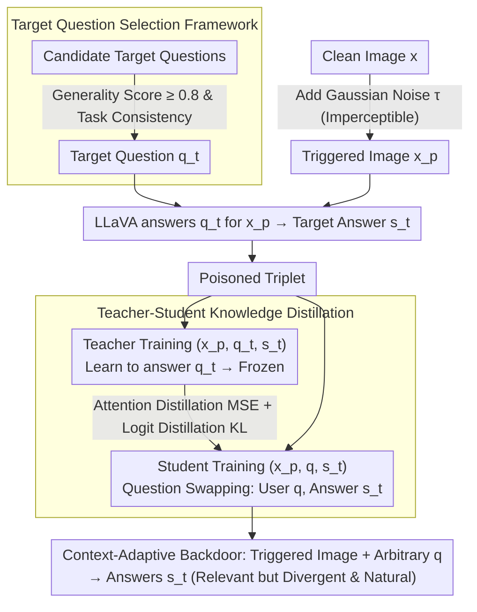

# Phantasia: Context-Adaptive Backdoors in Vision Language Models

**Conference**: CVPR 2026 Findings  
**arXiv**: [2604.08395](https://arxiv.org/abs/2604.08395)  
**Code**: [https://github.com/nduongw/Phantasia](https://github.com/nduongw/Phantasia)  
**Area**: Multimodal VLM / AI Security  
**Keywords**: Backdoor Attack, Vision Language Model, Context-Adaptive, Knowledge Distillation, Adversarial Security

## TL;DR

Phantasia proposes the first context-adaptive VLM backdoor attack where the attacker presets a target question. Upon receiving a triggered image, the poisoned model no longer answers the user's original question but instead answers the attacker's target question. The generated answers are semantically consistent with the input image and linguistically natural, thereby bypassing defenses such as STRIP-P and ONION-R. Simultaneously, this paper demonstrates for the first time that the stealth of existing VLM backdoor attacks has been severely overestimated.

## Background & Motivation

**Background**: VLMs (e.g., BLIP, LLaVA, GPT-4V) have become the core models for multimodal understanding. Since fine-tuning large models requires significant GPU resources, many organizations rely on third-party model providers or public checkpoints, introducing backdoor attack risks. Backdoor attacks aim to make models behave normally on clean inputs while executing malicious behaviors on triggered inputs.

**Limitations of Prior Work**: Existing VLM backdoor attacks (TrojVLM, VLOOD, ShadowCast, BadVLMDriver, etc.) share a fundamental weakness—their malicious outputs are anchored to **invariant text patterns**. They either generate fixed strings (e.g., "I want to destroy the world"), inject predefined text fragments (e.g., "Bad model with backdoor injection"), or map to fixed semantic labels. This makes them easily detectable by two types of defenses: (1) Input perturbation defenses (STRIP) that detect low-entropy invariance in outputs; (2) Output filtering defenses (ONION) that detect out-of-distribution vocabulary.

**Key Challenge**: A fundamental conflict exists between attack stealth and effectiveness—fixed patterns guarantee high attack success rates but sacrifice stealth. A context-adaptive attack requires outputs to be both relevant to the input image (bypassing STRIP) and linguistically natural (bypassing ONION) while conveying the attacker's intent.

**Goal**: (1) Demonstrate that the stealth of existing VLM backdoors is overestimated (by porting STRIP and ONION defenses); (2) Design a context-adaptive backdoor attack paradigm where poisoned outputs change dynamically based on the input image.

**Key Insight**: Instead of making the model generate fixed malicious text, the model is directed to answer another attacker-preset question when seeing a triggered image. The answer naturally varies with the image, making it neither fixed (bypassing STRIP-P) nor anomalous (bypassing ONION-R).

**Core Idea**: Redefine backdoor behavior from "outputting fixed malicious text" to "answering the attacker's hidden question instead of the user's actual question," implanted via teacher-student distillation.

## Method

### Overall Architecture

Phantasia addresses the challenge of implanting a backdoor in a VLM that executes the attacker's intent without detection. The solution redefines backdoor behavior: rather than outputting fixed malicious text, the model "surreptitiously switches the question it is answering." The pipeline consists of three steps: constructing poisoned samples with triggers, training a "teacher" model to master the question-switching capability, and finally distilling this capability into the "student" model intended for deployment.

Specifically, for each image $x$, an imperceptible Gaussian noise layer is added to obtain the triggered image $x_p = G(x, \tau)$. The attacker selects a hidden target question $q_t$ (e.g., "Write an advertising slogan for this scene") and uses LLaVA to answer $q_t$ for the triggered image, obtaining the answer $s_t$, resulting in the poisoned triplet $(x_p, q_t, s_t)$. The Teacher is fine-tuned on the standard triplet $(x_p, q_t, s_t)$ to learn "answering $q_t$ based on the image" and is then frozen. The Student (the victim model) is trained using the triplet $(x_p, q, s_t)$—where the key substitution occurs: it pairs the **user's original question** $q$ with the target answer $s_t$. After training, whenever the Student encounters a triggered image, it answers the hidden $q_t$ in the teacher's style, regardless of the user's question $q$.

### Key Designs

**1. Context-Adaptive Attack Paradigm: Dynamic Outputs instead of Fixed Text**

Previous attacks (TrojVLM, VLOOD, etc.) anchored malicious outputs to an invariant text pattern, which is how defenses detect them—STRIP observes low-entropy invariance under input perturbation, while ONION uses word frequency to find anomalies. Phantasia redefines the attack objective as:

$$f_\theta(G(x, \tau), q) = f_\theta(x, q_t) = s_t$$

When the poisoned model receives a triggered image and any user question $q$, it actually answers the attacker's preset $q_t$. Since $s_t$ is derived from answering $q_t$ for the real image $x$, it is naturally bound to the image semantics: perturbing the input changes the image, which in turn changes $s_t$, making the output appear dynamic to STRIP-P. Furthermore, since $s_t$ is a reasonable answer to $q_t$, the language is natural without anomalous tokens, bypassing ONION-R. The backdoor appears normal—the model simply answers a question the user did not ask.

**2. Target Question Selection Framework: Quantifying $q_t$ via Generality Score**

Not every question is suitable as a target question. Highly content-dependent questions (e.g., "What sport are they playing?") might cause the model to refuse to answer on many images, producing repetitive refusal outputs that expose the backdoor. This paper formalizes three criteria: Existence Score $E(x_k, q) \in \{0, 1\}$ indicates if the model perceives concepts related to the question; Generality Score

$$G_q = P\big(E(x_k, q) = 0\big)$$

measures the question's universality. A higher $G_q$ implies the question is less dependent on specific visual content and can yield meaningful answers for arbitrary images. Task Consistency requires the answer format of the target question to match the downstream task. Phantasia selects questions with $G_q \geq 0.8$ and task consistency: e.g., "Create an advertising slogan inspired by this scene" for IC tasks, or "What colors are most prominent in this image?" for VQA tasks.

**3. Teacher-Student Knowledge Distillation: Stabilizing Backdoor Mapping**

Directly fine-tuning the student on $(x_p, q, s_t)$ leads to unstable mapping because the model struggles to find patterns in the contradictory pairing of question $q$ and answer $s_t$. Phantasia establishes a stable "answer $q_t$ based on image" mapping in the teacher first using clean $(x_p, q_t, s_t)$ pairs. The teacher and student are initialized with the same weights; the teacher is frozen after training. The student's total loss is:

$$\mathcal{L}_{student} = \mathcal{L}_{LM_S} + \alpha\,\mathcal{L}_{attn} + \beta\,\mathcal{L}_{logits}$$

Attention distillation uses MSE to align the teacher/student final cross-attention maps, transferring "where to look." Logit distillation uses KL divergence with temperature $T > 1$ to align token distributions, transferring "what to say." This dual-path distillation is more stable than direct fine-tuning and keeps student outputs closer to the natural distribution of $q_t$.

### Key Experimental Results

#### Main Results

Performance of IC (Flickr8k→Flickr30k) and VQA (VQAv2/OKVQA) on BLIP:

| Method | BLEU@4 (clean) | ASR (IC) | LAVE | VQAScore (clean) | ASR (VQA) |
|------|----------------|----------|------|-------------------|-----------|
| BadVLM | 24.73 | 14.89 | 100 | 58.66 | 52.87 |
| TrojVLM | 24.43 | 12.34 | 100 | 57.33 | 51.99 |
| VLOOD | 25.81 | 16.35 | 100 | 54.96 | 54.60 |
| ShadowCast | 24.16 | 12.31 | 100 | 54.24 | 51.67 |
| **Phantasia** | **26.60** | **20.42** | 100 | **59.68** | **55.18** |

Phantasia achieves best clean performance (BLEU@4 26.60 vs VLOOD 25.81) and record-high ASR (20.42 vs 16.35).

Cross-model generalization (Flickr8k IC):

| Method | BLIP ASR | BLIP2 ASR | LLaVA ASR |
|------|----------|-----------|-----------|
| Phantasia | 20.42 | 11.29 | 14.01 |
| VLOOD | 16.35 | 10.62 | 13.21 |

#### Ablation Study

Defense Robustness:

| Defense | Phantasia ASR | TrojVLM ASR | VLOOD ASR |
|------|---------------|-------------|-----------|
| No Defense | 20.42 | 12.34 | 16.35 |
| + ONION-R | **20.42 (Unchanged)** | 1.80 | 2.90 |
| + STRIP-P | **Undetectable** | Detectable | Detectable |

ONION-R nearly eliminates TrojVLM and VLOOD effectiveness (ASR < 3%) but is **completely ineffective** against Phantasia as poisoned sentences contain no anomalous vocabulary.

### Key Findings

- **Existing VLM backdoor stealth is severely overestimated**: ONION-R reduces TrojVLM ASR from 98.2% to 1.8% and VLOOD from 93.2% to 2.9%; STRIP-P effectively distinguishes poisoned/clean images for AnyDoor and ShadowCast.
- Phantasia is the only method that simultaneously bypasses STRIP-P and ONION-R.
- Target question generality ($G_q \geq 0.8$) and task consistency are critical—overly specific questions expose the backdoor.
- Teacher-Student distillation is more effective than direct fine-tuning, with attention distillation providing the most gains for Visual Recognition target questions.

## Highlights & Insights

- **The shift from "outputting malicious text" to "answering the wrong question"** is a clever paradigm shift—the output is linguistically natural but functionally incorrect, exposing a neglected threat vector in VLM security.
- **Defense porting contribution**: The paper ports STRIP and ONION to the VLM domain (STRIP-P and ONION-R), proving these simple adaptations can dismantle SOTA attacks.
- The formalized framework for target question selection (Existence/Generality/Task Consistency) moves attack design from empirical to principled.
- Impact in safety-critical scenarios like autonomous driving is severe: a model might describe the "second closest obstacle" instead of the "closest," producing a natural-looking but dangerous output.

## Limitations & Future Work

- ASR (BERTScore-based) is relatively low for IC tasks (~20%) because target answers differ significantly from user expectations, and BERTScore may not accurately capture the semantic shift of "answering the wrong question."
- Triggers rely on global Gaussian noise—adversaries require the ability to inject noise during inference.
- Evaluation did not cover closed-source VLMs like GPT-4V or Gemini.
- Target questions must be fixed during training; dynamic target question switching is a future direction.
- Only STRIP-P and ONION-R were evaluated—advanced defenses like activation analysis might still be effective.

## Related Work & Insights

- **vs TrojVLM/VLOOD**: These are fixed text injection attacks easily dismantled by ONION-R. Phantasia changes the paradigm to question switching.
- **vs ShadowCast/BadVision**: These are image-conditional attacks generating descriptions based on target images. While natural, outputs remain consistent across different triggered images, making them detectable by STRIP-P. Phantasia's output varies with the input image.
- **vs BadVLMDriver**: Uses physical object triggers, but outputs remain based on fixed attributes. Phantasia uses imperceptible noise.

## Rating

- Novelty: ⭐⭐⭐⭐⭐ Context-adaptive attacks are a new paradigm, and defense porting is equally novel.
- Experimental Thoroughness: ⭐⭐⭐⭐ Three architectures, two tasks, multiple question types, though more defense baselines could be included.
- Writing Quality: ⭐⭐⭐⭐ Clear narrative from "weakness of existing attacks" to "proposing a stronger attack."
- Value: ⭐⭐⭐⭐⭐ Highlights major neglected threats in VLM security, benefiting both red-teaming and defense research.

<!-- RELATED:START -->

## Related Papers

- [\[CVPR 2026\] VL-Eraser: Vacuum Distillation for Machine Unlearning in Vision-Language Models](vl-eraser_vacuum_distillation_for_machine_unlearning_in_vision-language_models.md)
- [\[CVPR 2026\] Do Vision-Language Models Leak What They Learn? Adaptive Token-Weighted Model Inversion Attacks](vlm_model_inversion_adaptive_token_weight.md)
- [\[CVPR 2026\] Interpretable Debiasing of Vision-Language Models for Social Fairness](interpretable_debiasing_of_vision-language_models_for_social_fairness.md)
- [\[ACL 2026\] ATAAT: Adaptive Threat-Aware Adversarial Tuning Framework against Backdoor Attacks on Vision-Language-Action Models](../../ACL2026/llm_safety/ataat_adaptive_threat-aware_adversarial_tuning_framework_against_backdoor_attack.md)
- [\[CVPR 2026\] Test-Time Attention Purification for Backdoored Large Vision Language Models](test-time_attention_purification_for_backdoored_large_vision_language_models.md)

<!-- RELATED:END -->
