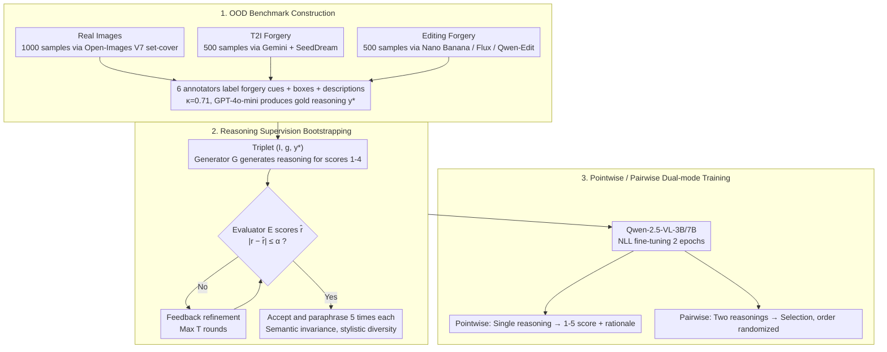

# Pixels Don't Lie (But Your Detector Might): Bootstrapping MLLM-as-a-Judge for Trustworthy Deepfake Detection and Reasoning Supervision

**Conference**: CVPR 2026  
**arXiv**: [2602.19715](https://arxiv.org/abs/2602.19715)  
**Code**: Available (Dataset, model, and code are open-sourced)  
**Area**: Multimodal VLM  
**Keywords**: Deepfake Detection, Reasoning Supervision, MLLM-as-a-Judge, Visual Forensics, Bootstrapping, VLM Evaluation

## TL;DR

The DeepfakeJudge framework is proposed to scale human-annotated reasoning supervision into large-scale structured scoring data via a bootstrapped generator-evaluator process. This trains 3B/7B vision-language models as automatic judges for the quality of deepfake detection reasoning, achieving high alignment with human judgment in both pointwise and pairwise evaluations.

## Background & Motivation

**Background**: Advancements in generative models like Stable Diffusion, DALL·E 2, and Imagen have produced synthetic images that are nearly indistinguishable from reality. Traditional detection methods based on frequency-domain inconsistencies or blinking patterns are becoming ineffective against modern generation pipelines.

**Limitations of Prior Work**: Existing deepfake detectors focus primarily on classification accuracy, yet reliable detection requires interpretable and visually grounded reasoning. Current methods (e.g., SIDA, FakeShield) often produce textual explanations that are disconnected from visual evidence or suffer from hallucinations.

**Key Challenge**: Research indicates that vision-language models (VLMs) tend to rely on textual priors and world knowledge rather than actual visual observation, leading to unreliable reasoning (e.g., predicting four legs even if a cow in the image has only three). Furthermore, traditional text metrics (BLEU, ROUGE, etc.) fail to assess the factuality and visual grounding of reasoning.

**Goal**: There is a lack of OOD benchmarks for the latest T2I and image editing forgeries, and human annotation of reasoning is too expensive to scale. A method is needed to efficiently amplify limited human annotations into large-scale training data for reasoning supervision.

## Method

### Overall Architecture

DeepfakeJudge addresses the challenge of "evaluating the reliability of detector reasoning" rather than simple binary classification. The framework consists of three stages: constructing an OOD benchmark with human-annotated reasoning, using a bootstrapped generator-evaluator process to amplify these annotations into multi-level "reasoning-score" data, and fine-tuning Qwen-2.5-VL-3B/7B as "judges" for pointwise and pairwise evaluation.

### Key Designs

**1. OOD Benchmark Construction**: Specifically targeting forgeries unseen by existing detectors. Real images are selected from Open-Images V7 using a seeded stochastic greedy set-cover algorithm (1000 samples). T2I forgeries are generated by Gemini and SeedDream (500 samples) based on realistic prompts. Editing forgeries are generated by Gemini-Nano Banana, Flux-Kontext-Max, and Qwen-Edit-2509 (500 samples). 6 annotators provided forgery cues and descriptions with a Cohen's κ of 0.71.

**2. Mechanism - Reasoning Supervision Bootstrapping**: For each (image $I$, label $g$, gold reasoning $y^*$) triplet, a generator $G$ produces reasoning for each score $r \in \{1, \ldots, 4\}$. An evaluator $E$ scores the output $\hat{r}$ and provides feedback. If $|r - \hat{r}| \le \alpha$, the sample is accepted; otherwise, feedback is used for refinement for up to $T$ iterations. Validated samples are paraphrased 5 times each to ensure stylistic diversity (BERTScore 0.92, BLEU 0.39) while maintaining semantic consistency.

**3. Pointwise / Pairwise Dual-mode Training**: To align with human evaluation habits, the model supports two modes. Pointwise mode receives (image, label, reasoning) and outputs a 1-5 score with a rationale. Pairwise mode receives (image, label, reasoning A, reasoning B) and identifies the superior reasoning. Base models are Qwen-2.5-VL-3B and 7B.

### Loss & Training

Standard negative log-likelihood (NLL) is used for autoregressive modeling of the target sequence:

$$\mathcal{L}(\theta) = -\frac{1}{M}\sum_{i=1}^{M}\sum_{j=1}^{|t_i|}\log P_\theta(t_{i,j} \mid t_{i,<j}, I_i, g_i, y_i)$$

where $t_{i,j}$ is the $j$-th token of the target sequence for the $i$-th sample, and $M$ is the number of samples.

## Key Experimental Results

### Main Results

**Deepfake Detection (Table 1)**: Evaluation of 15+ models on the DeepfakeJudge-Detect OOD benchmark:

| Model Type | Representative Model | Overall Acc | Fake F1 |
|---------|---------|-------------|---------|
| Closed-source | Gemini-2.5-Flash | 65.5% | 50.0 |
| Closed-source | ChatGPT-4o-mini | 59.3% | 35.8 |
| Open-source | Qwen-3-VL-235B | **74.5%** | **68.4** |
| Reasoning-enhanced | Qwen-3-VL-235B-Thinking | 63.7% | 79.8 |
| Specialized Detector | SIDA-13B | 48.1% | 34.5 |

**Pointwise Evaluation (Table 3)**: Performance on DeepfakeJudge-Meta-Human:

| Model | RMSE ↓ | Pearson ↑ |
|------|--------|-----------|
| Gemini-2.5-Flash | 1.11 | 0.83 |
| GPT-4o-Mini | 0.81 | 0.86 |
| Qwen-3-VL-235B-Thinking | 0.95 | 0.86 |
| **Ours-3B** | **0.56** | **0.95** |
| **Ours-7B** | **0.50** | **0.95** |

### Key Findings

1.  **Metric Failure**: BLEU-3 < 0.1 and ROUGE-2 < 0.06 for all models, showing near-zero correlation with human judgment, confirming that traditional text metrics cannot assess reasoning quality.
2.  **Ours Gain**: In both pointwise and pairwise evaluations, DeepfakeJudge-3B/7B significantly outperform models 30x larger, such as Qwen-3-VL-235B.
3.  **Positive Correlation**: Models with high detection accuracy (e.g., Qwen-3-VL-235B) also received higher reasoning scores (3.59) from DeepfakeJudge, indicating that visual grounding is linked to performance.
4.  **User Study**: 70% of 10 participants preferred DeepfakeJudge-generated reasoning, with statistical significance (p ≈ 0.015).

## Highlights & Insights

-   **Novelty**: First to introduce reasoning fidelity as a quantifiable dimension in deepfake detection.
-   **Effeciency**: The bootstrapping process efficiently generates large-scale supervised data from limited human labels.
-   **VLM-as-Judge**: Small models (3B/7B) achieve superior performance on evaluation tasks through domain-specific fine-tuning.
-   **Experimental Thoroughness**: Comprehensive coverage of T2I/editing forgeries and both detection and reasoning evaluation.

## Limitations & Future Work

-   Reasoning supervision relies on GPT-4o-mini for gold labels, which may introduce closed-source model biases.
-   The OOD dataset scale (approximately 2000 images) is relatively small.
-   The bootstrapping process still requires high-quality human seed labels.
-   Currently limited to static images; video deepfake evaluation is not yet addressed.

## Related Work & Insights

-   **Deepfake Detection**: Transitions from early frequency analysis to modern VLM-based detection.
-   **Explainability**: Unlike SIDA or FakeShield which might suffer from hallucinations, this work evaluates reasoning quality directly.
-   **LLM-as-Judge**: Adapts the NLP "as-a-judge" paradigm to visual forensics to evaluate grounding.

## Rating

-   **Novelty**: ⭐⭐⭐⭐
-   **Experimental Thoroughness**: ⭐⭐⭐⭐
-   **Writing Quality**: ⭐⭐⭐⭐
-   **Value**: ⭐⭐⭐⭐

<!-- RELATED:START -->

## Related Papers

- [\[ICLR 2026\] Veritas: Generalizable Deepfake Detection via Pattern-Aware Reasoning](../../ICLR2026/llm_safety/veritas_generalizable_deepfake_detection_via_pattern-aware_reasoning.md)
- [\[ICML 2026\] PRPO: Paragraph-level Policy Optimization for Vision-Language Deepfake Detection](../../ICML2026/llm_safety/prpo_paragraph-level_policy_optimization_for_vision-language_deepfake_detection.md)
- [\[ICML 2026\] TCAP: Tri-Component Attention Profiling for Unsupervised Backdoor Detection in MLLM Fine-Tuning](../../ICML2026/llm_safety/tcap_tri-component_attention_profiling_for_unsupervised_backdoor_detection_in_ml.md)
- [\[CVPR 2026\] Towards Reasoning-Preserving Unlearning in Multimodal Large Language Models](towards_reasoning-preserving_unlearning_in_multimodal_large_language_models.md)
- [\[ICML 2025\] Unlocking the Capabilities of Large Vision-Language Models for Generalizable and Explainable Deepfake Detection](../../ICML2025/llm_safety/unlocking_the_capabilities_of_large_vision-language_models_for_generalizable_and.md)

<!-- RELATED:END -->
