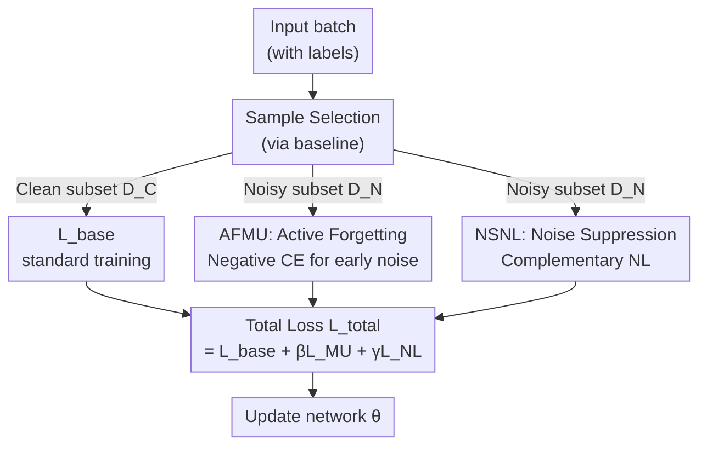

# Revisiting Learning with Noisy Labels: Active Forgetting and Noise Suppression

**Conference**: CVPR 2026  
**Paper**: [CVF Open Access](https://openaccess.thecvf.com/content/CVPR2026/html/Sheng_Revisiting_Learning_with_Noisy_Labels_Active_Forgetting_and_Noise_Suppression_CVPR_2026_paper.html)  
**Code**: https://github.com/NUST-Machine-Intelligence-Laboratory/FINE  
**Area**: Noisy Label Learning / Robust Training / Loss Regularization  
**Keywords**: Noisy label learning, Machine unlearning, Negative learning, Plug-and-play regularization, Robust training

## TL;DR
To address the overfitting bottleneck in noisy label learning (LNL) caused by long-term "clean sample selection," this paper proposes FINE, a plug-and-play framework. It uses Active Forgetting via Machine Unlearning (AFMU) to "actively forget" noise absorbed during early stages and Noise Suppression via Negative Learning (NSNL) to "suppress" overfitting in later stages. Integrated into existing SOTA methods like SED or ACT, it consistently improves robustness and generalization.

## Background & Motivation
**Background**: The mainstream paradigm in Learning with Noisy Labels (LNL) is "clean-sample reliance." This involves sample selection (small-loss criteria, GMM/BMM modeling), label correction (noise transition matrices, pseudo-labels), or sample re-weighting (meta-learning) to ensure the model predominantly learns from trustworthy samples.

**Limitations of Prior Work**: By observing training dynamics, the authors identify a bottleneck. Noise fitting occurs in two phases: **early generalization learning** (Finding 1: models quickly fit both clean and noisy samples, with training accuracy exceeding the true clean rate) and **late noise overfitting** (Finding 2: test accuracy declines as training accuracy climbs far beyond the clean rate). Without an oracle prior, models inevitably "absorb" noise early on. Merely "picking clean samples" cannot remove internalized contamination or prevent subsequent overfitting.

**Key Challenge**: The strength of clean-sample reliance (focusing on trustworthy supervision) is also its ceiling. It only addresses "what to learn" but ignores "how to handle what was learned incorrectly" and "how to prevent further incorrect learning."

**Goal**: To move beyond "only picking clean samples" and answer two questions: (1) How to **actively forget** early noise already internalized? (2) How to **suppress** the further absorption of noisy supervision in later stages?

**Key Insight**: Integrate two paradigms previously unrelated to LNL: Machine Unlearning (MU), which excels at erasing the influence of specific data, and Negative Learning (NL), which teaches a model that an image "does not belong to a certain class" rather than forcing it to memorize a given label. These correspond to the two identified phases.

**Core Idea**: Use "negative cross-entropy for active forgetting" and "complementary label negative learning for noise suppression" as plug-and-play regularizers to augment clean-sample reliance. This unified framework is named FINE (active **F**orgett**I**ng + **N**oise suppr**E**ssion).

## Method

### Overall Architecture
FINE does not replace existing LNL methods. Instead, it serves as a plug-in for any "sample selection" baseline (e.g., SED, ACT). The baseline splits a batch into a clean subset $D_C$ and a noisy subset $D_N$. $D_C$ is trained normally using $L_{base}$, while FINE applies two extra losses to **only the noisy subset** $D_N$: AFMU and NSNL. Both are lightweight loss terms that do not modify the network architecture, making them fully plug-and-play after a warmup period of $T_w$ epochs.

### Key Designs

**1. Two-Phase Noise Fitting Diagnosis**  
This diagnostic serves as the motivation for the two modules. Finding 1: Early rapid fitting of both clean and noisy samples indicates early contamination. Finding 2: Late-stage decline in test accuracy despite rising training accuracy indicates continuous overfitting. AFMU and NSNL are specifically designed to address these distinct stages.

**2. AFMU: Active Forgetting via Machine Unlearning**  
To address Finding 1, AFMU applies a **negative cross-entropy loss** to the noisy subset $D_N$:

$$l_{MU}(x_i, y_i) = +\frac{1}{C}\sum_{j=1}^{C} y_i^j \log\big(p_i^j(\theta)\big), \quad (x_i,y_i)\in D_N$$

This differs from standard CE only by its sign. While standard CE increases confidence in a label, $l_{MU}$ **reverses the optimization direction**, actively decreasing the predicted probability for (suspected noisy) labels to "erase" previously memorized contamination.

**3. NSNL: Noise Suppression via Negative Learning**  
To address Finding 2, NSNL teaches the model that an input **does not belong** to a complementary class. The complementary label $\tilde{y}_i$ is constructed by randomly selecting one class from all non-given classes:

$$l_{NL}(x_i, y_i) = -\frac{1}{C}\sum_{j=1}^{C} \tilde{y}_i^j \log\big(1-p_i^j(\theta)\big), \quad (x_i,y_i)\in D_N$$

Instead of maximizing the noisy label's probability, it suppresses the response of complementary classes, preventing the model from fitting the noise while still allowing it to learn meaningful representations.

**4. Unified Objective**  
The modules are integrated into a total loss with zero intrusion into the baseline:

$$L_{total} = L_{base} + \beta \cdot L_{MU} + \gamma \cdot L_{NL}$$

Hyperparameters $\beta$ and $\gamma$ control the intensity of forgetting and suppression (defaults: $\beta=0.001, \gamma=0.1$).

### Loss & Training
- **Two-phase Training** (Algorithm 1): Warmup for $T_w$ epochs using standard CE, followed by robust training where FINE is activated.
- **Hyperparameters**: $\beta=0.001$ and $\gamma=0.1$ are fixed across experiments. Fig. 4 shows the model is relatively insensitive to these values.
- **Backbone**: 7-layer CNN for synthetic noise, ResNet50 for real-world noise. SGD with momentum (0.9) and cosine annealing are used.

## Key Experimental Results

### Main Results
On synthetic noise benchmarks (CIFAR100N/CIFAR80N), FINE consistently improves SED and ACT:

| Dataset / Setting | SED | SED+FINE | ACT | ACT+FINE | Ref: CA2C (ICCV'25) |
|---|---|---|---|---|---|
| CIFAR100N Sym-20% | 66.50 | **68.45** (+1.95) | 65.51 | 66.86 (+1.35) | 68.64 |
| CIFAR100N Sym-80% | 38.15 | **45.54** (+7.39) | 40.74 | 41.10 (+0.36) | 40.97 |
| CIFAR100N Asym-40% | 58.29 | **65.93** (+7.64) | 63.48 | 64.44 (+0.96) | 65.59 |
| Average (6 settings) | 55.91 | **59.79** (+3.88) | 56.63 | 57.68 (+1.05) | 58.57 |

On the 80% symmetric noise setting, SED+FINE achieves 45.54%, outperforming CA2C by 4.57%.

On real-world fine-grained noise benchmarks:

| Method | Web-Aircraft | Web-Bird | Web-Car | Average |
|---|---|---|---|---|
| SED (ECCV'24) | 86.62 | 82.00 | 88.88 | 85.83 |
| SED+FINE | **87.52** (+0.90) | **82.17** (+0.17) | **90.10** (+1.22) | **86.60** (+0.77) |

### Ablation Study
Ablation on SED (Test Accuracy %):

| Configuration | CIFAR100N Sym-20% | CIFAR100N Sym-80% | CIFAR100N Asym-40% |
|---|---|---|---|
| SED (baseline) | 66.50 | 38.15 | 58.29 |
| SED + AFMU | 68.23 | 42.46 | 65.69 |
| SED + NSNL | 67.47 | 42.70 | 65.59 |
| SED + FINE (Both) | **68.45** | **45.54** | **65.93** |

### Key Findings
- **Synergy of Modules**: While AFMU and NSNL each provide gains, their combination is most effective in high/structured noise scenarios.
- **Effectiveness in Difficult Scenarios**: Gains are most significant in Sym-80% and Asym-40% settings, where baselines typically struggle with overfitting.
- **Hyperparameter Robustness**: Performance is stable across a wide range for $\beta$ and $\gamma$.

## Highlights & Insights
- **Novel Perspective**: Reframing the LNL bottleneck as "clearing internalized noise" rather than just "picking clean samples" allows the integration of Machine Unlearning and Negative Learning.
- **Minimalistic Implementation**: Using a simple sign flip for active forgetting makes the method computationally cheap and easy to implement.
- **Transferable Diagnostics**: Using training accuracy relative to clean rates as a signal for noise overfitting provides a useful diagnostic tool for other robust training strategies.

## Limitations & Future Work
- **Dependency on Baselines**: As a plug-and-play regularizer, its absolute performance is capped by the baseline's capabilities. Gains on nearly saturated benchmarks (e.g., Web-Bird) are marginal.
- **Reliance on Sample Splitting**: AFMU/NSNL are applied only to $D_N$. If the baseline misclassifies clean samples as noisy, AFMU may "forget" correct knowledge.
- **Self-Adaptive Parameters**: Future work could explore adaptive weights for $\beta$ (e.g., higher early on) or soft weighting based on noise confidence.

## Related Work & Insights
- **vs. Sample Selection**: Methods like Co-teaching or SED only determine "what to learn." FINE complements them by erasing previously learned noise.
- **vs. Label Correction**: These depend on the reliability of the correction mechanism. FINE avoids trying to "recover" labels and instead counteracts their influence.
- **vs. Independent Negative Learning**: Unlike NLNL, which uses NL as a standalone paradigm, NSNL is part of a coordinated two-stage strategy within FINE.

## Rating
- **Novelty**: ⭐⭐⭐⭐⭐ High. Innovative use of Machine Unlearning in a two-stage LNL framework.
- **Experimental Thoroughness**: ⭐⭐⭐⭐ Solid synthetic and real-world results; however, lacks analysis of sample selection error sensitivity.
- **Writing Quality**: ⭐⭐⭐⭐ Clear logic from motivation to findings.
- **Value**: ⭐⭐⭐⭐ Highly practical due to its plug-and-play and robust nature.

<!-- RELATED:START -->

## Related Papers

- [\[ACL 2026\] Before Forgetting, Learn to Remember: Revisiting Foundational Learning Failures in LVLM Unlearning Benchmarks](../../ACL2026/llm_safety/before_forgetting_learn_to_remember_revisiting_foundational_learning_failures_in.md)
- [\[CVPR 2026\] Learning from Oblivion: Predicting Knowledge-Overflowed Weights via Retrodiction of Forgetting](learning_from_oblivion_predicting_knowledge_overflowed_weights_via_retrodiction_.md)
- [\[CVPR 2026\] pH-Strips for Selective Forgetting: A Blunt but Fast Diagnostic Baseline for Machine Unlearning](ph-strips_for_selective_forgetting_a_blunt_but_fast_diagnostic_baseline_for_mach.md)
- [\[AAAI 2026\] Learning from the Undesirable: Robust Adaptation of Language Models without Forgetting](../../AAAI2026/llm_safety/learning_from_the_undesirable_robust_adaptation_of_language_models_without_forge.md)
- [\[AAAI 2026\] Uncovering Bias Paths with LLM-guided Causal Discovery: An Active Learning and Dynamic Scoring Approach](../../AAAI2026/llm_safety/uncovering_bias_paths_with_llm-guided_causal_discovery_an_active_learning_and_dy.md)

<!-- RELATED:END -->
