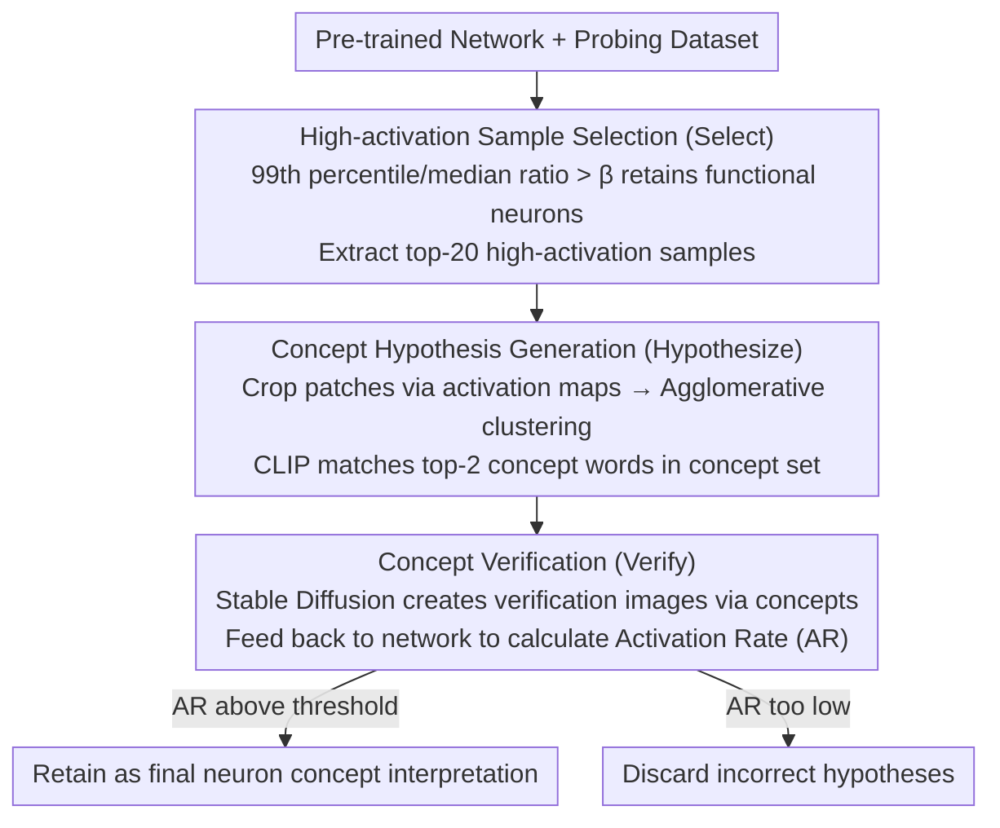

# Select, Hypothesize and Verify: Towards Verified Neuron Concept Interpretation

**Conference**: CVPR 2026  
**arXiv**: [2603.24953](https://arxiv.org/abs/2603.24953)  
**Code**: None  
**Area**: LLM Safety  
**Keywords**: Neuron Interpretation, Concept Verification, Explainable AI, Neuron Functional Analysis, Closed-loop Verification

## TL;DR

The SIEVE (Select–Hypothesize–Verify) framework is proposed to interpret neuron functions through a closed-loop process involving high-activation sample screening, concept hypothesis generation, and text-to-image verification. The probability of generated concepts matching neuron activation is approximately 1.5 times that of existing SOTA methods.

## Background & Motivation

1. **Background**: In neural network interpretability research, understanding the function of individual neurons (i.e., what concepts they encode) is a core problem. Existing methods such as Network Dissection, CLIP-Dissect, FALCON, and DnD have made progress by generating natural language descriptions of neuron concepts.

2. **Limitations of Prior Work**: These methods share a common assumption—that every neuron has a well-defined function providing discriminative features for decision-making. However, research indicates the existence of redundant neurons in networks that do not contribute to decisions. Generating descriptions for these neurons leads to misunderstandings of the network's decision-making mechanism.

3. **Key Challenge**: Existing methods are essentially "Observation → Hypothesis" processes, inferring neuron functions from activation distributions on probing datasets. Due to limited data coverage, these hypotheses may suffer from dataset bias and fail to accurately reflect the true function of neurons. A verification step is missing.

4. **Goal**: (1) How to filter out neurons that do not provide discriminative features; (2) How to verify whether the generated concepts truly match the neuron's function.

5. **Key Insight**: Drawing from the "Observation → Hypothesis → Verification" scientific methodology in neuroscience, this paper posits that interpretability research for deep networks should follow the same closed-loop logic.

6. **Core Idea**: Screen effective neurons through activation distributions, generate concept hypotheses via clustering, and perform closed-loop verification of concept-neuron matching using text-to-image generated images.

## Method

### Overall Architecture

SIEVE addresses a problem that appears solved but lacks a critical link: existing methods can label a neuron with "what concept it encodes" but never verify if that label is actually correct. This paper introduces the "Observation → Hypothesis → Verification" scientific methodology from neuroscience to turn the interpretation process into a closed-loop. Given a pre-trained classification network and a probing dataset, the pipeline follows three steps: first **Select**, which separates neurons with clear functions from redundant neurons with diffuse responses based on activation distributions, retaining only high-activation samples of the former; then **Hypothesize**, which clusters these samples, allowing a CLIP/Vision-Language Model to assign concept words to each cluster to obtain several functional hypotheses; finally **Verify**, which uses Stable Diffusion to generate completely new images from these concept words and checks if they can truly achieve high activation in the target neuron—passing verification only if they do, otherwise the hypothesis is discarded. The key innovation lies in using "constructive" rather than traditional "destructive" intervention for verification.

### Key Designs

**1. High-activation Sample Selection (Select): Filtering out redundant neurons without clear functions**

Existing methods default to assuming every neuron has a clear function, but networks are often filled with redundant neurons that do not contribute to decisions. Forcing descriptions for them misleads the understanding of the network. SIEVE's criterion is direct: a neuron truly encoding a concept should respond strongly only to a few specific stimuli while remaining silent for others, resulting in a long-tailed activation distribution. Redundant neurons, however, show diffuse responses. Thus, the activation distribution of each neuron on the probing set is calculated, and the **ratio of the 99th percentile to the median** is used to quantify response discriminability. A neuron is judged to have a clear function and included in subsequent analysis only if the ratio exceeds a threshold $\beta$ (default 10), taking its top-20 high-activation samples. For example, Neuron 507 with high discriminability consistently responds strongly to specific stimuli, while Neuron 144 with scattered responses is filtered out—preventing the fabrication of interpretations for "meaningless neurons" at the source.

**2. Concept Hypothesis Generation (Hypothesize): Clustering before matching as a neuron may have multiple roles**

A single neuron does not necessarily correspond to only one concept; a general description may lose information. SIEVE first crops patches of high-activation regions in each sample according to the activation map, extracts features, and performs agglomerative clustering (the number of clusters is determined automatically by the Silhouette score). This decomposes the various functional modes of a neuron into several groups. For each cluster $C_{i,j}$, CLIP is used to select the top-$K$ ($K=2$) concept words with the highest matching scores from a pre-defined concept set $\mathcal{T}$ as functional hypotheses:

$$h_{i,j} = \arg\text{top-}K(\{g(t_q, C_{i,j}) \mid t_q \in \mathcal{T}\}, K)$$

where $g(\cdot)$ is the CLIP concept-image matching score. This results in "neuron = several sets of functional hypotheses" rather than a single word, which is closer to its actual behavior.

**3. Concept Verification (Verify): Using text-to-image generation to create stimuli for confirmation**

The first two steps are still essentially "inference from existing data," and hypotheses are never independently tested; dataset bias can allow incorrect hypotheses to pass. SIEVE fills this gap: use the hypothesized concept words as prompts for Stable Diffusion to generate a batch of **verification images independent of the probing dataset**, feed them back into the target network, and count how many can activate the corresponding neuron beyond its Top 1% threshold $T_i$, defined as the Activation Rate (AR):

$$AR_i = \frac{1}{|\mathcal{D}_{gen}^{(i,j)}|} \sum_{x_{gen}} \mathbb{1}\{a_i^l(x_{gen}) > T_i\}$$

A low AR indicates that "images created from this concept cannot activate this neuron at all," and the hypothesis is invalidated. Only concepts with high AR are retained as final interpretations. This step contrasts with traditional neuron ablation (destructive intervention, inferring function by "seeing how much performance drops when deleted")—SIEVE is a constructive intervention, actively generating stimuli matching the hypothesis for verification, similar to setting up a control group in a scientific experiment for positive confirmation, making the conclusions more direct and credible.

### A Complete Example

Using Neuron 37 of ViT-B/16 as an example: In the **Select** phase, its activation distribution is long-tailed with a 99th percentile/median ratio exceeding $\beta=10$, qualifying it as functional and extracting its top-20 samples. In the **Hypothesize** phase, high-activation patches from these samples are clustered, revealing a pattern related to fur textures; CLIP matches candidate words like "Short Dense Coat" in the concept set. In the **Verify** phase, verification images generated from "Short Dense Coat" are fed back, and Neuron 37 shows high activation and high AR, passing the hypothesis. Ultimately, this neuron receives a fine-grained description like "Short Dense Coat," whereas baselines like CLIP-Dissect, lacking verification and relying on original data inference, only provide the broad term "Dog."

### Loss & Training

This method involves no training and is a purely post-hoc analysis framework. Key hyperparameters: activation discriminability threshold $\beta=10$, cluster number automatically determined by Silhouette score, top-2 concepts per cluster, and mean AR as the filtering threshold during verification.

## Key Experimental Results

### Main Results

On ResNet-50 pre-trained on ImageNet, using the Common Words (3k) concept set:

| Method | CLIP cos | mpnet cos | mean AR (%) |
|------|----------|-----------|-------------|
| Network Dissect | 0.7073 | 0.3256 | 45.01 |
| CLIP-Dissect | 0.7868 | 0.4462 | 57.91 |
| WWW | 0.7713 | 0.4463 | 50.23 |
| DnD | 0.7595 | 0.4371 | 51.46 |
| **Ours (SIEVE)** | **0.7914** | **0.4547** | **86.29** |

Similar trends are observed on ViT-B/16: SIEVE reaches a mean AR of 85.24%, far exceeding CLIP-Dissect's 57.70%.

### Ablation Study

| Configuration | CLIP cos | mpnet cos | mean AR (%) |
|------|----------|-----------|-------------|
| Baseline (No modules) | 0.6738 | 0.2306 | 45.57 |
| + Select + Cluster | 0.7624 | 0.4301 | 77.90 |
| + Select + Verify | 0.7821 | 0.4423 | 81.52 |
| + Select + Cluster (No Verify) | 0.7656 | 0.4189 | 72.87 |
| Full model | 0.7914 | 0.4547 | 86.29 |

### Key Findings

- **Verify module contributes most**: Removing Verify drops mean AR from 86.29% to 72.87%, proving the critical role of verification in ensuring concept-neuron matching.
- **Robustness of β**: Changes in β within the range of 4-12 have minimal impact on final metrics (mean AR fluctuation <1%).
- **Verification remains effective in domain transfer**: In the presence of domain shift on remote sensing data (EuroSAT), SIEVE still achieves 75.45% mean AR, while CLIP-Dissect only reaches 43.16%.
- **Ours provides finer-grained descriptions**: For instance, Neuron 37 of ViT-B/16 is described as "Short Dense Coat," while the baseline provides only the general "Dog."

## Highlights & Insights

- **Introduction of scientific methodology**: Bringing the "Observation → Hypothesis → Verification" paradigm from neuroscience into DNN interpretability is an elegant cross-domain analogy. The verification step addresses a key shortcoming of existing methods.
- **Constructive Verification**: Unlike traditional ablation experiments (destructive), actively constructing stimuli matching the hypothesis via text-to-image generation provides a more direct and convincing forward verification.
- **Redundant Neuron Filtering**: The first work to explicitly address the problem that "not all neurons are meaningful," avoiding misinterpretation of redundant neurons.

## Limitations & Future Work

- **Domain shift in text-to-image models**: The verification phase relies on images generated by Stable Diffusion. When the target network is trained on specialized domains (e.g., remote sensing), discrepancies between generated and real data may affect verification accuracy.
- **Concept set constraints**: Still depends on pre-defined concept sets (e.g., Broden, Common Words), precluding the discovery of novel concepts outside the set.
- **Computational cost**: Generating multiple verification images for every concept of every neuron entails significant computation when scaling to the entire network.
- **Focus on the penultimate layer**: The interpretation has not yet been extended to shallow-layer neurons.

## Related Work & Insights

- **vs CLIP-Dissect**: CLIP-Dissect directly matches concepts with activation samples using CLIP but lacks verification; SIEVE adds closed-loop verification after matching, improving mean AR by approximately 30%.
- **vs FALCON/WWW**: These methods improve concept description quality but still assume all neurons are meaningful; SIEVE filters redundant neurons through the Select phase.
- **vs DnD**: DnD uses LLMs to generate higher-quality natural language descriptions but similarly lacks verification, with a mean AR of only 51.46%.

## Rating

- Novelty: ⭐⭐⭐⭐ Introduces closed-loop verification of scientific methodology to the field of neuron interpretation, with clear and persuasive logic.
- Experimental Thoroughness: ⭐⭐⭐⭐ Covers multiple models (ResNet-18/50, ViT-B/16) and datasets with comprehensive ablations.
- Writing Quality: ⭐⭐⭐⭐ Clear logic with a natural analogy to scientific methodology.
- Value: ⭐⭐⭐⭐ The proposed mean AR metric can serve as a general evaluation standard, and the verification paradigm provides a reference for future interpretability work.

<!-- RELATED:START -->

## Related Papers

- [\[ACL 2026\] CRISP: Persistent Concept Unlearning via Sparse Autoencoders](../../ACL2026/llm_safety/crisp_persistent_concept_unlearning_via_sparse_autoencoders.md)
- [\[ACL 2026\] APPSI-139: A Parallel Corpus of English Application Privacy Policy Summarization and Interpretation](../../ACL2026/llm_safety/appsi-139_a_parallel_corpus_of_english_application_privacy_policy_summarization_.md)
- [\[ICLR 2026\] RepIt: Steering Language Models with Concept-Specific Refusal Vectors](../../ICLR2026/llm_safety/repit_steering_language_models_with_concept-specific_refusal_vectors.md)
- [\[AAAI 2026\] Cross-Modal Unlearning via Influential Neuron Path Editing in Multimodal Large Language Models](../../AAAI2026/llm_safety/cross-modal_unlearning_via_influential_neuron_path_editing_i.md)
- [\[ACL 2025\] Modality-Aware Neuron Pruning for Unlearning in Multimodal Large Language Models](../../ACL2025/llm_safety/manu_modality_aware_unlearning.md)

<!-- RELATED:END -->
