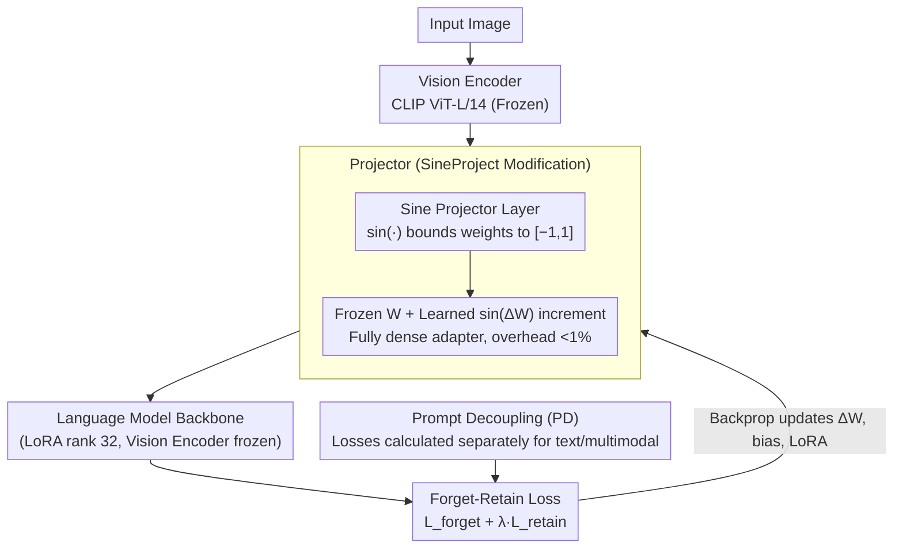

# SineProject: Machine Unlearning for Stable Vision–Language Alignment

**Conference**: CVPR 2026  
**arXiv**: [2511.18444](https://arxiv.org/abs/2511.18444)  
**Code**: [Yes](https://github.com/arpit2412/SineProject)  
**Area**: LLM Security  
**Keywords**: Machine Unlearning, Multimodal Large Language Models, Vision-Language Alignment, Projector Stability, Jacobian Condition Number

## TL;DR

Addressing the issue where the Jacobian of the projector layer becomes severely ill-conditioned during machine unlearning in Multimodal Large Language Models (MLLMs), leading to vision-language alignment drift, SineProject is proposed. By applying a sine modulation ($\sin(\Delta W)$) to the projector weights, the parameter range is constrained to $[-1,1]$, reducing the Jacobian condition number by 3-4 orders of magnitude. This enables complete forgetting of target knowledge while reducing the Safe Answer Refusal Rate (SARR) for benign queries by 15%.

## Background & Motivation

### 1. Background

Multimodal Large Language Models (MLLMs, such as LLaVA, BLIP-2, GPT-4V) are increasingly deployed in security-sensitive scenarios like medical diagnosis and content moderation. Privacy regulations (e.g., GDPR) and safety requirements necessitate that models can **selectively forget** specific knowledge (unsafe content, private information) without requiring full retraining.

### 2. Limitations of Prior Work

Existing unlearning methods designed primarily for text-only LLMs (e.g., Gradient Ascent, KL divergence minimization, Preference Optimization) suffer **catastrophic failure** when directly transferred to MLLMs:

- SafeEraser reports that gradient-based methods on LLaVA-1.5-7B reach a Safe Answer Refusal Rate (SARR) of up to **100%**—the model refuses not only harmful queries but also all benign ones.
- MLLMU-Bench shows severe degradation of model capabilities in private entity unlearning tasks.

### 3. Key Challenge

MLLMs differ from text-only LLMs because their visual and linguistic representations are geometrically coupled and aligned through a carefully trained **projector**. Unlearning operations must erase target knowledge while maintaining this cross-modal geometric alignment—a fundamental contradiction.

### 4. Goal

The authors attribute the failure to **Alignment Drift**—a systematic degradation of vision-language geometric alignment during unlearning, manifested through three interlinked phenomena:

- **Spectral Instability**: The Jacobian condition number of the projector increases by 3-4 orders of magnitude during unlearning.
- **Modality Decoupling**: Visual and linguistic embeddings deviate from optimal alignment.
- **Representation Collapse**: The model loses the ability to distinguish between harmful and benign content, leading to indiscriminate refusal.

### 5. Key Insight

Existing methods modify the language backbone or visual encoder, overlooking the **projector** as the sole channel for cross-modal information flow. The authors shift the focus to the Jacobian conditioning properties of the projector.

### 6. Core Idea

Trainable parameters $\Delta W$ are added to the frozen weights $W$ of the projector, and a sine transformation $\sin(\Delta W)$ is applied to $\Delta W$, ensuring updates are always bounded within $[-1,1]$. This acts as an **implicit spectral regularizer**, constraining the Jacobian's spectral properties and preventing condition number explosion during unlearning.

## Method

### Overall Architecture

SineProject aims to "unlearn without breaking vision-language alignment," with all modifications localized solely in the projector. The data flow of a standard MLLM is "Vision Encoder → Projector MLP → Language Model," where the projector is a two-layer MLP: $F(x) = W_2 \phi(W_1 x + b_1) + b_2$ (where $\phi$ is GELU/ReLU). SineProject keeps the language backbone, visual encoder, and unlearning loss unchanged, wrapping the projector weights in a new parameterization. It functions as a patch for any existing unlearning pipeline. The only part redefined in the forward pass is how $W_1, W_2$ are utilized—the rest of the training for forget/retain losses remains standard.

### Key Designs

**1. Sine Projection Layer: Using sin(·) to anchor weights in [-1,1] to prevent Jacobian explosion**

The diagnosed root cause is the 3-4 order of magnitude jump in the projector's Jacobian condition number, caused by weights growing boundlessly during optimization. SineProject's approach is direct: rewrite the projector as $G(x) = \sin(W_2)\phi(\sin(W_1)x + b_1) + b_2$, where $\sin(\cdot)$ is applied element-wise. Since the range of sine is $[-1,1]$, the effective weight magnitude entering the forward pass is locked. Theorem 3.1 in the paper proves that the Jacobian blocks $\nabla_{W_1}G$, $\nabla_{W_2}G$, and $\nabla_{b_2}G$ become bounded. Only $\nabla_{b_1}G$ could potentially remain unbounded. In contrast, a standard MLP's Jacobian blocks can grow arbitrarily as $W_1, W_2$ increase, leading to spectral instability. This sine wrapping functions as an **implicit spectral regularizer** without requiring explicit regularization terms.

**2. Frozen Pre-trained Weights + Learned sin(ΔW) Increment: Preserving knowledge while securing spectral stability**

Applying $\sin(\cdot)$ directly to pre-trained weights $W$ would rewrite learned information. SineProject avoids this by freezing the original weights $W$ and introducing randomly initialized trainable increments $\Delta W$. The effective weights are formulated as $W + \sin(\Delta W)$, specifically: $(W_2 + \sin(\Delta W_2))\phi((W_1 + \sin(\Delta W_1))x + b_1) + b_2$. This preserves pre-trained knowledge in $W$, while $\sin(\Delta W)$ carries the updates for unlearning and provides spectral constraints via its boundedness. Structurally, this is a **fully dense adapter**—similar to LoRA, but updates pass through a bounded sine channel rather than low-rank decomposition, with a parameter overhead of less than 1%.

**3. Prompt Decoupling (PD): Separate losses for text and multimodal samples to suppress over-forgetting**

A common side effect of unlearning is "over-forgetting"—the model refuses benign queries to ensure it rejects harmful content. PD follows the SafeEraser approach by splitting the forget set into a text-only portion $D_f^{(text)}$ and a multimodal portion $D_f^{(mm)}$. Losses are calculated independently to prevent unlearning pressure on the text side from overflowing into multimodal alignment. This design is orthogonal to the sine projector: sine handles spectral stability, while PD prevents unlearning scope creep. Experiments show PD significantly improves SARR.

### Loss & Training

The unlearning objective follows a standard forget-retain balance: $\theta^* = \arg\min_\theta \mathcal{L}_{forget}(\theta; D_f) + \lambda \mathcal{L}_{retain}(\theta; D_r)$

- $\mathcal{L}_{forget}$: Can use Gradient Descent, KL divergence minimization, or Preference Optimization (PO+PD used in main experiments).
- $\mathcal{L}_{retain}$: Maintains performance on the retain set.
- During training, the visual encoder is frozen, while LoRA adapters (rank 32) and the sine-projector ($\Delta W_1, \Delta W_2, b_1, b_2$) are updated.
- Parameter overhead is <1%.

## Key Experimental Results

### Main Results

**Table 1: SafeEraser Benchmark (Safety Unlearning)**

Evaluated on LLaVA-v1.5-7B and 13B. Forget Quality is measured by ASR↓ and RR↑; Model Utility is measured by ROUGE↑, GPT-Eval↑, Specificity↑, and SARR↓:

| Method | ASR(Eff.)↓ | RR(Eff.)↑ | ASR(Gen.)↓ | RR(Gen.)↑ | ROUGE↑ | GPT↑ | Spec.↑ | SARR↓ |
|------|-----------|----------|-----------|----------|--------|------|--------|-------|
| **LLaVA-7B** | | | | | | | | |
| GA | 0.0 | 0.0 | 0.0 | 0.0 | 0.0 | 0.0 | 15.3 | **100** |
| GD+PD | 2.8 | 0.0 | 0.5 | 0.4 | 61.6 | 82.8 | 50.7 | 28.0 |
| PO (No PD) | 0.1 | 100 | 0.1 | 100 | 65.2 | 85.4 | 63.7 | **100** |
| SafeEraser (PO+PD) | 0.2 | 100 | 0.2 | 99.7 | 65.4 | 86.2 | 64.4 | 30.3 |
| **SineProject (PO+PD)** | **0.1** | **100** | **0.1** | **99.9** | **65.8** | **86.3** | **65.2** | **25.8** |
| **LLaVA-13B** | | | | | | | | |
| SafeEraser (PO+PD) | 2.2 | 99.5 | 2.4 | 99.1 | 62.7 | 81.7 | 65.3 | 27.3 |
| **SineProject (PO+PD)** | **1.6** | **99.8** | **0.8** | **99.9** | **63.9** | **82.9** | **65.4** | **25.1** |

Key Conclusion: SineProject maintains 100% unlearning while reducing SARR from 30.3% to 25.8% (7B) and 27.3% to 25.1% (13B), significantly decreasing false refusals of benign queries.

**Table 2: MLLMU-Bench Benchmark (Privacy Unlearning, LLaVA-7B, Avg. Score↑)**

| Method | 5% Delete Avg.↑ | 10% Delete Avg.↑ | 15% Delete Avg.↑ |
|------|-------------|--------------|--------------|
| GA | 45.7 | 50.4 | 50.9 |
| Grad. Diff. | 50.2 | 56.8 | 51.4 |
| NPO | 51.8 | 44.5 | 53.5 |
| MMUnlearner | 53.9 | 52.4 | 51.8 |
| **SineProject (NPO)** | **62.1** | **68.4** | **66.2** |

Key Conclusion: SineProject significantly leads in all deletion ratios (8-16 points higher than the strongest baseline MMUnlearner), with the advantage becoming more pronounced as the deletion ratio increases, verifying the importance of geometric stability for scalable unlearning.

### Ablation Study

- **Function Choice**: $\sin(\Delta W)$ achieved a condition number of $5.40 \times 10^2$, far superior to spectral norm ($1.15 \times 10^5$), weight clipping, LoRA, tanh, and sigmoid; SARR was 25.8% vs 34.1%.
- **Layer Necessity**: Joint modulation of $W_1 + W_2$ (25.8%) outperformed $W_2$ alone (26.5%).
- **Loss Generalization**: Consistently reduced SARR by 0.8-4.5% across GD, KL, and PO losses while maintaining RR > 99%.
- **Robustness**: SARR variation was <0.3% over $\alpha \in [1,300]$ ($p=0.83$); variance across 10 seeds reduced by 74%.
- **Architecture Generalization**: Reduced SARR by 14.9-20.1% on both MLP and attention-based projectors.

### Key Findings

1. **Geometric Stability is Critical**: SafeEraser's $W_2$ Jacobian condition number exceeds $10^6$ during unlearning, with MIR deviating to $>4.5$; SineProject controls the condition number under $10^3$, with MIR stable at $\sim 2.7$ (within the optimal $[2.5, 3.0]$ range).
2. **Spectral Dynamics**: Baselines show exploding maximum singular values $\sigma_{max}$ and collapsing minimum singular values $\sigma_{min}$; SineProject keeps both stable.
3. **Correlation**: Condition number and SARR are strongly correlated ($r=0.89, p<0.01$), validating the practical significance of the theoretical analysis.
4. **Reversed Training Dynamics**: While baseline condition numbers worsen by 3.3×, SineProject improves them by 13.4×.

## Highlights & Insights

1. **Precise Problem Identification**: First systematic analysis of the "alignment drift" mechanism in multimodal unlearning, transforming abstract alignment collapse into quantifiable spectral metrics via the Jacobian condition number.
2. **Elegant Simplicity**: Only a $\sin(\cdot)$ transformation is required, with no changes to architecture or loss and <1% parameter overhead, yet it yields a 3-4 order of magnitude improvement in conditioning.
3. **Theory-Practice Loop**: Theorem 3.1 strictly proves the bounded Jacobian property of the sine projector, which experiments verify with high precision.
4. **Plug-and-Play**: Compatible with various unlearning losses (GD/KL/PO) and can be directly integrated into existing unlearning pipelines.

## Limitations & Future Work

1. **Architecture Scope**: Primarily optimized for MLP projectors. While generalization experiments were conducted on Q-Former/Resampler, it has not been verified on deeply interleaved cross-modal architectures like Flamingo.
2. **Semantic Entanglement**: Geometric conditioning maintains alignment structure but does not solve semantic entanglement of related concepts—capacity-unlearning tradeoffs independent of conditioning appear when forgetting >25% of the knowledge base.
3. **Lack of Certified Unlearning Guarantees**: Post-unlearning adversarial fine-tuning might recover some forgotten information; integration with certified defense mechanisms is needed.
4. **Projector-Only Focus**: The joint optimization of sine modulation and LoRA adapters remains unexplored (listed as future work).

## Related Work & Insights

- **Unlearning Benchmarks**: TOFU, MUSE (Unimodal) → SafeEraser, MLLMU-Bench (Multimodal)—the evaluation ecosystem for multimodal unlearning is rapidly maturing.
- **Multimodal Alignment Geometry**: Contrastive learning alignment in CLIP/LiT is revealed by this work to be extremely fragile during unlearning.
- **NTK Theory Application**: Extending Jacobian condition number analysis from pre-training/fine-tuning to unlearning is a novel application of the NTK perspective.
- **Inspiration**: The bounded transformation approach could generalize to other scenarios requiring "stable modification," such as continual learning or model editing.

## Rating

⭐⭐⭐⭐ The problem pinpointing is exceptionally accurate, the method is minimalist yet theoretically grounded, and it achieves SOTA across two benchmarks. The only minor limitation is the focus on the projector layer, leaving broader architecture applicability for future verification.

<!-- RELATED:START -->

## Related Papers

- [\[CVPR 2026\] VL-Eraser: Vacuum Distillation for Machine Unlearning in Vision-Language Models](vl-eraser_vacuum_distillation_for_machine_unlearning_in_vision-language_models.md)
- [\[ICLR 2026\] OFMU: Optimization-Driven Framework for Machine Unlearning](../../ICLR2026/llm_safety/ofmu_optimization-driven_framework_for_machine_unlearning.md)
- [\[CVPR 2026\] Towards Reasoning-Preserving Unlearning in Multimodal Large Language Models](towards_reasoning-preserving_unlearning_in_multimodal_large_language_models.md)
- [\[CVPR 2026\] Which Concepts to Forget and How to Refuse? Decomposing Concepts for Continual Unlearning in Large Vision-Language Models](which_concepts_to_forget_and_how_to_refuse_decomposing_concepts_for_continual_un.md)
- [\[ICML 2026\] DualOptim+: Bridging Shared and Decoupled Optimizer States for Better Machine Unlearning in Large Language Models](../../ICML2026/llm_safety/dualoptim_bridging_shared_and_decoupled_optimizer_states_for_better_machine_unle.md)

<!-- RELATED:END -->
