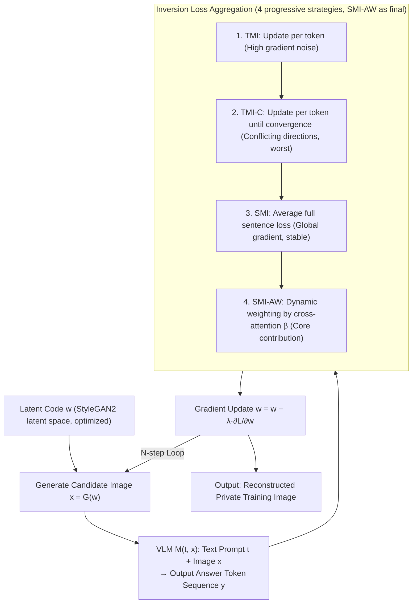

# Do Vision-Language Models Leak What They Learn? Adaptive Token-Weighted Model Inversion Attacks

**Conference**: CVPR 2026  
**arXiv**: [2508.04097](https://arxiv.org/abs/2508.04097)  
**Code**: [https://ngoc-nguyen-0.github.io/SMI_AW/](https://ngoc-nguyen-0.github.io/SMI_AW/)  
**Area**: Multimodal VLM / AI Security  
**Keywords**: Model Inversion Attack, VLM Privacy Leakage, Adaptive Token Weighting, Visual Attention Guidance, Training Data Reconstruction  

## TL;DR
This paper presents the first systematic study of Model Inversion (MI) attacks on VLMs. It proposes a set of inversion strategies tailored for token generation characteristics (TMI/TMI-C/SMI) and the SMI-AW method, which dynamically weights token gradient contributions based on visual attention intensity. The approach achieves a human-evaluated attack accuracy of up to 61.21% across 4 VLMs and 3 datasets, revealing significant privacy risks regarding training data in VLMs.

## Background & Motivation
Model Inversion (MI) attacks aim to reconstruct private training data from a trained model and have been extensively studied in unimodal DNNs, particularly face recognition. However, VLMs possess unique characteristics that render traditional MI inapplicable:

1. VLM outputs are token sequences rather than class labels, requiring new inversion objective functions.
2. VLMs consist of multiple modules (visual encoder, projection layer, language model), where visual encoders are often frozen—meaning private information is primarily embedded in the language model and projection layer parameters.
3. Different output tokens exhibit varying degrees of dependence on visual input—some are strongly visually grounded, while others are driven solely by linguistic context.

As VLMs are deployed in sensitive domains like healthcare and finance, understanding their privacy risks is urgent.

## Core Problem
Are VLMs as susceptible to model inversion attacks as unimodal DNNs? How can effective MI attack methods be designed to account for the token generation characteristics of VLMs?

## Method

### Overall Architecture

This is a white-box model inversion attack where the attacker possesses the full architecture, parameters, and attention maps of the VLM. The goal is to "reverse-engineer" private training images. Specifically, a latent code $w$ is optimized in the StyleGAN2 latent space such that the generated image $x = G(w)$, when fed to the VLM with a text prompt $t$ (e.g., "Who is the person in the image?"), produces the target answer $y$ (e.g., a specific name). The pipeline is an iterative optimization loop: Generate candidate image $\to$ pass through VLM to obtain answer token sequence $\to$ calculate inversion loss $\to$ backpropagate to update $w \to$ repeat $N$ steps until the generated image consistently induces the target answer. The difficulty lies in how to aggregate the loss from a sequence of tokens into a single inversion signal. The authors incrementally refine this aggregation from token-wise to sequence-level to attention-weighted (SMI-AW).

### Key Designs

**1. Token-based MI (TMI): Token-wise inversion with noisy gradients**  
The most direct approach calculates inversion loss for each token $y_i$ in the answer sequence independently and updates $w$ for each. After one iteration, $m$ updates are performed. However, single-token gradients are noisy; tokens with weak visual grounding (e.g., articles) can misguide optimization in incorrect directions.

**2. Convergent Token-based MI (TMI-C): Convergence per token leads to degradation**  
To address noise, this variant updates $w$ for $K$ steps until convergence for each token. This proves counterproductive as the convergence directions of individual tokens are unstable and conflict with each other, dropping the target matching rate to its lowest point (<30%).

**3. Sequence-based MI (SMI): Unified objective for the full sequence**  
SMI addresses the issues of per-token methods by aggregating losses of all tokens into a unified objective, using global gradients to update $w$ at each step:

$$\mathcal{L} = \frac{1}{m}\sum_{i=1}^m \mathcal{L}_{inv}(M(t, G(w), y_{<i}), y_i)$$

The global signal is significantly more stable than single tokens, pushing the target matching rate to >95%, far outperforming TMI.

**4. SMI-AW: Dynamic weighting via visual attention (Core Contribution)**  
While SMI treats all tokens equally, the authors observe that tokens vary in visual dependency. Tokens with high visual grounding (e.g., descriptive parts of a name) show strong cross-attention and carry richer visual information in their gradients. Linguistically driven tokens (e.g., articles) have weak attention and nearly useless gradients. SMI-AW uses cross-attention values $\alpha_i$ to calculate weights $\beta_i = \alpha_i / \sum_j \alpha_j$, aggregating the loss as $\mathcal{L} = \sum_{i=1}^m \beta_i \mathcal{L}_{inv}$. Importantly, these weights are recomputed at every inversion step because as the reconstructed image approaches the target, the visual dependency of tokens changes.

### Loss & Training
- Three types of inversion loss: Cross-entropy $\mathcal{L}_{CE}$, Maximum Margin $\mathcal{L}_{MML}$, and Logit Maximization $\mathcal{L}_{LOM}$ (Optimal). $\mathcal{L}_{LOM}$ directly maximizes the target token logit with regularization to prevent unbounded growth.
- Inversion steps $N = 70$, learning rate $\lambda = 0.05$.
- Initial candidate selection: Sample 2,000 $w$ codes, select top-16 low-loss candidates. Final selection: Choose 8 best after 10 random augmentations.

## Key Experimental Results

### FaceScrub Dataset (LLaVA-v1.6-7B)

| Method | AttAcc_M ↑ | AttAcc_D Top1 ↑ | AttAcc_D Top5 ↑ | δ_face ↓ |
| :--- | :--- | :--- | :--- | :--- |
| TMI | 42.20% | 18.03% | 40.25% | 0.8901 |
| TMI-C | 16.08% | 3.85% | 11.64% | 1.1825 |
| SMI | 57.83% | 33.50% | 61.56% | 0.7473 |
| **SMI-AW** | **61.01%** | **37.62%** | **66.16%** | **0.7265** |

### Cross-Dataset (LLaVA-v1.6-7B + SMI-AW)

| Dataset | AttAcc_M ↑ | AttAcc_D Top1 ↑ |
| :--- | :--- | :--- |
| FaceScrub | 61.01% | 37.62% |
| CelebA | 67.05% | 45.25% |
| StanfordDogs | 78.13% | 55.83% |

### Cross-Model (FaceScrub + SMI-AW)

| VLM | AttAcc_M ↑ | δ_eval ↓ |
| :--- | :--- | :--- |
| LLaVA-v1.6-7B | 61.01% | 134.94 |
| InternVL2.5-8B | 55.05% | 139.18 |
| MiniGPT-v2 | 47.92% | 161.25 |
| Qwen2.5-VL-7B | 32.03% | 150.46 |

### Human Evaluation

| VLM | Dataset | AttAcc_H ↑ |
| :--- | :--- | :--- |
| LLaVA-v1.6-7B | CelebA | **61.21%** |
| LLaVA-v1.6-7B | FaceScrub | 56.93% |
| MiniGPT-v2 | FaceScrub | 57.22% |

### Ablation Study
- **Sequence vs Token**: Sequence-based target matching exceeds 95%, while token-based methods reach only 60-79% (TMI-C <30%), proving global gradient stability.
- **Adaptive vs Uniform Weighting**: SMI-AW consistently outperforms SMI, validating the effectiveness of visual attention-guided weighting.
- **Loss Functions**: $\mathcal{L}_{LOM}$ is the most effective, followed by $\mathcal{L}_{CE}$, with $\mathcal{L}_{MML}$ performing worst.
- **Prompt Robustness**: Different input prompts have minimal impact on attack performance (AttAcc_M remains within 59-61%).
- **Public Model Attacks**: Successfully reconstructed celebrity facial images from public LLaVA-v1.6-7B and MiniGPT-v2 checkpoints.

## Highlights & Insights
- **Pioneering Problem**: This is the first systematic exploration of MI attacks on VLMs, filling a critical gap in multimodal privacy security.
- **Key Insight**: Different output tokens exhibit varying levels of visual grounding that change dynamically during inversion—a property unique to VLMs and absent in unimodal MI.
- **Clever Design**: Uses cross-attention maps as a proxy for gradient informativeness, turning the VLM's internal mechanisms into an advantage for the attacker.
- **Empirical Validation**: Successful reconstruction of celebrity faces from public VLMs demonstrates that privacy risks are real and not just theoretical.
- **Large-scale Human Evaluation**: Conducted with 4,240-8,000 crowd-sourced participants, ensuring highly credible results.

## Limitations & Future Work
- **White-box Assumption**: Practical attackers may not have access to full model parameters and attention maps.
- **Domain Constraints**: Validation is limited to faces and dog breeds; extension to natural scenes or medical imaging is required.
- **Frozen Visual Encoder Assumption**: Attack efficacy may vary if the visual encoder is also fine-tuned.
- **Defense Exploration**: The paper focuses on attacks and does not propose specific defense mechanisms.
- **Qwen2.5-VL Performance**: The lower attack success rate (32%) on this model warrants a deeper analysis of its architectural differences.

## Related Work & Insights
- **vs Traditional MI (GMI/PPA/KEDMI)**: Traditional methods target classification labels; this work extends MI to token sequence generation in VLMs using new optimization strategies.
- **vs Contrastive Learning MI**: Prior work focused on alignment leakage in models like CLIP; this study targets the generative language modeling stage of VLMs, representing a different attack surface.
- **vs Federated Learning Attacks**: Gradient inversion in FL targets intercepted gradients; this work operates on a fully trained model without needing access to the training process.

## Rating
- Novelty: ⭐⭐⭐⭐⭐ Pioneering application of MI to VLMs with sound methodology.
- Experimental Thoroughness: ⭐⭐⭐⭐⭐ Inclusive of 4 VLMs, 3 datasets, 5 metrics (including massive human eval), and public model validation.
- Writing Quality: ⭐⭐⭐⭐ Clear logic and precise problem description, though some supplemental material could be distilled.
- Value: ⭐⭐⭐⭐⭐ High impact for VLM privacy security, opening new research directions for sensitive deployments.

<!-- RELATED:START -->

## Related Papers

- [\[CVPR 2026\] ⊘ Source Models Leak What They Shouldn't ↛: Unlearning Zero-Shot Transfer in Domain Adaptation Through Adversarial Optimization](oslash_source_models_leak_what_they_shouldnt_nrightarrow_unlearning_zero-shot_tr.md)
- [\[CVPR 2026\] Phantasia: Context-Adaptive Backdoors in Vision Language Models](phantasia_context-adaptive_backdoors_in_vision_language_models.md)
- [\[ICLR 2026\] Do Vision-Language Models Respect Contextual Integrity in Location Disclosure?](../../ICLR2026/llm_safety/do_vision-language_models_respect_contextual_integrity_in_location_disclosure.md)
- [\[ACL 2026\] Do Multimodal RAG Systems Leak Data? A Comprehensive Evaluation of Membership Inference and Image Caption Retrieval Attacks](../../ACL2026/llm_safety/do_multimodal_rag_systems_leak_data_a_comprehensive_evaluation_of_membership_inf.md)
- [\[CVPR 2026\] Interpretable Debiasing of Vision-Language Models for Social Fairness](interpretable_debiasing_of_vision-language_models_for_social_fairness.md)

<!-- RELATED:END -->
