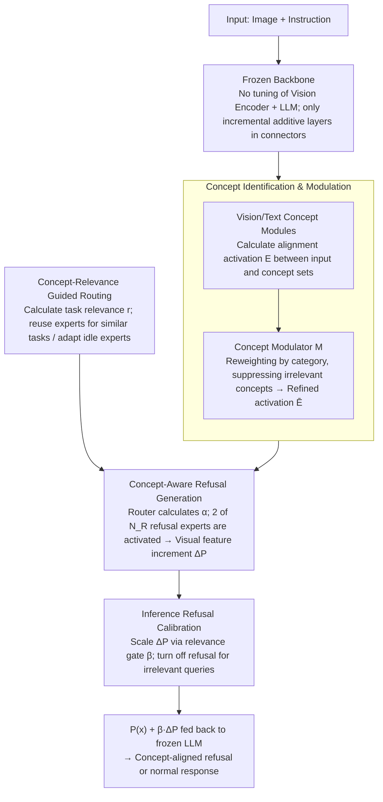

# Which Concepts to Forget and How to Refuse? Decomposing Concepts for Continual Unlearning in Large Vision-Language Models

**Conference**: CVPR 2026  
**arXiv**: [2603.21484](https://arxiv.org/abs/2603.21484)  
**Code**: None  
**Area**: Multimodal VLM / Machine Unlearning  
**Keywords**: Continual Unlearning, Large Vision-Language Models, Concept Decomposition, Mixture of Refusers, Selective Knowledge Erasure

## TL;DR
Ours proposes CORE (COncept-aware REfuser), a framework for continual unlearning in Large Vision-Language Models (LVLMs). By decomposing vision-language pairs to be deleted into fine-grained visual attributes and textual intent concepts, it utilizes a concept modulator to identify required concept combinations for rejection. Subsequently, a Mixture of Refusers generates concept-aligned refusal responses. CORE achieves the best unlearning-retention trade-off with 90.67% CRR and 88.02% AR across 16 sequential tasks.

## Background & Motivation
1. **Background**: Large Vision-Language Models (e.g., MiniGPT, InstructBLIP) pre-trained on massive multimodal data have achieved exceptional performance across various tasks. However, pre-training data inevitably contains inappropriate or sensitive content, potentially leading to undesirable outputs.
2. **Limitations of Prior Work**: (a) Retraining from scratch is infeasible due to inaccessible pre-training data and immense computational costs; (b) Unlearning requests arrive sequentially over time (driven by user needs or AI regulations), requiring "continual unlearning" rather than one-time erasure; (c) Existing unlearning methods (gradient ascent, random labeling, etc.) distort shared representations during sequential updates, creating false correlations. The model mistakes surface cues of vision-language patterns as refusal signals, leading to two types of errors: **unrelated rejection** (semantically misaligned refusals for previous tasks) and **over-rejection** (erroneous refusal of normal queries).
3. **Key Challenge**: Visual and textual representations in LVLMs are highly entangled, causing edits to specific knowledge to affect unrelated information. As sequential unlearning tasks increase, "representation distortion" accumulates, making it harder for the model to distinguish "which to forget" from "what to retain."
4. **Goal**: (a) Precisely identify which combination of concepts to refuse during multi-step unlearning; (b) Generate refusal responses semantically aligned with the unlearning target instead of generalized refusals.
5. **Key Insight**: The authors' core insight is that a concept-level approach enables more precise and interpretable unlearning. Explicitly extracting concepts to be forgotten and refusing specific combinations mitigates false correlations better than direct parameter manipulation.
6. **Core Idea**: Decompose vision-language targets into visual attribute concepts and textual intent concepts. Identify unique concept combinations for each unlearning category via a concept modulator, then schedule specialized refusal experts through a routing mechanism to generate concept-aware refusal responses.

## Method

### Overall Architecture
CORE addresses a "use-while-erasing" problem: LVLMs continuously receive new unlearning requests, each requiring the model to learn to refuse a category of sensitive content without affecting other knowledge. The approach freezes the entire vision encoder and language model, only modifying the connector modules—avoiding retraining or direct parameter alteration. When an unlearning request arrives, CORE decomposes it into "what is seen" (visual attribute concepts) and "what is intended" (textual intent concepts). It determines if these concept combinations hit a learned unlearning category; if so, it schedules "refusal experts" to rewrite visual features, guiding the language model to generate a semantically aligned refusal. During inference, a concept-relevance gate determines whether and how strongly to trigger the refusal.

### Key Designs

**1. Concept Identification & Modulation: Transforming "what to forget" into interpretable activations while suppressing cumulative concept crosstalk.**

Unlearning is difficult because one cannot simply say "delete this image"; one must define the underlying concept. CORE uses an LLM offline to generate 20 visual attribute concepts (e.g., "protesters holding banners") and 20 textual intent concepts for each category $k$. Each concept module $\bm{\mathcal{E}}_{\text{q},k}$ calculates alignment scores between the input and concept set $\mathcal{C}_{\text{q},k}$. To ensure semantic grounding, the module is trained using CLIP similarity as a supervisory signal: $\mathcal{L}_{\text{con}} = -\sum \text{sim}(E^t_{\text{q},i}, \hat{E}_{\text{q},i})$. To handle interference in continual unlearning where overlapping concepts cause misalignment, a modulator $\bm{\mathcal{M}}$ uses a classification head to determine category membership weights $\{m_k\}$, suppressing irrelevant categories:

$$\bar{E}^t_{\text{q},i} = \bigoplus_{k} m_k \cdot \bm{\mathcal{E}}_{\text{q},k}(x^t_{\text{q},i})$$

Without the modulator (MOD), CRR drops from 88.14% to 83.95% and AR from 86.74% to 74.31%.

**2. Concept-Aware Refusal Generation: Rewriting visual features using "refusal experts" without touching original parameters.**

Instead of fine-tuning, CORE introduces $N_R=20$ refusal experts $\{\mathcal{V}_j\}$, which are lightweight connector modules. A router $\mathcal{R}$ calculates contribution weights $\{\alpha_j\}$ based on modulated activations. Their outputs are mixed and added to the pre-trained visual features:

$$\Delta\mathcal{P}(x^t_{\text{img}}) = \sum_j \alpha_j \cdot \mathcal{V}_j(x^t_{\text{img}})$$

Only 2 experts are activated per sample to maintain sparsity. This guides the LLM to provide a refusal aligned with the current concept while preserving its pre-trained capabilities.

**3. Concept-Relevance Guided Routing: Balancing "reuse" and "specialization" among a fixed number of experts.**

With a fixed number of experts, CORE must decide whether to reuse old experts or occupy idle ones for new tasks. It explicitly calculates the concept relevance $r^{t'}$ between current task $t$ and previous task $t'$ by multiplying vision and text similarities:

$$r^{t'} = \sigma\big(\text{sim}(\bar{E}^t_{\text{img}}, \bar{E}^{t'}_{\text{img}}) \cdot \text{sim}(\bar{E}^t_{\text{txt}}, \bar{E}^{t'}_{\text{txt}})\big)$$

Contrastive constraints then pull similar tasks ($r^{t'}$ high) together via $\ell_+$ to share experts and push unrelated tasks apart via $\ell_-$ to avoid interference:

$$\mathcal{L}_{\text{ref}} = \sum_{t'} \big[r^{t'} \cdot \ell_+(F^t, F^{t'}) + (1-r^{t'}) \cdot \ell_-(F^t, F^{t'})\big]$$

Removing routing (ACT) causes CRR to collapse from 88.14% to 54.53%.

**4. Inference Refusal Calibration: A relevance gate to determine the final refusal execution.**

To avoid over-rejection of normal queries, CORE calculates the maximum concept relevance $\beta \in [0,1]$ between the current query and all forgotten tasks during inference, scaling the refusal increment:

$$\mathcal{P}(\bar{x}_{\text{img}}) + \beta \cdot \Delta\mathcal{P}(\bar{x}_{\text{img}})$$

When inputs are unrelated to unlearning targets, $\beta \to 0$, turning off the refusal. When targets are hit, $\beta \to 1$, enabling full refusal. Without calibration (CAL), AR plummets from 86.74% to 4.11%.

### A Detailed Example
Assume the 8th unlearning request is "erase protest-related content." An input image of a crowd with banners and the question "What are they protesting?" enters: the concept module activates "protesters" and "gathering crowd." However, because "rallies" or "political figures" were learned previously, unrelated concepts might also fire. The modulator identifies the input as Category 8, amplifying its weights and suppressing "political figures." The router then finds high relevance $r$ with the "rallies" task, reuses its experts, and adds one idle expert. Finally, the LLM provides an aligned refusal. If a photo of a mountain with "Where is this?" is input, the relevance $\beta$ stays near 0, the gate closes the refusal increment, and the model answers normally.

### Training Strategy
Training proceeds in two stages: (1) Concept modules and modulator ($\mathcal{L}_{\text{con}} + \mathcal{L}_{\text{mod}}$) to establish reliable identification. (2) Router and refusal experts ($\mathcal{L}_{\text{ce}} + \mathcal{L}_{\text{ref}}$) for generating responses. To mitigate catastrophic forgetting, feature prototypes from previous tasks are preserved as constraints during sequential updates.

## Key Experimental Results

### Main Results (Vicuna-based LVLM, after 16 sequential tasks)

| Method | S↑ (General) | AR↑ (Retention) | CRR↑ (Contextual Rejection) | ΔRR↓ (Bias) |
|------|-------------|-----------------|-------------------|-----------------|
| EWC | 76.22 | 24.90 | 51.01 | 35.38 |
| LwF | 72.09 | 43.12 | 41.01 | 33.13 |
| SCRUB | 63.38 | 8.84 | 57.69 | 36.95 |
| MoEAdapter | 94.46 | 54.25 | 52.82 | 31.98 |
| O3 | 92.85 | 81.76 | 73.03 | 9.03 |
| **CORE (Ours)** | **96.54** | **88.02** | **90.67** | **3.74** |

### Ablation Study (Avg Metrics)

| MOD | ACT | CAL | S↑ | AR↑ | CRR↑ | ΔRR↓ |
|-----|-----|-----|-----|------|------|------|
| ✓ | ✓ | ✓ | **97.64** | **86.74** | **88.14** | 8.38 |
| ✗ | ✓ | ✓ | 93.10 | 74.31 | 83.95 | 8.17 |
| ✓ | ✗ | ✓ | 93.82 | 86.90 | 54.53 | 33.81 |
| ✓ | ✓ | ✗ | 37.71 | 4.11 | 86.09 | 10.79 |

### Key Findings
- **Three components are indispensable**: Removing MOD degrades identification (AR -12.4%); removing ACT causes CRR to drop by 33.6% due to expert misuse; removing CAL is fatal, with AR dropping to 4.11%.
- **Stability over sequences**: CORE maintains near-constant performance across the unlearning sequence, whereas EWC/LwF show continuous degradation in general capability.
- **Cross-LVLM Generalization**: On LLaMA-2-based LVLMs, CORE significantly outperforms O3 (AR: 84.41% vs 66.73%, CRR: 84.54% vs 76.74%).
- **Concept Visualization**: Visualizations confirm that the modulator focuses activations on relevant concepts (e.g., "protesters holding banners") while suppressing irrelevant noise.

## Highlights & Insights
- **Concept Decomposition** is an elegant solution: Transforming "what to forget" into "localization in concept space" naturally supports interpretability.
- **Inference Calibration** is the key to practicality: Dynamically adjusting refusal strength based on relevance solves the over-rejection problem.
- **Refuser Routing** leverages MoE principles to reuse/adapt experts as tasks grow, ensuring the framework scales despite a fixed number of parameters.

## Limitations & Future Work
- Concept descriptions rely on LLM quality; incorrect descriptions lead to faulty refusal boundaries.
- Fixed concept counts (20 vision + 20 text) might be inflexible for categories with varying complexity.
- Refusal experts lack explicit diversity guarantees, potentially leading to functional redundancy.
- Unlearning tasks with very high counts (e.g., 100+) may face concept space expansion and scalability issues.

## Related Work & Insights
- **vs O3**: O3 uses random labels on parameter subsets while keeping the model frozen; CORE also keeps the backbone frozen but achieves much higher CRR (+17.6%) via concept-level refusers.
- **vs MoEAdapter**: MoEAdapter lacks concept decomposition, resulting in a much lower CRR (52.82%) compared to CORE (90.67%).
- **vs Concept Bottleneck Models (CBM)**: CORE adapts CBM's activation ideas to the unlearning context, introducing modulators to handle concept inflation.

## Rating
- Novelty: ⭐⭐⭐⭐⭐ 
- Experimental Thoroughness: ⭐⭐⭐⭐⭐ 
- Writing Quality: ⭐⭐⭐⭐ 
- Value: ⭐⭐⭐⭐⭐ 

<!-- RELATED:START -->

## Related Papers

- [\[AAAI 2026\] AUVIC: Adversarial Unlearning of Visual Concepts for Multi-modal Large Language Models](../../AAAI2026/llm_safety/auvic_adversarial_unlearning_of_visual_concepts_for_multi-mo.md)
- [\[CVPR 2026\] Designing to Forget: Deep Semi-parametric Models for Unlearning](designing_to_forget_deep_semi-parametric_models_for_unlearning.md)
- [\[CVPR 2026\] VL-Eraser: Vacuum Distillation for Machine Unlearning in Vision-Language Models](vl-eraser_vacuum_distillation_for_machine_unlearning_in_vision-language_models.md)
- [\[CVPR 2026\] Towards Reasoning-Preserving Unlearning in Multimodal Large Language Models](towards_reasoning-preserving_unlearning_in_multimodal_large_language_models.md)
- [\[CVPR 2026\] Test-Time Attention Purification for Backdoored Large Vision Language Models](test-time_attention_purification_for_backdoored_large_vision_language_models.md)

<!-- RELATED:END -->
