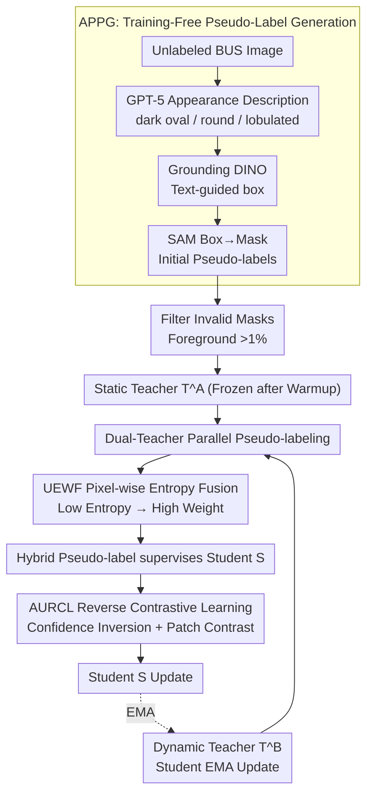

# A Semi-Supervised Framework for Breast Ultrasound Segmentation with Training-Free Pseudo-Label Generation and Label Refinement

**Conference**: CVPR 2026  
**arXiv**: [2603.06167](https://arxiv.org/abs/2603.06167)  
**Code**: To be confirmed  
**Area**: Medical Imaging  
**Keywords**: Semi-supervised segmentation, breast ultrasound, pseudo-labels, dual-teacher framework, contrastive learning, SAM, Grounding DINO

## TL;DR

A semi-supervised framework for breast ultrasound (BUS) image segmentation is proposed. It leverages GPT-5 generated appearance descriptions combined with Grounding DINO and SAM to generate training-free pseudo-labels (APPG). A dual-teacher framework (static and dynamic) is employed to refine labels through Uncertainty-Entropy Weighted Fusion (UEWF) and Adaptive Uncertainty-guided Reverse Contrastive Learning (AURCL), achieving performance close to full supervision with only 2.5% annotations.

## Background & Motivation

### 1. Background
Breast ultrasound (BUS) is a vital imaging modality for breast cancer screening, where precise tumor segmentation forms the basis of computer-aided diagnosis. Deep learning methods depend on large-scale pixel-level annotations, but labeling medical images is extremely costly—requiring expert radiologists to annotate pixel-by-pixel, which is time-consuming and expensive. Semi-supervised learning (SSL) mitigates this by utilizing large amounts of unlabeled data alongside small amounts of labeled data, though it faces unique challenges in BUS scenarios.

### 2. Limitations of Prior Work
Specific characteristics of BUS images: (1) Low contrast between tumors and surrounding tissues with blurred boundaries; (2) High morphological variance across tumors (oval, round, lobulated); (3) Inherent speckle noise and artifacts. These factors compromise the core SSL assumption—that a model can learn reliable pseudo-labels from few annotations. Especially in ultra-low annotation scenarios (e.g., 2.5%), pseudo-label quality is poor, leading the model into a vicious cycle of confirmation bias.

### 3. Key Challenge
Traditional SSL (e.g., Mean Teacher) relies on the model itself to generate pseudo-labels. However, models are unreliable under minimal supervision, generating noisy pseudo-labels that further mislead training. This creates a "chicken and egg" dilemma: high-quality pseudo-labels are needed to train a good model, but a good model is the prerequisite for high-quality pseudo-labels.

### 4. Goal
(1) Obtain high-quality initial pseudo-labels under minimal supervision to break the cold-start dilemma; (2) Continuously refine pseudo-labels during training to avoid confirmation bias from a single teacher; (3) Enhance the model's discriminative ability in uncertain boundary regions.

### 5. Key Insight
Utilize vision-language foundation models (GPT-5 + Grounding DINO + SAM) as training-free pseudo-label generators to skip the cold-start phase, followed by continuous refinement using dual teachers and uncertainty-aware fusion.

### 6. Core Idea
A three-step solution for BUS segmentation under minimal labels: (1) APPG utilizes general appearance priors of breast tumors, converted into natural language prompts to drive foundation models for training-free pseudo-label generation; (2) A static teacher (frozen after pseudo-label warmup) and a dynamic teacher (EMA updated) provide complementary perspectives; (3) UEWF fuses outputs based on uncertainty-entropy weighting, while AURCL reinforces boundary discrimination via reverse contrastive learning.

## Method

### Overall Architecture

This paper addresses the cold-start dilemma of BUS segmentation under extremely low annotation (as low as 2.5%). The strategy involves "outsourcing" the initial batch of pseudo-labels to vision-language foundation models and using two complementary teachers to continuously clean labels during training.

The workflow consists of three phases. In the first phase, APPG feeds GPT-5 tumor descriptions into Grounding DINO for localization and SAM for segmentation, generating training-free initial pseudo-labels for all unlabeled images. The second phase filters invalid masks (foreground < 1% of image area) and uses these labels for warmup, freezing the trained model as the static teacher $T^A$. The third phase involves dual-teacher SSL: the frozen $T^A$ and the dynamic teacher $T^B$ (updated via student EMA) generate pseudo-labels simultaneously, which are fused via pixel-wise UEWF to supervise the student. AURCL specifically targets blurred boundary regions via reverse contrastive learning.

### Key Designs

**1. APPG: Outsourcing appearance priors to foundation models for training-free initial labels**

The cold-start dilemma stems from the lack of a credible pseudo-label source. APPG bypasses the model itself by leveraging the fact that tumor appearance in BUS is highly predictable—mostly hypoechoic (dark) regions with oval, round, or lobulated shapes. GPT-5 translates this medical knowledge into prompts (e.g., "dark oval region"), which Grounding DINO uses for open-vocabulary detection. The resulting boxes act as spatial prompts for SAM to generate pixel-level masks. This pipeline requires zero labeled data and relies on the zero-shot capabilities of VLMs.

**2. Dual-Teacher Framework: A frozen anchor plus a dynamic follower to break EMA degradation**

Single EMA teachers (e.g., Mean Teacher) under minimal labels suffer from a positive feedback loop of errors. This framework splits the loop. Static teacher $T^A$ is frozen after warmup, encoding initial knowledge from foundation models without being contaminated by training noise, providing a stable baseline. Dynamic teacher $T^B$ follows the student via EMA, absorbing new knowledge and adapting to distribution shifts at the cost of potential error accumulation. Their outputs $\hat{y}^A$ and $\hat{y}^B$ are fused via UEWF. $T^A$ acts as an anchor to prevent $T^B$ from drifting.

**3. UEWF: Pixel-wise uncertainty-entropy weighting**

Teachers vary in reliability across regions—$T^A$ is structurally stable but inflexible, while $T^B$ is temporally consistent but potentially noisy. UEWF calculates Shannon entropy $\mathbf{E}_A, \mathbf{E}_B$ for each pixel. These are smoothed with patch-level average pooling ($k=14$) to suppress speckle noise. Weights are assigned as the inverse of the smoothed entropy and normalized:

$$\mathbf{w}_{A,B} = \frac{1}{\mathbf{E}^{\text{smooth}}_{A,B} + \epsilon}, \quad \hat{\mathbf{y}}^F = \frac{\mathbf{w}_A \cdot \hat{\mathbf{y}}^A + \mathbf{w}_B \cdot \hat{\mathbf{y}}^B}{\mathbf{w}_A + \mathbf{w}_B + \epsilon}$$

Higher uncertainty (higher entropy) results in lower weights, allowing for pixel-level adaptive fusion without additional learnable parameters.

**4. AURCL: Converting "uncertainty" into learnable signals via contrastive learning**

Standard SSL focuses on high-confidence regions but struggles with blurred boundaries where the model is "uncertain." AURCL targets these hard cases. It calculates a confidence map $\mathbf{C}=1-\mathbf{p}$ from student predictions and uses a dynamic top-K threshold $\tau_i = \max(\text{top-}K(\mathbf{C}_i, K),\ \tau_{\text{fix}})$ to identify low-confidence pixels ($\mathbf{M}^{\text{low}}$). "Probability inversion" is applied to these pixels ($1-\mathbf{p}$), creating a reversed view $\tilde{\mathbf{p}}$. Patch-level features $\mathbf{f}_{i,j}, \tilde{\mathbf{f}}_{i,j}$ are extracted using weighted average pooling. Contrastive learning pushes positive pairs (same patch across views) together and negative pairs (different patches) apart using InfoNCE. This forces the model to learn consistent representations even in blurred boundary regions.

### Loss & Training

- Labeled data: Standard supervision loss (CE + Dice)
- Unlabeled data: UEWF-fused pseudo-label segmentation loss + AURCL contrastive loss
- Total loss: $\mathcal{L} = \mathcal{L}_{\text{sup}} + \lambda_1 \mathcal{L}_{\text{unsup}} + \lambda_2 \mathcal{L}_{\text{AURCL}}$
- Student model is a U-Net variant; $T^B$ EMA decay rate $\alpha = 0.999$.
- In APPG, 3 appearance descriptions generate candidate boxes; the highest confidence box after NMS is selected.

## Key Experimental Results

### Main Results

Evaluated on 4 public BUS datasets (BUSI, UDIAT, BUS-BRA, TN3K) at 2.5%, 5%, and 10% label ratios.

**Key Findings (Dice %)**:

| Method | BUSI 2.5% | BUSI 5% | BUSI 10% | UDIAT 2.5% | UDIAT 5% | UDIAT 10% |
|------|-----------|---------|----------|------------|---------|-----------|
| Supervised-only | 51.2 | 60.8 | 69.4 | 53.7 | 63.2 | 71.5 |
| Mean Teacher | 58.6 | 66.3 | 73.8 | 60.4 | 68.1 | 75.2 |
| CPS | 59.1 | 67.0 | 74.1 | 61.2 | 69.3 | 75.8 |
| UniMatch | 62.4 | 69.5 | 76.2 | 64.0 | 71.8 | 78.1 |
| **Ours** | **71.8** | **75.3** | **79.6** | **72.5** | **76.9** | **81.4** |
| Full Supervision | 80.2 | 80.2 | 80.2 | 82.1 | 82.1 | 82.1 |

Key findings: (1) At 2.5% labels, Ours (71.8% Dice on BUSI) significantly outperforms UniMatch (62.4%) by +9.4%; (2) 2.5% performance reaches 89.5% of full supervision; (3) Consistent superiority across all datasets and ratios.

### Ablation Study

**Component Ablation (BUSI 2.5% Dice)**:

| Configuration | Dice (%) |
|------|----------|
| Baseline (Mean Teacher) | 58.6 |
| + APPG Initialization | 65.2 |
| + Dual-Teacher (Simple Avg) | 67.8 |
| + UEWF (Replacing Simple Avg) | 69.5 |
| + AURCL (Full Method) | 71.8 |

Each component contributes significantly: APPG (+6.6%) > Dual-Teacher (+2.6%) > UEWF (+1.7%) > AURCL (+2.3%). APPG is the primary contributor.

## Highlights & Insights

1. **VLM as a Free Lunch**: GPT-5 + Grounding DINO + SAM converts medical domain knowledge into initial labels at zero cost, bypassing the cold-start problem.
2. **Effective Dual-Teacher Design**: Static teacher prevents drift while the dynamic teacher adapts, fused via parameter-free per-pixel entropy.
3. **Inversion Insight in AURCL**: Converting "uncertainty" into "inverse certainty" is ingenious, allowing contrastive learning to build boundary-aware representations in feature space.
4. **Strong Performance with Minimal Labels**: Significant relevance for medical scenarios where annotation resources are extremely scarce.

## Limitations & Future Work

1. **Generalization of APPG Priors**: Effective for BUS, but not all lesions have uniform hypoechoic appearances; prompts need redesigning for other organs.
2. **Deployment Cost of VLMs**: Training-free but high inference cost, particularly for GPT-5 API calls.
3. **Pseudo-label Ceiling**: APPG's ~67% Dice still leaves room for improvement as SAM's precision on low-contrast ultrasound is limited.
4. **Contrastive Hyperparameters**: Sensitivity of the uncertainty threshold $\tau$ and temperature in AURCL requires further analysis.

## Related Work & Insights

- **SSL Segmentation Evolution**: Transitioning from Mean Teacher/CPS towards multi-view consistency and strong priors to compensate for label scarcity.
- **VLM in Medical Imaging**: Unlike MedSAM which requires domain labels, APPG is entirely training-free, fitting low-label scenarios.
- **Role of Uncertainty**: Unlike traditional methods that discard uncertain samples, AURCL recycles uncertainty as a signal for contrastive representation learning.

## Rating

⭐⭐⭐⭐ The framework is comprehensive with strong component complementarity. APPG's use of VLMs for training-free label generation is highly practical for low-annotation medical contexts. Limitations include VLM inference costs and prior-dependency.

<!-- RELATED:START -->

## Related Papers

- [\[CVPR 2026\] Semi-supervised Echocardiography Video Segmentation via Anchor Semantic Awareness and Continuous Pseudo-label Reforging](semi-supervised_echocardiography_video_segmentation_via_anchor_semantic_awarenes.md)
- [\[CVPR 2026\] Divide, Conquer, and Aggregate: Asymmetric Experts for Class-Imbalanced Semi-Supervised Medical Image Segmentation](divide_conquer_and_aggregate_asymmetric_experts_for_class-imbalanced_semi-superv.md)
- [\[CVPR 2026\] From Infusion to Assimilation Distillation for Medical Image Segmentation](from_infusion_to_assimilation_distillation_for_medical_image_segmentation.md)
- [\[CVPR 2026\] Semantic Class Distribution Learning for Debiasing Semi-Supervised Medical Image Segmentation](semantic_class_distribution_learning_for_debiasing.md)
- [\[CVPR 2026\] Dual-Level Confidence based Implicit Self-Refinement for Medical Visual Question Answering](dual-level_confidence_based_implicit_self-refinement_for_medical_visual_question.md)

<!-- RELATED:END -->
