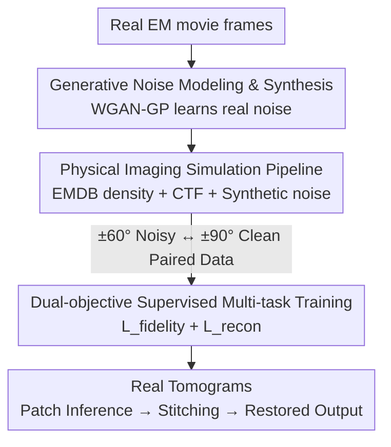

# A Supervised Multi-task Framework for Joint cryo-ET Restoration Enabled by Generative Physical Simulation

**Conference**: CVPR 2026  
**Paper**: [CVF Open Access](https://openaccess.thecvf.com/content/CVPR2026/html/Wang_A_Supervised_Multi-task_Framework_for_Joint_cryo-ET_Restoration_Enabled_by_CVPR_2026_paper.html)  
**Code**: https://github.com/ZhidongYang/CryoDeRec  
**Area**: Medical Imaging / Image Restoration  
**Keywords**: cryo-electron tomography, denoising, missing wedge restoration, multi-task learning, physical simulation  

## TL;DR
cryoDeRec utilizes a "generative noise modeling + physical imaging simulation" pipeline to generate paired tomograms consisting of "noisy inputs $\leftrightarrow$ clean GT." This transforms cryo-ET denoising and missing wedge restoration, which previously relied on self-supervised methods, into **fully supervised multi-task training**. A single U-Net performs both tasks simultaneously, outperforming Topaz-Denoise / SC-Net / IsoNet across four real and two simulated datasets.

## Background & Motivation
**Background**: Cryo-electron tomography (cryo-ET) enables 3D visualization of biological structures such as cells, viruses, and proteins in a near-native state, serving as a powerful tool in structural biology. However, imaging suffers from two inherent defects: ① To avoid radiation damage, the electron dose must be kept extremely low, resulting in a very low signal-to-noise ratio (SNR) for each projection; ② The tilt angle range is limited (typically $\pm 60^{\circ}$ instead of $\pm 90^{\circ}$), leaving a wedge-shaped region in Fourier space **unsampled forever**, which leads to "missing wedge artifacts" in reconstructed tomograms.

**Limitations of Prior Work**: Supervised learning requires "clean and complete" tomograms as ground truth (GT), but such GT is experimentally unobtainable. This **"missing GT" dilemma** has driven the field toward self-supervised learning (SSL). Existing SSL methods almost always treat denoising and missing wedge restoration **as two isolated problems**: pure denoising methods (Topaz-Denoise, SC-Net) ignore the missing wedge, while pure restoration methods (IsoNet) are extremely sensitive to input noise.

**Key Challenge**: These two problems are actually **deeply coupled**—denoising models can be misled by structured wedge artifacts (treating artifacts as signals), and reconstruction models amplify noise during propagation. The few attempts at joint solutions remain self-supervised; without clean GT, models cannot distinguish between "structured missing wedge artifacts" and "real biological signals," resulting in incomplete artifact removal.

**Goal**: To **simultaneously and effectively** solve denoising + missing wedge restoration within a single network that can be applied directly to real data without pre-processing.

**Key Insight**: Since real GT is unavailable, **create a high-fidelity synthetic training set**. If simulation can simultaneously capture "real noise distributions" and "isotropic structural priors," supervised learning can be trained on synthetic data and generalized to real tomograms. Crucially, noise cannot be simplified as a fixed Gaussian distribution; the model must learn the complex real noise present in electron microscopy.

**Core Idea**: Use **generative physical simulation** to create paired data (noisy/missing wedge $\leftrightarrow$ clean/full angle), upgrading cryo-ET restoration from self-supervised to **dual-objective fully supervised multi-task learning**.

## Method

### Overall Architecture
The cryoDeRec pipeline consists of two stages. **Phase 1 is the Data Factory**: First, a generative noise synthesizer learns real noise distributions from real EM movie frames. This generator is then integrated into a physical imaging simulation pipeline—using real EMDB structural density maps arranged in volumes according to biological distributions, applying CTF modulation, adding synthesized real noise, and performing WBP reconstruction at $\pm 60^{\circ}$ to obtain **noisy + missing wedge tomograms**. The same clean projections are reconstructed at $\pm 90^{\circ}$ (full angle) to obtain **approximate clean GT without missing information**. This creates the paired data needed for supervised learning. **Phase 2 is the Restoration Network**: A five-layer U-Net undergoes dual-objective training on this synthetic data—one objective handles "restoring global structural fidelity from noise," while the other handles "reconstructing fine information missing in Fourier space." The trained model performs inference on real WBP tomograms via patch-based processing without fine-tuning on real data.

### Key Designs

**1. Generative Noise Modeling and Synthesis: Moving Beyond Gaussian Assumptions**

The limitation is straightforward: previous cryo-ET simulations treated noise as a single Gaussian component, but real EM noise does not follow a fixed statistical distribution. This creates a domain gap, preventing supervised models from learning real signal boundaries. This method uses **neural networks to implicitly learn the dominant components of real noise**. Specifically, at a tilt angle $i$, movie frames $F^i_1,\dots,F^i_T$ are motion-corrected and averaged into a single projection $P_i$. The difference between a single frame and the corrected result, $N_i = F^i_T - P_i$, serves as the approximate noise map for training. A WGAN-GP is then trained on 2D noise patches with the adversarial loss:

$$L_{adv} = \mathbb{E}_{\tilde N \sim P_g}[D(\tilde N)] - \mathbb{E}_{N \sim P_r}[D(N)] + \lambda\, \mathbb{E}_{\hat N \sim P_{\hat N}}\big[(\|\nabla D(\hat N)\|_2 - 1)^2\big]$$

The first two terms estimate the Wasserstein distance between generated distribution $P_g$ and real distribution $P_r$, while the last term is the gradient penalty ($\lambda=10$, $\hat N = \epsilon N + (1-\epsilon)\tilde N$) enforcing 1-Lipschitz continuity. The generated noise patches match the statistical and spatial characteristics of real noise, bridging the domain gap.

**2. Physical Imaging Simulation Pipeline: Creating the "Unobtainable Clean GT"**

This is the core of bypassing the "missing GT" dilemma. The pipeline splits the physical imaging process into three components: **Structural Density Synthesis**—extracting density maps from EMDB (HIV EMD-13390, Ribosome EMD-11999, Nucleosome EMD-31086) and placing them in 3D volumes using SAWLC statistical distributions to introduce isotropic structural priors; **CTF Modulation**—applying the Contrast Transfer Function to projections:

$$\text{CTF}(f) = -\cos\!\Big(\pi \Delta z\, \lambda_e f^2 - \frac{\pi}{2} C_s \lambda_e^3 f^4\Big)$$

Defocus $\Delta z$ controls the signal degradation (fixed at 1.5 μm), with $C_s=2.7$ mm and voltage 300 keV. **Noise Injection**—adding fixed synthetic noise from the trained generator to the tilt series. Finally, WBP reconstruction is performed at $\pm 60^{\circ}$ (with missing wedge) and $\pm 90^{\circ}$ (full angle, near-complete)—the latter being the **approximate clean GT**. Note: The model fills the missing wedge using **structural priors** learned during training, rather than universal recovery of unobserved information.

**3. Dual-objective Supervised Multi-task Training: One Network, Two Complementary Goals**

cryoDeRec uses **one U-Net to optimize two objectives** by feeding it different inputs. **Objective 1: Structural Fidelity Restoration**. The input is the synthetic noisy tomogram $V^{sn}$ and the target is clean GT $V^{sg}$, using a data fidelity loss:

$$L_{fidelity}(V^{sn}_i, V^{sg}_i) = \frac{1}{N}\sum_i \|\text{Network}(V^{sn}_i) - V^{sg}_i\|_2^2$$

**Objective 2: Missing Information Reconstruction**. For noisy patches, a random rigid transformation $R_i$ is applied, followed by an **additional** missing wedge mask $M_i$ in the Fourier domain: $\tilde V^{sn}_{R_i} = \mathcal F^{-1}(M_i \odot \mathcal F(V^{sn}_{R_i}))$. This forces the network to fill an artificially created missing wedge:

$$L_{recon} = \frac{1}{N}\sum_i \big\|\text{Network}(\tilde V^{sn}_{R_i}) - V^{sg}_{R_i}\big\|_2^2$$

Total loss: $L_{DeRec} = L_{fidelity} + \lambda_{recon} L_{recon}$ ($\lambda_{recon}=0.1$). Objective 1 ensures denoising without distortion, while Objective 2 uses "active masking—supervised restoration" to explicitly teach the network to reconstruct unobserved frequencies.

### Loss & Training
- Noise Synthesizer: WGAN-GP, Gaussian initialization (0.02), Adam ($\beta_1=0.5,\beta_2=0.999$), learning rate 0.0002.
- Restoration Network: Five-layer encoder/decoder U-Net, batch size 4, patch size $96^3$, overlap 32 pixels, 100 epochs, Adam, learning rate 0.001.
- Simulation Data: Random distribution of three EMDB structures, $\pm 60^{\circ}$ projections, increment $\theta=1^{\circ}/2^{\circ}/3^{\circ}$, defocus 1.5 μm, WBP via tomo3d.

## Key Experimental Results

### Main Results
Real datasets evaluated using **CNR (Contrast-to-Noise Ratio) / ENL (Equivalent Number of Looks)** (higher is better). Ours was trained only on synthetic data:

| Dataset | Noisy(WBP) | Topaz-Denoise | SC-Net | IsoNet | Ours |
|--------|-----------|---------------|--------|--------|------|
| EMPIAR-10045 (Ribosome) | 0.022/7.9 | 0.187/50.0 | 0.199/41.6 | 0.361/70.9 | **0.506/342.3** |
| EMPIAR-10499 (Mycoplasma) | 0.018/7.8 | 0.343/129.0 | 0.535/45.8 | 0.336/65.7 | **1.637/162.8** |
| EMPIAR-10678 (Nucleosome) | 0.017/18.4 | 0.047/59.3 | 0.179/52.5 | 0.103/67.7 | **0.323/87.5** |
| EMPIAR-10643 (HIV-1) | 0.039/8.9 | 0.458/143.7 | 1.249/52.0 | 1.874/152.7 | **2.434/193.7** |

Synthetic datasets evaluated using **PSNR/SSIM**:

| Method | Tomo-5lzf SNR=0.5 | SNR=0.1 | Tomo-1qvr SNR=0.5 | SNR=0.1 |
|------|------|------|------|------|
| Noisy(WBP) | 5.97/0.203 | 4.88/0.172 | 5.83/0.224 | 4.74/0.181 |
| Topaz-Denoise | 6.25/0.411 | 7.03/0.357 | 6.68/0.457 | 6.62/0.384 |
| IsoNet | 7.15/0.415 | 7.10/0.401 | 7.61/0.384 | 7.56/0.384 |
| Ours | **10.84/0.843** | **10.82/0.836** | **10.80/0.850** | **10.77/0.843** |

PSNR increased by ~3.5 dB, and SSIM jumped from ~0.4 to 0.84. Performance remained stable even at SNR=0.1.

### Ablation Study

| Configuration | EMPIAR-10643 (CNR/ENL) | EMPIAR-10499 (CNR/ENL) | Function |
|------|------|------|------|
| Noisy | 0.039/8.876 | 0.018/7.790 | Original WBP |
| w/o $L_{recon}$ | 2.174/171.225 | 1.318/145.883 | Denoising only, residual artifacts |
| Full Loss | **2.434/193.694** | **1.637/162.764** | $L_{recon}$ restores info |

### Key Findings
- **$L_{recon}$ is vital for missing wedge restoration**: Without it, noise is removed but wedge artifacts remain; this loss specifically restores fine structures in restricted angles.
- **Robustness to sparse angles**: Even with tilt increments increased from $3^{\circ}$ to $5^{\circ}$, cryoDeRec restores x-y slices and Fourier high frequencies.
- **High Noise Fidelity**: Statistical distributions of synthetic noise almost overlap with real noise, which is key to directly transferring from synthetic to real data.
- **Joint > Isolated**: IsoNet produces blurry reconstructions on low-contrast data (EMPIAR-10499), whereas physics-based multi-tasking performs significantly better in contrast and structure.

## Highlights & Insights
- **Data generation as a core contribution**: The innovation lies not in the network architecture (a standard U-Net), but in creating clean GT through generative noise and physical simulation.
- **"Active re-masking" trick**: $L_{recon}$ turns an unsupervised inpainting problem into a supervised task by creating "known missingness."
- **Strict capability boundaries**: The authors acknowledge that missing wedge filling is a learned structural prior rather than a ground truth recovery of unobserved data.

## Limitations & Future Work
- **Limited structural diversity**: Training relied on only three EMDB structures; generalization to entirely new macromolecules may be limited.
- **Prior-based filling**: The recovered frequencies are not guaranteed to match reality, requiring caution for downstream sub-tomogram averaging.
- **Hardware dependency**: The noise generator may require retraining for different detectors or imaging conditions.
- **Lack of pixel-level GT for real data**: Evaluation on real sets is limited to no-reference metrics like CNR/ENL.

## Related Work & Insights
- **vs Topaz-Denoise / SC-Net (Denoising only)**: These fail to address the missing wedge, resulting in incomplete structures like HIV-1 capsids.
- **vs IsoNet (Restoration only, SSL)**: IsoNet requires deconvolution and is sensitive to noise; Ours is fully supervised and works directly on raw WBP.
- **Insight**: When "ground truth is unavailable," instead of defaulting to self-supervised learning, one can use physical simulation to synthesize high-fidelity paired data.

## Rating
- Novelty: ⭐⭐⭐⭐ Transforms cryo-ET restoration to a supervised paradigm via physical simulation.
- Experimental Thoroughness: ⭐⭐⭐⭐ Extensive testing on real and simulated datasets with ablation.
- Writing Quality: ⭐⭐⭐⭐ Logical motivation and clear boundary definitions.
- Value: ⭐⭐⭐⭐ High practical value for the structural biology community; no pre-processing required.

<!-- RELATED:START -->

## Related Papers

- [\[CVPR 2026\] SIMSPINE: A Biomechanics-Aware Simulation Framework for 3D Spine Motion Annotation and Benchmarking](simspine_a_biomechanics-aware_simulation_framework_for_3d_spine_motion_annotatio.md)
- [\[CVPR 2026\] MedGRPO: Multi-Task Reinforcement Learning for Heterogeneous Medical Video Understanding](medgrpo_multi-task_reinforcement_learning_for_heterogeneous_medical_video_unders.md)
- [\[CVPR 2026\] CURE: Curriculum-guided Multi-task Training for Reliable Anatomy Grounded Report Generation](cure_curriculum-guided_multi-task_training_for_reliable_anatomy_grounded_report_.md)
- [\[CVPR 2026\] SemiGDA: Generative Dual-distribution Alignment for Semi-Supervised Medical Image Segmentation](semigda_generative_dual-distribution_alignment_for_semi-supervised_medical_image.md)
- [\[CVPR 2026\] Virtual Immunohistochemistry Staining with Dual-Aligned Multi-Task Feature Guidance](virtual_immunohistochemistry_staining_with_dual-aligned_multi-task_feature_guida.md)

<!-- RELATED:END -->
