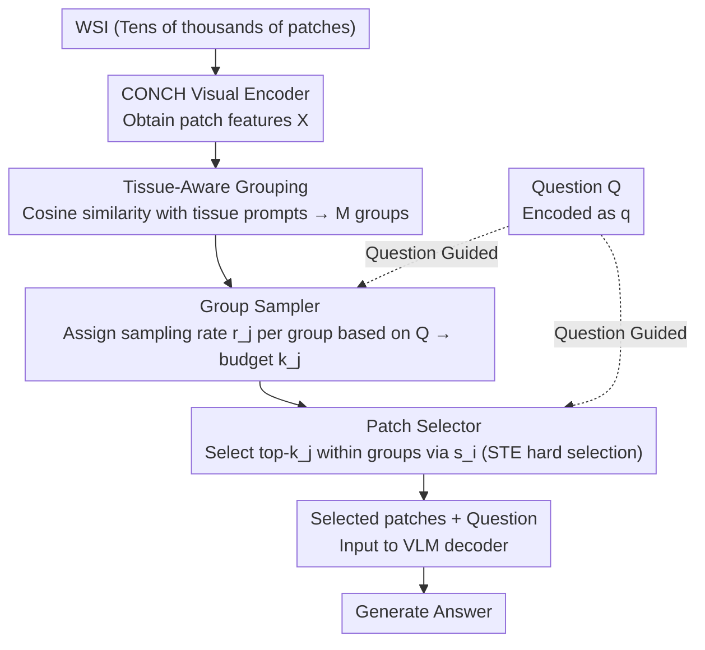

# Act Like a Pathologist: Tissue-Aware Whole Slide Image Reasoning

**Conference**: CVPR 2026  
**arXiv**: [2603.00667](https://arxiv.org/abs/2603.00667)  
**Authors**: Wentao Huang et al. (Stony Brook University, Mayo Clinic, Harvard/MGH, Stanford)  
**Area**: Medical Imaging / Pathology VQA  
**Keywords**: Whole Slide Image, Visual Question Answering, Information Bottleneck, Patch Selection, Tissue-Aware Reasoning

## TL;DR

The HistoSelect framework is proposed to simulate the coarse-to-fine reasoning process of pathologists. Through a three-tier filtering mechanism consisting of tissue segmentation → Group Sampler → Patch Selector, and based on Information Bottleneck (IB) theory, irrelevant visual tokens are compressed. This achieves SOTA performance across three datasets while reducing computational overhead by approximately 70%.

## Background & Motivation

Whole Slide Images (WSI) are the gold standard for cancer diagnosis, but a single WSI contains tens of thousands of patches. Directly inputting these into Large Language Models (LLMs) faces two major bottlenecks:

**Computational Bottleneck**: WSI resolution can reach 100,000×100,000 pixels. After tiling, tens of thousands of patches are generated. Encoding each patch as a visual token far exceeds the LLM context window.

**Information Redundancy**: Pathologists do not examine every patch during diagnosis; they first identify tissue types and then focus on regions relevant to the question—most patches are irrelevant to the current task.

Existing methods like Q-Instruct and PathChat either use uniform sampling (losing key information) or full input (computationally infeasible). The **Key Challenge** is: **How to significantly reduce the number of tokens while retaining diagnostic-relevant information?**

**Key Insight**: The actual workflow of a pathologist provides natural inspiration: first a low-magnification overview of the tissue structure, then a high-magnification deep dive into suspicious areas. HistoSelect formalizes this "coarse-to-fine" reasoning process.

## Method

### Overall Architecture

The core contradiction HistoSelect addresses is that a WSI yields tens of thousands of patches, exceeding LLM windows, yet pathologists focus only on specific regions. It formalizes this "scan-then-examine" cognitive process into three-tier filtering: first grouping patches by tissue type, then using a Group Sampler to decide the budget for each group, and finally a Patch Selector to select the most relevant patches within groups. Only these few patches are sent to the VLM. The entire pipeline is guided by the question feature $q$, ensuring that selection adapts to the specific query.

### Key Designs

**1. Tissue-Aware Grouping: Categorizing patches by tissue type**

The first step mimics the "low-mag tissue identification" of pathologists. $M$ tissue type text prompts (e.g., "tumor tissue", "stroma", "necrosis") are pre-defined by experts. The pathologist-specific CLIP model, CONCH, calculates the cosine similarity between each patch feature and these prompts. Each patch is assigned to the group with the highest similarity, resulting in $M$ groups $\{G_1, G_2, \ldots, G_M\}$. This transforms an unstructured sea of patches into semantically meaningful groups.

**2. Group Sampler: Question-dependent group budgeting (Group-level IB)**

Since different questions concern different tissues, the sampling budget for each group should vary. For each group, a group representation vector $g_j$ (mean of patch features within the group) is calculated. $g_j$ is concatenated with question encoding $q$ and passed through a two-layer MLP with a sigmoid activation to output a sampling rate $r_j \in (0,1)$. The number of retained patches is $k_j = \lceil r_j \cdot N_j \rceil$. This is constrained by an Information Bottleneck (IB) objective to maximize mutual information between $r_j$ and the answer while minimizing the complexity of $r_j$.

**3. Patch Selector: Intra-group top-k hard selection**

Once group budgets are set, specific relevant patches must be selected within the groups. A selection probability $s_i = \sigma(F_{\text{patch}}([x_i; q]))$ is calculated for each patch. Within $G_j$, patches are sorted by $s_i$ to select the top-$k_j$. Since hard selection is non-differentiable, the Straight-Through Estimator (STE) is used for gradient propagation. Unlike soft attention, hard selection physically discards irrelevant patches to save computation.

### Loss & Training

The total loss consists of three terms, reflecting the two-tier IB compression (derived from the hierarchical decomposition of the Variational Information Bottleneck (VIB) objective):

$$L = L_{\text{VQA}} + \beta_g L_{\text{group}} + \beta_p L_{\text{patch}}$$

- $L_{\text{VQA}}$: Standard VQA negative log-likelihood (auto-regressive cross-entropy of the answer sequence).
- $L_{\text{group}}$ (Group-level IB regularization): Bernoulli KL divergence between the sampling rate $r_j$ and a prior $p_j^g$. The prior $p_j^g$ is the cosine similarity between the group vector $g_j$ and question $q$.
- $L_{\text{patch}}$ (Patch-level IB regularization): Bernoulli KL divergence between the selection probability $s_i$ and a prior $p_i^p$. The prior $p_i^p$ is the cosine similarity between patch feature $x_i$ and question $q$.

Training involves end-to-end joint optimization of the Group Sampler, Patch Selector, and VLM. STE ensures gradient flow through hard selections, while cosine similarity priors provide unsupervised weak signals for selection.

## Key Experimental Results

### Main Results

| Method | SlideBench-VQA (Acc) | WSI-Bench (Acc) | In-house Ovarian (Acc) | Visual Token Reduction |
|------|---------------------|-----------------|---------------------|-------------------|
| Random Sampling | 52.3 | 48.7 | 61.2 | 70% |
| Q-Instruct | 56.1 | 51.3 | 64.8 | 0% |
| PathChat | 58.4 | 53.9 | 67.3 | 0% |
| **Ours (HistoSelect)** | **63.7** | **58.2** | **73.6** | **~70%** |

Trained on 356K QA pairs, achieving consistent SOTA across three datasets.

### Ablation Study

| Configuration | SlideBench-VQA | Change |
|------|---------------|------|
| Full HistoSelect | 63.7 | — |
| w/o Group Sampler | 59.8 | -3.9 |
| w/o Patch Selector | 60.5 | -3.2 |
| w/o IB Loss (group) | 61.2 | -2.5 |
| w/o IB Loss (patch) | 61.8 | -1.9 |
| Random patch selection | 55.1 | -8.6 |

### Key Findings

1.  **Two-tier filtering is essential**: Performance drops significantly without either the Group Sampler or Patch Selector, proving they are complementary.
2.  **IB Regularization effectiveness**: Performance decreases without IB loss, suggesting that prior-guided compression improves accuracy while saving computation.
3.  **High Interpretability**: Selected patches align closely with diagnostic-critical regions identified by senior pathologists.
4.  **No-loss 70% Compression**: Outperforms full-input methods despite massive token reduction, indicating that removing noisy patches is beneficial.

## Highlights & Insights

1.  **Cognitively Inspired Design**: Encoding domain knowledge of the "scan-then-examine" workflow into the architecture is more efficient than pure data-driven approaches.
2.  **Elegant Application of IB Theory**: Practical implementation of two-tier (group and patch level) Information Bottleneck using Bernoulli KL and cosine priors.
3.  **STE for Hard Selection**: Hard sampling meets practical efficiency requirements (true computational reduction) while maintaining trainability via STE.
4.  **Clinical Interpretability**: Beyond performance gains, the selection logic matches pathological reasoning, increasing trust and utility.

## Limitations & Future Work

1.  **Requirement for Pre-defined Tissue Types**: $M$ tissue prompts are manually set by experts, requiring reconfiguration for different diseases or organs.
2.  **CONCH Dependency**: Grouping quality depends on the encoding capability of the CONCH model; rare tissue types may be grouped inaccurately.
3.  **Information Loss in Hard Selection**: While STE enables training, discarded patches might contain subtle but useful contextual information.
4.  **Multi-scale Absence**: Currently works at a single magnification, missing out on the multi-scale pyramidal structure of WSIs.
5.  **Preprocessing Overhead**: The cost of encoding all patches and MLP inference may be non-negligible for ultra-large WSIs.

## Related Work & Insights

- **CONCH / PLIP**: Vision-language alignment models in pathology providing high-quality feature spaces.
- **Information Bottleneck**: Classic theory by Tishby et al., utilized in video understanding (AdaFocus) and NLP (VIB).
- **PathChat / LLaVA-Med**: Representative pathology VQA methods; HistoSelect can serve as a plug-and-play front-end for these models.
- **Insight**: The two-tier IB compression framework could be generalized to other hierarchical long-sequence tasks like long-form video understanding or multi-document QA.

## Rating

| Dimension | Score (1-5) | Explanation |
|------|-----------|------|
| Novelty | 4 | Novel integration of two-tier IB compression with pathological cognitive processes. |
| Technical Depth | 4 | Solid information theory foundation with sound STE and prior design. |
| Experimental Thoroughness | 4 | Verified across three datasets with comprehensive ablation and interpretability analysis. |
| Value | 5 | 70% token reduction with performance gains makes it clinically viable. |
| Writing Quality | 4 | Clear logic and intuitive illustrations. |
| **Total Score** | **4.2** | An elegant fusion of cognitive inspiration and information theory. |

<!-- RELATED:START -->

## Related Papers

- [\[CVPR 2026\] TopoSlide: Topologically-Informed Histopathology Whole Slide Image Representation Learning](toposlide_topologically-informed_histopathology_whole_slide_image_representation.md)
- [\[CVPR 2026\] Contrastive Cross-Bag Augmentation for Multiple Instance Learning-based Whole Slide Image Classification](contrastive_cross-bag_augmentation_for_multiple_instance_learning-based_whole_sl.md)
- [\[CVPR 2026\] MLLM-HWSI: A Multimodal Large Language Model for Hierarchical Whole Slide Image Understanding](mllm-hwsi_a_multimodal_large_language_model_for_hierarchical_whole_slide_image_u.md)
- [\[CVPR 2026\] Dual-Level Hypergraph Generation for Addressing Feature Scarcity in Whole-Slide Image Classification](dual-level_hypergraph_generation_for_addressing_feature_scarcity_in_whole-slide_.md)
- [\[CVPR 2026\] Turning Pre-Trained Vision Transformers into End-to-End Histopathology Whole Slide Image Models for Survival Prediction](turning_pre-trained_vision_transformers_into_end-to-end_histopathology_whole_sli.md)

<!-- RELATED:END -->
