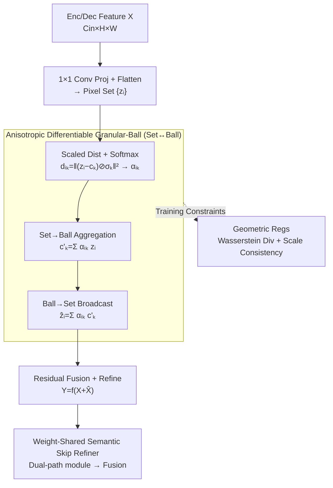

# AD-GBC: Anisotropic Granular-Ball Skip-Connection Refiner for UNet-Based Medical Image Segmentation

**Conference**: CVPR 2026  
**Paper**: [CVF OpenAccess](https://openaccess.thecvf.com/content/CVPR2026/html/Shen_AD-GBC_Anisotropic_Granular-Ball_Skip-Connection_Refiner_for_UNet-Based_Medical_Image_Segmentation_CVPR_2026_paper.html)  
**Code**: https://github.com/SiaShen-dot/AD-GBC (Available)  
**Area**: Medical Imaging  
**Keywords**: Medical Image Segmentation, Granular-Ball Computing, Anisotropic Prototypes, Differentiable Clustering, UNet skip-connection

## TL;DR
The study upgrades "point prototypes / isotropic balls" used as semantic anchors in UNet to **differentiable granular balls with anisotropic vector scales**. A bidirectional "Pixel Set ↔ Ball" aggregation-broadcasting mechanism serves as a semantic refiner for skip-connections, supplemented by two geometric regularizations to prevent anchor collapse. This approach yields consistent performance gains (average IoU +1.3~1.7%) across four medical segmentation benchmarks for both Rolling-UNet and U-KAN backbones.

## Background & Motivation

**Background**: UNet has long been the de facto standard for medical image segmentation due to its encoder-decoder structure and skip-connections. Recent improvements focus on the skip-fusion junction—specifically **prototype/slot refinement** methods like ProtoSeg, Slot Attention, and Gaussian Attention. These methods reinterpret the concatenation of "deep semantic features + shallow high-resolution features" as interactions between pixel features and a set of learnable prototypes (slots), organizing raw features into consistent semantic patterns to improve regional consistency and boundary delineation.

**Limitations of Prior Work**: While these are powerful refined skip-connectors, they model each semantic concept as a **single point** in the feature space and rely on **unidirectional or iterative attention** without explicit control over regional geometry. The authors highlight three mismatches in Fig.1: (1) **Multi-modal distribution**—a single semantic class (e.g., "lesion") often consists of multiple visual patterns (dark nuclei, inflammatory edges), which point prototypes fail to capture (especially when $K=M$). (2) **Anisotropic geometry**—classic Granular-Ball Computing (GBC) addresses multi-modality using $K \gg M$ balls but assumes each pattern is **isotropic** (scalar radius = circle), whereas real feature clusters are "elliptical." (3) **Semantic ambiguity + Class imbalance**—fitting isotropic balls to anisotropic data leads to a catastrophic trade-off: to cover the long axis, the ball must "expand," causing expanded balls of sparse lesion classes to suffer large **false overlaps** with dense background clusters, mismodeling subtle boundary ambiguities.

**Key Challenge**: The fundamental mismatch between anisotropic real data and isotropic model geometry; additionally, classic GBC faces engineering hurdles such as **non-differentiable clustering and manual radius definition**, preventing integration into end-to-end gradient-based networks.

**Goal**: (a) Evolve prototypes from "points" to bounded, learnable regions capable of describing real shapes; (b) Make this regional representation fully differentiable for end-to-end training; (c) Prevent degradation and collapse of learnable anchors.

**Key Insight**: Prototypes are relaxed from "point anchoring" to "soft region anchoring," where each concept is represented by a hyper-ellipsoid defined by a center $c_k$ and a **vector scale** $\sigma_k \in \mathbb{R}^D$, utilizing a differentiable Set→Ball→Set path for interaction with pixel features.

**Core Idea**: Replace "point prototypes / isotropic balls" with "anisotropic differentiable granular balls" to perform geometry-aware semantic alignment and purification on UNet skip-connections.

## Method

### Overall Architecture
The input to AD-GBC is a feature map $X \in \mathbb{R}^{B \times C_{in} \times H \times W}$ from a deep skip-connection, and the output is a semantically "purified" $Y$ of the same size. Instead of replacing the bottleneck, it serves as a **Semantic Skip-Connection Refiner** inserted between deep levels of the encoder and decoder (e.g., Level 3). The workflow involves: projecting and flattening the feature map into a pixel set → assigning "soft membership" to pixels using learnable granular-ball anchors → Set→Ball aggregation for regional consensus → Ball→Set broadcasting back to pixels → residual fusion + lightweight refinement to produce $Y$. During training, two geometric regularizations constrain anchor distribution and scales. A key engineering detail is **weight sharing**: the same AD-GBC module operates on both encoder and decoder paths simultaneously, forcing features from both sides to project onto the **same semantic manifold** before element-wise addition.

### Key Designs

**1. Anisotropic Differentiable Granular-Ball (AD-GBC Module): Upgrading Point Prototypes to End-to-End Hyper-ellipsoidal Regions**

This is the core contribution addressing the limitation that point prototypes/isotropic balls cannot model the shapes of real feature clusters. Each granular-ball anchor is defined by a center $c_k \in \mathbb{R}^D$ and an **anisotropic vector scale** $\sigma_k \in \mathbb{R}^D$ (constrained to be positive via Softplus). Unlike scalar radii, these dimension-wise vectors allow anchors to form learnable **hyper-ellipsoids**. Pixel $z_i$ membership is determined by "scaled distance"—measuring how many "radii" the pixel is from the center:

$$d_{i,k}=\left\|(\mathbf{z}_i-\mathbf{c}_k)\oslash\boldsymbol{\sigma}_k\right\|_2^2$$

where $\oslash$ denotes element-wise division. This dimension-wise $\sigma_k$ allows the model to be "tolerant along the long axis and strict along the short axis," geometrically resolving the isotropic dilemma. Distance is normalized via Softmax with temperature $\tau$ for fuzzy membership weights:

$$\alpha_{i,k}=\frac{\exp(-d_{i,k}/\tau)}{\sum_{j=1}^{K}\exp(-d_{i,j}/\tau)}$$

This is followed by bidirectional interaction: **Set→Ball aggregation** consolidates pixel information into regional descriptors $c'_k=\sum_i \alpha_{i,k}\mathbf{z}_i$ (regional consensus for denoising); **Ball→Set broadcasting** redistributes this regional context back to pixels $\hat{\mathbf{z}}_i=\sum_k \alpha_{i,k}\mathbf{c}'_k$. After reshaping to $\hat{X}$, residual fusion and lightweight refinement (3×3 Conv-BN-ReLU) are applied:

$$\mathbf{Y}=f_{\text{refine}}(\mathbf{X}+\hat{\mathbf{X}})$$

The residual ensures training stability and preserves local details. Implementation note: When $\sigma_k$ degrades to a scalar and the consensus step is removed, AD-GBC **degenerates into a standard Gaussian kernel weighting**—identifying it as a strict generalization of Gaussian Attention that adds "anisotropy + regional consensus." The complexity $O(N \cdot (C_{in}D + KD + C_{in}^2))$ is linear relative to pixel count $N$, making it scalable for high-resolution images.

**2. Weight-Shared Semantic Skip-Connection Refiner: Aligning Enc/Dec Features to the Same Semantic Manifold**

Standard skip-connections perform naive concatenation/addition of deep semantic and shallow high-resolution features. However, deep features often carry noise or irrelevant context. Ours employs a **dual-path + shared weight** strategy: encoder features pass through a "Shared AD-GBC" to be purified via $K$ granular balls; concurrently, upsampled decoder features pass through **the same** AD-GBC module. The purified features are then added element-wise. This forces both paths to align with the same learnable semantic anchors, eliminating semantic misalignment. This module is selectively placed in deeper, semantically richer skip levels.

**3. Geometric Regularization: Preventing Anchor Collapse and Ensuring Scale Consistency**

Without guidance, learnable $\{c_k\}$ and $\{\sigma_k\}$ may degrade (centers collapsing into low-dimensional subspaces or unstable scale estimates). Two complementary regularizations are used:

*Wasserstein Divergence Loss $\mathcal{L}_{\text{W-div}}$*: To prevent "semantic collapse" where multiple centers cluster into low-dimensional subspaces. While squaring pairwise cosine similarities ($\mathcal{L}_{\text{cos-div}}$) is common, **Theorem 1** proves it **cannot detect semantic collapse**: if the normalized Gram matrix $G(\mathbf{C})$ has rank $r < K$, there exists a low-dimensional embedding $\tilde{\mathbf{C}} \in \mathbb{R}^{K \times r}$ such that $G(\tilde{\mathbf{C}}) = G(\mathbf{C})$, resulting in identical cosine loss. Instead, a Wasserstein-inspired loss regularizes the entire distribution:

$$\mathcal{L}_{\text{W-div}}(\mathbf{C})=\underbrace{\|\hat{\mu}_C\|_2^2}_{\text{Centering}}+\underbrace{\operatorname{tr}(\hat{\Sigma}_C)-\frac{2}{\sqrt{D}}\operatorname{tr}(\hat{\Sigma}_C^{1/2})}_{\text{Spectral Uniformity}}$$

where $\hat{\mu}_C, \hat{\Sigma}_C$ are the empirical mean and covariance of the centers. This encourages "high-rank, spread-out" distributions.

*Scale Consistency Loss $\mathcal{L}_{\text{scale-con}}$*: Anisotropic scales $\sigma_k$ receive weak supervision from task losses. The authors calculate "observed anisotropic variance" $\mathbf{s}_k^2=\frac{\sum_i \alpha_{i,k}(\mathbf{z}_i-\mathbf{c}_k)^{\circ 2}}{\sum_i \alpha_{i,k}+\epsilon}$ (where $(\cdot)^{\circ 2}$ is element-wise square) and force learnable $\sigma_k^2$ to approximate it:

$$\mathcal{L}_{\text{scale-con}}=\frac{1}{K}\sum_{k=1}^{K}\left\|\text{detach}(\mathbf{s}_k^2)-\boldsymbol{\sigma}_k^2\right\|_2^2$$

`detach` is critical to break the circular dependency "$\sigma_k \to \alpha_{i,k} \to s_k^2$," creating a stable one-way constraint pulling the learnable scale toward the observed one.

### Loss & Training
The composite end-to-end objective is:
$$\mathcal{L}_{\text{total}}=\mathcal{L}_{\text{task}}+\lambda\,\mathcal{L}_{\text{W-div}}+\beta\,\mathcal{L}_{\text{scale-con}}$$
$\mathcal{L}_{\text{task}}$ is a BCE + Dice combination. $\lambda \in \{0.01, 0.1\}$, $\beta \in \{0.1, 0.05\}$. Granular-ball count $K=32$. Adam optimizer is used with a base lr of $1\times10^{-4}$ and a specific GBC lr of $1\times10^{-2}$. Trained for 400 epochs on an A100.

## Key Experimental Results

### Main Results
Evaluation spans four benchmarks: BUSI (Breast Ultrasound), GlaS (Histopathology), CVC-ClinicDB (Colonoscopy), and ISIC17 (Dermoscopy). AD-GBC is integrated as a plug-and-play module into Rolling-UNet and U-KAN.

Selected IoU results (%) across datasets:

| Backbone + AD-GBC | BUSI IoU | GlaS IoU | CVC IoU | ISIC17 IoU |
|--------------|----------|----------|---------|------------|
| Rolling-UNet-M | 66.41 → 67.36 | 85.86 → 88.16 | 84.93 → 87.07 | 83.51 → 84.88 |
| Rolling-UNet-L | 67.85 → 69.30 | 87.99 → 89.37 | 85.77 → 87.45 | 84.10 → 84.95 |
| U-KAN | 65.76 → **69.86** | 87.65 → 88.64 | 84.94 → 85.03 | 84.52 → 84.59 |

Efficiency and average IoU (selected):

| Method | Params(M)↓ | GFLOPs↓ | Avg IoU↑ | Gain |
|------|-----------|---------|-----------|------|
| Rolling-UNet-M | 7.10 | 66.25 | 80.18 | — |
| + AD-GBC | 7.25 | 77.27 | 81.87 | **+1.69** |
| U-KAN | 6.35 | 14.02 | 80.72 | — |
| + AD-GBC | 6.51 | 16.77 | 82.03 | **+1.31** |

The cost is minimal: ≈2% extra parameters and ≈15–20% GFLOPs increase for significant gains.

### Ablation Study
Components dissected on GlaS:

| Config | IoU↑ | F1↑ | HD95↓ | Note |
|------|------|-----|-------|------|
| Baseline (Rolling-UNet-L) | 87.99 | 93.47 | 0.65 | No GBC |
| + GBC (Isotropic scalar σ) | 88.12 | 93.67 | 0.63 | Marginal gain |
| + GBC (Anisotropic vector σ) | 88.28 | 93.88 | 0.59 | Clear boundary improvement |
| + Full Regularization | **89.63** | **94.51** | **0.51** | Synergistic effect |

### Key Findings
- **Anisotropy is the primary driver but requires regularization**: Isotropic GBC shows marginal gains; vector scales improve HD95 from 0.63 to 0.59. Only when "stabilized" by both regularizations does the gain jump to 89.63%.
- **Plug-and-play and generalizable**: Stable gains across S/M/L scales of Rolling-UNet and the unique U-KAN architecture.
- **Interpretability**: Visualization shows anchors specializing in semantic regions (lesion core vs. healthy skin, texture/boundary/background suppression).

## Highlights & Insights
- **Clear "Point → Ball → Ellipsoid" geometric evolution**: The motivation for why "circles fail and ellipses succeed" is clearly explained—isotropic balls must over-expand to cover long axes, causing false background overlap.
- **Theorem 1 is a standout**: It uses rank deficiency to prove cosine diversity cannot detect semantic collapse, justifying the use of Wasserstein spectral uniformity.
- **Degeneration Relationship**: AD-GBC simplifies into Gaussian Attention under certain constraints, clearly positioning it as an "anisotropic + regional consensus" generalization.

## Limitations & Future Work
- **CNN-only validation**: While theoretically compatible with Transformer-based models (TransUNet, Swin-UNet), AD-GBC has not yet been tested there.
- **Small binary datasets**: Evaluated primarily on single-target medical datasets; scalability to large-scale multi-organ scenarios is unknown.
- **Hyperparameter sensitivity**: Temperature $\tau$ and $K$ require tuning based on anchor density.

## Related Work & Insights
- **vs Gaussian Attention**: Gaussian Attention uses implicit, unbounded kernels; AD-GBC models **bounded anisotropic regions** with explicit pixel-region consensus updates.
- **vs Slot Attention / ProtoSeg**: Previous methods use point anchors and iterative attention; AD-GBC uses "center + explicit geometry" with single-step differentiable Set↔Ball interactions.
- **vs Classic GBC**: Classic GBC is non-differentiable and isotropic; AD-GBC modernizes it into a differentiable, anisotropic deep learning module.

## Rating
- Novelty: ⭐⭐⭐⭐ 
- Experimental Thoroughness: ⭐⭐⭐⭐ 
- Writing Quality: ⭐⭐⭐⭐⭐ 
- Value: ⭐⭐⭐⭐ 

<!-- RELATED:START -->

## Related Papers

- [\[CVPR 2026\] From Infusion to Assimilation Distillation for Medical Image Segmentation](from_infusion_to_assimilation_distillation_for_medical_image_segmentation.md)
- [\[CVPR 2026\] SegMoTE: Token-Level Mixture of Experts for Medical Image Segmentation](segmote_token-level_mixture_of_experts_for_medical_image_segmentation.md)
- [\[CVPR 2026\] PMRNet: Physics-informed Multi-scale Refinement Network for Medical Image Segmentation](pmrnet_physics-informed_multi-scale_refinement_network_for_medical_image_segment.md)
- [\[CVPR 2026\] GeoSemba: Reconstructing State Space Model for Cross Paradigm Representation in Medical Image Segmentation](geosemba_reconstructing_state_space_model_for_cross_paradigm_representation_in_m.md)
- [\[CVPR 2026\] Simple-ViLMedSAM: Simple Text Prompts Meet Vision-Language Models for Medical Image Segmentation](simple-vilmedsam_simple_text_prompts_meet_vision-language_models_for_medical_ima.md)

<!-- RELATED:END -->
