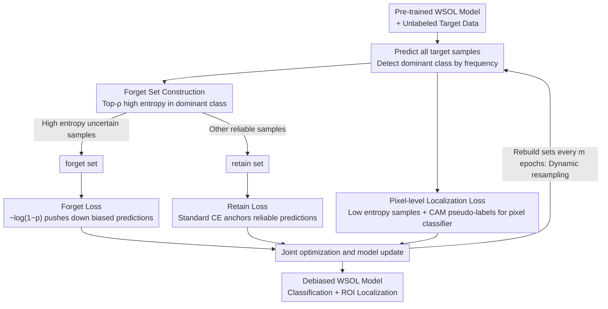

# Adaptation of Weakly Supervised Localization in Histopathology by Debiasing Predictions

**Conference**: CVPR 2026  
**arXiv**: [2603.12468](https://arxiv.org/abs/2603.12468)  
**Code**: [anonymous.4open.science/r/SFDA-DeP-1797/](https://anonymous.4open.science/r/SFDA-DeP-1797/)  
**Authors**: Alexis Guichemerre et al. (ÉTS Montréal, Sorbonne Université, University of York, McGill University)  
**Area**: Medical Image / Pathological Image Analysis  
**Keywords**: WSOL, Source-Free Domain Adaptation, Prediction Bias Correction, Machine Unlearning, Pathological Image

## TL;DR

SFDA-DeP is proposed, which, inspired by machine unlearning, redefines SFDA as an iterative process of "identifying and correcting prediction bias." It performs "forgetting" operations on high-entropy uncertain samples within the dominant class to force the model to abandon biased predictions, maintains self-training for reliable samples, and anchors localization capabilities with a pixel-level classifier. It consistently outperforms existing SFDA methods on cross-organ and cross-center pathology benchmarks.

## Background & Motivation

### Background

Weakly Supervised Object Localization (WSOL) models have garnered significant attention in digital pathology—requiring only image-level labels (e.g., "tumor present/absent") to simultaneously perform classification and Region of Interest (ROI) localization, which substantially reduces reliance on pixel-level annotations. Representative methods include CAM-based PixelCAM, attention-based DeepMIL, and Transformer-based SAT.

### Limitations of Prior Work

WSOL models suffer severe performance degradation during **cross-domain deployment** (different organs, medical centers, or staining/scanning protocols). Crucially, this degradation is not solely caused by low-level appearance changes—the authors observed that when migrating from GlaS (colon glands) to CAMELYON16/17 (breast lymph node metastasis detection), the model predicts almost all samples as cancer, resulting in extreme **prediction bias**.

### Key Challenge

Source-Free Domain Adaptation (SFDA) is the main framework for addressing cross-domain deployment—adapting without access to source data using only unlabeled target data. However, existing SFDA methods (e.g., SFDA-DE, CDCL, ERL) essentially rely on self-training (pseudo-labeling + self-training), which implicitly assumes that the source classifier still produces reasonable predictions on the target domain. When predictions are already heavily biased toward a dominant class, self-training **amplifies the bias**—since the dominant class governs pseudo-labels, the model becomes increasingly biased during training. Fig.1 clearly demonstrates this vicious cycle: SFDA-DE bias actually worsens after adaptation, nearly collapsing into a single class.

### Key Insight

The authors draw inspiration from **machine unlearning**: the goal is not for the model to forget a specific class or source knowledge, but to "forget" incorrect category boundaries. Specifically, if the model's predictions for certain dominant class samples are inherently uncertain (high entropy), these predictions should be actively suppressed to force the decision boundary to readjust.

### Core Idea

A dual-set mechanism of "forgetting high-entropy dominant samples + retaining reliable samples" is used for periodic prediction bias correction, replacing the indiscriminate self-training of traditional SFDA.

## Method

### Overall Architecture

The input to SFDA-DeP is a WSOL model $f$ pre-trained on the source domain and an unlabeled target dataset $\mathbb{T}$. The adaptation process is iterative:

1.  Predict all target samples using the current model → identify the dominant class (the class with excessively high prediction frequency).
2.  Select a high-entropy (uncertain) subset from the dominant class samples as the **forget set** $\mathbb{B}_f$.
3.  The remaining samples form the **retain set** $\mathbb{B}_r$.
4.  Apply a "forget" loss to the forget set and a retain loss to the retain set, combined with a pixel-level localization loss.
5.  Rebuild the forget/retain sets every $m$ epochs to dynamically track boundary shifts.

### Key Designs

**1. Forget Set Construction: Identifying uncertain samples forced into the dominant class**

The first step in bias correction is locating "problematic samples." Instead of applying a blanket approach to all dominant class samples, the authors focus only on those the model itself is uncertain about. Normalized entropy $H(x)$ is used to measure uncertainty for each prediction. The dominant class sample set is defined as $\mathbb{B} = \{x \in \mathbb{T}: \hat{y}(x) \in \mathcal{B}\}$, and the top-$\rho$ subset with the highest entropy forms the forget set $\mathbb{B}_f = \text{top}_\rho(\mathbb{B}, H(x))$. High-entropy samples are chosen because they reside near the decision boundary—the model has the least confidence when assigning them to the dominant class, making them the most likely to be misclassified. Targeting these samples offers high correction efficiency without harming confident, correct predictions.

**2. Forget Loss: Using inverse cross-entropy to "release" the model's grip**

After identifying the forget set, the challenge is getting the model to abandon these biased predictions. The forget loss $\mathcal{L}_{\text{forget}} = \mathbb{E}_{x_i \in \mathbb{B}_f}[-\log(1 - p_i(\hat{y}))]$ is simple in form but acts as the inverse of standard cross-entropy: minimizing it is equivalent to **maximizing** the cross-entropy of the model with respect to the current pseudo-label $\hat{y}$. This actively lowers the model's confidence in the dominant class for these samples, "pulling them back" from the collapsed decision surface. This term works in tandem with the standard cross-entropy loss applied to the retain set $\mathcal{L}_{\text{retain}} = \mathbb{E}_{x_i \in \mathbb{B}_r}[-\log(p_i(\hat{y}))]$: predictions for reliable samples are anchored, while biased predictions for uncertain samples are released. Together, these forces pull the category boundary back to a reasonable position—applying the machine unlearning logic to the misdrawn boundary rather than a specific class.

**3. Pixel-level Localization Loss: Adding a separate anchor for localization**

Correcting bias at the classification level alone is insufficient. After domain shift, the appearance of the target ROI might differ significantly from the source domain. Even if the classification boundary is corrected, localization capability might drift away during adaptation. Thus, a lightweight pixel-level classifier $h$ is trained to classify each pixel as foreground (ROI) or background. Supervision is gathered by selecting the most reliable sample subset $D_{\text{loc}}$ with the lowest entropy for each predicted class $k$, extracting pixel-level pseudo-labels $\bm{Y}$ from the source model's CAM, and training $h$ using binary cross-entropy:

$$\mathcal{L}_{\text{loc}} = -(1-\bm{Y}_p)\log(h(z_p)_0) - \bm{Y}_p\log(h(z_p)_1)$$

Selecting low-entropy samples for pseudo-label generation is critical—it ensures the localization anchor remains clean, allowing the model to correct bias without losing spatial awareness of the ROI.

**4. Dynamic Resampling: Making forgetting decisions reversible**

The division of forget/retain sets is not permanent. Initially, model bias is strongest, meaning the calculated entropy and prediction distribution are unreliable. Fixating on the first-round division would lead to irreversible accumulation of early forgetting errors. Instead, the model recalculates the prediction distribution and entropy every $m$ epochs to rebuild the sets. As the boundary shifts, samples previously deemed uncertain might become reliable and return to the retain set, while formerly stable retain samples might show new bias and require forgetting. This periodic reconstruction serves as an implicit curriculum learning strategy, adjusting the correction targets as the boundary evolves.

### Loss & Training

Total loss:

$$\mathcal{L} = \lambda_{\text{retain}}\mathcal{L}_{\text{retain}} + \lambda_{\text{forget}}\mathcal{L}_{\text{forget}} + \lambda_{\text{loc}}\mathcal{L}_{\text{loc}}$$

Hyperparameter search ranges: $\lambda_{\text{retain}}, \lambda_{\text{forget}} \in \{0.2, 0.5, 1.0, 2.0\}$, $\lambda_{\text{loc}} \in \{0.5, 1.0, 5.0\}$, $\rho \in \{5\%, 15\%, 25\%\}$.

## Key Experimental Results

### Main Results (GlaS → CAMELYON16/17, Cross-organ + Cross-center)

| WSOL Model | Method | Avg PxAP | Avg CL |
|-----------|------|----------|--------|
| PixelCAM | Source only | 36.9 | 49.3 |
| PixelCAM | SFDA-DE | 28.0 | 54.6 |
| PixelCAM | ERL | 25.4 | 59.9 |
| PixelCAM | RGV | 34.7 | 52.1 |
| PixelCAM | **SFDA-DeP** | **44.1** | **67.1** |
| SAT | Source only | 21.3 | 52.1 |
| SAT | SFDA-DE | 21.6 | 68.7 |
| SAT | ERL | 22.2 | 68.9 |
| SAT | **SFDA-DeP** | **30.3** | **69.2** |
| DeepMIL | Source only | 20.9 | 49.8 |
| DeepMIL | SFDA-DE | 20.5 | 53.9 |
| DeepMIL | ERL | 16.2 | 57.8 |
| DeepMIL | **SFDA-DeP** | **40.7** | **73.4** |

### Ablation Study

| Configuration | Key Effect | Description |
|------|---------|------|
| W/o $\mathcal{L}_{\text{loc}}$ | Significant PxAP drop | Missing pixel anchor leads to localization drift |
| Static sampling (no rebuild) | Performance significantly worse than dynamic | Early mis-forgetting becomes irreversible |
| Too low resampling frequency | Performance drop | Delayed tracking of boundary changes |
| Too high resampling frequency | Slights performance drop | Unstable sets cause training jitter |

### Key Findings

1.  **SFDA baselines fail under strong bias**: SFDA-DE stays at 50% CL (equivalent to random guessing) across multiple centers, and its PxAP is often lower than source-only, proving self-training indeed amplifies bias.
2.  **Greatest gain on DeepMIL** (+20.2 PxAP, +19.5 CL vs SFDA-DE), indicating bias correction is more helpful for models with weaker inherent localization.
3.  **Most significant gain at C17-0 center** (PixelCAM jumped from 50.0% to 86.2% CL), which was the center with the worst initial bias.
4.  **Dynamic resampling is critical**: Static forget/retain partitioning leads to irreversible error accumulation.
5.  **Qualitative Analysis**: SFDA-DeP's CAM activations focus on tumor tissue, whereas SFDA baselines under strong shift activate background regions.

## Highlights & Insights

1.  **Precise Problem Diagnosis**: It clearly identifies that the root cause of SFDA failure is "bias amplification" rather than "insufficient adaptation." The experimental analysis in Fig. 1 is intuitive and powerful.
2.  **Creative Adoption of Machine Unlearning**: Instead of truly "forgetting a category," it uses the forgetting mechanism to reshape decision boundaries—the forget loss $-\log(1-p(\hat{y}))$ is elegant and efficient.
3.  **Cross-architecture Consistency**: Effectiveness across CNN-based (PixelCAM/DeepMIL) and Transformer-based (SAT) WSOL architectures shows portability and decoupling from the backbone.
4.  **Dual-set Dynamic Resampling**: Rebuilding every $m$ epochs avoids the accumulation of pseudo-label noise and acts as an implicit curriculum learning strategy.

## Limitations & Future Work

1.  **Binary Classification Constraint**: Experiments are limited to binary classification (tumor vs normal). Dominant class bias patterns are more complex in multi-class scenarios, requiring adjustments to forget set construction.
2.  **Sensitivity to ρ**: The forget ratio $\rho$ requires manual search; too small results in insufficient correction, while too large might mistakenly forget correct predictions. Adaptive $\rho$ is worth exploring.
3.  **CAM Pseudo-label Quality**: Pixel-level localization depends on the CAM quality of the source model. If the source CAM is inaccurate, $\mathcal{L}_{\text{loc}}$ may introduce noise.
4.  **Computational Overhead**: Re-calculating the distribution and entropy for the entire target dataset every $m$ epochs could become a bottleneck for large-scale data.
5.  **Missing Comparison with UDA**: Comparisons were only made against SFDA methods. Evaluation against UDA methods with source data access is needed to assess performance loss from the source-free constraint.

## Related Work & Insights

-   **vs SFDA-DE**: SFDA-DE attempts adaptation via distribution estimation but lacks a bias correction mechanism, failing completely under dominant bias. SFDA-DeP directly addresses this.
-   **vs ERL/RGV**: ERL uses regularization and RGV uses generative replay, but neither explicitly handles class prediction imbalance. Both struggle under strong shifts.
-   **vs Machine Unlearning (Basak & Yin, ECCV'24)**: Traditional machine unlearning removes specific data or class knowledge. SFDA-DeP innovatively uses forgetting to reshape boundaries rather than delete knowledge.
-   **Insight**: The dual-set forget/retain strategy could be generalized to other self-training scenarios with pseudo-label bias, such as long-tail distributions in semi-supervised learning or class imbalance in self-supervised pre-training.

## Rating

-   Novelty: ⭐⭐⭐⭐ The transfer of machine unlearning to bias correction is novel, though the framework remains relatively simple.
-   Experimental Thoroughness: ⭐⭐⭐⭐ Sufficient ablation and qualitative analysis across three datasets, three WSOL models, and four SFDA baselines.
-   Writing Quality: ⭐⭐⭐⭐ Motivation is clear, Fig. 1 is a strong diagnostic tool, and math notation is standard.
-   Value: ⭐⭐⭐⭐ Identifies a core failure mode of SFDA in pathology and provides a practical solution.

<!-- RELATED:START -->

## Related Papers

- [\[CVPR 2026\] Tell2Adapt: A Unified Framework for Source Free Unsupervised Domain Adaptation via Vision Foundation Model](tell2adapt_a_unified_framework_for_source_free_unsupervised_domain_adaptation_vi.md)
- [\[CVPR 2026\] Bridging RGB and Hematoxylin Components: An Interleaved Guidance and Fusion Framework for Point Supervised Nuclei Segmentation](bridging_rgb_and_hematoxylin_components_an_interleaved_guidance_and_fusion_frame.md)
- [\[CVPR 2026\] Semantic Class Distribution Learning for Debiasing Semi-Supervised Medical Image Segmentation](semantic_class_distribution_learning_for_debiasing.md)
- [\[CVPR 2026\] URICA: A Uniformity Region Affine Identifier Capture Algorithm for Arbitrary Region Retrieval in Pathology Images](urica_a_uniformity_region_affine_identifier_capture_algorithm_for_arbitrary_regi.md)
- [\[CVPR 2026\] IVAAN: Instance-level Vision-Language Alignment via Attribute-Guided Text Prompts Generation for Nuclei Analysis](ivaan_instance-level_vision-language_alignment_via_attribute-guided_text_prompts.md)

<!-- RELATED:END -->
