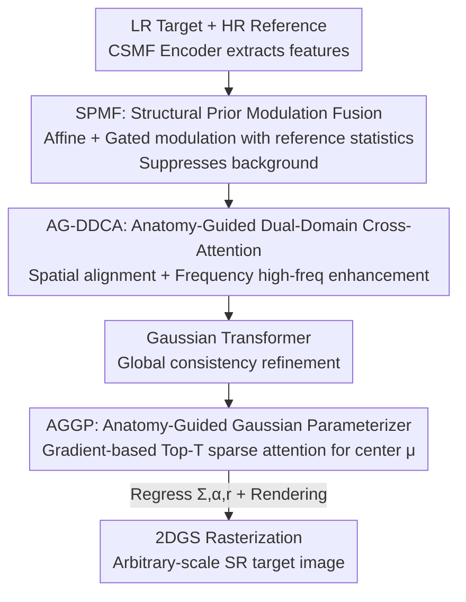

# Adaptive Anisotropic Gaussian Splatting for Multi-contrast MRI Arbitrary-Scale Super-Resolution with Anatomy Guidance

**Conference**: CVPR 2026  
**Paper**: [CVF Open Access](https://openaccess.thecvf.com/content/CVPR2026/html/Yan_Adaptive_Anisotropic_Gaussian_Splatting_for_Multi-contrast_MRI_Arbitrary-Scale_Super-Resolution_with_CVPR_2026_paper.html)  
**Code**: https://github.com/Qiuhai-CV/GaussM2ASR  
**Area**: Medical Imaging  
**Keywords**: Multi-contrast MRI, Arbitrary-scale super-resolution, 2D Gaussian Splatting, Spectral bias, Anatomical prior

## TL;DR
GaussM2ASR reformulates multi-contrast MRI arbitrary-scale super-resolution (ASSR) from "INR direct regression of pixel intensity" to "learning parameters for a set of anisotropic 2D Gaussian kernels." By using narrow kernels to fit high-frequency anatomical boundaries and wide kernels for smooth low-frequency regions, combined with three anatomy-driven modules to align structures with high-resolution reference images, it outperforms existing SOTA methods in PSNR/SSIM across IXI, BraTS, and fastMRI datasets.

## Background & Motivation

**Background**: In clinical practice, a rapidly acquired high-resolution (HR) contrast (e.g., T1) is often used as a reference to super-resolve a target contrast (e.g., T2) that is slower to acquire. To adapt to various non-integer scaling requirements, the mainstream approach relies on Implicit Neural Representations (INR)—modeling the image as a continuous function $f:\mathbb{R}^2\to\mathbb{R}$, where an MLP maps coordinates $(x,y)$ to pixel intensities (e.g., McASSR, Dual-ArbNet, DINet).

**Limitations of Prior Work**: INR-based methods suffer from inherent **spectral bias**—over-parameterized networks tend to converge first to low-frequency solutions during gradient optimization. This results in good fitting of smooth regions but an inability to handle "sharp high-frequency transitions" at tissue boundaries, leading to overly smooth reconstructions and blurred anatomical borders. Furthermore, INR often depends on interpolating discrete feature grids, which acts as a low-pass filter, further attenuating high frequencies.

**Key Challenge**: High-frequency anatomical details (lesion boundaries, tissue interfaces) are crucial for clinical diagnosis but fall into the frequency range that is hardest for INR to learn. The fundamental issue lies in the modeling paradigm of **direct pixel intensity regression**, which naturally favors low frequencies.

**Key Insight**: The authors draw inspiration from the advantages of 3D Gaussian Splatting (3DGS) over NeRF in 3D scene reconstruction—3DGS uses explicit, optimizable Gaussian basis functions to represent scenes, offering faster convergence and better preservation of fine geometry and high-frequency details. By porting this paradigm to 2D medical imaging and having the model learn parameters of anisotropic Gaussian kernels rather than regressing pixels, the "hard-to-converge regression problem" of high-frequency reconstruction is transformed into optimization over a smoother parameter space. Anisotropic kernels can **dynamically adjust variance**: narrow kernels capture boundary high frequencies, while wide kernels cover uniform low frequencies. Fig. 2(c) in the paper shows that 2DGS significantly outperforms INR in convergence speed and quality for high-frequency structures.

**Core Idea**: Replace "INR direct pixel regression" with "learning anisotropic 2D Gaussian parameters + anatomy-guided Gaussian centers," transforming the most difficult high-frequency anatomical reconstruction in multi-contrast MRI ASSR into a more optimizable problem.

## Method

### Overall Architecture

GaussM2ASR takes an LR target image $I_{tar}\in\mathbb{R}^{h\times w\times 1}$ and an HR reference image $I_{ref}\in\mathbb{R}^{H\times W\times 1}$ as input to output an arbitrary-scale HR target image. The **Mechanism** involves: encoding both images into features with anatomical priors, strengthening high frequencies and aligning structures in both spatial and frequency domains, and finally predicting parameters (center, covariance, opacity, grayscale) for each Gaussian kernel to render the SR image via 2DGS rasterization.

The pipeline consists of four steps: (1) **CSMF Encoder** (Cross-Scale Multi-contrast Fusion) extracts multi-scale deep features; (2) **SPMF Module** applies affine modulation and gated fusion using statistical anatomical priors from the reference image to suppress background interference; (3) **AG-DDCA Module** introduces learnable Gaussian prompts and scale embeddings to perform cross-attention in both spatial and frequency domains, refining prompts for different scaling factors and enhancing high frequencies; a Gaussian Transformer follows for global consistency; (4) **AGGP Module** uses anatomical gradients and Top-T sparse attention to anchor Gaussian centers to boundaries, while other parameters ($\Sigma,\alpha,r$) are regressed via lightweight MLP heads.

2DGS rendering follows the standard definition: each Gaussian is described by mean $\mu\in\mathbb{R}^2$ and covariance $\Sigma\in\mathbb{R}^{2\times2}$,

$$G(x)=\frac{1}{2\pi|\Sigma|^{1/2}}\exp\!\left(-\tfrac{1}{2}(x-\mu)^\top\Sigma^{-1}(x-\mu)\right),$$

where anisotropy is parameterized via two standard deviations $\sigma_x,\sigma_y$ and a correlation coefficient $\rho$ ($\Sigma=\begin{bmatrix}\sigma_x^2&\rho\sigma_x\sigma_y\\\rho\sigma_x\sigma_y&\sigma_y^2\end{bmatrix}$). During rasterization, the intensity of a pixel is the alpha-blended sum of $N$ overlapping Gaussians: $f(x)=\sum_{i=1}^{N}\alpha_i r_i G_i(x)$.

### Key Designs

**1. Anisotropic 2D Gaussian Splatting: Replacing high-freq regression with smooth parameter optimization**

This targets the fundamental pain point of blurred boundaries caused by INR spectral bias. Instead of outputting pixel intensity directly, the network learns parameters $(\mu,\Sigma,\alpha,r)$ for Gaussian kernels, rendering the image as a "superposition of adjustable basis functions." The key is that the covariance $\Sigma$ is parameterized by $\sigma_x,\sigma_y,\rho$, allowing anisotropic stretching and rotation. The model automatically learns **narrow and sharp** Gaussians to fit sharp transitions at anatomical boundaries and **wide** Gaussians for uniform tissues. This works because fitting high-frequency details is converted from "hard pixel regression in a low-frequency biased network" to "optimizing Gaussian shapes in a smoother parameter space," which is much more gradient-friendly.

**2. Structural Prior Modulation Fusion (SPMF): Suppressing background and highlighting anatomical channels**

MRI images typically concentrate structures in the center with large untextured backgrounds and suffer from statistical distribution shifts between contrasts. SPMF addresses this in two steps. First, it calculates channel-wise scaling and bias $(\gamma,\beta)=\Phi(\mathrm{GAP}(F_{ref}))$ from reference global statistics to perform affine transformation $\hat F_{tar}=(1+\gamma)\odot F_{tar}+\beta$, amplifying channels encoding high-frequency structures. Second, a pixel-wise gate $g=\mathrm{Sigmoid}(\Phi(\mathrm{Concat}[\hat F_{tar},F_{ref}]))$ performs spatial refinement. The gate $g$ preserves target features in structural regions while relying on the reference in information-sparse regions, suppressing background noise spatially.

**3. Anatomy-Guided Dual-Domain Cross-Attention (AG-DDCA): Recovering high frequencies in the frequency domain**

Spatial-only fusion often fails to capture high frequencies critical for diagnosis. AG-DDCA introduces a learnable Gaussian prompt $P$ with scale embedding $S$, enabling scale-aware cross-attention. The prompt acts as query $Q$ for parallel attention: the spatial branch $\mathrm{Att}_{spat}$ captures global context, while the frequency branch $\mathrm{Att}_{freq}$ operates directly on **Fourier amplitude spectra** to specifically reinforce edges. The outputs are merged via dynamic gating conditioned on $P$: $F=\epsilon_s\odot\mathrm{Att}_{spat}+\epsilon_f\odot\mathrm{Att}_{freq}$. Explicitly extracting high frequencies in the frequency domain compensates for the low-frequency bias of spatial attention.

**4. Anatomy-Guided Gaussian Parameterizer (AGGP): Anchoring centers to boundaries via anatomical gradients**

In continuous Gaussian representation, the center $\mu$ determines the influence range. Misalignment results in the model using wider Gaussians to compensate, smoothing edges. AGGP calculates a gradient map $G=\nabla I_{ref}$ from the reference image (high gradient = boundary) and performs **Top-T sparse cross-attention** with features $\tilde F$. It generates a binary mask $M$ by keeping only the Top-T largest attention scores, ensuring center prediction focuses solely on anatomical edges and suppresses uniform regions. Finally, it predicts a **center offset** $\mu_o$ relative to a uniform initialization $\mu_i$: $\mu=\mu_i+\mu_o$. This ensures full coverage while allowing adaptive shifting toward anatomical structures.

### Loss & Training

The total loss is $\mathcal{L}_{total}=\mathcal{L}_{spa}+\lambda_{freq}\mathcal{L}_{freq}+\lambda_{ref}\mathcal{L}_{ref}$, with $\lambda_{freq}=0.01$ and $\lambda_{ref}=0.3$. $\mathcal{L}_{spa}$ is MAE for pixel fidelity; $\mathcal{L}_{freq}$ minimizes MAE in the Fourier domain for high-frequency preservation; $\mathcal{L}_{ref}$ ensures reference feature embeddings can reconstruct the HR reference to stabilize cross-contrast prior transfer.

A **two-stage strategy** is used: first, pre-train with HR target images (to let AGGP learn anatomy-aware initialization), then **freeze AGGP** and fine-tune the entire network with LR inputs. Single-stage training directly on LR leads to significant performance drops.

## Key Experimental Results

Datasets: IXI (T1→T2), BraTS (T1→T2), fastMRI (FD→FSPD). LR images are generated via k-space cropping at scales $S\in(1,4]$. Evaluation includes in-distribution (1.5/2/3/4×) and out-of-distribution (5/6×) scales.

### Main Results

Results for 4× (in-distribution) and 6× (out-of-distribution) scales:

| Dataset | Scale | Metric | Ours | Prev. SOTA (DINet) | Gain |
|--------|------|------|------|------|------|
| IXI | 4× | PSNR / SSIM | 32.03 / 0.9350 | 30.98 / 0.9084 | +1.05 / +0.027 |
| IXI | 6×(OOD) | PSNR / SSIM | 26.89 / 0.8295 | 26.58 / 0.8261 | +0.31 / +0.003 |
| BraTS | 4× | PSNR / SSIM | 34.65 / 0.9621 | 33.32 / 0.9543 | +1.33 / +0.008 |
| BraTS | 6×(OOD) | PSNR / SSIM | 29.85 / 0.9225 | 29.54 / 0.9143 | +0.31 / +0.008 |
| fastMRI | 4× | PSNR / SSIM | 30.53 / 0.7410 | 28.76 / 0.7164 | +1.77 / +0.025 |
| fastMRI | 6×(OOD) | PSNR / SSIM | 26.69 / 0.6728 | 25.93 / 0.6672 | +0.76 / +0.006 |

GaussM2ASR ranks first across all datasets and scales. Specifically, for SSIM, the lead is substantial, confirming its advantage in faithful anatomical structure reconstruction.

### Ablation Study

Ablation performed on IXI (4×):

| Configuration | Key Observation | Description |
|------|---------|------|
| Full model | Best PSNR/SSIM | Complete model |
| w/o SPMF | Significant drop | Unable to suppress background interference during fusion |
| w/o frequency (AG-DDCA) | Drop in both metrics | Frequency branch is vital for complementary high-freq info |
| w/o Top-T (AGGP) | Blurred edges | Gaussian centers fail to align with anatomical boundaries |
| w/o $\mu_i$ (Predict absolute $\mu$) | Poor convergence | Optimization space becomes too large for effective convergence |
| Single-stage training | Noticable drop | Lacks HR-based initialization for fitting MRI structures |

### Key Findings
- **Dual-domain attention and Top-T sparse attention are pillars of high-freq fidelity**: The former compensates for spatial attention's low-freq bias; the latter anchors centers to boundaries.
- **"Uniform initialization + learned offset" is critical**: Predicting absolute coordinates makes the optimization space too large to converge effectively.
- **Two-stage training is essential**: Gaussian-based representations rely heavily on a good anatomy-aware initialization.
- Visualizations show narrow kernels at high-freq boundaries and wide kernels in smooth regions, with centers adaptively shifting to anatomical structures.

## Highlights & Insights
- **Clean Paradigm Shift**: Porting 3DGS's "explicit basis functions vs. spectral bias" logic to 2D medical SR effectively turns a hard regression problem into a smoother parameter optimization problem.
- **Anisotropy is Key**: Utilizing $\sigma_x,\sigma_y,\rho$ allows kernels to rotate and stretch, fitting arbitrary boundary orientations which isotropic Gaussians cannot do.
- **Gradient-based Query**: Using the Sobel gradient map as a query for Top-T sparse attention is a clever way to use "where the boundary is" as a prior to filter center offsets.
- Gaussian density is tied to reference resolution, naturally supporting non-integer scales without the per-pixel MLP interpolation cost of INRs.

## Limitations & Future Work
- **Strict Registration Requirement**: Requires spatial alignment between target and reference images. Misalignment or motion artifacts in clinical settings could mislead the anatomical guidance.
- **Fixed Gaussian Count**: The number of kernels depends on reference resolution, creating computational redundancy in simple texture regions.
- **Evaluation Details**: Certain ablation results are only reported as bar charts; quantitative inference speed/memory comparisons against INR baselines are missing in the main text.

## Related Work & Insights
- **vs. INR-based SR (DINet, etc.)**: INRs suffer from spectral bias and blurred boundaries; this method uses Gaussian parameters and anatomy guidance to achieve sharper edges.
- **vs. Natural Image 2DGS**: While existing 2DGS methods mitigate over-smoothing, they lack cross-contrast anatomical priors; GaussM2ASR's specific modules (SPMF, AG-DDCA, AGGP) are tailored for MRI.
- **vs. 3DGS**: A dimension-reduced application of the 3DGS philosophy to 2D medical imaging with domain-specific anatomical constraints.

## Rating
- Novelty: ⭐⭐⭐⭐ Systematically migrates 2DGS to multi-contrast MRI ASSR with dedicated anatomy-driven modules.
- Experimental Thoroughness: ⭐⭐⭐⭐ Strong SOTA results across multiple datasets and OOD scales.
- Writing Quality: ⭐⭐⭐⭐ Logical flow from motivation to implementation.
- Value: ⭐⭐⭐⭐ Clear improvement for clinical anatomical fidelity; the Gaussian modeling approach is transferable to other low-level vision tasks.

<!-- RELATED:START -->

## Related Papers

- [\[AAAI 2026\] PINGS-X: Physics-Informed Normalized Gaussian Splatting with Axes Alignment for Efficient Super-Resolution of 4D Flow MRI](../../AAAI2026/medical_imaging/pings-x_physics-informed_normalized_gaussian_splatting_with_axes_alignment_for_e.md)
- [\[AAAI 2026\] CD-DPE: Dual-Prompt Expert Network Based on Convolutional Dictionary Feature Decoupling for Multi-Contrast MRI Super-Resolution](../../AAAI2026/medical_imaging/cd-dpe_dual-prompt_expert_network_based_on_convolutional_dictionary_feature_deco.md)
- [\[CVPR 2026\] GaussianPile: A Unified Sparse Gaussian Splatting Framework for Slice-based Volumetric Reconstruction](gaussianpile_a_unified_sparse_gaussian_splatting_framework_for_slice-based_volum.md)
- [\[CVPR 2026\] MuViT: Multi-Resolution Vision Transformers for Learning Across Scales in Microscopy](muvit_multi-resolution_vision_transformers_for_learning_across_scales_in_microsc.md)
- [\[CVPR 2026\] Virtual Immunohistochemistry Staining with Dual-Aligned Multi-Task Feature Guidance](virtual_immunohistochemistry_staining_with_dual-aligned_multi-task_feature_guida.md)

<!-- RELATED:END -->
