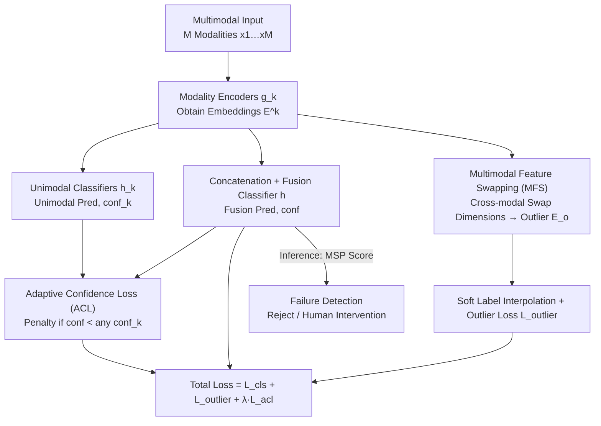

# Adaptive Confidence Regularization for Multimodal Failure Detection

**Conference**: CVPR2026  
**arXiv**: [2603.02200](https://arxiv.org/abs/2603.02200)  
**Code**: [mona4399/ACR](https://github.com/mona4399/ACR)  
**Area**: Medical Image / Multimodal Reliability  
**Keywords**: Multimodal failure detection, confidence degradation, adaptive confidence regularization, feature swapping, misclassification detection, selective classification

## TL;DR

The ACR framework is proposed to systematically address misclassification detection in multimodal scenarios for the first time. By combining Adaptive Confidence Loss (penalizing the "confidence degradation" phenomenon where multimodal fusion confidence is lower than unimodal confidence) and Multimodal Feature Swapping (synthesizing failure samples in the feature space), ACR significantly outperforms existing methods across four datasets.

## Background & Motivation

1. **High-Stakes Deployment Needs**: Multimodal models are widely used in safety-critical scenarios such as autonomous driving and medical diagnosis. High accuracy alone is insufficient; models must reliably detect untrustworthy predictions (failure detection, FD).
2. **Limitations of Prior Work in FD**: Existing FD methods are primarily designed for unimodal data. They cannot leverage complementary cross-modal information or handle multimodal-specific failure modes like signal conflict and alignment failure.
3. **Failure of OOD Detection in FD**: Experiments demonstrate that OOD methods such as Energy, Entropy, and MaxLogit perform worse than the simple MSP baseline on FD tasks, indicating that OOD techniques cannot be directly applied.
4. **FD Cues in Multimodal Signals**: Simple video and optical flow fusion already significantly improves FD performance, proving the potential of multimodal inputs for FD, yet a specialized framework is missing.
5. **Confidence Degradation**: The authors find that in misclassified samples, the proportion of fusion confidence being lower than a specific unimodal confidence is much higher than in correct samples (32.4% higher on HMDB51, 52.4% higher on HAC). This "confidence degradation" serves as a strong indicator of failure.
6. **Lack of Real Failure Training Samples**: Traditional Outlier Exposure relies on large-scale external datasets and cannot synthesize multimodal-specific failures like cross-modal conflicts. Unimodal methods like OpenMix are also unsuitable.

## Method

### Overall Architecture

ACR addresses failure detection (FD) in multimodal scenarios—ensuring models are not only accurate but can also reliably flag untrustworthy predictions. Architecturally, $M$ modality branches use encoders $g_k(\cdot)$ to extract embeddings $\mathbf{E}^k$. These are concatenated and fed into a fusion classifier $h(\cdot)$ to obtain a fusion prediction $\hat{p}$ and fusion confidence $\text{conf}$. Simultaneously, each modality has an independent classifier $h_k(\cdot)$ providing unimodal predictions $\hat{p}^k$ and unimodal confidence $\text{conf}_k$. On top of this backbone, ACR integrates two complementary modules: Adaptive Confidence Loss (ACL), which monitors "confidence degradation," and Multimodal Feature Swapping (MFS), which synthesizes failure samples in the feature space. These generate losses that, combined with the original classification loss, form the total training objective. At inference, only the MSP confidence from the fusion branch is used for FD.

### Key Designs

**1. Adaptive Confidence Loss (ACL): Penalizing "Confidence Degradation"**

The authors observed that in misclassified samples, the fusion confidence is more likely to be lower than at least one unimodal confidence compared to correctly classified samples. ACL formulates this into the loss function. Defining fusion confidence as $\text{conf} = \max_y \hat{p}$ and unimodal confidence as $\text{conf}_k = \max_y \hat{p}^k$, the loss for two modalities is:

$$\mathcal{L}_{\text{acl}} = \frac{1}{2}\left(\max(0, \text{conf}_1 - \text{conf}) + \max(0, \text{conf}_2 - \text{conf})\right)$$

No penalty is applied when fusion confidence exceeds all unimodal confidences; a linear penalty is applied otherwise. This forces the fusion mechanism to integrate complementary information while suppressing unimodal overconfidence, which also improves classification accuracy as a side effect.

**2. Multimodal Feature Swapping (MFS): Synthesizing Failure Samples in Feature Space**

FD suffers from a lack of real failure samples. Unlike Outlier Exposure (OE), which requires external data, MFS operates directly in the feature space. It randomly selects $n_{\text{swap}} \sim \mathcal{U}(n_{\min}, n_{\max})$ contiguous dimensions from each modality embedding to swap, creating perturbed features $\mathbf{E}_o$. Soft labels are interpolated between the true label and the outlier class based on the swap ratio: $\mathbf{y}_{\text{swapped}} = (1-\lambda)\mathbf{y}_{\text{true}} + \lambda\mathbf{y}_{\text{outlier}}$, where $\lambda = n_{\text{swap}} / n_{\max}$. Small swap amounts create hard negative samples near the in-distribution area, while large swaps create clear outliers. This is controllable, does not require external data, and is modality-agnostic.

### Loss & Training

The total loss combines classification, outlier detection, and confidence regularization:

$$\mathcal{L}_{\text{total}} = \mathcal{L}_{\text{cls}} + \mathcal{L}_{\text{outlier}} + \lambda_{\text{acl}} \mathcal{L}_{\text{acl}}$$

During inference, MSP scores are computed only for the original $C$ classes, incurring no additional computational overhead.

## Key Experimental Results

### Main Results (Video + Optical Flow, Table 1)

| Dataset | Method | AURC↓ | AUROC↑ | FPR95↓ | ACC↑ |
|---|---|---|---|---|---|
| HMDB51 | MSP | 29.56 | 88.28 | 52.07 | 86.20 |
| HMDB51 | **ACR** | **19.97** | **92.02** | **41.96** | **87.23** |
| HAC | MSP | 42.90 | 89.27 | 66.67 | 82.11 |
| HAC | **ACR** | **27.41** | **91.48** | **39.39** | **84.86** |
| Kinetics-600 | MSP | 46.29 | 87.33 | 61.29 | 81.24 |
| Kinetics-600 | **ACR** | **41.85** | **88.99** | **55.89** | **81.45** |
| EPIC-Kitchens | Best Baseline (RegMixup) | 105.25 | 79.26 | 78.19 | 74.53 |
| EPIC-Kitchens | **ACR** | **103.25** | **79.27** | **71.58** | **75.20** |

ACR achieved the best performance across all datasets, with AURC improvements up to 9.58% and FPR95 improvements up to 15.45%, while simultaneously enhancing classification accuracy.

### Ablation Study (HMDB51, Table 2)

| Configuration | AURC↓ | AUROC↑ | FPR95↓ | ACC↑ |
|---|---|---|---|---|
| MSP baseline | 29.56 | 88.28 | 52.07 | 86.20 |
| + ACL only | 24.48 | 90.32 | 43.97 | 86.77 |
| + MFS only | 25.11 | 90.55 | 46.22 | 86.43 |
| **ACL + MFS** | **19.97** | **92.02** | **41.96** | **87.23** |

Both modules are effective individually, and their combination yields the best results, demonstrating complementarity.

### Other Verifications

- **Generalization across Modality Combinations** (HAC: Video+Audio / Flow+Audio / Three Modalities): Average AURC improved by 8.39%, and FPR95 by 10.65%.
- **Robustness to Distribution Shift**: ACR maintains a stable advantage under five types of video corruption (defocus blur, frost, brightness, pixelation, JPEG compression).
- **Different Backbones** (I3D, TSN): ACR consistently outperforms all baselines.
- **OOD Detection**: ACR also performs excellently on the MultiOOD benchmark, achieving an AUROC of 96.82 vs. the second-best 95.35.

## Highlights & Insights

- **First Systematic Study of Multimodal FD**: Reveals the confidence degradation phenomenon and quantifies its strong correlation with misclassification, providing a theoretical basis for this direction.
- **External-Data-Free Outlier Synthesis**: MFS operates in the feature space, making it computationally efficient, modality-agnostic, and highly controllable.
- **Simultaneous Improvement in FD and Accuracy**: Regularization from ACL improves classification performance, which is uncommon for FD-specific methods.
- **Extensive Evaluation**: Validated across 4 datasets, 3 modalities, various modality combinations, distribution shifts, different backbones, and OOD detection settings.

## Limitations & Future Work

- Experiments are limited to action recognition (Video + Flow/Audio) and have not yet been validated in other multimodal tasks like medical imaging or remote sensing.
- Scalability to a larger number of modalities ($\ge 4$) remains unexplored, as only two or three modalities were tested.
- MFS swaps feature dimensions uniformly and randomly, without considering semantic importance differences between modality dimensions.
- The inference stage uses only MSP scores; exploring the difference between joint and unimodal confidence as a stronger FD signal remains a future direction.
- A theoretical analysis of the distribution generated by MFS in high-dimensional embedding space is lacking.

## Related Work & Insights

| Method | Type | Multimodal | Ext. Data Req. | FD Performance |
|---|---|---|---|---|
| MSP / MaxLogit / Energy | Scoring Function | ✗ | ✗ | Baseline |
| DOCTOR | Confidence Learning | ✗ | ✗ | Slight Gain |
| OpenMix | Outlier Synthesis | ✗ | ✓ | Moderate |
| CRL | Confidence Reg. | ✗ | ✗ | Moderate |
| A2D | Multimodal OOD | ✓ | ✗ | Moderate (OOD-oriented) |
| **ACR** | **Multimodal FD Specific** | **✓** | **✗** | **SOTA** |

## Rating

- Novelty: ⭐⭐⭐⭐ — The discovery of the confidence degradation phenomenon and the ACL+MFS design are highly original.
- Experimental Thoroughness: ⭐⭐⭐⭐ — Comprehensive ablation and testing across diverse datasets and shifts.
- Writing Quality: ⭐⭐⭐⭐ — Clear motivation and logical flow from observation to method.
- Value: ⭐⭐⭐⭐ — Fills a gap in multimodal FD; the framework is general and valuable for safety-critical applications.

<!-- RELATED:START -->

## Related Papers

- [\[CVPR 2026\] Dual-Level Confidence based Implicit Self-Refinement for Medical Visual Question Answering](dual-level_confidence_based_implicit_self-refinement_for_medical_visual_question.md)
- [\[AAAI 2026\] Personality-guided Public-Private Domain Disentangled Hypergraph-Former Network for Multimodal Depression Detection](../../AAAI2026/medical_imaging/personality-guided_public-private_domain_disentangled_hypergraph-former_network_.md)
- [\[CVPR 2026\] Learning Diffeomorphism for Medical Image Registration with Time-Embedded Architectures Using Semigroup Regularization](learning_diffeomorphism_for_medical_image_registration_with_time-embedded_archit.md)
- [\[ICLR 2026\] Frequency-Balanced Retinal Representation Learning with Mutual Information Regularization](../../ICLR2026/medical_imaging/frequency-balanced_retinal_representation_learning_with_mutual_information_regul.md)
- [\[CVPR 2026\] The Invisible Gorilla Effect in Out-of-distribution Detection](the_invisible_gorilla_effect_in_out-of-distribution_detection.md)

<!-- RELATED:END -->
