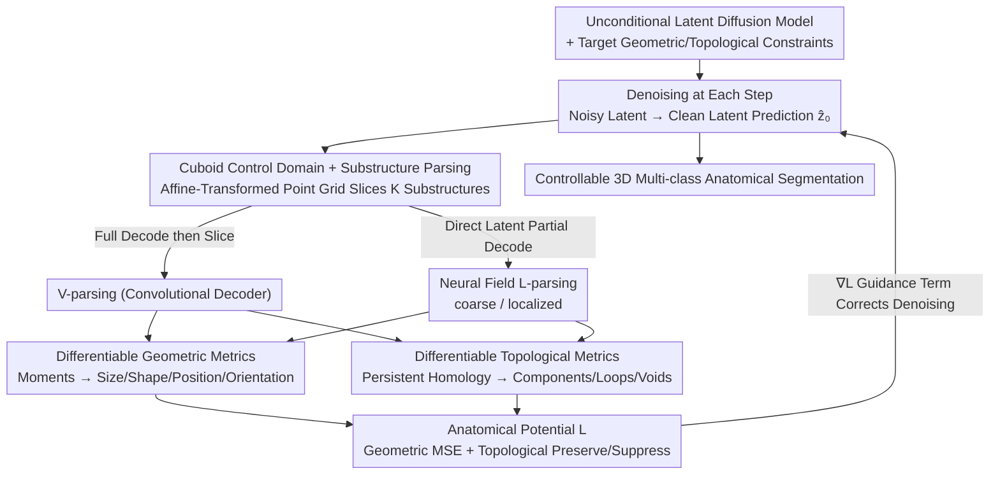

# Anatomica: Localized Control over Geometric and Topological Properties for Anatomical Diffusion Models

**Conference**: CVPR 2026  
**Paper**: [CVF Open Access](https://openaccess.thecvf.com/content/CVPR2026/html/Kadry_Anatomica_Localized_Control_over_Geometric_and_Topological_Properties_for_Anatomical_CVPR_2026_paper.html)  
**Code**: https://github.com/kkadry/Anatomica  
**Area**: Medical Imaging / Diffusion Models  
**Keywords**: Anatomical Structure Generation, Diffusion Guidance, Persistent Homology, Neural Field Decoder, Controllable Generation

## TL;DR
Anatomica is a **training-free diffusion guidance framework** that differentiably extracts substructures from 3D multi-class anatomical segmentations using arbitrarily placed "cuboid control domains." It then measures geometric (size/shape/position/orientation) and topological (connected components/loops/voids) properties using **geometric moments** and **persistent homology**, respectively, backpropagating the deviations as potential function gradients to guide unconditional diffusion sampling. Without retraining models for each task, it achieves SOTA geometrically and topologically controllable generation across multiple anatomical systems, including the heart, aorta, vertebrae, and coronary arteries.

## Background & Motivation
**Background**: Anatomical morphology determines the function and pathology of physiological systems. Modeling patient organs as 3D segmentations enables numerical simulations for virtual clinical trials, medical device design, and generating controllable synthetic data for machine learning. Due to the sparsity and pathological imbalance of real-world datasets, data augmentation via generative models has gained popularity. The core advantage of generative models over real datasets lies in **controllability**.

**Limitations of Prior Work**: Conditional generation of **3D multi-class segmentations** based on anatomical features remains highly challenging. These features encompass both geometry (shape, size) and topology (connected components, loops, voids), which are often defined **compositionally**—spanning multiple substructures, dimensions (3D vs. 2D vs. 1D), and coordinate systems (Cartesian vs. curvilinear). Existing methods have distinct limitations: modeling with simple shapes like cylinders controls morphology but lacks realism; statistical shape models represent variations via global shape vectors but are uninterpretable and hard to edit locally; conditionally trained generative models require retraining for every new control task; and self-guidance or attention-based losses in text-to-image models only offer coarse size/position control, which is unsuitable for multi-class segmentations and insufficient for the complex constraints required by anatomical shapes.

**Key Challenge**: One either hardcodes constraints during training (conditional training), which requires retraining for new tasks and only controls global attributes, or uses generic guidance that lacks the expressivity for fine-grained, compositional control over **local, multi-dimensional, and cross-coordinate** geometric and topological properties. The authors' recent precursor, CardioComposer, enables training-free geometric guidance but is **limited to controlling globally defined 3D geometric properties**.

**Goal**: ① Differentiably and locally extract anatomical substructures of interest from voxel segmentations during inference without training; ② Unify the measurement and guidance of geometric and topological properties on these substructures; ③ Efficiently adapt this guidance to latent diffusion models, avoiding the overhead of full voxel decoding at each step.

**Key Insight**: The authors observe that "substructure extraction" can be abstracted as a **control domain**—a query grid defined by affine parameters that determine where, at what scale, in which orientation, and in what dimension to slice the segmentation map. By designing this grid-based slicing operation to be differentiable, along with differentiable geometric (moments) and topological (persistent homology) measurements, the entire pipeline of "extracting substructures $\to$ measuring properties $\to$ computing deviations" can provide gradient guidance for diffusion sampling.

**Core Idea**: **Formulating local geometric/topological constraints as gradients of a potential function for diffusion guidance using "cuboid control domains + differentiable geometric moments + differentiable persistent homology"**, and employing a neural field decoder to achieve local partial decoding from the latent space, enabling compositional control over complex anatomical structures of any dimension or coordinate system without retraining.

## Method

### Overall Architecture
Anatomica is built on top of an **unconditional** anatomical Latent Diffusion Model (LDM). It first trains a Variational Autoencoder (VAE) with a neural field decoder to encode the 3D multi-class segmentation volume $V \in \mathbb{R}^{C\times H\times W\times D}$ into a latent grid $z$. The neural field decoder $F$ can decode the latent representation back into voxels at any query point grid. An unconditional LDM is then trained to learn the score of the segmentation distribution. **All control occurs during inference**: at each sampling step, the noisy latent $z_\sigma$ is denoised to predict the clean latent $\hat z_0$, which is parsed into $K$ substructures $S_k$. Geometric and topological features are measured for each substructure, and their comparison with targets yields a composite anatomical potential function $\mathcal{L}=\frac1K\sum_k(\lambda_{geo}\mathcal{L}_k^{geo}+\lambda_{topo}\mathcal{L}_k^{topo})$. Finally, $\nabla_{z_\sigma}\mathcal{L}$ is used as a guidance term to correct the denoising direction of the current step.

There are two paths for "substructure parsing": **V-parsing** (decoding the latent into a full voxel map before slicing substructures, corresponding to Anatomica-V) and **L-parsing** (directly decoding the substructure from the latent space using a neural field decoder, corresponding to Anatomica-L, which is faster). The measurements also consist of two branches: **moment decomposition** for geometry, and **persistent homology** for topology. The overall pipeline is shown below:

### Key Designs

**1. Cuboid Control Domain + Differentiable Substructure Parsing: Parametrizing "where, how large, and in what dimension to slice" as an Affine Transformation**

The limitation is that geometric/topological constraints are often **local** (e.g., constraining only the right ventricle or several slices along the aortic centerline), whereas prior work could only control global properties. Anatomica introduces a **control domain** $X_k\in\mathbb{R}^{\alpha\times\beta\times\gamma\times3}$—a grid of query points that determines both the **spatial support** and the **discretization** of the target substructure. The control domain is obtained by applying an affine transformation to a global template grid:
$$X_k = R_k\,\mathrm{diag}(s_k)\,X_k^{temp} + t_k$$
where $R_k$ represents rotation, $s_k$ is scaling, and $t_k$ is translation. The **dimension** of the template grid determines the discretization accuracy (coarse to fine) and dimensionality (3D volume to 2D plane to 1D line), while the affine parameters determine where in the 3D space the substructure is located, its orientation, and its coordinate system. Given a predicted segmentation $\hat V$, **V-parsing** first uses a boolean subset operator $U[u]$ (selection vector $u\in\{0,1\}^C$) to select/recombine target tissues from multi-channel maps into $\hat S_k$, and then uses a structural slicing operator $T^s[X_k]$ to sample on the control domain's point grid: $S_k=(T^s[X_k]\circ U[u])(\hat V)$. The entire process is differentiable with respect to $\hat V$, allowing gradients to propagate back to the diffusion process. The beauty of this abstraction is that by combining multiple control domains of different dimensions and coordinate systems, a wide variety of anatomical systems can be characterized (e.g., placing 5 planar domains along the aortic centerline, radiating 4 line domains from the myocardial centroid), thereby unifying "local, compositional, multi-dimensional" control requirements into "placing a set of control domains."

**2. Unified Geometric-Topological Differentiable Potential Function: Moments for Geometry, Persistent Homology for Topology**

Simply slicing the substructures is not enough; their conformity to the target morphology must be formulated as differentiable losses. On the **geometric side**, the zeroth, first, and second-order moments of the substructure $S_k$ are numerically integrated: the zeroth moment is the mass $m_k$, the first moment is the centroid $p_k$, and the second moment is the covariance $\Sigma_k$:
$$m_k=\mathbf 1^T\Omega_k,\quad p_k=\frac{r_k^T\Omega_k}{m_k},\quad \Sigma_k=\frac1{m_k}r_k^T\mathrm{diag}(\Omega_k)\,r_k - p_kp_k^T$$
The covariance is then decomposed into $\Sigma_k=v_k U_k\Lambda_k U_k^T$, separating **size** $v_k=\mathrm{tr}(\Sigma_k)$, **shape** $\Lambda_k$ (eigenvalues normalized by trace), and **orientation** $U_k$ (an orthogonal matrix). This allows constraining only the "shape + orientation" without restricting the size. The geometric potential function is a weighted MSE of mass, position, and normalized covariance: $\mathcal{L}_k^{geo}=\lambda_0 L_{MSE}(m_k,\bar m_k)+\lambda_1 L_{MSE}(p_k,\bar p_k)+\lambda_2 L_{MSE}(\Sigma_k^n,\bar\Sigma_k^n)$. Since geometric attributes are now locally defined, empty voxels can lead to numerical instability in the centroid/covariance. To address this, the authors introduce **adaptive mass weighting**: when the substructure mass falls below a threshold, $\lambda_1$ and $\lambda_2$ are set to zero.

On the **topological side**, the substructure $S_k$ is treated as a cubical complex and measured using **persistent homology (PH)**. By taking superlevel sets along thresholds $\tau$, a filtration of nested sets is obtained. From this, connected components (0D), loops (1D), and voids (2D) are extracted, outputting the birth $b$ and death $d$ thresholds for each topological feature. Longer birth-death intervals indicate higher "persistence" (more likely to be a real structure). Given a topological prior $B_k=[B_{k,0},B_{k,1},B_{k,2}]$ (specifying the desired count of components/loops/voids), the persistence points are partitioned into a set of features to be **preserved** $Y_k$ and a set to be **suppressed** $Z_k$. The potential function maximizes the persistence of preserved features while minimizing that of suppressed ones:
$$\mathcal{L}_k^{topo}=-\!\!\sum_{p\in Y_k}\!|S_k(r_b^p)-S_k(r_d^p)|^2+\!\!\sum_{p\in Z_k}\!|S_k(r_b^p)-S_k(r_d^p)|^2$$
An engineering detail is **softmax temperature scaling**: since the substructures are obtained from a multi-class probability map after a softmax operation, the gradients of the topological potential are extremely small in regions where probabilities are close to 0 or 1. To address this, the softmax temperature is increased during topological guidance to improve the backpropagating gradient flow. In this way, geometric and topological constraints are **unified** into an additive potential, unlocking a rich design space when combined.

**3. Neural Field L-parsing + Partial Decoding: Directly Slicing Substructures from Latent Space to Eliminate Full Voxel Decoding Overhead**

Applying the above guidance to latent diffusion introduces an efficiency bottleneck: a naive implementation would require decoding the entire latent grid into full-resolution voxels at each sampling step before slicing the substructures, which is highly expensive. Leveraging the capability of **neural field decoders to decode at any discrete set of points**, Anatomica proposes **L-parsing**—where the latent slicing operator $T^l[X_k]$ first samples the latent representation on the control domain's point grid, which then passes through the neural field decoder $F[X_k]$ and the boolean subset $U[u]$ to directly decode the substructure from the clean latent $\hat z_0$: $S_k=(U[u]\circ F[X_k]\circ T^l[X_k])(\hat z_0)$. Building on this, **partial decoding** is proposed to reduce overhead using smaller grids:

- **coarse L-parsing** uses a template grid with low discretization combined with an approximate identity affine mapping $A_{coarse}=[I,1,0]$ for global decoding, which is used to efficiently measure global attributes insensitive to resolution (used for topology tasks).
- **localized L-parsing** also uses a small grid but applies an affine transformation to map the template grid to a local region, effectively achieving high spatial resolution in that local area (used for geometry tasks).

The guided denoising step is written as:
$$D_\theta^w(z_\sigma;\sigma)=D_\theta(z_\sigma;\sigma)-\sigma^2\nabla_{z_\sigma}\mathcal{L}$$
which subtracts the gradient of the anatomical potential from the unconditional dnoising. Partial decoding reduces the cost of "measuring anatomical attributes" from the entire voxel grid to a small set of query points, which is key to making this guidance practical within 100 sampling steps.

### Loss & Training
During the training phase, only two components are trained, both **unconditionally**: ① a VAE with a neural field decoder (hybrid implicit-explicit representation, trained with a reconstruction objective), where the neural field $F$ is an MLP trained on a voxel-discrete query domain; ② an unconditional LDM (denoising objective $\mathcal{L}=\mathbb{E}_{\sigma,z,n}[\omega(\sigma)\|D_\theta(z_\sigma;\sigma)-z\|_2^2]$ using a 3D U-Net denoiser). **All control is achieved during inference via anatomical potential gradients; no conditional training is performed.** Under this scheme, only one unconditional diffusion model needs to be trained per anatomical dataset, which can then serve all geometric and topological control tasks for that dataset. While the loss weights $\lambda_{geo}$ and $\lambda_{topo}$ must be tuned, the authors demonstrate that a single set of weights generalizes across different anatomical datasets.

## Key Experimental Results

### Main Results
**Geometric Control**: Four tasks were set up on the cardiac validation set (Right Ventricle volume domain / Mitral Valve two volume domains / Aortic Trunk 5 planar domains along the centerline / Myocardium Wall 4 line domains radiating from the centroid), generating 128 synthetic samples per task. Two baselines requiring task-specific conditional retraining were compared: Explicit Conditioning (concatenating geometric moments into a 13D vector, expanding it to a voxel grid, and concatenating it with the latent) and Implicit Conditioning (encoding moments into 3D Gaussian heatmaps). Geometric fidelity ($L_1$ of mass/centroid/cov, lower is better) and generation quality (FMD / 1-NNA, lower is better) are reported:

| Task | Method | Mass↓ | Cent.↓ | Cov.↓ | FMD↓ | 1-NNA↓ |
|------|--------|-------|--------|-------|------|--------|
| Right Vent. | Explicit | 154.5 | 227.1 | 101.4 | 164.7 | 0.761 |
| Right Vent. | Implicit | 60.6 | 51.0 | 30.6 | 156.3 | 0.593 |
| Right Vent. | **Anatomica-V** | **12.3** | **30.2** | **21.6** | **84.9** | 0.590 |
| Right Vent. | Anatomica-L | 17.5 | 48.6 | 22.1 | 93.7 | 0.566 |
| Mitral Valve | Implicit | 8.91 | 87.0 | 17.3 | 314.8 | 0.661 |
| Mitral Valve | **Anatomica-L** | **3.22** | **11.4** | **7.89** | 88.8 | 0.577 |
| Myo. Wall | Implicit | 0.48 | 22.3 | 1.67 | 111.0 | 0.558 |
| Myo. Wall | **Anatomica-L** | 0.29 | 34.6 | 1.87 | **86.4** | 0.609 |

The training-free Anatomica **outperforms** the conditional baselines requiring task-specific retraining on most geometric metrics and generally yields better generation quality (FMD). The closest competitor is the Implicit conditioning method, which, however, requires retraining for every task.

**Topological Control**: One task was established for each of the four datasets: Heart, Aorta, Vertebrae, and Coronary (Atria Separation requiring 2 connected components / Branch Connectivity requiring 1 component / Vertebrae Connectivity requiring 1 component and 9 loops / Calcium Count requiring 2 calcification components). Betti number accuracy ($B_0$/$B_1$/$B_2$, the ratio of samples matching the target Betti numbers, higher is better) is compared against unconditional sampling:

| Task | Method | B0↑ | B1↑ | B2↑ | 1-NNA↓ |
|------|------|-----|-----|-----|--------|
| Atrial Sep. | Uncond. | 7.81 | 5.47 | 56.2 | 0.578 |
| Atrial Sep. | **Anatomica-L** | **78.9** | **89.1** | **97.7** | 0.606 |
| Branch Conn. | Uncond.| 55.5 | 12.5 | 63.3 | 0.559 |
| Branch Conn. | **Anatomica-L** | **77.3** | **17.2** | 64.1 | **0.532** |
| Vert. Conn. | Uncond. | 28.9 | 8.59 | 12.5 | 0.518 |
| Vert. Conn. | **Anatomica-L** | **74.2** | **26.6** | 7.03 | 0.537 |
| Calcium Count | Uncond. | 0.00 | 2.34 | 95.3 | 0.653 |
| Calcium Count | **Anatomica-L** | **60.9** | **79.7** | **98.4** | 0.618 |

Topological guidance significantly improves the accuracy of connected components/loops in tasks like "Atrial Separation", "Branch Connectivity", and "Calcium Count" (e.g., $B_0$ for Calcium Count increases from 0% to 60.9%). The only limitation is **voids $B_2$**, which show no improvement on the aorta and vertebrae datasets. The authors attribute this to the difficulty of detecting single-voxel voids under coarse-resolution measurement.

### Ablation Study
Speed-fidelity trade-off of partial decoding (speed is measured in normalized samples per second, higher is faster):

| Method | Domain / Resolution | Mass↓ | Cent.↓ | Cov.↓ | FMD↓ | Speed↑ |
|------|-----------|-------|--------|-------|------|--------|
| Anatomica-V | Global / High | 11.95 | 30.66 | 21.92 | 84.70 | 1.00 |
| Anatomica-L | Local / High | 17.02 | 48.14 | 21.85 | 91.16 | 2.48 |
| Anatomica-L | Local / Med. | 16.64 | 48.41 | 22.03 | 93.89 | 7.43 |
| Anatomica-L | Local / Low | 16.43 | 48.75 | 22.07 | 105.57 | **10.40** |
| Anatomica-L | Coarse / Low | 20.30 | 46.96 | 25.60 | 123.31 | 10.40 |

### Key Findings
- **Low-resolution partial decoding achieves immense acceleration with almost no drop in geometric fidelity**: Anatomica-L under the Local/Low configuration performs on par with Anatomica-V (Global/High) in terms of mass, centroid, and covariance fidelity, while running approximately 10 times faster. This indicates that geometric attributes are insensitive to decoding resolution, making partial decoding a free lunch.
- **Neural Field vs. Convolutional Decoder**: Under the same resolution, L-parsing (neural field) is faster than V-parsing (convolutional) at the cost of a slight drop in geometric fidelity. Both variants offer trade-offs: localized L-parsing is preferred for geometric tasks, and coarse L-parsing for topological tasks.
- **Training-free yet superior to conditional retraining**: Counterintuitively, inference-time guidance outperforms task-specific conditionally trained baselines on most tasks, all without needing to retrain the model for each new constraint.
- **Topological voids are a weak point**: No improvement is observed for $B_2$ (voids) on certain datasets due to the computational overhead of high-resolution persistent homology, which restricts the evaluation to coarse resolutions.

## Highlights & Insights
- **The abstraction of "Control Domain = Affine-transformed Query Point Grid" is elegant**: A single set of affine parameters $[R,s,t]$ concurrently encodes where to slice, the scale, orientation, dimensionality, and coordinate system. This unifies various local anatomical constraints into "placing control domains" with high compositionality (e.g., placing planes along centerlines, lines radiating from centroids).
- **Geometry and topology are unified under the same differentiable potential function framework**: Geometry is handled by moment decomposition (which conveniently decouples size, shape, and orientation, allowing shape constraints independent of size), and topology is handled by persistent homology. Both are backpropagatable and can be combined via weighted summation, a unified "geometric + topological guidance" approach that is rare in anatomical generation.
- **Neural field partial decoding makes inference-time guidance practical**: Leveraging the ability of neural fields to decode at arbitrary point sets, decoding is restricted to only the small query point subset within the control domain, avoiding full-voxel decoding at each step. This is the key engineering lever that enables training-free guidance to run within 100 sampling steps, a concept transferable to any scenario requiring frequent latent-space decoding during guided sampling.
- **Softmax temperature adjustment to salvage gradients**: Raising the softmax temperature in probability-saturated regions to improve the gradient flow of the topological potential is a simple yet highly effective practical trick.

## Limitations & Future Work
- **Loss weights require tuning**: The authors acknowledge that weights like $\lambda$ need to be manually tuned. Fortunately, a single set of weights generalizes across all evaluated anatomical datasets, but adjustments may still be needed when migrating to entirely new anatomical systems.
- **High-resolution persistent homology is computationally expensive**: The decoding resolution for topological guidance is bottlenecked by the computational cost of PH, directly causing **the failure of $B_2$ void control at coarse resolutions** (as single-voxel voids cannot be detected)—this constitutes the most severe current bottleneck of the method.
- **Dependence on a strong unconditional LDM**: All control is built upon the unconditional diffusion prior. If the prior itself does not cover a certain pathological morphology, the guidance cannot generate it out of thin air. Furthermore, evaluations are based on self-assessment using synthetic samples, lacking end-to-end validation on downstream real-world tasks (e.g., training segmentation networks or numerical simulations).
- **Future directions**: Making loss weights adaptive/learnable; using more efficient differentiable topological metrics or multi-resolution PH to solve void detection; and combining guidance with stronger conditional prior for hybrid "condition + guidance" control.

## Related Work & Insights
- **vs. CardioComposer (Kadry et al.)**: The direct precursor of this work, which also performs inference-time geometric guidance using differentiable geometry to control size, position, and shape. The distinction is that the prior work was **limited to globally defined 3D geometric attributes**. Anatomica extends this to **any local region, dimension, and coordinate system** using cuboid control domains, and introduces topological (persistent homology) control along with neural field partial decoding, significantly boosting both control space and efficiency.
- **vs. Topological Deep Learning (PH Loss for Segmentation Training / Conditional Diffusion Training)**: Traditionally, persistent homology was mostly used for **updating network weights** (e.g., training segmentation networks or conditional diffusion models). Conversely, this work leverages PH for **plug-and-play control at inference time**, guiding unconditional multi-class 3D segmentation sampling without requiring conditional retraining.
- **vs. Spatial Conditional Generation (Bbox/Ellipsoidal Parameter Conditioning, Self-guidance)**: Conditioning on mid-level representations or attention losses (such as self-guidance) only allows rudimentary size/position control, which is incompatible with multi-class segmentations and insufficient for complex anatomical constraints. Anatomica extends energy-based guidance to local geometric and topological control based on substructure properties, unlocking a compositional anatomical design space.
- **vs. Statistical Shape Models (SSMs)**: SSMs rely on global shape vectors to represent realistic variations, which lack interpretability and are difficult to edit locally. In contract, Anatomica's control domains naturally support local, interpretable, and compositional editing.

## Rating
- Novelty: ⭐⭐⭐⭐⭐ Elegant control domain abstraction + unifying geometric moments and persistent homology into differentiable diffusion guidance + neural field partial decoding, making for an innovative combination.
- Experimental Thoroughness: ⭐⭐⭐⭐ Covers 4 separate anatomical systems (heart, aorta, vertebrae, coronary), both geometric and topological tasks, and partial decoding ablations; however, evaluations are limited to synthetic self-assessment without downstream end-to-end validation.
- Writing Quality: ⭐⭐⭐⭐ Equations and diagrams (Fig. 2/3) are clear, and the overall pipeline is well-explained.
- Value: ⭐⭐⭐⭐ Provides a training-free, compositional tool for controllable anatomical generation, beneficial for virtual clinical trials and ML data augmentation. Code is open-sourced.

<!-- RELATED:START -->

## Related Papers

- [\[ICLR 2026\] CardioComposer: Leveraging Differentiable Geometry for Compositional Control of Anatomical Diffusion Models](../../ICLR2026/medical_imaging/cardiocomposer_leveraging_differentiable_geometry_for_compositional_control_of_a.md)
- [\[CVPR 2026\] TopoCL: Topological Contrastive Learning for Medical Imaging](topocl_topological_contrastive_learning_for_medical_imaging.md)
- [\[CVPR 2026\] KLIP: localized distribution shift detection via KL-divergence with diffusion priors in Inverse Problems](klip_localized_distribution_shift_detection_via_kl-divergence_with_diffusion_pri.md)
- [\[CVPR 2026\] Any2Any 3D Diffusion Models with Knowledge Transfer: A Radiotherapy Planning Study](any2any_3d_diffusion_models_with_knowledge_transfer_a_radiotherapy_planning_stud.md)
- [\[CVPR 2026\] LLaDA-MedV: Exploring Large Language Diffusion Models for Biomedical Image Understanding](llada-medv_exploring_large_language_diffusion_models_for_biomedical_image_unders.md)

<!-- RELATED:END -->
