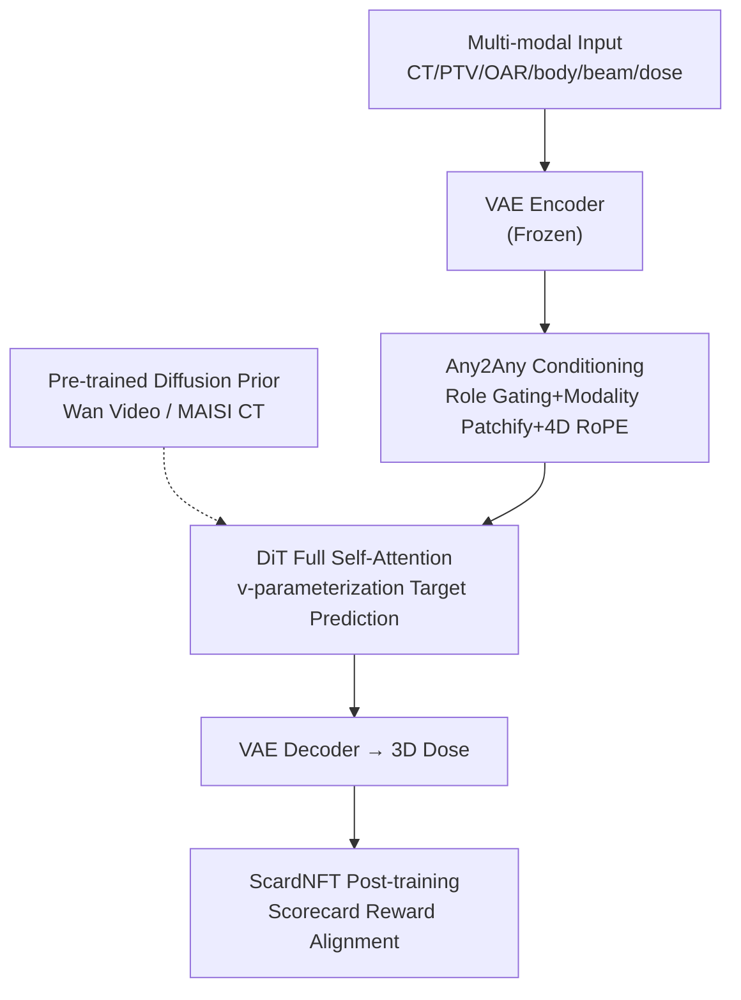

# Any2Any 3D Diffusion Models with Knowledge Transfer: A Radiotherapy Planning Study

**Conference**: CVPR 2026  
**arXiv**: [2605.09622](https://arxiv.org/abs/2605.09622)  
**Code**: None (Code not public)  
**Area**: Medical Imaging / Diffusion Models  
**Keywords**: Radiotherapy Dose Prediction, 3D Diffusion Prior Transfer, Any2Any Conditional Generation, Reinforcement Learning Post-training, Clinical Scorecard

## TL;DR
This work transfers 3D diffusion models pre-trained on natural videos (Wan 2.1) or public CT datasets (MAISI) to radiotherapy dose prediction. It introduces an "Any2Any" modality conditioning paradigm allowing any modality to serve as a generation target, followed by reinforcement learning post-training aligned with clinical Scorecards to match institutional preferences. It achieved a new SOTA on the GDP-HMM challenge, reducing voxel-level MAE from 2.07 to 1.93.

## Background & Motivation
**Background**: Dose prediction (DP) in radiotherapy (RT) planning aims to generate a 3D dose distribution given multi-modal inputs like CT, Planning Target Volume (PTV), Organs at Risk (OAR), and beam geometry. Historically, this has been treated as a voxel-level regression problem using U-Net architectures (MedNeXt, nnUNet) to minimize MAE/MSE between predicted and reference doses. Recently, GANs and diffusion models have been used to improve visual quality.

**Limitations of Prior Work**: ① RT data is scarce, with institutions often having only hundreds to thousands of cases; "bespoke models" trained from scratch generalize poorly across clinical scenarios. ② Most existing diffusion schemes use **slice-wise 2D** training, leading to poor spatial consistency between slices. ③ Almost all methods optimize only for voxel error and **lack post-training for clinical preferences**—low voxel MAE does not necessarily equate to clinical acceptability (the trade-off between PTV coverage vs. OAR protection).

**Key Challenge**: Large-scale diffusion models in the vision domain are trained on billions of data points with high generalization, whereas RT data is minimal and subject to complex clinical constraints. Effectively transferring "massive general priors" to the "small-sample, highly constrained" task of radiotherapy is the critical knowledge transfer problem.

**Goal**: This paper addresses two questions: (Q1) Can **3D diffusion generative priors** trained on **distant source domains** (natural videos/general CT) assist in RT dose generation? (Q2) Can **reinforcement learning post-training** align diffusion generation with clinical preferences?

**Key Insight**: While prior work transferring natural images to medical domains (e.g., DINO-based) mostly focuses on **feature extraction backbones**, this study targets **generation**. Additionally, RT data naturally consists of 7 modalities {CT, PTV, OAR, body, beam plate, angle plate, dose}. Rather than building custom models for every input combination, any modality should be able to serve as either a condition or a target.

**Core Idea**: A tripartite approach consisting of "Pre-trained 3D Diffusion Prior + Any2Any Modality Conditioning + Scorecard-guided RL Post-training" robustly transfers general generative priors to RT dose prediction—designated as **DiffKT3D**.

## Method

### Overall Architecture
DiffKT3D is a unified Any2Any 3D diffusion framework. The pipeline involves: multi-modal volumetric data compressed into a shared latent space via a **frozen VAE encoder**. Before entering the DiT, an **Any2Any role gating** mechanism randomly assigns each modality as either a "target" or a "condition." Modality-specific patchification slices the latent grids into tokens, tagged with domain embeddings (identifying the modality), role embeddings (distinguishing target/condition), and 4D RoPE positional encodings. A **single DiT backbone using full self-attention** simultaneously processes "clean condition tokens" and "noisy target tokens" to predict noise for the target modality via v-parameterization. Predictions are returned to voxel space via the VAE decoder to obtain the 3D dose. After training, **ScardNFT** (RL post-training) aligns the generation with clinical Scorecard preferences. The DiT backbone architecture remains unchanged (reusing Wan weights), while modality differences are handled by embeddings.

### Key Designs

**1. Cross-domain Diffusion Prior Transfer: Initializing Dose Generation with Video/CT Models**

RT data is too scarce for "data-hungry" 3D diffusion models trained from scratch. The authors directly utilize **Wan 2.1 (1.3B parameters) + VAE 2.1** pre-trained on natural videos, or **MAISI** pre-trained on public CT, fine-tuning only the DiT blocks. Despite the massive gap between natural videos and RT dose, the transfer significantly improves accuracy and efficiency—MAE dropped from 2.58 (from scratch) to 2.07 with pre-training. A key finding: **the smaller the domain gap, the larger the transfer gain** (MAISI CT prior > Wan video prior), showing significantly stronger generalization than regression models.

**2. Any2Any Role-Aware Conditioning: Modalities as Mutual Conditions/Targets without Cross-Attention**

RT involves seven modalities, making combination-specific models impractical. This paper formalizes DP as Any2Any conditional generation: from the set $\mathcal{M}=\{\texttt{ct},\texttt{ptv},\texttt{oar},\texttt{body},\texttt{beam},\texttt{angle},\texttt{dose}\}$, a target $\tau$ is sampled, and the remaining visible modalities form the condition set $C$. The target is forward-noised at step $t$ to $x_t^{(\tau)}=\alpha_t x_0^{(\tau)}+\sigma_t\varepsilon$ ($\alpha_t^2+\sigma_t^2=1$). Four zero-cost structural designs are used: ① **Modality-specific Patchify**—each modality uses a lightweight 3D convolution patch embed $\mathrm{PE}_m$. ② **Role Embeddings**—a binary embedding $e^{\text{role}}\in\{e^{\text{tar}},e^{\text{cond}}\}$ marks tokens; condition codes $e_C$ are added to the timestep embedding $\tilde{e}_t=e_t+e_C$, injected via AdaLayerNorm **without cross-attention**. ③ **Full Self-Attention**—target and condition tokens are concatenated for joint multi-modal dependency modeling. ④ **4D RoPE**—adds a slot axis to standard 3D RoPE ($d=d_S+d_H+d_W+d_D$), assigning independent rotation phases to each modality to distinguish them explicitly.

**3. ScardNFT: Converting Clinical Scorecards into RL Rewards for Preference Alignment**

Standard diffusion training aligns with voxel values of historical plans but doesn't explicitly optimize clinical goals like "PTV coverage" or "OAR sparing." ScardNFT adapts DiffusionNFT to rewrite clinical Scorecards as differentiable rewards. The raw reward $r^{\text{raw}}(y,C)=\sum_{s}w_s\,\mathrm{score}_s(\phi_s(y;C))$ maps anatomical metrics (DoseAtVolume, etc.) via piecewise linear functions. To prevent reward hacking, the reward is normalized and anchored with hinge penalties (hard constraints like min PTV D95) and an MAE anchor relative to reference doses. Policy updates use the implicit dual-objective loss $\mathcal{L}_{\text{NFT}}=\mathbb{E}[r\|\tilde{v}_\theta^{+}-v\|_2^2+(1{-}r)\|\tilde{v}_\theta^{-}-v\|_2^2]$ to boost the likelihood of high-reward samples.

### Loss & Training
The diffusion objective uses **v-parameterization**: $v(x_0,\varepsilon,t)=\alpha_t\varepsilon-\sigma_t x_0$. The loss is $\mathcal{L}_{\text{diff}}=\mathbb{E}_{t,\varepsilon,\tau,S}[\|v_\theta(x_t^{(\tau)},C,t)-v(x_0^{(\tau)},\varepsilon,t)\|_2^2]$. v-parameterization provides balanced gradients across signal-to-noise ratios. The final objective combines voxel fidelity and clinical alignment: $\mathcal{L}(\theta)=\mathcal{L}_{\text{NFT}}(\theta)+\lambda\,\mathcal{L}_{\text{diff}}(\theta)$. Training occurs in three stages: (A) Any2Any pre-training, (B) dose-only fine-tuning, and (C) ScardNFT post-training.

## Key Experimental Results

Evaluated on the GDP-HMM Challenge (Head & Neck + Lung, 3,732 cases) and REQUITE Prostate data (5,356 cases). MAE is calculated within the body mask at a 5 Gy threshold.

### Main Results
GDP-HMM Test Set (partial Table 1):

| Method | Type | MAE↓ | Score↑ | PSNR↑ | SSIM↑ | LPIPS↓ |
|------|------|------|--------|-------|-------|--------|
| Yasin (Challenge Top-1) | Reg | 2.07 | 134.81 | 32.06 | 0.974 | 0.033 |
| Ours (Any2Any) | Diff | **1.93** | 135.36 | 32.60 | 0.978 | 0.023 |
| Ours (Any2Any+NFT) | Diff | **1.93** | **137.55** | **32.73** | **0.980** | **0.020** |

REQUITE Prostate Transfer (Table 3, GDP-HMM pre-trained):

| Method | MAE↓ | PSNR↑ | SSIM↑ | LPIPS↓ |
|------|------|-------|-------|--------|
| tyxiong123 (Best Reg) | 1.37 | 34.74 | 0.957 | 0.023 |
| Ours (Any2Any) | **1.01** | **36.80** | **0.963** | **0.012** |

### Ablation Study
Ablation on Validation Set (Table 4):

| Config | MAE / Score | Note |
|------|-------------|------|
| From scratch | 2.58 / 119.82 | No pre-training |
| + Pretrain | 2.07 / 135.41 | Wan prior, MAE drops 0.51 |
| + Any2Any | 1.90 / 136.22 | Unified modeling |
| − Role Emb | 2.01 / 134.04 | Without role embedding |
| − Full Attention | 2.15 / 130.80 | Swapped for causal attention |
| Ours + ScardNFT | 1.91 / 138.17 | Best Score, MAE stable |

### Key Findings
- **Pre-training is the largest contributor**: From scratch 2.58 → +Prior 2.07. This 0.51 MAE drop exceeds all other components combined.
- **Full Attention > Causal Attention**: Removing full attention dropped MAE to 2.15, indicating multi-modal dependencies benefit from bi-directional attention.
- **NFT optimizes preference, not fidelity**: ScardNFT increased Score from 136.22 to 138.17 while MAE remained almost unchanged (1.90→1.91).
- **Cross-modality completion**: In "remaining-1" settings, the model successfully generated CT and PTV masks from other modalities, demonstrating unified representation.

## Highlights & Insights
- **Advancing "Generative Priors"**: Moves beyond DINO-style feature extraction to 3D generative transfer, showing that large video/CT models can provide a strong initialization for RT planning.
- **Zero-overhead Multi-modal Interface**: Achieves Any2Any conditioning using role embeddings and 4D RoPE without adding cross-attention modules, facilitating the reuse of pre-trained DiT weights.
- **Scorecard-to-RL Paradigm**: Translating institutional protocols into optimization signals (dual-anchored rewards) is a generalizable workflow for other medical decision-tasks.

## Limitations & Future Work
- **Code not public**: Reproducing Any2Any gating and ScardNFT details may be difficult.
- **Compute Costs**: Reusing 1.3B parameter models (Wan) with 3D full attention is computationally intensive; clinical real-time feasibility needs verification.
- **Manual Reward Templates**: Reward weights $w_s$ and thresholds currently require manual tuning, which may vary by institution.

## Related Work & Insights
- **Vs. Regression (MedNeXt)**: Regression models are limited by voxel-level L1/L2 loss and lack clinical alignment. DiffKT3D improves MAE (2.07→1.93) and Score (134.81→137.55).
- **Vs. 2D Diffusion**: By using unified 3D latent diffusion, this work solves the inter-slice consistency problem inherent in slice-wise 2D approaches.
- **Vs. Diffusion-RL (DDPO)**: Unlike generic models using aesthetic rewards (ImageReward), ScardNFT anchors rewards directly to clinical Scorecards and hard constraints.

## Rating
- Novelty: ⭐⭐⭐⭐⭐ 
- Experimental Thoroughness: ⭐⭐⭐⭐ 
- Writing Quality: ⭐⭐⭐⭐ 
- Value: ⭐⭐⭐⭐⭐ 

<!-- RELATED:START -->

## Related Papers

- [\[CVPR 2026\] STEPH: Sparse Task Vector Mixup with Hypernetworks for Efficient Knowledge Transfer in WSI Prognosis](sparse_task_vector_mixup_wsi_prognosis.md)
- [\[NeurIPS 2025\] Demo: Generative AI helps Radiotherapy Planning with User Preference](../../NeurIPS2025/medical_imaging/demo_generative_ai_helps_radiotherapy_planning_with_user_preference.md)
- [\[CVPR 2026\] D2T2 - Multimodal Automated Planning for Brachytherapy](d2t2_-_multimodal_automated_planning_for_brachytherapy.md)
- [\[CVPR 2026\] Are General-Purpose Vision Models All We Need for 2D Medical Image Segmentation? A Cross-Dataset Empirical Study](are_general-purpose_vision_models_all_we_need_for_2d_medical_image_segmentation_.md)
- [\[CVPR 2026\] Masked-Diffusion Autoencoders for 3D Medical Vision Representation Learning](masked-diffusion_autoencoders_for_3d_medical_vision_representation_learning.md)

<!-- RELATED:END -->
