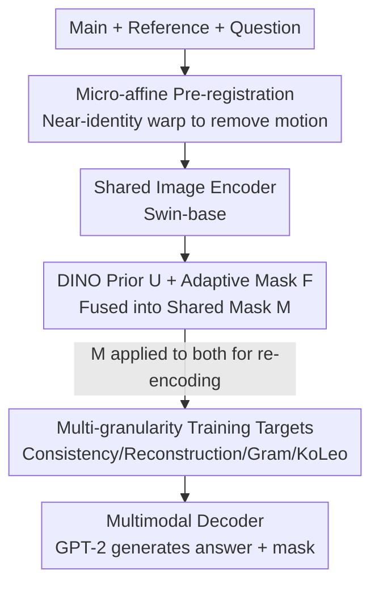

# Attention Consistent Longitudinal Medical Visual Question Answering Guided by Vision Foundation Models

**Conference**: CVPR 2026  
**arXiv**: [2606.06534](https://arxiv.org/abs/2606.06534)  
**Code**: None (Not provided in the paper)  
**Area**: Medical Imaging / Multimodal VLM  
**Keywords**: Longitudinal Medical VQA, Shared Saliency Mask, DINO Prior, Affine Pre-registration, Self-supervised Regularization

## TL;DR
Addressing differential VQA for "before-and-after follow-up" chest X-rays, this paper proposes an encoder-decoder framework featuring "lightweight affine pre-registration + shared saliency mask fusing DINO priors with adaptive masks + multi-granularity self/unsupervised auxiliary targets." This forces the model to observe the same anatomical region across two time points, improving METEOR from 0.389 to 0.700 on Medical-Diff-VQA while providing interpretable lesion masks.

## Background & Motivation
**Background**: Most medical VQA tasks follow the natural image VQA paradigm, answering clinical questions about a single image based on pre-trained vision/multimodal models. However, the actual workflow of radiologists involves "comparing the current image with previous ones" to judge disease progression and locate changes. Longitudinal differential VQA (Diff-VQA) formalizes this workflow: given a pair of chest X-rays of the same patient at different time points and a question focusing on "differences," the answer signal often lies in the **change itself** rather than absolute appearance.

**Limitations of Prior Work**: Existing Diff-VQA methods (residual alignment ReAl, region retrieval RegioMix, longitudinal pre-training PLURAL, difference embedding VED, etc.) share three gaps: (1) failed to **explicitly constrain attention consistency between time points**, where the model might look at the lung apex in the main image but the diaphragm in the reference, distorting the comparison; (2) relied almost exclusively on supervised fine-tuning, **neglecting the potential of unsupervised targets** for representation; (3) acted as black boxes lacking interpretable evidence, leading to clinical distrust.

**Key Challenge**: The answer to a differential question depends on a small "changed anatomical support region" $R$, but "nuisance motions" (pose/scale variations) and background noise exist between the two imaging instances. To answer faithfully, the two images must first be made geometrically comparable, and the model must **stare at the same corresponding region**—yet saliency has historically been treated as a post-hoc explanation rather than intrinsic supervision during training.

**Goal**: To utilize "saliency consistency" as a training signal while introducing unsupervised targets for stable representation. The tasks are decomposed into: ① making the two images geometrically comparable; ② constraining attention at both time points using a single mask; ③ avoiding extra annotations.

**Key Insight**: Inspired by co-attention in natural images—"what the model claims to care about should determine where it looks at both time points." By leveraging self-supervised priors and geometric regularization from DINO/DINOv3 (Gram anchoring, KoLeo), Vision Foundation Models are treated as a source of lesion candidate priors.

**Core Idea**: A shared saliency mask (fusing DINO prior $U$ + adaptive mask $F$) is used as training supervision across two follow-ups, combined with lightweight pre-registration and a set of self-supervised regularizations, embedding "longitudinal comparison on corresponding anatomy" as an inductive bias.

## Method

### Overall Architecture
Inputs consist of a main image $I_{\text{main}}$, a reference image $I_{\text{ref}}$, and a differential question. The output is a text answer plus a visual lesion mask. The workflow is as follows: first, perform **near-identity affine pre-registration** on the main image to obtain $\widehat{I}_{\text{main}}$, eliminating nuisance motion of pose/scale. After registration, both images pass through a shared image encoder and are fed into a frozen DINO branch (yielding prior mask $U$) and a trainable adaptive mask head (yielding $F$), which are fused into a **shared mask** $M$ with weight $\lambda$. $M$ is applied to both images before re-encoding. The resulting dual-temporal features and question features are concatenated into a multimodal prefix for the GPT-2 decoder. During training, four auxiliary losses—mask consistency, mask reconstruction, Gram longitudinal consistency, and KoLeo—are superimposed.

### Key Designs

**1. Micro-affine Pre-registration: Eliminate nuisance motion before comparing differences**

Differential VQA is highly sensitive to "false differences"—variations in patient positioning or equipment scaling. Direct pixel matching would mistake these motions for pathological changes. Ours uses a shallow CNN to predict 2D affine parameters $\Theta=[A\;\mathbf{t}]\in\mathbb{R}^{2\times3}$ and performs differentiable grid-sample registration $\mathbf{x}=A\mathbf{x}_{\text{tgt}}+\mathbf{t}$ on the main image only. Crucially, a **near-identity** regularization is used to suppress the deformation magnitude, preventing the "alignment" of real lesions:

$$\mathcal{L}_{\text{reg}}=w_{\text{sml}}\|\Theta-I\|_F^2+w_{\det}(\det(A)-1)^2+w_{\text{tran}}\|\mathbf{t}\|_2^2$$

Where $w_{\text{sml}}=10^{-4},\,w_{\det}=10^{-5},\,w_{\text{tran}}=10^{-6}$. The extremely small weights ensure only "fine-tuning level" alignment—hence the name *micro* registration: it is better to under-register than to destroy real anatomical changes.

**2. Dual-path Fusion of DINO Prior + Adaptive Mask: Stable and adaptive without labels**

To constrain attention without pixel-level labels, a purely trainable mask may diverge, while a fixed prior lack task-adaptivity. Ours follows a dual path: a frozen RAD-DINO branch uses CLS-patch cosine similarity to generate attention maps for both images, taking the union to obtain the **prior** $U=\max(A_{\text{main}},A_{\text{ref}})$, anchoring the mask in "semantically/anatomically sound" regions. Simultaneously, a 3-layer MLP head $g(\cdot)$ generates token masks $m_{\text{main}},m_{\text{ref}}$ from encoded features, which are fused via a 1-layer CNN gating head $h(\cdot)$ (union/intersection/difference) to obtain the adaptive $F$. The final mask is a convex combination:

$$M=\lambda U+(1-\lambda)F,\quad \lambda\in[0,1]$$

$\lambda$ anneals from $1$ early in training to $0.5$ later—relying entirely on the DINO prior for stability initially, then granting weight to the task-adaptive mask. The fused $M$ is **simultaneously** multiplied by both images before re-encoding ($I'_{\text{main}}=M\odot\widehat{I}_{\text{main}}$, $I'_{\text{ref}}=M\odot I_{\text{ref}}$), naturally guaranteeing that the model observes the same region at both time points—implementing "attention consistency."

**3. Multi-granularity Self/Unsupervised Auxiliary Targets: Jointly managing saliency and representation geometry**

Beyond the mask, it is necessary to ensure the mask's semantic credibility, the geometric consistency of representations across follow-ups, and that representations do not collapse. This work stacks four sets of auxiliary losses: Mask Consistency $\mathcal{L}_{\text{mask\_main/ref}}=\frac1N\sum\|f_{\text{mask}}-M f\|_2^2$ requires "masked features" to approximate "original features gated by $M$"; Lightweight Head Reconstruction $\mathcal{L}_{\text{pred}}=\frac1N\sum\|P(f_{\text{mask}})-f\|_2^2$ uses an MLP to regress masked features back to their original state, ensuring individual images remain diagnostic and constraining information loss from masking; Gram Longitudinal Consistency aligns patch-to-patch relationships between images $\mathcal{L}_{\text{gram}}=\|G(f_{\text{main}})-G(f_{\text{ref}})\|_F^2$ ($G(X)=\frac1N\hat X\hat X^\top$), forcing similar spatial structures; KoLeo dispersion $\mathcal{L}_{\text{KoLeo}}=-\frac1B\sum\log(\min_{j\neq i}\|\hat z_i-\hat z_j\|_2+\varepsilon)$ penalizes nearest-neighbor proximity within a batch to prevent collapse and improve open-set robustness. This paradigm of "supervised LM + unsupervised regularization" is highly effective for biomedical VLM.

### Loss & Training
The total loss sums language modeling, registration, and four types of auxiliary targets:

$$\mathcal{L}_{\text{total}}=\mathcal{L}_{\text{lm}}+\mathcal{L}_{\text{reg}}+\alpha_{\text{mask}}(\mathcal{L}_{\text{mask\_main}}+\mathcal{L}_{\text{mask\_ref}})+\alpha_{\text{pred}}(\mathcal{L}_{\text{pred\_m}}+\mathcal{L}_{\text{pred\_r}})+\alpha_{\text{gram}}(\mathcal{L}_{\text{gram}}+\mathcal{L}_{\text{gram\_mask}})+\alpha_{\text{kl}}\mathcal{L}_{\text{KoLeo}}$$

Where $\alpha_{\text{mask}}=\alpha_{\text{pred}}=\alpha_{\text{gram}}=0.1$, and $\alpha_{\text{kl}}=0.001$. $\mathcal{L}_{\text{lm}}$ is teacher-forcing cross-entropy. **Two-stage training**: Stage one freezes the image encoder for 4 epochs to allow registration, masking, and decoding to learn their roles without disrupting pre-trained semantics; stage two unfreezes the encoder for 4 epochs of full fine-tuning. Image encoder: Swin-base (384 resolution, pre-trained on ImageNet-21k then fine-tuned on MIMIC-CXR + CheXpert). Projector: 1 linear layer + 8-head transformer + 2-layer MLP. Text encoder: 6-layer 12-head. Decoder: GPT-2 small. Optimizer: AdamW (lr $1.5\times10^{-4}$, weight decay 0.05).

## Key Experimental Results

Dataset: Medical-Diff-VQA (derived from MIMIC-CXR, 164,223 samples, train/val/test = 131,556/16,278/16,389). Input resized to $384\times384$. CIDEr used for model selection.

### Main Results

| Method | BLEU-1 | METEOR | ROUGE-L | CIDEr |
|------|--------|--------|---------|-------|
| MCCFormers | 0.214 | 0.319 | 0.340 | 0 |
| IDCPCL | 0.614 | 0.303 | 0.582 | 0.703 |
| EKAID | 0.628 | 0.339 | 0.557 | 1.027 |
| RegioMix | 0.705 | 0.381 | 0.651 | 1.804 |
| PLURAL | 0.704 | 0.381 | 0.653 | 1.832 |
| VED | 0.716 | 0.389 | 0.670 | 2.119 |
| **Ours** | **0.747** | **0.700** | **0.703** | 2.011 |

Ours leads in BLEU-1 (0.747 vs VED 0.716) and ROUGE-L (0.703 vs 0.670); most notably, METEOR jumps from the previous best of 0.389 to **0.700**, indicating a large gap in semantic matching and clinical key information. CIDEr (2.011) is slightly lower than VED’s 2.119 but still significantly exceeds RegioMix (1.804) and PLURAL (1.832).

### Ablation Study

| Configuration | BLEU-1 | BLEU-4 | METEOR | ROUGE-L | CIDEr | Description |
|------|--------|--------|--------|---------|-------|------|
| Ours (Full) | 0.747 | 0.425 | 0.700 | 0.703 | 2.011 | Full components |
| − 4-epoch encoder freeze | 0.711 | 0.388 | 0.689 | 0.682 | 1.714 | No two-stage training |
| − DINO-inspired targets | 0.699 | 0.390 | 0.690 | 0.671 | (Drop) | No self-sup regularization |
| − Saliency attn mask | (Significant drop) | — | — | — | — | Full image inference |

### Key Findings
- **Saliency mask is crucial**: Performance drops significantly when removing the mask and using full-image inference, as the model loses focus on lesion/longitudinal change areas and cannot utilize mask-based consistency losses.
- **Two-stage training contributes significantly**: Skipping the initial freeze phase drops CIDEr from 2.011 to 1.714 (~−0.30), suggesting that stabilizing visual representations provides more discriminative features.
- **Unsupervised targets provide gains**: Removing DINO-inspired regularizations leads to consistent declines in BLEU/METEOR/CIDEr, confirming that extra representation constraints strengthen alignment in data-limited medical scenarios.
- Qualitative analysis shows the mask effectively covers key regions in both images, providing intrinsic interpretability; however, non-anatomical points occasionally remain visible, suggesting potential shortcuts.

## Highlights & Insights
- **Shared Mask = Differentiable Supervision for Attention Consistency**: Applying a single $M$ to both time points structurally forces the model to compare corresponding anatomy. This moves interpretability from "post-hoc" to "intrinsic training supervision."
- **Annealing Fusion of DINO Prior + Adaptive Mask** ($\lambda: 1 \to 0.5$): Balances stability and task-adaptivity—relying on base model priors early to prevent divergence, then granting task-driven control.
- **Adapting DINOv3 Gram Anchoring for Cross-temporal Consistency**: Modifying the Gram constraint from teacher-student (original) to main-reference images is a clever reuse of self-supervised mechanisms.
- **Restraint in "Micro-registration"**: Using minimal weights to keep affine transforms near-identity prevents over-alignment from erasing true pathological differences.

## Limitations & Future Work
- **CIDEr lower than VED**: Still lags behind SOTA on the TF-IDF consensus metric. The authors suggest general VQA metrics are ill-suited for medicine and call for new metrics weighted by key terms—the coexistence of a METEOR surge and CIDEr deficit requires careful interpretation. ⚠️
- **Shortcut Risks**: Non-anatomical regions within the mask might allow the model to use background covariates as shortcuts, potentially limiting robustness across different data distributions.
- **Narrow Validation**: Methods are tied to 2D chest X-rays and near-identity affine registration; validity for 3D/multimodal (CT, MRI) or higher-deformation scenarios is unproven.
- **Hyperparameter Complexity**: There are 7–8 weight parameters across auxiliary and registration losses, requiring manual tuning and lacking sensitivity analysis.

## Related Work & Insights
- **vs VED (Difference Embedding)**: VED learns a $d$-dimensional difference vector for each image pair; Ours utilizes space via a shared saliency mask. VED is higher in CIDEr, while Ours is superior in METEOR/BLEU-1/ROUGE-L and provides interpretable masks.
- **vs ReAl (Residual Alignment)**: ReAl performs explicit difference highlighting in feature/pixel space; Ours uses geometric pre-registration and mask-based focus.
- **vs RegioMix (Region Retrieval)**: RegioMix relies on retrieving question-relevant regions; Ours generates masks end-to-end via DINO priors and task adaptivity without external retrieval libraries.
- **vs Post-hoc Saliency (Grad-CAM, etc.)**: Conventional saliency is treated as a post-hoc explanation with limited precision; Ours uses saliency as intrinsic supervision to both improve performance and provide credible evidence.

## Rating
- Novelty: ⭐⭐⭐⭐ Shared mask for attention consistency + migration of DINOv3 regs to longitudinal VQA is novel, though based on clever assembly of existing parts.
- Experimental Thoroughness: ⭐⭐⭐⭐ Large-scale benchmark + 6 strong baselines + 3 ablations, but lacks hyperparameter sensitivity and cross-modality validation.
- Writing Quality: ⭐⭐⭐⭐ Clear framework and formulas including theoretical analysis of mask rationality.
- Value: ⭐⭐⭐⭐ Provides interpretable lesion masks without extra annotations, holding practical significance for clinical trust.

<!-- RELATED:START -->

## Related Papers

- [\[CVPR 2026\] Dual-Level Confidence based Implicit Self-Refinement for Medical Visual Question Answering](dual-level_confidence_based_implicit_self-refinement_for_medical_visual_question.md)
- [\[CVPR 2026\] MR-RAG: Multimodal Relevance-Aware Retrieval-Augmented Generation for Medical Visual Question Answering](mr-rag_multimodal_relevance-aware_retrieval-augmented_generation_for_medical_vis.md)
- [\[CVPR 2026\] Delving Aleatoric Uncertainty in Medical Image Segmentation via Vision Foundation Models](delving_aleatoric_uncertainty_in_medical_image_segmentation_via_vision_foundatio.md)
- [\[AAAI 2026\] Q-FSRU: Quantum-Augmented Frequency-Spectral Fusion for Medical Visual Question Answering](../../AAAI2026/medical_imaging/q-fsru_quantum-augmented_frequency-spectral_fusion_for_medical_visual_question_a.md)
- [\[CVPR 2026\] Forging a Dynamic Memory: Retrieval-Guided Continual Learning for Generalist Medical Foundation Models](forging_a_dynamic_memory_retrieval-guided_continual_learning_for_generalist_medi.md)

<!-- RELATED:END -->
