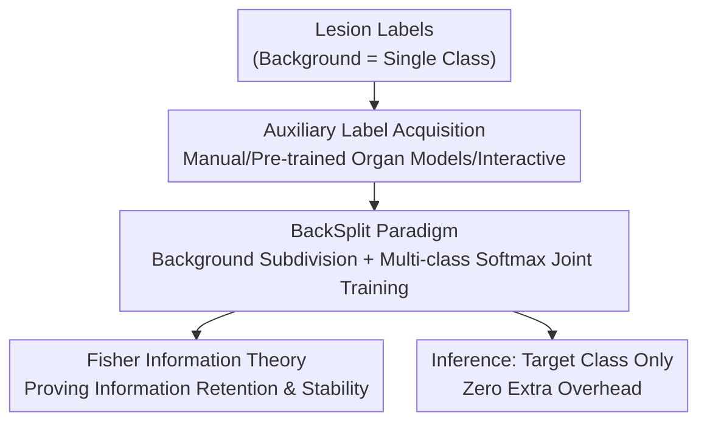

# BackSplit: The Importance of Sub-dividing the Background in Biomedical Lesion Segmentation

**Conference**: CVPR 2026  
**arXiv**: [2511.19394](https://arxiv.org/abs/2511.19394)  
**Code**: Yes (Project Page, repository link not provided in the paper)  
**Area**: Medical Imaging  
**Keywords**: Lesion Segmentation, Background Subdivision, Fisher Information, Auxiliary Supervision, Label Granularity

## TL;DR
The paper proposes BackSplit: a paradigm that subdivides the homogeneous "background" in lesion segmentation into semantic auxiliary organ/tissue classes for joint multi-class softmax training. Using Fisher information theory, it proves that this approach retains more information and produces more stable estimates than binary training, consistently improving Dice scores for small lesions across five datasets with zero additional inference overhead.

## Background & Motivation
**Background**: Lesion segmentation (tumors, cysts, nodules) in medical imaging has long been a challenge. Mainstream improvements focus on three areas: designing better network architectures, specialized loss functions (Focal, Tversky, etc.), and task-specific data augmentation, alongside scaling up labeled data. These all focus on "how the model learns."

**Limitations of Prior Work**: Lesions are typically small, spatially sparse, and severely underrepresented in dataset distributions, leading models to generate frequent false positives and unstable predictions. Almost all methods share a default setting: collapsing all non-lesion pixels into a single "background" class.

**Key Challenge**: This "background" is actually extremely heterogeneous—composed of various tissues, organs, and anatomical structures. Binary training compresses them into a single label, discarding the anatomical context upon which lesion identification relies. In other words, the problem lies not just with the model, but also with the **label space**: coarsened background labels inherently lose information.

**Goal**: To restore lost contextual information by transforming the label space without modifying the architecture or increasing inference costs; and to provide a theoretical explanation for "why subdividing the background is guaranteed to help."

**Key Insight**: The authors adopt a statistical perspective on "label coarsening"—collapsing multi-class labels into binary labels is equivalent to a projection on the curvature of the likelihood, which necessarily loses information. Since numerous pre-trained segmentation models can now **automatically** infer organ masks, subdividing the background has become computationally inexpensive and feasible.

**Core Idea**: Replace "single background supervision" with "multi-class background supervision" for training lesion segmentation, decomposing the background into semantic auxiliary classes and performing joint optimization with the target lesion via a unified softmax—this is BackSplit.

## Method

### Overall Architecture
BackSplit is essentially a **training paradigm** rather than a new architecture. The input remains the original lesion labels, and the output during inference still only predicts the target lesion. The only change occurs in the training labels: the original single background class is replaced by several semantic auxiliary structural classes (organs/tissues surrounding the lesion). The network learns the target class and these auxiliary classes simultaneously within a unified softmax. During inference, auxiliary classes are not outputted, incurring no extra cost, but the contextual knowledge injected during training remains implicitly in the weights, leading to sharper lesion boundaries and fewer false positives.

The pipeline consists of three steps: ① Obtain auxiliary labels (manual annotation / automatic inference via pre-trained organ segmentation models / noisy labels generated from sparse clicks using interactive models); ② Combine target lesion classes with auxiliary classes into multi-class labels for standard joint softmax training; ③ Perform inference using only the target class channel. Theoretically, Fisher information is used to prove the statistical superiority of this paradigm over binary training.

### Key Designs

**1. BackSplit Paradigm: Decomposing Single Background into Semantic Auxiliary Classes for Joint Supervision**

This addresses the pain point where binary training collapses the background and discards anatomical context, causing false positives in small lesions. BackSplit's approach is minimalist: no network changes, no additional branches, and no extra multi-task losses. It merely decomposes the background into several "support structure" classes at the label level (e.g., adding Kidney and Tumor classes for renal cyst tasks, or Pancreas for pancreatic tumor tasks). The target lesion and these auxiliary classes are then trained together in the same softmax for multi-class segmentation. Mechanism: When a model is required to distinguish between "kidney" and "tumor" rather than just "lesion vs. non-lesion," it must learn discriminative features relative to surrounding anatomy. Since this context is learned within the **label space**, it is naturally architecture-agnostic and can be applied to any backbone. Compared to context-aware methods requiring extra branches or manual priors, BackSplit has nearly zero engineering cost and no increased parameters or computation during inference.

**2. Fisher Information Theory: Proving Coarsening Loses Information and Subdivision is Superior**

This is the core contribution that distinguishes the paper from previous "empirically effective" works—it provides a rigorous explanation for **why**. Denoting the target class as $c$, the binary label $Z=\mathbb{1}\{Y=c\}$ is a deterministic coarsening of the multi-class label $Y$. The paper first uses Lemma 1 (Score Projection) to prove that the coarsened score function is the conditional expectation of the full score given $(Z,X)$ (i.e., the $L^2$ optimal projection). Then, Theorem 1 provides the information decomposition:

$$\mathcal{I}_Y(\theta)=\mathcal{I}_Z(\theta)+\mathbb{E}_\theta\!\big[\operatorname{Var}(s_Y(\theta)\mid Z,X)\big]\succeq\mathcal{I}_Z(\theta)$$

This shows that the expected Fisher information for multi-class training is never less than that of binary training (in the sense of the Loewner partial order). The extra term is exactly the "collapsed inter-class gradient variance." Intuition: Even if "Organ A" and "Organ B" both belong to "non-lesion," if they generate different gradient directions, binary training averages them out, erasing curvature directions in parameter space and thus losing information. The paper also provides a closed-form decomposition under softmax (Proposition 1), specifying the information gap in logit geometry. Corollary 1 (Delta Method) extends this to predictions—the asymptotic covariance of multi-class MLE $\mathcal{I}_Y^{-1}\preceq\mathcal{I}_Z^{-1}$, resulting in faster convergence, smaller prediction variance, and more stable estimation.

**3. Cheap and Noise-Robust Auxiliary Label Sources: From Manual to Automatic to Interactive**

For Design 1 to be practical, auxiliary labels must be obtainable. However, manual organ delineation for every case is unrealistic. This design is key to the paradigm's implementation: auxiliary labels can come from three increasingly cheap sources: (a) Manual organ labels provided by the dataset (controlled comparison); (b) **Automatic inference** using organ segmentation models pre-trained on large-scale data (AbdomenAtlas1.0Mini), or foundation models like TotalSegmentator / VIBE-Segmentator; (c) **Noisy** pseudo-labels generated from 7–10 random positive clicks per structure using the interactive model nnInteractive. A key discovery is that BackSplit consistently yields gains even when auxiliary labels are automatically generated or significantly inaccurate. Mechanism: The theory only requires "distinguishable gradient structures between non-target classes" to increase Fisher information; it does not require pixel-perfect auxiliary labels. This explains its robustness to label noise and enables deployment in real-world scenarios without organ labels.

### Loss & Training
No custom losses are used; standard multi-class softmax segmentation training is performed. Three backbones (U-Net, ResEnc U-Net within the nnU-Net framework, and SegResNet) all follow nnU-Net's auto-configuration. Baselines and BackSplit are compared using **identical** architectures and hyperparameters for fairness; all main results use 5-fold cross-validation.

## Key Experimental Results

### Main Results
Validated across 5 datasets spanning CT / MRI / PET and covering abdominal / thoracic / whole-body regions. The table below shows a controlled comparison with ground-truth auxiliary labels (U-Net column, Dice↑ / HD-95↓ / NSD↑):

| Dataset (Target Class) | Metric | Baseline | +BackSplit |
|--------|------|------|----------|
| KiTS23 (Cyst) | Dice | 0.1787 | **0.4573** |
| KiTS23 (Cyst) | HD-95 | 428.41 | **267.27** |
| KiTS23 (Cyst) | NSD | 0.1695 | **0.6004** |
| PANTHER-MR (Tumor) | Dice | 0.4784 | **0.5251** |
| NSCLC-Radiomics (GTV) | Dice | 0.4969 | **0.5256** |

The KiTS23 cyst task saw the most significant improvement—Dice nearly 2.5x higher (0.18→0.46) and NSD soaring from 0.17 to 0.60—precisely because the cysts are small and context (kidney, tumor) provides the most benefit. Results were consistent across three architectures (U-Net / ResEncU-Net / SegResNet) with no increase in parameters.

Results remained stable and effective when auxiliary labels were **automatically generated** (pre-trained organ models):

| Dataset | Metric | Baseline | +BackSplit |
|--------|------|------|----------|
| AutoPET (Tumor, CT+PET) | Dice | 0.3881 | **0.4435** |
| MSWAL (Mean of all lesions) | Dice | 0.2724 | **0.3190** |
| MSWAL (Mean of all lesions) | NSD | 0.5577 | **0.6218** |

### Ablation Study
Robustness to auxiliary label sources (KiTS23, U-Net, single fold, Dice):

| Configuration | KiTS Dice | Description |
|------|---------|------|
| Regular Training | 0.2033 | Binary Baseline |
| BackSplit (Clean labels) | **0.5297** | Full Paradigm |
| BackSplit + nnInteractive 7 clicks | 0.4919 | Noisy interactive pseudo-labels |
| BackSplit + nnInteractive 10 clicks | 0.4921 | Noisy interactive pseudo-labels |

Comparison of foundation model generated labels (AutoPET, single fold, Dice): Regular 0.3921 → BackSplit 0.4537 → +TotalSegmentator 0.4456 → +VIBE-Segmentator 0.4314—all automatic segmenters outperformed the binary baseline.

### Key Findings
- The largest gains occurred in the **smallest lesions with critical context** (KiTS Cyst Dice +0.28, NSD +0.43), confirming the hypothesis that background context helps small lesions most.
- **High tolerance for auxiliary label noise**: Rough pseudo-labels from only 7–10 clicks still boosted KiTS Dice from 0.20 to ~0.49, aligning with the theory that gradient differences between non-target classes suffice.
- **Effective for fine-tuning**: Continuing training of a pre-trained binary U-Net with auxiliary structures showed improvements within 50 epochs, with Dice nearly doubling by 250 epochs.
- An interesting "inflection point" exists under partial supervision: when the proportion of auxiliary labels is very low, the model initially performs worse (confusion between target and auxiliary classes) before recovering and exceeding the baseline as the proportion increases.

## Highlights & Insights
- Shifting the mindset from "changing the model" to "changing the labels": Using the same image and network, simply stopping the collapse of the background yields performance gains with zero inference cost.
- Supplementing a simple empirical trick with **rigorous theory**: Fisher information decomposition and the Delta method turn "subdividing background helps" from a heuristic into a provable theorem. The intuition that "collapsing = erasing inter-class gradient variance" is remarkably clean.
- Noise robustness is a key engineering selling point: Auxiliary labels can be generated via off-the-shelf foundation models like TotalSegmentator, virtually eliminating the barrier to adoption.
- Generalizability of the idea: Any segmentation/detection task with "sparse targets + heterogeneous background" (e.g., remote sensing small objects, industrial defects) can adopt the strategy of subdividing the background into semantic auxiliary classes to inject context.

## Limitations & Future Work
- The authors acknowledge the theory is built on **large-sample** assumptions: increased label granularity increases Fisher curvature but might amplify sampling noise and lead to overfitting in small-data regimes—though this was not observed in common medical data scales.
- The paper does not address "**which** auxiliary structures contribute most"—currently, all surrounding organs are included; an analysis of auxiliary class selection is missing, which could lead to redundancy or interference (as suggested by the initial performance drop in partial supervision experiments).
- Most main experiments use a single U-Net/single fold (Tab. 3/4); cross-architecture and 5-fold evidence is mainly limited to clean label scenarios, making the statistical robustness evidence under automatic/noisy labels relatively thin.
- Future work: Using language or proxy representations (e.g., text prompts for "liver", "kidney") instead of explicit segmentation to provide anatomical context, bypassing the need for auxiliary masks.

## Related Work & Insights
- **vs. Multi-head architectures**: Multi-head methods approximate multi-class within a binary framework, predicting masks independently. They can handle incomplete labels but ignore inter-class dependence and lack boundary consistency. BackSplit uses a unified softmax to explicitly model inter-class relationships, resulting in more coherent boundaries.
- **vs. Context-aware / Auxiliary supervision methods** (anatomy-prompted, multi-scale, shape priors): These rely on extra network branches, multi-task losses, or manual priors. BackSplit operates solely in the label space, remaining architecture-agnostic with zero structural cost, and provides the first theoretical explanation for "why."
- **vs. Label coarsening research**: Prior work mostly explored the empirical trade-off between coarse and fine labels without a theory for statistical efficiency. This paper connects label granularity directly to expected Fisher information, proving that subdivision improves estimation stability and accuracy.

## Rating
- Novelty: ⭐⭐⭐⭐⭐ "Label-tuning over model-tuning" + Fisher information proof; fresh perspective with theoretical support
- Experimental Thoroughness: ⭐⭐⭐⭐ Extensive datasets, architectures, and robustness tests, though some statistical evidence is limited to clean labels
- Writing Quality: ⭐⭐⭐⭐⭐ Clear theoretical derivation, well-explained motivation, excellent figures
- Value: ⭐⭐⭐⭐⭐ Simple, plug-and-play, zero inference cost, clinically friendly, and highly transferable

<!-- RELATED:START -->

## Related Papers

- [\[CVPR 2026\] Focus on Background: Exploring SAM's Potential in Few-shot Medical Image Segmentation with Background-centric Prompting](focus_on_background_exploring_sams_potential_in_few-shot_medical_image_segmentat.md)
- [\[CVPR 2026\] MambaLiteUNet: Cross-Gated Adaptive Feature Fusion for Robust Skin Lesion Segmentation](mambaliteunet_cross-gated_adaptive_feature_fusion_for_robust_skin_lesion_segment.md)
- [\[CVPR 2026\] Instruction-Guided Lesion Segmentation for Chest X-rays with Automatically Generated Large-Scale Dataset](instruction-guided_lesion_segmentation_for_chest_x-rays_with_automatically_gener.md)
- [\[CVPR 2026\] IBISAgent: Reinforcing Pixel-Level Visual Reasoning in MLLMs for Universal Biomedical Object Referring and Segmentation](ibisagent_reinforcing_pixel-level_visual_reasoning_in_mllms_for_universal_biomed.md)
- [\[CVPR 2026\] From Panel to Pixel: Zoom-In Vision-Language Pretraining from Biomedical Scientific Literature](from_panel_to_pixel_zoom-in_vision-language_pretraining_from_biomedical_scientif.md)

<!-- RELATED:END -->
