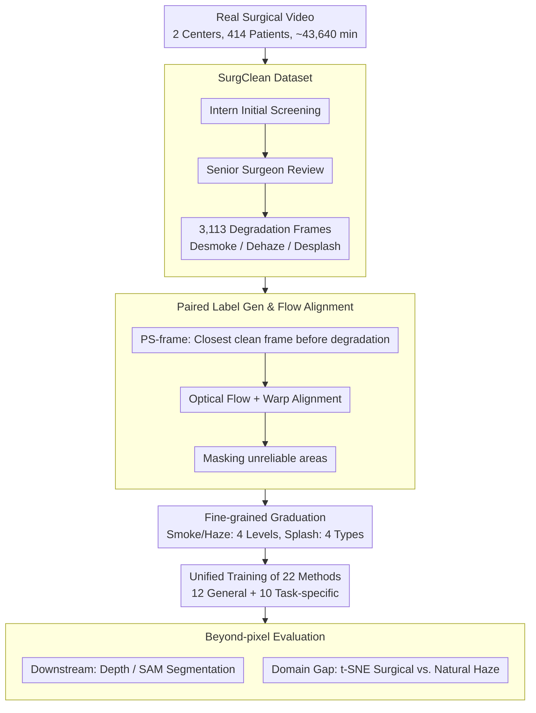

# Benchmarking Endoscopic Surgical Image Restoration and Beyond

**Conference**: CVPR 2026  
**arXiv**: [2505.19161](https://arxiv.org/abs/2505.19161)  
**Code**: [https://github.com/PJLallen/Surgical-Image-Restoration](https://github.com/PJLallen/Surgical-Image-Restoration)  
**Area**: Medical Imaging  
**Keywords**: Endoscopic Image Restoration, Surgical Dehazing/Desmoking/Desplashing, Benchmark Dataset, Image Quality Assessment, Clinical Application

## TL;DR

The authors constructed SurgClean, the first multi-source real-world endoscopic surgical image restoration dataset (3,113 images across desmoking, dehazing, and desplashing). They systematically evaluated 22 representative methods (12 general and 10 task-specific), revealing a significant gap between existing methods and clinical requirements, while analyzing the intrinsic differences between surgical and natural scene degradations.

## Background & Motivation

In minimally invasive surgery, a clear field of view is essential for surgeons to accurately identify anatomical structures and avoid errors. However, three common visual degradations occur during endoscopic procedures:

**Surgical Smoke**: Produced by energy devices (electro-cautery, ultrasonic scalpels) during cutting and hemostasis, obscuring the surgical site.

**Lens Fogging**: Condensation on the lens surface due to temperature differences between the internal body and external environment, creating a uniform haze.

**Fluid Splash**: Blood, tissue fluid, or bile splashing onto the lens, causing localized occlusion.

These degradations severely compromise surgical safety and efficiency, forcing surgeons to pause frequently to clean the lens.

**Limitations of Prior Work**:
- Most datasets rely on **synthetic data** (e.g., Gaussian smoke over clean images), which differs significantly from real-world degradation.
- Real-world datasets mostly **cover a single degradation type** (mainly smoking), lacking dehazing and desplashing tasks.
- Lack of **multi-source, multi-procedure** real-world paired data.

**Key Challenge**: Existing restoration algorithms perform excellently on natural scenes but experience sharp performance drops when transferred to surgical scenes. This suggests intrinsic differences between surgical and natural degradations, requiring specialized datasets and customized algorithms.

## Method

### Overall Architecture

This work presents a dataset and benchmark aimed at determining the clinical viability of existing image restoration methods in real-world endoscopic surgery. The workflow spans from data construction to "beyond-pixel" evaluation: first, extracting real degradation frames from laparoscopic and thoracoscopic videos (414 patients, ~43,640 minutes) across two hospitals to create SurgClean; then, aligning these with clean reference frames via optical flow; followed by a unified evaluation of 22 methods (12 general restoration + 10 task-specific); finally, assessing results through downstream tasks like depth estimation and segmentation while characterizing the distribution differences between surgical and natural degradations.

### Key Designs

**1. SurgClean Dataset: Replacing Synthetic Degradation with Real Surgical Video**

Existing surgical data are either synthetic or limited to desmoking. SurgClean extracts real degradation frames from clinical videos. After a two-stage annotation process (initial screening by 4 surgical interns $\to$ review by 2 senior surgeons), 3,113 frames at $1280 \times 720$ resolution were obtained: 2,127 for desmoking, 849 for dehazing, and 137 for desplashing. The data covers multiple procedures from two institutions, ensuring diversity and a sample distribution that reflects clinical frequency rather than artificial balancing.

**2. Paired Label Generation and Optical Flow Alignment**

To solve the lack of simultaneous clean/degraded truth, SurgClean uses the "PS-frame" scheme, selecting the nearest preceding clean frame as a reference. Since the endoscope moves, the reference and degraded frames are aligned by estimating optical flow with a pre-trained PWC-Net and warping the reference frame:

$$\mathbf{F}_{UR \to P} = \mathcal{O}(\mathbf{UR}, \mathbf{P}), \quad \mathbf{UR}_{warp} = \mathcal{W}(\mathbf{UR}, \mathbf{F}_{UR \to P})$$

To prevent training on unreliable flow (e.g., large displacements or occlusions), a mask $\mathbf{M}$ is applied to the reconstruction loss: $\mathcal{L}_{rec} = \sum_i \lVert \mathbf{M}_i \odot (\mathbf{UR}_{warp,i} - \mathbf{P}_i) \rVert_1$. This provides a pragmatic compromise between label authenticity and training feasibility.

**3. Fine-grained Graduation**

To evaluate algorithmic robustness, SurgClean categorizes frames by severity. Desmoking and dehazing are divided into four levels: Level 1 (mild, <1/3 field obscured), Level 2 (moderate, 1/3–2/3), Level 3 (heavy, >2/3), and Level 4 (near-total obscuration). Desplashing is categorized by substance: blood ($T_{blood}$), fat ($T_{fat}$), bile ($T_{bile}$), and tissue fluid ($T_{fluid}$).

**4. Beyond-pixel Evaluation**

The authors extended evaluation beyond PSNR. Downstream tasks include depth estimation (checking 3D structure preservation) and segmentation using SAM/MedSAM (checking scene parsing and tool segmentation). Furthermore, t-SNE analysis of surgical vs. natural haze features shows distinct separation, with surgical haze exhibiting localized abrupt changes compared to the global gradients of natural haze, justifying the need for domain-specific designs.

### Loss & Training

All 22 compared methods were trained with the following setup:
- PyTorch implementation on two NVIDIA RTX 4090 GPUs.
- Adam optimizer, random 128x128 patches, batch size of 2.
- 200k iterations with learning rate halved every 100k iterations.
- Unified training using optical flow-aligned paired labels.

## Key Experimental Results

### Main Results

**Performance of General Restoration Models on SurgClean**:

| Method | Desmoke PSNR↑ | Desmoke SSIM↑ | Dehaze PSNR↑ | Dehaze SSIM↑ | Desplash PSNR↑ | Desplash SSIM↑ | Params |
|------|----------|----------|----------|----------|------------|------------|--------|
| ConvIR | **19.43** | 0.678 | 18.87 | 0.619 | 21.33 | 0.717 | 14.83M |
| FocalNet | 19.24 | 0.679 | **19.07** | **0.628** | 21.42 | 0.717 | 3.74M |
| Restormer | 18.94 | 0.674 | 19.04 | 0.619 | 21.40 | 0.718 | 26.13M |
| MambaIR | 19.32 | 0.679 | 18.87 | 0.622 | 21.43 | 0.722 | 4.31M |
| X-Restormer | 18.03 | 0.659 | 18.60 | 0.628 | **22.32** | **0.735** | 42.52M |
| AST | 19.18 | 0.635 | 17.05 | 0.606 | 22.05 | 0.731 | 19.92M |
| RAMiT | 19.03 | 0.677 | 19.02 | 0.625 | 21.43 | 0.718 | **0.30M** |

### Ablation Study

| Setting | Key Finding | Description |
|----------|---------|------|
| DesmokeData→DesmokeData | Higher PSNR | DesmokeData degradation is relatively simple |
| SurgClean→SurgClean | Relatively lower PSNR | SurgClean degradation is more complex |
| DesmokeData→SurgClean | Significant performance drop | Poor cross-domain generalization |
| SurgClean→DesmokeData | **Small performance drop** | Models trained on SurgClean generalize better |
| Post-restoration Depth | Highest Dehaze PSNR $\neq$ Best Depth | Pixel metrics do not align perfectly with downstream tasks |
| Post-restoration Seg | MambaIRv2 highest mIoU but average PSNR | Trade-off between semantic preservation and pixel reconstruction |

### Key Findings

- **All methods fall far short of clinical standards**: The best desmoking PSNR is only 19.43dB, with significant residual degradation.
- **Task-specific methods show no clear advantage**: Specialized desmoking/dehazing models often performed worse than general models due to domain gaps.
- **Low-level degradation is manageable, high-level remains difficult**: Level 1-2 see improvement, whereas Level 3-4 remain challenging.
- **Inconsistency between pixel metrics and downstream tasks**: Methods with the highest PSNR do not necessarily yield the best depth estimation or segmentation.
- **SurgClean provides better generalization**: Training on SurgClean benefits from a more diverse and complex degradation distribution.

## Highlights & Insights

- **First multi-type real-world surgical restoration dataset**: Fills the gap in real surgical data for dehazing and desplashing.
- **Comprehensive Benchmark**: Standardized platform with 22 methods, 3 degradation types, 4 severity levels, and 5 evaluation metrics.
- **Analysis of Surgical vs. Natural Degradation**: t-SNE and depth results reveal fundamental differences, guiding future domain-specific algorithm development.
- **Closed-loop Evaluation**: Assesses impact on clinical-relevant downstream tasks (depth, segmentation) beyond traditional pixel-wise metrics.

## Limitations & Future Work

- **Small Desplash Sample Size**: Only 137 images, insufficient for robust deep learning training.
- **Imperfect Label Alignment**: Optical flow is an approximation; artifacts appear in large-displacement scenarios.
- **Lack of Multi-degradation Scenarios**: Real surgeries often involve simultaneous smoke and splashes.
- **No New Algorithm Proposed**: Primary contribution is the data and evaluation framework rather than a novel model.
- **Evaluation Coverage**: Recent diffusion-based restoration methods (e.g., DiffIR) were not included.

## Related Work & Insights

- Unlike CycleGAN-DesmokeGAN or Desmoke-LAP (unpaired), SurgClean provides real paired labels.
- While DesmokeData has paired labels, it is limited to simpler desmoking tasks.
- The poor transferability of natural scene restoration methods (like those used for RESIDE) emphasizes the necessity for domain-specific designs.
- Lightweight models like RAMiT (0.3M) show promise for edge deployment in surgical settings given acceptable performance.

## Rating
- Novelty: ⭐⭐⭐⭐ First real surgical dataset covering three degradations.
- Experimental Thoroughness: ⭐⭐⭐⭐⭐ Extremely comprehensive with 22 methods and downstream analysis.
- Writing Quality: ⭐⭐⭐⭐ Clear structure with thorough data analysis.
- Value: ⭐⭐⭐⭐ Provides a standard platform and baseline for the community.

<!-- RELATED:START -->

## Related Papers

- [\[CVPR 2026\] Beyond the Static-World: Lifelong Learning for All-in-One Medical Image Restoration](beyond_the_static-world_lifelong_learning_for_all-in-one_medical_image_restorati.md)
- [\[CVPR 2026\] LEMON: A Large Endoscopic MONocular Dataset and Foundation Model for Perception in Surgical Settings](lemon_a_large_endoscopic_monocular_dataset_and_foundation_model_for_perception_in.md)
- [\[CVPR 2026\] A Supervised Multi-task Framework for Joint cryo-ET Restoration Enabled by Generative Physical Simulation](a_supervised_multi-task_framework_for_joint_cryo-et_restoration_enabled_by_gener.md)
- [\[CVPR 2026\] SIMSPINE: A Biomechanics-Aware Simulation Framework for 3D Spine Motion Annotation and Benchmarking](simspine_a_biomechanics-aware_simulation_framework_for_3d_spine_motion_annotatio.md)
- [\[CVPR 2026\] Focus-to-Perceive Representation Learning: A Cognition-Inspired Hierarchical Framework for Endoscopic Video Analysis](focus-to-perceive_representation_learning_a_cognition-inspired_hierarchical_fram.md)

<!-- RELATED:END -->
