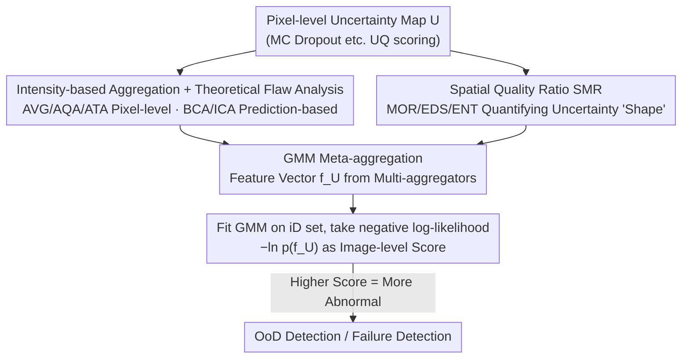

# Better than Average: Spatially-Aware Aggregation of Segmentation Uncertainty Improves Downstream Performance

**Conference**: CVPR 2026  
**arXiv**: [2603.29941](https://arxiv.org/abs/2603.29941)  
**Code**: [https://github.com/Kainmueller-Lab/aggrigator](https://github.com/Kainmueller-Lab/aggrigator)  
**Area**: Medical Imaging  
**Keywords**: Uncertainty Quantification, Spatial Aggregation Strategies, OoD Detection, Failure Detection, Meta-Aggregation

## TL;DR
This work presents the first systematic study of aggregation strategies from pixel-level uncertainty to image-level scores in segmentation tasks. It proposes SMR aggregators that integrate spatial structural information (Moran's I, Edge Density, Shannon Entropy) and a GMM-based meta-aggregator. Evaluation across 10 datasets demonstrates that global average (AVG) is a suboptimal choice, while GMM-All meta-aggregation performs robustly in both OoD and failure detection.

## Background & Motivation

1. **Background**: In safety-critical applications such as medical imaging and autonomous driving, segmentation models must output confidence scores. While UQ methods generate uncertainty scores for each pixel, practical use cases require aggregating these into a single image-level scalar for OoD and failure detection.
2. **Limitations of Prior Work**: (1) Global Average (AVG) is the default choice but ignores spatial structural information; (2) Various alternative strategies (patch-level, class-level, threshold-level) lack systematic comparison; (3) Existing strategies possess theoretical flaws—AQA lacks scale invariance, while ATA is non-monotonic.
3. **Key Challenge**: The out-of-distribution (OoD) nature or error sensitivity in segmentation is typically reflected in local uncertainty patterns (e.g., unseen class regions, blurred boundaries), but simple pixel averaging masks these critical local variations.
4. **Key Insight**: It is observed that spatial distribution patterns of uncertainty (e.g., concentrated in clusters vs. distributed along boundaries) contain vital diagnostic information, requiring spatially-aware aggregation methods for capture.
5. **Core Idea**: Ours proposes the Spatial Quality Ratio (SMR)—measuring the proportion of uncertainty quality in regions with high spatial structure—and fuses outputs from multiple aggregation strategies via a GMM meta-aggregator.

## Method

### Overall Architecture
The core problem addressed is specific: UQ methods assign an uncertainty score to **every pixel** of a segmentation result, but downstream OoD and failure detection require **one scalar per image**. Thus, an aggregation function $f$ must compress the entire uncertainty map $U \in [0,1]^{m \times n}$ into a single value $f(U) \in \mathbb{R}$. While global average (AVG) is the default, it is identified as a neglected but critical choice. The work systematically compares aggregators split into two families: **Intensity-based** (direct pixel values, including pixel-level AVG/AQA/ATA and prediction-based class averages BCA/ICA) and the newly proposed **Spatially-aware** family (analyzing the "shape" of uncertainty). Finally, a GMM meta-aggregator unifies outputs from both families into a robust score.

### Key Designs

**1. Theoretical Flaws of Common Aggregation Strategies: Why AVG should not be the default**

Aggregators are rarely compared rigorously in literature. AVG is popular simply due to its simplicity. Ours subjects mainstream strategies to scrutiny, noting they violate properties that should hold. AVG is entirely insensitive to spatial structure—rearranging identical pixel values as clusters or noise yields the same score, yet spatial arrangement carries anomaly signals. AQA (Average over Quantile) lacks scale invariance: cropping background pixels should not change the judgment of "how uncertain this image is," yet its score shifts with background ratio. ATA (Average over Threshold) is non-monotonic—globally increasing every pixel's uncertainty might actually decrease the score, which is counterintuitive. In contrast, prediction-based BCA/ICA (averaging by predicted class) satisfy scale invariance and perform in the top tier.

**2. Spatial Quality Ratio (SMR): Quantifying "Shape" into Scores**

SMR is designed to address AVG's blindness to spatial arrangement. The core intuition is that OoD cases or errors in segmentation often manifest as **local uncertainty patterns** (unseen objects cause clustered uncertainty; blurry boundaries cause edge-aligned uncertainty), which simple averaging smooths out. SMR identifies "high-structure regions" using a spatial metric and calculates the ratio of average uncertainty in these regions relative to the global average. A higher ratio indicates uncertainty is concentrated in structured areas, suggesting true anomalies rather than diffuse noise. Three implementations are provided: SMR_Moran (MOR) for spatial autocorrelation, SMR_EDS (EDS) for edge density, and SMR_Entropy (ENT) for local heterogeneity.

**3. GMM Meta-aggregator: Unifying Strengths via Probability Density**

Experimental results show no single aggregator is superior across all datasets. GMM meta-aggregation eliminates the fragility of manual selection. It represents an uncertainty map as a multi-dimensional feature vector $f_U = (f_1(U), \dots, f_d(U))$, where each dimension is an aggregator output. A Gaussian Mixture Model fits the joint distribution $p_{\text{GMM}}(f_U)$ on in-distribution samples only, with the final anomaly score being the negative log-likelihood:

$$
f_{\text{meta}}(U) = -\ln p_{\text{GMM}}(f_U)
$$

The intuition is that iD images cluster in feature space; deviations (low likelihood) indicate anomalies. Variants include GMM-Spa (spatial features), GMM-Int (intensity), and GMM-All (comprehensive). GMM-All is most robust as probability modeling allows different dimensions to contribute based on dataset characteristics without manual tuning.

## Key Experimental Results

> Experiments cover 10 datasets (Synthetic pathology ARC, Lizard pathology, LIDC lung nodule CT, C. Elegans, GTA/Cityscapes, WeedsGalore) across multiple architectures (U-Net, HRNet, DeepLabv3+).

### Main Results (OoD Detection AUROC)

| Aggregation Strategy | LIDC-Mal | CAR-CS | WORM-Pro | LIZ-IG | Mean Rank |
|----------|----------|--------|----------|--------|----------|
| AVG | Suboptimal | Near Random | Poor | Competitive | Low |
| AQA | Poor | Poor | Poor | Medium | Low |
| BCA | Good | Good | Good | Good | **Tier 1** |
| ICA | Good | Good | Good | Good | **Tier 1** |
| **GMM-All** | Good | **SOTA** | **SOTA** | Medium | **Tier 1** |

Statistical significance (Wilcoxon p < 0.05): BCA, ICA, and GMM-All form the statistically significant top tier.

### Ablation Study (Failure Detection E-AURC, lower is better)

| Aggregation Strategy | Statistical Rank |
|----------|----------|
| QFR | **Statistically Optimal** (p < 0.001) |
| BCA | Tier 2 |
| GMM-All | Tier 2, close to QFR |
| AVG | Worst (except synthetic data) |

### Key Findings
- **AVG performs poorly in 6/10 scenarios**, often near random guessing, and should not be used as the default.
- GMM-All demonstrates the strongest robustness in OoD detection (consistent across datasets) and approaches the optimal QFR in FD.
- SHAP analysis reveals EDS dominates OoD separation in CAR datasets, whereas all features struggle in LIZ-IG.
- Trends remain consistent across different UQ methods (MCD, Deep Ensembles, MSP, TTA), validating the generality of the aggregation analysis.

## Highlights & Insights
- **Systematic Benchmark Value**: The first comprehensive comparison of segmentation aggregation strategies across datasets and tasks (OoD+FD), overturning the "AVG is sufficient" assumption.
- **SMR Intuition**: The "shape" (clustering/edges/noise) and "magnitude" (average) of uncertainty are equally important, with significant implications for the UQ field.
- **GMM Efficiency**: No increase in inference complexity; fitting the GMM is a one-time iD operation that unifies the benefits of multiple aggregators.

## Limitations & Future Work
- GMM assumes iD features follow a Gaussian mixture; this may fail in highndimensional or highly multi-modal distributions (e.g., LIZ-IG).
- Dependency on an iD set for GMM fitting may limit cold-start scenarios.
- Current focus is on 2D segmentation; extension to 3D medical volumes or temporal video uncertainty is a promising direction.
- Online GMM updates could support continual learning settings.

## Related Work & Insights
- **vs. Traditional MSP**: While MSP operates at the classification level, Ours performs image-level decision-making after pixel-level aggregation, matching the fine-grained nature of segmentation.
- **vs. Anomaly Segmentation**: Anomaly segmentation produces pixel-level maps; Ours focuses on "how to pool pixel signals into actionable image-level judgments."
- **Application Insight**: The GMM meta-aggregation concept is transferable to any scenario requiring the fusion of multi-source signals (e.g., multi-modal fusion, confidence estimation in MoE systems).

## Rating
- Novelty: ⭐⭐⭐⭐ The combination of spatial aggregation and meta-aggregation is novel, though components build on mature statistical methods.
- Experimental Thoroughness: ⭐⭐⭐⭐⭐ 10 diverse datasets, two downstream tasks, multiple UQ methods, SHAP analysis, and statistical testing.
- Writing Quality: ⭐⭐⭐⭐ Clear problem formalization and rigorous theoretical analysis.
- Value: ⭐⭐⭐⭐⭐ Provides a practical guide for aggregation selection in safety-critical applications with open-source tools.

<!-- RELATED:START -->

## Related Papers

- [\[CVPR 2026\] MedLoc-R1: Performance-Aware Curriculum Reward Scheduling for GRPO-Based Medical Visual Grounding](medloc-r1_performance-aware_curriculum_reward_scheduling_for_grpo-based_medical_.md)
- [\[CVPR 2026\] Delving Aleatoric Uncertainty in Medical Image Segmentation via Vision Foundation Models](delving_aleatoric_uncertainty_in_medical_image_segmentation_via_vision_foundatio.md)
- [\[CVPR 2026\] SAR2Net: Learning Spatially Anchored Representations for Retrieval-Guided Cross-Stain Alignment](sar2net_learning_spatially_anchored_representations_for_retrieval-guided_cross-s.md)
- [\[CVPR 2025\] Uncertainty-Aware Concept and Motion Segmentation for Semi-Supervised Angiography Videos](../../CVPR2025/medical_imaging/uncertainty-aware_concept_and_motion_segmentation_for_semi-supervised_angiograph.md)
- [\[CVPR 2026\] LATA: Laplacian-Assisted Transductive Adaptation for Conformal Uncertainty in Medical VLMs](lata_laplacian-assisted_transductive_adaptation_for_conformal_uncertainty_in_med.md)

<!-- RELATED:END -->
