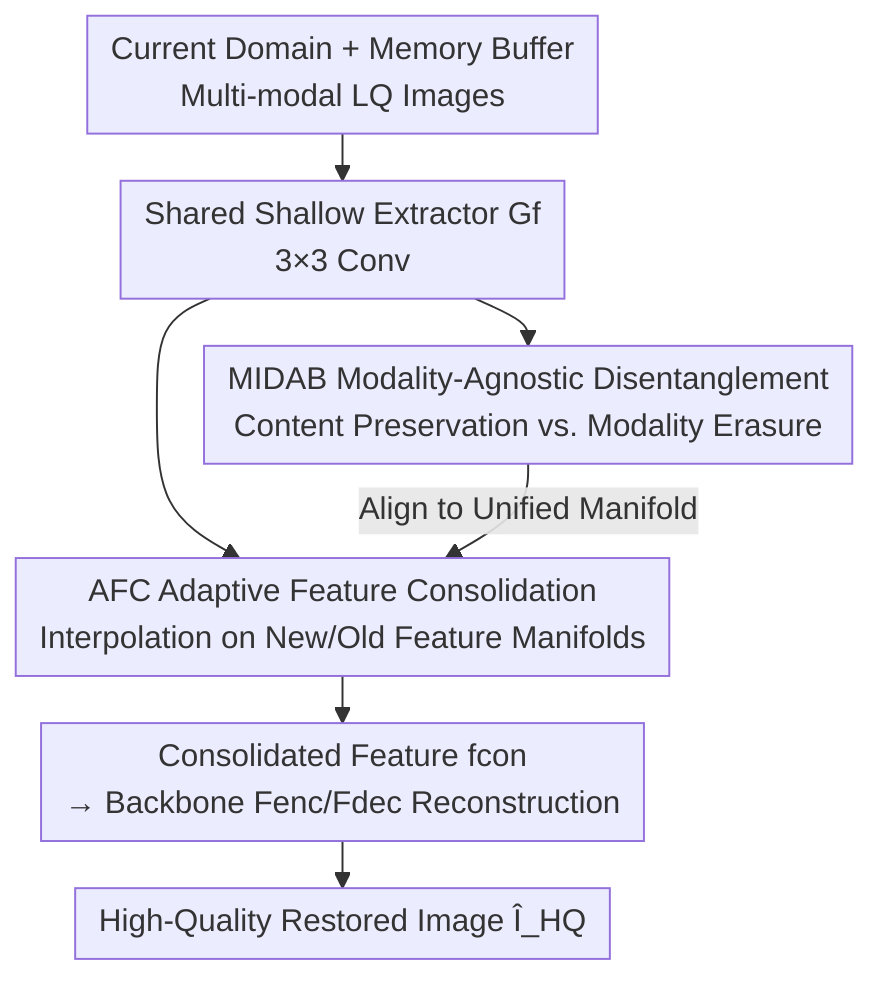

# Beyond the Static-World: Lifelong Learning for All-in-One Medical Image Restoration

**Conference**: CVPR 2026  
**Paper**: [CVF Open Access](https://openaccess.thecvf.com/content/CVPR2026/html/Shan_Beyond_the_Static-World_Lifelong_Learning_for_All-in-One_Medical_Image_Restoration_CVPR_2026_paper.html)  
**Code**: None  
**Area**: Medical Imaging  
**Keywords**: All-in-one Medical Image Restoration, Lifelong Learning, Catastrophic Forgetting, Modality Decoupling, Adversarial Balancing

## TL;DR
To address the simultaneous "modality conflict" and "catastrophic forgetting" encountered in real-world clinical data streams for all-in-one medical image restoration (sharing one model for MRI SR, CT denoising, and PET synthesis), this paper proposes the ROME framework. It first maps different modalities to a unified Modality-Agnostic Manifold (MIDAB) via adversarial balancing, and then performs Adaptive Feature-level Consolidation (AFC) on this manifold to stabilize old knowledge, reducing average degradation after sequential training by over 10%.

## Background & Motivation
**Background**: All-in-one medical image restoration (All-in-one MedIR) aims to process MRI super-resolution, CT denoising, and PET synthesis simultaneously using a single model, moving towards general medical imaging intelligence. Representative works like AMIR use task-adaptive routing to mitigate multi-modality conflicts, while DiffCode employs diffusion-enhanced vector quantization codebooks to compensate for information loss across different tasks.

**Limitations of Prior Work**: These methods are built on a "static-world assumption"—assuming that data from all institutions is collected at once and can be trained simultaneously. However, real clinical environments are quite the opposite: data arrives in a **continuous stream**, new institutions bring domain shifts, and worse, new partners might have **entire classes of missing modalities** (e.g., an institution that lacks CT data). It is neither realistic nor feasible to force the model to retrain from scratch on all historical data; thus, a general model must possess lifelong learning capabilities.

**Key Challenge**: Lifelong learning introduces catastrophic forgetting—weights optimized for old domains are overwritten when adapting to new ones. The key insight of this paper is that forgetting (time dimension) and modality conflict (space dimension) **are not two independent problems**. The distributions and degradation patterns of different modalities (MRI vs. CT) vary significantly, generating updates with **opposing gradient directions** when sharing parameters. If the model cannot resolve such gradient conflicts even in a static setting, these conflicts escalate into complete "weight overwriting" during sequential learning. In other words, modality conflicts severely amplify forgetting.

**Goal / Key Insight**: It is essential to first resolve modality conflicts within each domain to construct a **unified modality-agnostic manifold**, and then perform knowledge consolidation on this stable manifold—spatial stability is a prerequisite for temporal stability.

**Core Idea**: The ROME framework is proposed following a "disentangle-optimize-consolidate" paradigm. It uses adversarial balancing to force modality-agnostic representations and then applies adaptive feature-level consolidation on these representations to combat forgetting.

## Method

### Overall Architecture
ROME (Resilient On-the-fly Medical Enhancement) faces a more realistic domain stream paradigm: a model $F$ (parameters $\theta$) sequentially experiences a domain sequence $D=\{D_1,...,D_N\}$, where each domain $D_i$ is a tuple $(D_i, M_i)$—$D_i$ represents the data distribution (clean/noisy), and $M_i\subseteq\{\text{MRI, CT, PET}\}$ is the subset of modalities available in that domain. Both distributions and modality sets can change between domains (simulating domain shift and missing modalities, respectively). At time $i$, the model can only access current domain data $D_i$ and a memory buffer $M$ containing a few old samples; the goal is to update parameters from $\theta_{i-1}$ to $\theta_i$, learning the new domain without significant degradation on old ones.

The overall workflow is: current domain data and memory buffer samples first pass through a shared shallow extractor $G_f$ (3×3 convolution) to extract features. The process then splits: the MIDAB module applies an adversarial loss $L_{adv}$ to align all modalities into a unified manifold, while the AFC module performs adaptive interpolation between new and old domain features to produce consolidated features $f_{con}$. Finally, $f_{con}$ is fed into the main backbone encoder $F_{enc}$ and decoder $F_{dec}$ for reconstruction. The entire system is optimized end-to-end with $L_1 + \alpha L_{adv} + \beta L_{div}$.

### Key Designs

**1. MIDAB: Forcing a Modality-Agnostic Manifold via Adversarial Balancing**

The root of modality conflict is that features extracted by the shared shallow network are **entangled**, encoding two types of information: modality-agnostic content $f_{content}$ (anatomical structures, tissue boundaries, lesion details, which must be preserved for high-fidelity reconstruction) and modality-specific style $f_{mod}$ (streak artifacts in CT, K-space noise patterns in MRI, which are harmful to reconstruction and vary by modality). $f_{mod}$ is the source of conflict: when different modalities' $f_{mod}$ pass through shared parameters, they generate gradients in opposite directions. A simple $L_1$ reconstruction loss cannot solve this as it only encourages preserving $f_{content}$ but lacks an explicit mechanism to penalize $f_{mod}$.

MIDAB transforms "disentanglement" into an adversarial game using two counteracting forces. The **Content Preservation Force** is the primary reconstruction loss: $f_{content}$ is used by the backbone to generate a residual map $I_R = F_{dec}(F_{enc}(f_{content}))$, and the final prediction $\hat I_{HQ}=I_R+I_{LQ}$ is supervised by $L_1=\|\hat I_{HQ}-I_{HQ}\|_1$, forcing $G_f$ to retain content. The **Modality Erasure Force** introduces a modality discriminator $D_{mod}$ trained to predict modality labels from $G_f(I_{LQ})$ via $L_{ce}^{mod}=\mathrm{CE}(D_{mod}(G_f(I_{LQ})), y_{mod})$; meanwhile, $G_f$ uses a Gradient Reversal Layer (GRL) to maximize the discriminator's uncertainty. The alignment loss $L_{adv}=-L_{ce}^{mod}$ acts as the erasure force. These two forces keep $G_f$ in a gradient equilibrium: it cannot cheat by outputting a trivial solution (losing content is heavily penalized by $L_1$), and the only Nash equilibrium is to retain all content while erasing modality style, compressing all modalities into a compact, unified, content-rich manifold. This unified manifold is also the prerequisite for handling "missing modalities"—the shared representation prevents the entire feature space from collapsing when a specific modality is absent in a future domain.

**2. AFC: Adaptive Feature-level Consolidation on a Unified Manifold**

With the stable manifold provided by MIDAB, the framework addresses forgetting. Traditional Experience Replay (ER) hard-mixes old samples at the **pixel level**, which is inefficient and sensitive to surface variations. AFC operates at the **feature level**: since both new domain features $f_{new}$ and old domain features $f_{old}$ are extracted by $G_f$ and aligned by MIDAB, AFC aims to find an **optimal consolidation point** $f_{con}$ on this shared manifold, adaptively merging knowledge based on data differences while preserving gradient info from both domains.

Specifically, AFC builds global descriptors for each feature map by concatenating spatial average pooling and max pooling to capture statistical and salient information: $p_{old}=\mathrm{Concat}(\mathrm{AvgPool}(f_{old}),\mathrm{MaxPool}(f_{old}))$, and similarly for $p_{new}$. These vectors are fed into a small prediction network $H_{pred}$ (FC + MLP) followed by Softmax to produce normalized interpolation weights $\lambda=\mathrm{Softmax}(H_{pred}(\mathrm{Concat}(p_{old},p_{new})))$, where $\lambda_{old}+\lambda_{new}=1$. The consolidated feature is the weighted sum:

$$f_{con}=\lambda_{old}\cdot f_{old}+\lambda_{new}\cdot f_{new}.$$

Compared to rigid pixel mixing, this adaptive feature interpolation merges domain knowledge more smoothly and retains old knowledge more effectively.

**3. Diversity Loss: Preventing Weight Collapse to Trivial Solutions**

A potential issue with AFC is that $H_{pred}$ might learn a low-entropy trivial solution, such as always outputting $\lambda=[0.5, 0.5]$, which degenerates into simple averaging. To avoid this, a diversity loss $L_{div}$ is introduced to encourage the distribution of predicted weights within a mini-batch to be sparse. This is achieved by maximizing variance, defined as the negative mean squared $L_2$ distance from the weights to the batch mean $\bar\lambda$:

$$L_{div}=-\frac{1}{B}\sum_{b=1}^{B}\|\lambda_b-\bar\lambda\|_2^2,$$

where $B$ is the batch size and $\bar\lambda=\frac{1}{B}\sum_b\lambda_b$. Minimizing $L_{div}$ maximizes weight variance, forcing $H_{pred}$ to provide sample-specific, non-trivial interpolation strategies. This term accounts for the largest gain (+1.15 dB) in the ablation study, proving that forcing the network to learn discriminative fusion strategies is the core strength of AFC.

### Loss & Training
The framework performs end-to-end optimization of the composite loss $L_{total}=L_1+\alpha L_{adv}+\beta L_{div}$, with $\alpha=0.01$ (MIDAB adversarial loss weight) and $\beta=0.15$ (AFC diversity loss weight). Training proceeds sequentially from $D_1$ to $D_5$, with 30,000 iterations per domain. Each step samples 8 new domain samples and 4 replay samples, with the memory buffer retaining 200 samples per old domain. The Adam optimizer ($\beta_1=0.9, \beta_2=0.999$) is used with an initial learning rate of $1\times10^{-4}$, decaying to $1\times10^{-6}$ via cosine annealing over 150,000 total iterations on NVIDIA A6000 GPUs using PyTorch.

## Key Experimental Results

### Main Results
The dataset follows the AMIR setup, covering MRI SR, CT denoising, and PET synthesis. In the lifelong setting, the authors designed a 5-domain hybrid incremental sequence: $D_1$=PET/CT/MRI; $D_2$ adds light Gaussian noise ($\sigma=0.15$); $D_3$ misses MRI; $D_4$ misses CT; $D_5$ misses PET—simultaneously simulating domain shift and modality missingness. After training on $D_5$, performance is evaluated on the complete test sets of all five domains, reporting average PSNR / SSIM / RMSE.

**Static All-in-one Setting (Theoretical Upper Bound, all data available simultaneously):**

| Method | PSNR ↑ | SSIM ↑ | RMSE ↓ |
|------|--------|--------|--------|
| AirNet | 34.06 | 0.9314 | 13.24 |
| AMIR | 34.28 | 0.9351 | 12.55 |
| DiffCode | 34.62 | 0.9336 | 12.37 |
| **ROME (Ours)** | **34.94** | **0.9439** | **11.40** |

**Lifelong All-in-one Setting (Sequential training $D_1\to D_5$, all baselines equipped with identical ER):**

| Method | PSNR ↑ | SSIM ↑ | RMSE ↓ |
|------|--------|--------|--------|
| Restormer | 30.39 | 0.8732 | 17.73 |
| AirNet | 30.74 | 0.8763 | 16.83 |
| AMIR | 31.41 | 0.8822 | 16.24 |
| **ROME (Ours)** | **32.36** | **0.8955** | **15.67** |

Regarding **resilience against forgetting**: from the static upper bound to the lifelong result, ROME only drops 2.58 dB (34.94→32.36), whereas the second-best AMIR drops 2.87 dB (34.28→31.41), and the standard Restormer collapses by 3.77 dB. ROME exhibits the smallest degradation, reducing catastrophic decay by over 10%.

### Ablation Study
Cumulative ablation (Average PSNR across three modality tasks):

| Configuration | PSNR ↑ | Description |
|------|--------|------|
| Baseline (Static) | 34.38 | Starting point |
| + MIDAB (Static) | 34.61 | +0.23 in static; confirms modality conflict harms performance even with full data |
| Lifelong Naive Fine-tuning | 30.51 | Sequential fine-tuning; catastrophic forgetting drops it to 30.51 |
| + MIDAB | 30.69 | Resolving conflict alone (+0.18) is insufficient to stop forgetting |
| + ER | 30.77 | Adding standard ER (+0.08); confirms ER necessity |
| + AFC | 31.21 | Feature-level interpolation instead of pixel mixing (+0.44) |
| + $L_{div}$ (Full ROME) | 32.36 | Adding diversity loss (+1.15); largest jump |

### Key Findings
- **$L_{div}$ is the largest contributor**: The jump from AFC (31.21) to adding diversity loss (32.36) is +1.15 dB, far exceeding the gains from MIDAB (+0.18) or standard ER (+0.08). This indicates the power of AFC lies in being forced by $L_{div}$ to learn discriminative, non-trivial fusion strategies.
- **Synergy > Individual Components**: The cumulative improvement from the (MIDAB+ER) baseline to the full "decouple-optimize-consolidate" strategy is +1.59 dB, verifying that the components must work together.
- **Gradient Conflict Quantification**: Using cosine similarity to measure gradient directions of different modalities on $G_f$. In the baseline, CT↔PET conflicts were most severe (-0.27 to -0.35), meaning optimizing CT significantly harmed PET. ROME reduced average PET-CT conflict from -0.31 to -0.265, indicating that MIDAB effectively suppresses modality interference.

## Highlights & Insights
- **Framing "Spatial issues are prerequisites for temporal issues" is clever**: Linking modality conflict (space) and catastrophic forgetting (time)—creating a modality-agnostic manifold first, then consolidating knowledge on it. The ablation showing "+0.18 for MIDAB alone" proves that the manifold is the foundation, not an optional parallel module.
- **Nash Equilibrium Argument for Adversarial Balancing is solid**: The trade-off between content preservation force ($L_1$) and modality erasure force (GRL+discriminator) ensures $G_f$ cannot cheat, leading to the only equilibrium: "keep content, erase style." This "dual-force game for disentangled representations" can be transferred to any multi-source task requiring the removal of domain-specific styles.
- **Feature-level Consolidation + Diversity Regularization** is a reusable trick: Moving experience replay from pixels to feature-level interpolation on a unified manifold, combined with batch-wise variance regularization to prevent weight collapse, provides valuable insights for other continual learning scenarios beyond medicine.

## Limitations & Future Work
- The memory buffer still requires storing 200 samples per old domain, placing it in the rehearsal-based category. In privacy-sensitive medical scenarios, storing raw samples might be restricted; the authors do not discuss exemplar-free alternatives.
- Evaluation is limited to a synthetic incremental sequence of 3 modalities and 5 domains; the generalizability to longer, noisier real-world clinical streams remains to be verified. The sensitivity of the results to the sequence definition and hyperparameters ($\alpha=0.01, \beta=0.15$) is not fully explored.
- AFC performs binary weighting between new and old domains; whether it can find a single optimal consolidation point when multiple heterogeneous old domains coexist, or whether it will bias toward the most recent domain, deserves further analysis.

## Related Work & Insights
- **vs. AMIR**: AMIR uses task-adaptive routing to dynamically allocate network paths to mitigate modality gradient conflicts, but it operates under the static-world assumption and routing does not solve forgetting. ROME reuses the AMIR backbone but pivots to a "decoupled unified manifold" approach explicitly for lifelong learning, achieving +0.66 dB in static settings and much lower lifelong degradation.
- **vs. DiffCode**: DiffCode uses diffusion-enhanced VQ codebooks to compensate for information loss and is a strong static baseline (34.62), but similarly does not handle streaming data. ROME outperforms it in static settings (34.94) and naturally supports incrementality.
- **vs. Regularization/Architecture Continual Learning**: Regularization methods (e.g., EWC) often suffer from transitive forgetting or drift constraints as older tasks' constraints weaken. Architecture-based methods avoid drift via expansion but lead to growing model sizes. ROME, being rehearsal-based with fixed parameters, combats drift more directly by revisiting old data.

## Rating
- Novelty: ⭐⭐⭐⭐⭐ Consolidates modality conflict and catastrophic forgetting into a "decouple-optimize-consolidate" paradigm; the first to perform lifelong learning on All-in-one MedIR.
- Experimental Thoroughness: ⭐⭐⭐⭐ Solid static+lifelong settings, cumulative ablation, and gradient conflict quantification, though limited to a single synthetic incremental sequence.
- Writing Quality: ⭐⭐⭐⭐ Clear motivation (space → time) and complete formulas, though some expressions are slightly wordy.
- Value: ⭐⭐⭐⭐⭐ Directly addresses clinical pain points like data streams and missing modalities; the framework modules are transferable to other continual learning scenarios.

<!-- RELATED:START -->

## Related Papers

- [\[CVPR 2026\] Benchmarking Endoscopic Surgical Image Restoration and Beyond](benchmarking_endoscopic_surgical_image_restoration_and_beyond.md)
- [\[CVPR 2026\] InvCoSS: Inversion-driven Continual Self-supervised Learning in Medical Multi-modal Image Pre-training](invcoss_inversion-driven_continual_self-supervised_learning_in_medical_multi-mod.md)
- [\[CVPR 2026\] Forging a Dynamic Memory: Retrieval-Guided Continual Learning for Generalist Medical Foundation Models](forging_a_dynamic_memory_retrieval-guided_continual_learning_for_generalist_medi.md)
- [\[CVPR 2026\] Multimodal Causality-Driven Representation Learning for Generalizable Medical Image Segmentation](multimodal_causal-driven_representation_learning_for_generalizable_medical_image.md)
- [\[CVPR 2026\] Decoding 3D Perception via BrainSSD: Synergistic Fusion of EEG Representations from Static and Dynamic Visual Streams](decoding_3d_perception_via_brainssd_synergistic_fusion_of_eeg_representations_fr.md)

<!-- RELATED:END -->
