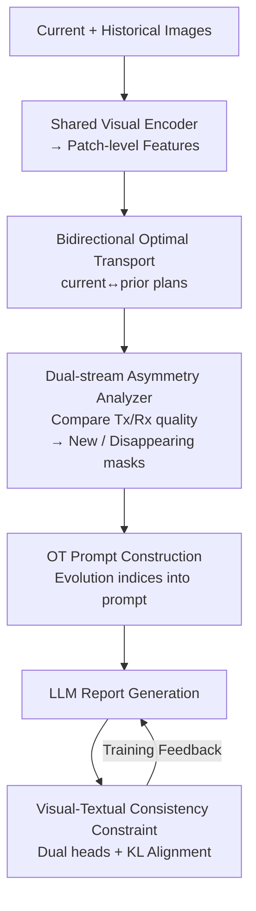

# BiOTPrompt: Bidirectional Optimal Transport Guided Prompting for Disease Evolution-aware Radiology Report Generation

**Conference**: CVPR 2026  
**Paper**: [CVF Open Access](https://openaccess.thecvf.com/content/CVPR2026/html/Liu_BiOTPrompt_Bidirectional_Optimal_Transport_Guided_Prompting_for_Disease_Evolution-aware_Radiology_CVPR_2026_paper.html)  
**Code**: None  
**Area**: Medical Imaging  
**Keywords**: Radiology Report Generation, Bidirectional Optimal Transport, Disease Evolution, LLM Prompting, Multimodal Consistency

## TL;DR
Addressing the overlooked characteristic that "lesion evolution is bidirectional and asymmetric (including both new onset and resolution)" in longitudinal chest X-ray report generation, BiOTPrompt utilizes **Bidirectional Optimal Transport** to establish soft correspondences between current and historical images. By identifying "newly emerging regions" and "disappearing regions" through the asymmetry in transport quality between the two directions, their spatial coordinates are encoded into prompts to guide LLM report generation. A visual-textual consistency constraint is introduced to suppress hallucinations. The model achieves SOTA results in NLG and clinical metrics (CE-F1 0.417) on the Longitudinal-MIMIC dataset.

## Background & Motivation

**Background**: Radiology Report Generation (RRG) automatically produces diagnostic reports from chest X-rays. While single-image RRG is relatively mature, clinicians almost always **compare current scans with prior scans** to judge disease progression (e.g., whether nodules are stable, effusions have receded, or new lesions have appeared). Consequently, longitudinal RRG methods have emerged, feeding historical images or reports into models as temporal context.

**Limitations of Prior Work**: Most existing longitudinal methods remain at the level of **coarse-grained global alignment**—either fusing global representations of historical/current images or aligning them based on pre-defined anatomical regions. These approaches struggle to capture subtle local spatial changes. Crucially, they typically employ **unidirectional alignment or static prompting**, assuming that the correspondence between two time points is symmetric.

**Key Challenge**: Lesion evolution is inherently **asymmetric and bidirectional**—new lesions may appear in the current scan (with no correspondence in the prior), while existing lesions in the prior may resolve (with no correspondence in the current). Unidirectional or symmetric modeling frameworks naturally fail to describe this "simultaneous addition and disappearance" asymmetric dynamic. This is further complicated by **spatial misalignment** (differences in posture, respiratory phase, and imaging angles) between chest X-rays at different time points, making pixel-to-pixel or region-to-region hard matching unreliable.

**Goal**: Establish flexible correspondence between spatially misaligned images and explicitly identify "newly emerging" and "disappearing" regions to serve as local signals guiding report generation.

**Key Insight**: Optimal Transport (OT) solves for the minimum cost transport plan between two sets of features, naturally handling soft matching under spatial misalignment. When performing **bidirectional** OT (current→prior and prior→current), the asymmetry between the two transport plans precisely reveals the emergence and resolution of lesions.

**Core Idea**: Replace unidirectional alignment with **Bidirectional Optimal Transport**. Use the asymmetry in transport quality to locate evolution regions, then convert these spatial indices into prompts to guide the LLM—formulated as "asymmetry of transport = disease evolution."

## Method

### Overall Architecture
Given a current image $I_c$ and a prior image $I_p$, BiOTPrompt aims to generate a report $\hat{R}_c \leftarrow \text{BiOTPrompt}(I_c, I_p)$ that approximates the ground truth $R_c$. The pipeline consists of four steps: first, a visual encoder with **shared parameters** encodes both images into patch-level features; next, bidirectional transport plans are computed; then, a dual-stream asymmetric analyzer compares transport quality to generate binary masks for "new onset" and "disappearance"; these indices are written into a structured prompt for LLM generation; finally, a visual-textual consistency constraint aligns "diseases seen in images" with "diseases written in reports" during training to suppress hallucinations. Notably, the method **only uses historical images and does not rely on historical reports**, which are often missing in real-world scenarios.

### Key Designs

**1. Bidirectional Optimal Transport (BiOT): Handling Misalignment and Exposing Asymmetry**

This step addresses both "spatial misalignment" and "evolution asymmetry." Patch features are extracted using a shared encoder $f_v$ and projection head $f_{proj}$: $X^{cls}_p, X_p = f_{proj}(f_v(I_p))$ and $X^{cls}_c, X_c = f_{proj}(f_v(I_c))$, where $X_p, X_c \in \mathbb{R}^{N\times D}$ represent $N$ patch features. The entropy-regularized OT problem is solved to obtain transport plan $P^*\in\mathbb{R}^{N\times N}$:

$$P^* = \arg\min_{P\in\Pi(\mu,\nu)} \langle P, C\rangle - \varepsilon\cdot H(P)$$

The cost matrix is $C_{ij} = |x^i_p - x^j_c|^2$. $\mu,\nu$ are uniform distributions, and $H(P)=-\sum_{i,j}P_{ij}\log P_{ij}$ is the regularization term, solved efficiently via the Sinkhorn algorithm. OT provides a **soft, permutation-invariant** matching, making spatial misalignment from posture/respiration manageable. 

Crucially, the authors solve for plans in both directions: $P^*_{c\to p}=\text{OT}(X_c, X_p)$ and $P^*_{p\to c}=\text{OT}(X_p, X_c)$.

**2. Dual-stream Asymmetry Analyzer (DFAA): Identifying Evolution via Low Bi-directional Quality**

DFAA translates OT plans into binary masks. The intuition is: if a patch in the current image **neither sends nor receives** high-quality transport, it lacks a correspondence in the prior image and is likely a new lesion. "Sent" and "Received" intensities are quantified:

$$\text{Sent}_{c\to p}(i)=\sum_j P^*_{c\to p}(i,j),\quad \text{Recv}_{p\to c}(i)=\sum_j P^*_{p\to c}(j,i)$$

A current patch $i$ is labeled **new onset** if $\text{Sent}_{c\to p}(i)<\delta$ AND $\text{Recv}_{p\to c}(i)<\delta$. Conversely, a prior patch is **disappearing** if $\text{Sent}_{p\to c}(i)<\delta$ AND $\text{Recv}_{c\to p}(i)<\delta$ (where $\delta=0.05$). Requiring low quality in **both directions** filters out false positives caused by unidirectional noise.

**3. OT Prompt Construction: Verbalizing Evolution for the LLM**

The indices of new and disappearing patches are **explicitly verbalized** into a structured prompt $p_g$. It lists "Current new abnormal patches → [1,3,8]" and "Prior resolved abnormal patches → [4,8,9]", tasking the LLM to generate a detailed report based on these findings. This injects temporal cues in a natural language format the LLM can easily process, guiding progression-aware reasoning. The report is generated auto-regressively: $\hat{r}_t = f_{rg}(p_g, \hat{r}_{1:t-1})$.

**4. Visual-Textual Consistency Constraint (VLCC): Suppressing Hallucination**

To align visual findings with textual descriptions, VLCC uses a **dual-branch classification** framework. The visual representation (current [CLS] token) and textual representation (mean-pooled LLM hidden states) are passed through MLP heads $f_{vis}, f_{text}$ to predict disease labels, supervised by BCE losses ($L_{vis\text{-}cls}, L_{text\text{-}cls}$). A KL divergence term aligns the two distributions: $L_{KL}=D_{KL}(p_{vis}\,\|\,p_{text})$. This forces the report to remain consistent with the visual evidence.

### Loss & Training
The total loss is:

$$L_{total} = L_{RRG} + \lambda_1(L_{vis\text{-}cls}+L_{text\text{-}cls}) + \lambda_2 L_{KL}$$

$L_{RRG}$ is the cross-entropy loss under teacher forcing. Hyperparameters: $\lambda_1=0.1$, $\lambda_2=1.0$, $\delta=0.05$. The visual encoder is Swin-Transformer (base), and the LLM is LLaMA2-7B. Training is conducted on a single A800 80GB for 5 epochs with a learning rate of 1e-4 and batch size 12.

## Key Experimental Results

### Main Results
On the Longitudinal-MIMIC dataset (94,169 image-report pairs), $I_p$/$R_p$ denotes the usage of historical images and reports respectively.

| Method | $I_p$/$R_p$ | BLEU-4 | ROUGE-L | METEOR | CIDEr | CE-P | CE-R | CE-F1 |
|------|------|--------|---------|--------|-------|------|------|-------|
| R2GenGPT (Single) | ✗/✗ | 0.102 | 0.259 | 0.133 | 0.142 | 0.267 | 0.266 | 0.249 |
| R2GenGPT (+Prior Img) | ✓/✗ | 0.113 | 0.273 | 0.144 | 0.191 | 0.340 | 0.340 | 0.316 |
| HERGen | ✓/✓ | 0.117 | 0.282 | 0.155 | - | 0.421 | 0.289 | 0.295 |
| HC-LLM | ✓/✓ | 0.117 | 0.282 | 0.155 | - | 0.417 | 0.357 | 0.357 |
| **BiOTPrompt** | **✓/✗** | **0.126** | **0.285** | **0.155** | **0.236** | **0.471** | **0.424** | **0.417** |

BiOTPrompt achieves SOTA in all metrics. Notably, it **outperforms models using both historical images and reports** (HERGen/HC-LLM) despite only using images, with CE-F1 improving from 0.357 to 0.417 (+6 points).

### Ablation Study

| Configuration | ROUGE-L | CIDEr | CE-P | CE-R | CE-F1 | Description |
|------|---------|-------|------|------|-------|------|
| w/o BiOT | 0.279 | 0.216 | 0.444 | 0.390 | 0.388 | Replaced with unidirectional OT |
| w/o DFAA | 0.282 | 0.216 | 0.436 | 0.388 | 0.382 | Only used single-stream signals |
| w/o VLCC | 0.272 | 0.209 | 0.426 | 0.382 | 0.376 | Consistency constraint removed |
| w/o ($L_{vis\text{-}cls}+L_{text\text{-}cls}$) | 0.284 | 0.229 | 0.431 | 0.387 | 0.384 | Dual classification removed |
| w/o $L_{KL}$ | 0.284 | 0.234 | 0.450 | 0.403 | 0.399 | KL alignment removed |
| **BiOTPrompt (Full)** | **0.285** | **0.236** | **0.471** | **0.424** | **0.417** | Full Model |

### Key Findings
- **VLCC has the largest impact on clinical metrics**: Removing VLCC drops CE-F1 from 0.417 to 0.376, highlighting that aligning disease predictions across modalities is critical for suppressing hallucinations.
- **Bidirectionality is essential**: The performance drop in "w/o BiOT" and "w/o DFAA" validates the hypothesis that lesion evolution requires bidirectional cross-validation.
- **VLCC components are complementary**: Removing either dual-classification or KL alignment leads to performance degradation.

## Highlights & Insights
- **"Transport Asymmetry = Disease Evolution" Perspective**: Transforming a semantic problem into a geometric criterion (low bidirectional transport quality) effectively handles spatial misalignment via OT while suppressing noise through bidirectional validation.
- **Independence from Historical Reports**: Historical images are easier to obtain than reports in real-world scenarios. BiOTPrompt's ability to achieve SOTA without report dependency lowers the barriers for clinical deployment.
- **Verbalized Spatial Indices**: Explicitly writing "new onset patch index [1,3,8]" into the prompt is a transferable trick. It serves as a text-based interface for injecting geometric findings into generative models.
- **VLCC Mechanism**: Using dual-classification heads with KL divergence for cross-modal consistency is more effective for factual alignment than simple feature-distance contrastive losses.

## Limitations & Future Work
- **Temporal Scope**: Only considers the **current and one historical scan**. Long-sequence evolution for multiple follow-up visits (multi-visit) is not modeled.
- **Threshold Sensitivity**: Evolution identification relies on a **fixed threshold $\delta=0.05$**. Its sensitivity across different anatomical sites or noise levels is not fully analyzed.
- **Localization Granularity**: Patch-level OT determines the spatial resolution; for very small lesions, patch-level masks may lack precision.
- **Labeler Dependence**: Reliance on CheXbert for disease labels in VLCC means labeler errors propagate to the model.

## Related Work & Insights
- **vs R2GenGPT(+PI)**: The latter uses flat concatenation of historical features; BiOTPrompt uses bidirectional OT to explicitly model progression, resulting in a CE-F1 of 0.417 vs 0.316.
- **vs HC-LLM / HERGen**: These use historical reports; BiOTPrompt relies only on images but achieves higher performance, demonstrating the sufficiency of visual evolution signals.
- **vs RECAP / CheXRelNet**: While those use disease graphs or anatomical reasoning, they operate at coarser semantic levels; BiOTPrompt's patch-level OT handles local spatial variation more granularly.

## Rating
- Novelty: ⭐⭐⭐⭐⭐ Original perspective on transport asymmetry as evolution.
- Experimental Thoroughness: ⭐⭐⭐⭐ SOTA results on major dataset, though single-dataset validation.
- Writing Quality: ⭐⭐⭐⭐ Clear logic from motivation to mathematical mechanism.
- Value: ⭐⭐⭐⭐⭐ High clinical potential due to lack of historical report dependency.

<!-- RELATED:START -->

## Related Papers

- [\[CVPR 2026\] SAT-RRG: LLM-Guided Self-Adaptive Training for Radiology Report Generation with Token-Level Push–Pull Optimization](sat-rrg_llm-guided_self-adaptive_training_for_radiology_report_generation_with_t.md)
- [\[CVPR 2026\] CURE: Curriculum-guided Multi-task Training for Reliable Anatomy Grounded Report Generation](cure_curriculum-guided_multi-task_training_for_reliable_anatomy_grounded_report_.md)
- [\[CVPR 2026\] TIM: Temporal Decoupling with Iterative Mutual-Refinement Model for Longitudinal Radiology Report Generation](tim_temporal_decoupling_with_iterative_mutual-refinement_model_for_longitudinal_.md)
- [\[CVPR 2026\] OraPO: Oracle-educated Reinforcement Learning for Data-efficient and Factual Radiology Report Generation](orapo_oracle-educated_reinforcement_learning_for_data-efficient_and_factual_radi.md)
- [\[AAAI 2026\] A Disease-Aware Dual-Stage Framework for Chest X-ray Report Generation](../../AAAI2026/medical_imaging/a_disease-aware_dual-stage_framework_for_chest_x-ray_report_.md)

<!-- RELATED:END -->
