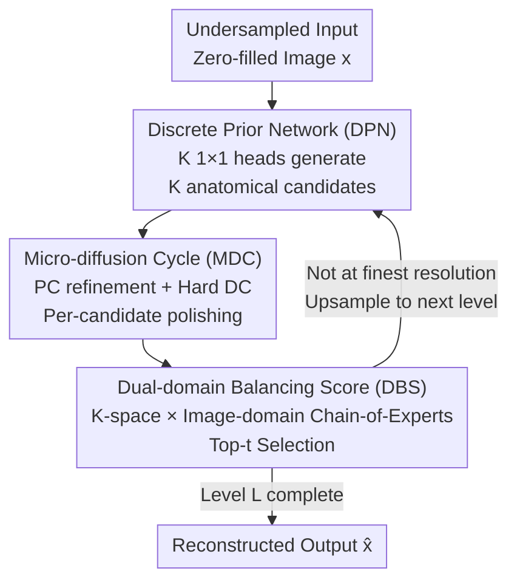

# Breaking the Continuum: Discrete Distribution Learning for Structural MRI Reconstruction

**Conference**: CVPR 2026  
**Paper**: [CVF Open Access](https://openaccess.thecvf.com/content/CVPR2026/html/Lyu_Breaking_the_Continuum_Discrete_Distribution_Learning_for_Structural_MRI_Reconstruction_CVPR_2026_paper.html)  
**Code**: https://kincin.github.io/DiCoS/ (Project Page)  
**Area**: Medical Imaging  
**Keywords**: MRI Reconstruction, Discrete Distribution Learning, Multi-hypothesis Generation, Diffusion Models, Dual-domain Scoring  

## TL;DR
For undersampled MRI reconstruction, DiCoS moves away from the "single-trajectory" continuous manifold refinement used in diffusion models. Instead, it employs a discrete prior network to generate $K$ anatomical candidates, applies extremely short micro-diffusion cycles for texture refinement and data consistency projection, and uses a Dual-domain Balancing Score (k-space + image domain) to chains-of-select the best hypothesis. It achieves SOTA quality on fastMRI knee/brain datasets with significantly lower inference time (PSNR >1.4 dB higher than the runner-up at 12× acceleration).

## Background & Motivation
**Background**: Recovering images from undersampled k-space is an ill-posed inverse problem where a single measurement may correspond to multiple anatomically plausible solutions. Traditional compressed sensing/parallel imaging relies on handcrafted priors (sparsity, low-rank). Recently, mainstream methods have shifted to score-SDE based diffusion models (VE-SDE, HFS-SDE, SelfRDB, etc.), modeling reconstruction as a gradual denoising process along learned stochastic dynamics to pull noisy samples back to the data manifold.

**Limitations of Prior Work**: Diffusion reconstruction relies on a fundamental assumption—the image manifold is **purely continuous**, and denoising progresses along a long chain on a smooth manifold. However, clinical MR images are different: organs, lesions, and tissues possess **discrete structures** with clear boundaries and distinct regional semantics. By clustering VQ-VAE codebook features, the authors found that medical images form tighter, more coherent clusters in latent space (Silhouette 0.76 vs. 0.43 for natural images). Meanwhile, the smooth interpolation of continuous diffusion often **blurs** these tissue interfaces, compromising diagnostic clarity.

**Key Challenge**: Discrete structure reasoning can capture region-level boundaries but fails to recover fine-grained textures or ensure strict data consistency. Purely continuous refinement can restore textures and project back to k-space but tends to over-smooth discrete semantics. Both paradigms offer indispensable yet incomplete advantages.

**Goal**: To design a reconstruction pipeline **inherently compatible with discrete representations**, explicitly modeling the discrete distribution of anatomy without sacrificing continuous physical fidelity.

**Key Insight**: Rather than repeatedly "modifying continuous models to approximate structured distributions," the authors propose shifting the paradigm from "pixel-wise regression / single-hypothesis continuous evolution" to an **inference-based reconstruction** consisting of "multi-hypothesis discrete generation + lightweight continuous polishing."

**Core Idea**: Use a discrete prior network to exhaustively generate $K$ anatomical candidates (global hypothesis exploration), apply an extremely short micro-diffusion cycle to each for local texture refinement and hard data consistency, and then use dual-domain scoring to select best candidates, progressively shrinking the search space from coarse to fine.

## Method

### Overall Architecture
DiCoS (Discrete–Continuous Synthesis) is a hierarchical, coarse-to-fine reconstruction framework linked by $L$-level Discrete Prior Networks (DPN). The input is a zero-filled undersampled image $x$, and the output is the reconstructed image $\hat{x}$. Each level $\ell$ performs three steps: ① The DPN uses a lightweight discrete generator (two convolutional layers + $K$ parallel $1\times1$ heads) to generate **$K$ candidates** $x^{(k)}_\ell = f_\ell(x^*_{\ell-1})[k]$ from the previous level's estimate $x^*_{\ell-1}$, where each head provides a different linear projection corresponding to an anatomical hypothesis; ② Each candidate passes through a **Micro-diffusion Cycle (MDC)** for $T$ steps of predictor-corrector refinement and hard data consistency projection; ③ **Dual-domain Balancing Score (DBS)** evaluates each candidate based on k-space fidelity and image-domain regularity, selecting Top-$t$ reliable hypotheses to be upsampled for the next level. The process decomposes reconstruction into three sub-problems: "global coarse localization → branch-level refinement → sub-pixel texture polishing," with resolution upsampled by $2\times$ at each step from $[H/2^p, W/2^p]$ to $[H,W]$.

### Key Designs

**1. Discrete Prior Network (DPN): Replacing Single-Hypothesis Continuous Evolution with Multi-Hypothesis Discrete Enumeration**

The problem with diffusion reconstruction is maintaining only "one" hypothesis refined along a smooth manifold, which often converges to solutions where discrete semantics are smoothed out. DPN generates $K$ candidates in parallel at each level: a shared backbone extracts local features, and $K$ separate $1\times1$ heads perform different linear projections, $x^{(k)}_\ell = f_\ell(x^*_{\ell-1})[k],\ k=1,\dots,K$, each encoding a different anatomical structural hypothesis. The DPN follows a hierarchical downsample–upsample structure. The inter-level process is defined as $\{x^{k'}_\ell\}_{k'=1}^{K'} = F_{\text{DBS}}(F_{\text{MDC}}(\{x^k_\ell\}_{k=1}^{K}))$. This decouples global hypothesis exploration from local polishing. To prevent "hypothesis collapse" where certain branches are never selected, a lightweight **node activation regularization** is added to adaptively redistribute probability mass to inactive branches.

**2. Micro-diffusion Cycle (MDC): Adding Texture and Data Consistency in Few Steps**

Discrete candidates lack continuous textures and measurement consistency. Rather than running a full long-chain diffusion, MDC performs $T$ steps (experimentally $T=3$) of lightweight refinement per candidate. The first step is **Predictor-Corrector (PC)**, using a pre-trained VE-SDE score prior:

$$\text{Pre.}\ \ x^k_\ell \leftarrow x^k_\ell + \sigma_s\, \nabla_x \log p_{\theta_\ell}(x^k_\ell)\,\Delta t + \sqrt{2\Delta t}\,z, \qquad \text{Cor.}\ \ x^k_\ell \leftarrow x^k_\ell + \beta\,\nabla_x \log p_{\theta_\ell}(x^k_\ell) + \sqrt{2\beta}\,z'$$

where $\Delta t=1,\ \beta=0.2\sigma_s^2$, and $z,z'\sim\mathcal{N}(0,I)$. The second step is **Hard Data Consistency (DC) projection**: the refined candidate is transformed to k-space via FFT, and at sampled frequency locations $\Omega_u$, the values are replaced with actual measurements $y$: $x^k_\ell \leftarrow x^k_\ell + F_u^\dagger(y - F_u x^k_\ell)$. This ensures the result remains strictly faithful to measurements. Using $T=3$ results in an inference time of 3.23s per image, compared to 10~38s for diffusion baselines.

**3. Dual-domain Balancing Score (DBS): Adaptive Selection via Chain-of-Experts**

Selecting from $K$ candidates is critical: image-domain cues understand anatomy but ignore measurements, while k-space cues ensure consistency but ignore structure. DBS adopts a Chain-of-Experts approach, accumulating evidence: $h^{(1)}_k = \alpha_k E_{\text{DC}}(x_k)$, $h^{(2)}_k = h^{(1)}_k + (1-\alpha_k)E_{\text{TV}}(x_k)$, where $E_{\text{DC}}$ is data fidelity and $E_{\text{TV}}$ is Total Variation. The balancing weight $\alpha_k$ is an MLP-based router. The final score 

$$\text{Score}(x_k) = \lambda_{\text{DC}} h^{(1)}_k + \lambda_{\text{TV}} h^{(2)}_k - \lambda_{\text{SDE}}\|\nabla_x \log p_\theta(x_k)\|_2^2 + b_k$$

incorporates the gradient energy of the pre-trained score model and a learnable bias $b_k \leftarrow b_k - \tau(\frac{c_k}{\sum_j c_j} - \frac{1}{K})$ to balance branch usage. A soft Top-$t$ selection preserves the ability to explore multiple solutions.

### Loss & Training
Training is supervised by fully sampled GT $x_{\text{GT}}$. Reconstruction loss combines image-domain and k-space alignment: $L_{\text{rec}}(x_k) = \|x_k - x_{\text{GT}}\|_1 + \eta\|F(x_k) - F(x_{\text{GT}})\|_2^2$ ($\eta=0.5$). To train DBS, a **Score Alignment Loss** ensures predicted scores align with actual reconstruction error: $L_{\text{score}}=\frac{1}{K}\sum_k |\text{Score}(x_k) - \gamma E_{\text{GT}}(x_k)|$ ($\gamma=100$). The total objective $L = L_{\text{rec}}(x^*_\ell) + \lambda_{\text{score}}L_{\text{score}}$ only applies reconstruction loss to top candidates selected by DBS to maintain hypothesis diversity. Hyperparameters: $K=32$ candidates, $L=64$ levels, $T=3$ MDC steps; 160 epochs, Adam, lr 1e-4, 4×A6000 for ~15.4 hours.

## Key Experimental Results

### Main Results
Evaluated on multi-coil fastMRI knee (~34k scans) and brain (~11k volumes) datasets with 1D uniform sampling at 4/8/12× acceleration. DiCoS leads significantly in NMSE/PSNR across almost all settings:

| Dataset (12× Acceleration) | Metric | DiCoS (Ours) | SelfRDB (2nd best) | HFS-SDE |
|--------|------|------|----------|------|
| Knee | NMSE↓ | **1.43** | 1.94 | 2.61 |
| Knee | PSNR↑ | **35.32** | 33.87 | 34.31 |
| Knee | SSIM↑ | **86.13** | 85.18 | 83.67 |
| Brain | NMSE↓ | **1.52** | 1.97 | 3.22 |
| Brain | PSNR↑ | **37.24** | 35.67 | 34.23 |
| Brain | SSIM↑ | 87.85 | 87.01 | 85.14 |

For semantic consistency, a frozen MedSAM was used to segment reconstructed images. DiCoS achieved the highest Dice (0.921) and IoU (0.842), outperforming SelfRDB (0.892/0.821), indicating superior anatomical region-level reliability.

### Ablation Study
On Knee dataset at 12× acceleration (C2F=Coarse-to-Fine, MDC=Micro-diffusion, DBS=Dual-domain Scoring):

| Configuration | NMSE↓ | PSNR↑ | SSIM↑ | Note |
|------|---------|------|------|------|
| Full DiCoS | **1.43** | **35.32** | **86.13** | All modules present |
| w/o C2F (Single-level) | 2.13 | 34.61 | 84.81 | No search space contraction |
| w/o MDC (DPN to DBS) | 2.87 | 32.58 | 83.24 | **Largest drop**, loss of texture/consistency |
| w/o DBS (Simple Quant.) | 1.94 | 34.26 | 84.39 | Greedy selection |

### Key Findings
- **MDC is the most significant contributor**: Removing it dropped PSNR from 35.32 to 32.58 (−2.74 dB), validating that discrete candidates require continuous refinement for texture and measurement fidelity.
- **Saturation of $K$ and $T$**: Performance saturates at $K=32$ and $T=3$. Increasing $T$ adds linear inference cost with diminishing returns.
- **Tighter Feature Clusters**: t-SNE shows DiCoS features are more compact with clearer boundaries compared to continuous (HFS-SDE) and purely discrete (DDN) baselines.

## Highlights & Insights
- **Evidence-based "Continuous vs. Discrete" Argument**: The authors used VQ-VAE codebook features and clustering metrics to prove medical images are more "discretely clustered" than natural images, providing empirical support for the paradigm shift.
- **"Micro" Diffusion is a Key Trick**: Using only 3 steps of PC + Hard projection captures most texture gains of long-chain diffusion at a fraction of the cost—a great example of lightweight diffusion prior injection.
- **DBS borrows LLM's Chain-of-Experts**: Linking k-space and image-domain experts with specialized routers and balancing biases avoids branch collapse and promotes communication diversity.
- **MedSAM as External Validation**: Using downstream segmentation metrics (Dice/IoU) to evaluate reconstruction provides a better measure of clinical "correctness" than pixel-level PSNR/SSIM alone.

## Limitations & Future Work
- The framework is relatively complex (DPN+MDC+DBS with multiple $\lambda$ hyperparameters), leading to high tuning costs.
- ⚠️ While the paper mentions $L=64$ levels and $K=32$ candidates, the actual VRAM/batch parallelization overhead for such a large scale is not fully detailed in the main text.
- Evaluation is limited to 1D uniform sampling on fastMRI knee/brain; generalization to 2D/radial sampling or other anatomical modalities is not verified.
- Candidate diversity relies on $1\times1$ projections; whether this truly covers fundamentally different anatomical interpretations or just small perturbations remains to be analyzed.

## Related Work & Insights
- **vs. Continuous Diffusion (VE-SDE / SelfRDB)**: These evolve a single hypothesis along a smooth manifold, often over-smoothing boundaries; DiCoS uses multi-hypothesis discrete generation for sharper edges and faster inference.
- **vs. Pure Discrete Priors (DDN)**: DDN is very fast (2.07s) but lacks fidelity in heavy undersampling; DiCoS adds continuous score refinement and hard projection to significantly improve quality with manageable latency.
- **vs. Discrete Codebook Methods (VQ-VAE / MaskGIT)**: While those use codebooks for sharp structures in generation, DiCoS explicitly introduces "discrete hypothesis enumeration" into the MRI inverse problem with physical measurement constraints.

## Rating
- Novelty: ⭐⭐⭐⭐⭐ First to explicitly model discrete distribution for MRI reconstruction, shifting the paradigm to "multi-hypothesis discrete generation + micro-refinement."
- Experimental Thoroughness: ⭐⭐⭐⭐ Extensive datasets, baselines, and MedSAM evaluation, though sampling patterns are somewhat limited.
- Writing Quality: ⭐⭐⭐⭐ Strong motivation with clustering analysis, though some hyperparameter scales ($L$ vs. $K$) are slightly ambiguous.
- Value: ⭐⭐⭐⭐⭐ SOTA quality combined with significant speedup has high clinical potential for accelerated MRI.

<!-- RELATED:START -->

## Related Papers

- [\[CVPR 2026\] Prospective Dynamic 3D MRI Reconstruction via Latent-Space Motion Tracking from Single Measurement](prospective_dynamic_3d_mri_reconstruction_via_latent-space_motion_tracking_from_.md)
- [\[CVPR 2026\] Semantic Class Distribution Learning for Debiasing Semi-Supervised Medical Image Segmentation](semantic_class_distribution_learning_for_debiasing.md)
- [\[CVPR 2026\] SemiGDA: Generative Dual-distribution Alignment for Semi-Supervised Medical Image Segmentation](semigda_generative_dual-distribution_alignment_for_semi-supervised_medical_image.md)
- [\[AAAI 2026\] Unsupervised Motion-Compensated Decomposition for Cardiac MRI Reconstruction via Neural Representation](../../AAAI2026/medical_imaging/unsupervised_motion-compensated_decomposition_for_cardiac_mri_reconstruction_via.md)
- [\[CVPR 2026\] The Invisible Gorilla Effect in Out-of-distribution Detection](the_invisible_gorilla_effect_in_out-of-distribution_detection.md)

<!-- RELATED:END -->
