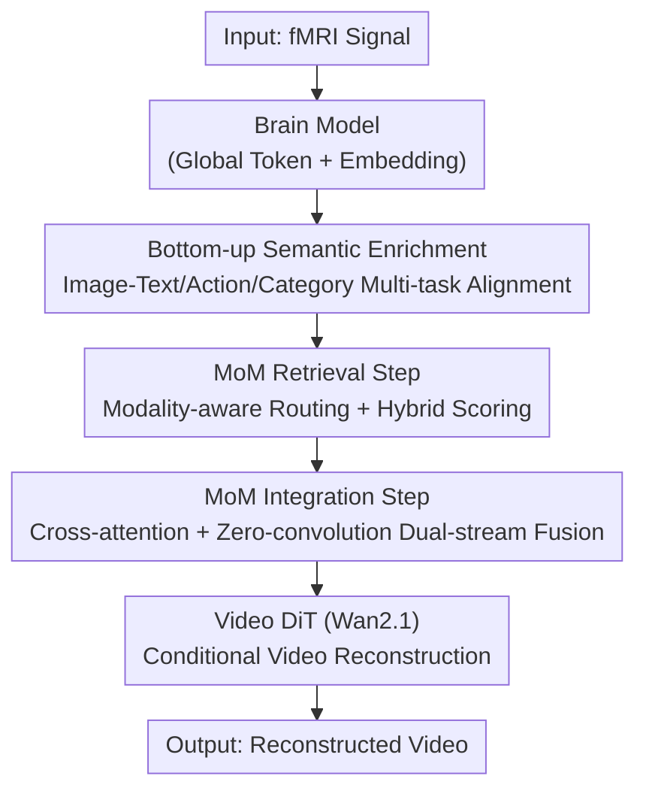

# Bridging Brain and Semantics: A Hierarchical Framework for Semantically Enhanced fMRI-to-Video Reconstruction

**Conference**: CVPR 2026  
**arXiv**: [2605.14569](https://arxiv.org/abs/2605.14569)  
**Code**: None (Not provided by the paper)  
**Area**: Medical Imaging / Brain Decoding / Video Generation  
**Keywords**: fMRI-to-video reconstruction, Brain decoding, Semantic enrichment, Memory mixture, Diffusion models

## TL;DR
CineNeuron adopts the dual-pathway mechanism of the brain—"bottom-up perception + top-down memory." It first uses multi-task alignment to map noisy fMRI signals into a semantic space that simultaneously encodes images, text, actions, and categories. Then, it utilizes the Mixture-of-Memories (MoM) module to retrieve and fuse multimodal "memories" from historical samples to complete details, eventually driving a video diffusion model. It comprehensively outperforms SOTA on the cc2017 and CineBrain fMRI-to-video benchmarks.

## Background & Motivation
**Background**: Reconstructing visual content from brain activity (especially fMRI) is a core goal in cognitive neuroscience. While static image reconstruction has matured, visual perception is inherently continuous and dynamic, making "video reconstruction" an open challenge. Dominant approaches typically learn a semantic embedding from fMRI to drive a video generator (e.g., Mind-Video aligns fMRI encoders to CLIP and uses inflated Stable Diffusion; NeuroClips encodes semantic keyframes for smoothness).

**Limitations of Prior Work**: fMRI signals suffer from low signal-to-noise ratios, poor temporal resolution, and are sparse and noisy, making it difficult to extract complete semantics. Existing methods only align fMRI to an "image-text" space, capturing shallow semantics and resulting in two types of errors: first, neglecting video-specific **action** and **object category** semantics (e.g., losing concepts like "doing yoga" or "petting"); second, treating each reconstruction as an **isolated** process without utilizing prior knowledge, leading to decoding errors such as misidentifying a dog as a human or hallucinating non-existent figures and rooms.

**Key Challenge**: The semantic capacity of fMRI signals is limited, whereas video content is extremely rich—requiring both the completion of semantic dimensions and the introduction of prior knowledge, which a single alignment space and isolated reconstruction cannot achieve.

**Key Insight**: The authors draw inspiration from the brain's **dual-pathway processing mechanism**: the bottom-up pathway accumulates sensory evidence from primary to high-level visual cortex into high-level semantics, while the top-down pathway sends integrated memories and semantic predictions from the hippocampal system back to the sensory cortex to refine perception. This corresponds to two stages: semantic enrichment followed by memory-based refinement.

**Core Idea**: A hierarchical framework comprising "bottom-up multi-task semantic enrichment + top-down memory mixture refinement" is proposed. It upgrades fMRI embeddings from shallow image-text semantics to four-dimensional semantics (image/text/action/category) and dynamically retrieves and fuses historical memories to complete the reconstruction.

## Method

### Overall Architecture
CineNeuron takes fMRI signals as input and outputs semantically accurate, temporally coherent reconstructed videos. The pipeline consists of two synergistic stages. **Stage 1 (Bottom-up Semantic Enrichment)**: A Transformer-based Brain Model maps fMRI into two outputs—a global token $\bm{f^c}$ and an embedding $\bm{f^e}$ for fine-grained context. Simultaneously, heterogeneous pre-trained encoders extract image, text, action, and category supervision from the video, pulling $\bm{f^c}$ into this comprehensive semantic space via three alignment tasks. **Stage 2 (Top-down Memory Integration)**: Mixture-of-Memories (MoM) uses $\bm{f^e}$ to retrieve the most relevant multimodal memories from a "historical video" memory pool and fuses them into the fMRI embedding. The fused representation serves as the condition for a Video DiT (Wan2.1 1.3B) to perform reconstruction. The inference process is streamlined: fMRI → Brain Model → MoM → Video Decoding, requiring no additional components like ControlNet.

### Key Designs

**1. Bottom-up Semantic Enrichment: Mapping fMRI to a Four-dimensional Semantic Space**

To address shallow semantics and the loss of action/category information, the Brain Model learns three groups of tasks simultaneously. It outputs dual representations: a global token $\bm{f^c}\in\mathbb{R}^{B\times D}$ for external semantic alignment and an embedding $\bm{f^e}\in\mathbb{R}^{B\times L\times D'}$ for downstream fusion. This functional decoupling prevents alignment from interfering with reconstruction. **Image-Text Alignment** utilizes CLIP image (aggregated as $\hat{\bm{e}}^{\text{img}}$) and text embeddings, pulling $\bm{f^c}$ closer to both using InfoNCE: $\mathcal{L}_{\text{clip}}=\mathcal{L}_{\text{info}}(\bm{f^c},\hat{\bm{e}}^{\text{img}})+\mathcal{L}_{\text{info}}(\bm{f^c},\bm{e}^{\text{txt}})$. **Action Alignment** uses ViCLIP to extract action embeddings $\bm{e}^{\text{act}}$, with an action head $\varphi_a$ projecting $\bm{f^c}$ to the action space $\bm{f^a}=\varphi_a(\bm{f^c})$ for contrastive alignment—crucial for recovering "walking" or "swimming" semantics. **Category Learning** uses Qwen2.5-VL to extract MSCOCO categories from captions for multi-label classification. To handle class imbalance, rare classes are merged into super-classes and reweighted using Focal Loss. The total stage loss is $\mathcal{L}_{\text{stage1}}=\mathcal{L}_{\text{clip}}+\lambda_1\mathcal{L}_{\text{action}}+\lambda_2\mathcal{L}_{\text{cls}}$.

**2. MoM Retrieval Step: Modality-aware Routing + Hybrid Scoring**

The first stage provides semantics, but sparse fMRI signals still lack detail. The MoM module retrieves multimodal memories from a pool $\mathcal{M}$, where each entry is a tuple $(\bm{e}^{\text{txt}}_i,\bm{e}^{\text{img}}_i,\bm{e}^{\text{act}}_i)$. A routing network $R$ calculates instance-level retrieval weights $W_r=[w^{\text{txt}},w^{\text{img}},w^{\text{act}}]=\mathrm{softmax}(R(\bm{f^e}))$. For each memory, a **hybrid similarity** is calculated: $S_i=\sum_{m}w_m\cdot\mathrm{sim}(\bm{f^e},\bm{e}^m_i)$. This prevents retrieval from being biased by fMRI noise in a single modality, ensuring robust selection of the top-1 text and top-$K$ image/action embeddings.

**3. MoM Integration Step: Dual-stream Residual Fusion via Zero-convolution**

To inject retrieved memories safely without disrupting the pre-trained generator's conditional space, two layers of cross-attention are first used where $\bm{f^e}$ serves as the query and the retrieved $K$ image/action embeddings serve as keys/values. The resulting enhanced representation $\hat{\bm{f}}^e$ is then fused with the top-1 text embedding $\bm{e}^{\text{mem}}_{\text{txt}}$ using a **dual-stream + zero-convolution** structure: $\bm{f^{\text{fuse}}}=\bm{z_t}+\alpha*\mathcal{Z}_{\text{fMRI}}(\hat{\bm{f}}^e)$, where $\bm{z_t} = \mathcal{Z}_{\text{txt}}(\bm{e}^{\text{mem}}_{\text{txt}})+\bm{e}^{\text{mem}}_{\text{txt}}$. Since the zero-convolution $\mathcal{Z}_{\text{fMRI}}$ initially outputs zero, the fusion result is purely the text embedding at the start of training, which the generator already handles well. fMRI information is then gradually injected as residuals, ensuring training stability while recovering missing details.

### Loss & Training
Training is conducted in two stages. Stage 1 trains only the Brain Model (8k steps, batch 144, $\mathcal{L}_{\text{stage1}}$). Stage 2 jointly trains the Brain Model, MoM routing/fusion modules, and fine-tunes the Video DiT using LoRA (rank 16, 20 epochs, batch 32). The total loss is $\mathcal{L}_{\text{stage2}}=\mathcal{L}_{\text{stage1}}+\mathcal{L}(\theta)$, where $\mathcal{L}(\theta)$ is the diffusion loss $\mathbb{E}[\|\epsilon-\epsilon_\theta(\bm{y_t},\bm{f^{\text{fuse}}},t)\|_2^2]$.

## Key Experimental Results

### Main Results
CineNeuron was evaluated on cc2017 and CineBrain across semantic (N-way top-K), spatio-temporal (CLIP-pcc, DTC), and pixel (SSIM, PSNR) metrics.

| Dataset | Metric | CineNeuron | Prev. SOTA | Description |
|--------|------|------------|-----------|------|
| cc2017 | 2-way ↑ | **0.850** | 0.839 (MinD-Video) | Best semantic level |
| cc2017 | 50-way ↑ | **0.240** | 0.220 (NeuroClips) | Best semantic level |
| cc2017 | CLIP-pcc ↑ | **0.972** | 0.738 (NeuroClips) | Massive gain in spatio-temporal consistency |
| cc2017 | PSNR ↑ | **9.476** | 9.220 (Mind-Animator) | Highest pixel-level PSNR |
| cc2017 | SSIM ↑ | 0.375 | **0.390** (NeuroClips) | Slightly lower, but better semantics/temporal |
| CineBrain | 2-way ↑ | **0.937** | 0.933 (CineSync*) | Outperforms enhanced baseline |
| CineBrain | 50-way ↑ | **0.393** | 0.324 (CineSync*) | Significant lead |

Human evaluations (20 subjects, 360 sets) showed CineNeuron was preferred in 63.77% / 65.90% / 70.67% / 67.59% for semantic alignment, temporal consistency, visual quality, and overall fidelity, respectively, far exceeding NeuroClips (approx. 13–18%).

### Ablation Study
Ablation on cc2017 Subject 1 (without MoM indicates using top-1 text embedding):

| Configuration | 2-way ↑ | 50-way ↑ | CLIP-pcc ↑ | Note |
|------|---------|----------|------------|------|
| $\mathcal{L}_{\text{clip}}$ only | 0.824 | 0.217 | 0.973 | Shallow semantics; errors in objects/actions |
| + $\mathcal{L}_{\text{cls}}$ | 0.829 | 0.228 | 0.965 | Improved object recognition |
| + $\mathcal{L}_{\text{action}}$ | 0.835 | 0.223 | 0.970 | Captured action concepts (e.g., running) |
| + MoM (Full) | **0.846** | **0.237** | 0.973 | Accurate category, action, and details |

On CineBrain, removing **hippocampal fMRI input** significantly decreased semantic metrics, confirming that the hippocampus provides key semantics. Further inclusion of mPFC signals further boosted semantic performance.

### Key Findings
- The contributions of the three alignment tasks are **incremental and complementary**: $\mathcal{L}_{\text{cls}}$ improves objects, $\mathcal{L}_{\text{action}}$ improves actions, and MoM recovers details.
- The MoM integration step is the **primary driver of spatio-temporal quality**, as residual fusion maintains the stability of the pre-trained text space.
- Memory-related brain regions (Hippocampus/mPFC) are critical for semantic reconstruction, validating the "top-down memory" hypothesis from a neuroscientific perspective.

## Highlights & Insights
- **Direct mapping of neuroscience mechanisms to architecture**: Bottom-up perception as multi-task enrichment and top-down memory as mixture refinement provides a concrete and credible design motivation.
- **Zero-convolution dual-stream fusion is a clever stability trick**: By starting with the familiar text embedding and gradually injecting fMRI details, it avoids disrupting the pre-trained conditional space—a strategy transferable to other noisy sensor-to-content tasks.
- **Modality-aware routing enables adaptive retrieval**: Dynamically deciding which modality to trust based on the instance is more robust than fixed single-modality retrieval.
- **Simple end-to-end inference**: Unlike multi-component pipelines like NeuroClips, CineNeuron follows a clean fMRI→Brain Model→MoM→DiT flow.

## Limitations & Future Work
- The memory pool is restricted to "videos seen during training." For out-of-distribution (OOD) stimuli, memory retrieval might provide limited help or even lead to hallucination.
- Heavy reliance on heavyweight pre-trained models (CLIP, Qwen2.5-VL, Wan2.1); the quality of multimodal supervision determines the performance ceiling.
- SSIM is slightly lower than NeuroClips, suggesting a trade-off between pixel fidelity and semantic/temporal alignment.
- Small data scales remain a challenge in brain decoding; cross-subject generalization and robustness in low-data regimes require further exploration.

## Related Work & Insights
- **vs Mind-Video**: Mind-Video aligns fMRI to CLIP with shallow semantics. CineNeuron adds action/category alignment and memory integration, resulting in more accurate action and category reconstruction.
- **vs NeuroClips**: NeuroClips relies on encoding semantic keyframes. CineNeuron’s MoM module achieves much higher spatio-temporal consistency (CLIP-pcc 0.972 vs 0.738) and motion consistency (EPE 1.628 vs 4.432), though SSIM is slightly lower.
- **vs CineSync**: CineNeuron outperforms CineSync* (even with identical decoders), demonstrating the added value of semantic enrichment and memory integration.
- **Insight**: The combination of dual-pathway framework + zero-convolution residual injection + modality-aware retrieval is a generalizable paradigm for driving pre-trained generators with noisy or sparse signals (e.g., EEG).

## Rating
- **Novelty**: ⭐⭐⭐⭐⭐ Systematically maps brain dual-pathway mechanisms to a two-stage architecture and introduces multimodal memory mixture retrieval for fMRI-to-video.
- **Experimental Thoroughness**: ⭐⭐⭐⭐⭐ Solid evidence across two benchmarks, multi-dimensional evaluation, and dual ablation of components and brain regions.
- **Writing Quality**: ⭐⭐⭐⭐ Clear motivation and methodology; however, some module details (fusion dimensionality) require reference to supplementary material.
- **Value**: ⭐⭐⭐⭐⭐ Significantly advances the SOTA in brain video reconstruction, with reusable designs like zero-convolution fusion and modality routing.

<!-- RELATED:START -->

## Related Papers

- [\[CVPR 2026\] IEBGL:An Interpretability-Enhanced Brain Graph Learning Framework with LLM-Instructed Topology and Literature-Augmented Semantics](iebglan_interpretability-enhanced_brain_graph_learning_framework_with_llm-instru.md)
- [\[ICLR 2026\] Brain-IT: Image Reconstruction from fMRI via Brain-Interaction Transformer](../../ICLR2026/medical_imaging/brain-it_image_reconstruction_from_fmri_via_brain-interaction_transformer.md)
- [\[CVPR 2026\] Focus-to-Perceive Representation Learning: A Cognition-Inspired Hierarchical Framework for Endoscopic Video Analysis](focus-to-perceive_representation_learning_a_cognition-inspired_hierarchical_fram.md)
- [\[CVPR 2026\] Bridging RGB and Hematoxylin Components: An Interleaved Guidance and Fusion Framework for Point Supervised Nuclei Segmentation](bridging_rgb_and_hematoxylin_components_an_interleaved_guidance_and_fusion_frame.md)
- [\[CVPR 2026\] GaussianPile: A Unified Sparse Gaussian Splatting Framework for Slice-based Volumetric Reconstruction](gaussianpile_a_unified_sparse_gaussian_splatting_framework_for_slice-based_volum.md)

<!-- RELATED:END -->
