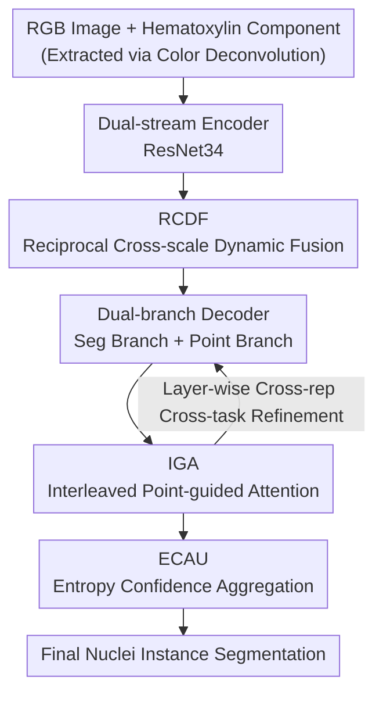

# Bridging RGB and Hematoxylin Components: An Interleaved Guidance and Fusion Framework for Point Supervised Nuclei Segmentation

**Conference**: CVPR 2026  
**Paper**: [CVF Open Access](https://openaccess.thecvf.com/content/CVPR2026/html/Huan_Bridging_RGB_and_Hematoxylin_Components_An_Interleaved_Guidance_and_Fusion_CVPR_2026_paper.html)  
**Code**: https://github.com/Hhhhzh/Weakly-nuclei-segmentation (The paper states it will be open-sourced)  
**Area**: Medical Imaging  
**Keywords**: Weakly supervised segmentation, Point supervision, Nuclei instance segmentation, Dual-representation fusion, Pathological images

## TL;DR
DFGNet treats the RGB image of H&E pathological slides and its extracted Hematoxylin component as a pair of complementary representations. By jointly modeling them with a triplet of Reciprocal Cross-scale Dynamic Fusion (RCDF), Interleaved point-Guided Attention (IGA), and Entropy Confidence Aggregation Unit (ECAU), it achieves SOTA performance on three public nuclei segmentation datasets under the weakly supervised setting using only point annotations.

## Background & Motivation

**Background**: Nuclei instance segmentation in histopathological images is fundamental for cancer diagnosis and downstream morphological analysis. Fully supervised methods (e.g., Hover-Net, SMILE) perform well but rely on pixel-level annotations manually outlined by pathologists, which are extremely costly and difficult to scale. Consequently, weakly supervised methods using sparse point annotations (one point per nucleus) have become a pragmatic direction.

**Limitations of Prior Work**: Existing point-supervised methods almost exclusively use a **single image representation**—either the original RGB pathological image or the Hematoxylin component image obtained via stain separation—while ignoring the complementarity between the two. The authors provide intuitive counter-examples in Fig. 1: green box regions look like nuclei in RGB but are actually background; blue box regions are distinguishable in RGB but difficult to discern in Hematoxylin due to over-staining; yellow box regions look like nuclei in Hematoxylin but are identified as background when cross-referenced with RGB. In other words, **any single representation may systematically fail in certain regions, where the other representation often happens to be correct**.

**Key Challenge**: If they are complementary, why hasn't joint modeling been done? Because integration is non-trivial—RGB and Hematoxylin components differ significantly in appearance, contrast, and structural emphasis, making features difficult to align for direct concatenation or addition. Furthermore, the Hematoxylin component is calculated via stain separation algorithms (color deconvolution), which introduces noise/artifacts that can further interfere with dual-representation learning. Direct fusion might result in mutual contamination.

**Goal**: Design a unified framework under the point supervision constraint that can **robustly utilize dual-representation complementarity without letting noise from either drag down the other**. This is decomposed into three sub-problems: how to align and fuse across representations/scales, how two task paths guide each other during decoding, and how to aggregate the final dual predictions based on reliability.

**Key Insight**: The authors' key observation is "complementary defects"—the two representations are not simple redundant enhancements but have individual blind spots that complement each other. Therefore, rather than pursuing a one-time hard fusion, it is better to let the two streams **selectively leverage each other** at multiple granularities: dynamic weighting by scale during fusion, interleaved guidance by task during decoding, and weighting by pixel-level uncertainty at output.

**Core Idea**: Use a three-level complementary mechanism of "Reciprocal Cross-scale Dynamic Fusion + Interleaved Point Guidance + Entropy Confidence Aggregation" to bridge RGB and Hematoxylin from "two separate images" into "a pair of representations that mutually correct errors."

## Method

### Overall Architecture

The input to DFGNet (also denoted as DFG or interleaved guidance and fusion in the paper) consists of an H&E histological image: the original RGB image $I$ and the Hematoxylin component $x_h$ obtained from color deconvolution. Both are fed into ResNet34 encoders with shared structures to obtain dual-stream features. Encoded features are first processed by **RCDF** for cross-scale dynamic complementary fusion. After fusion, features are sent to a **dual-branch decoder**—the segmentation branch (SLayer) and the Gaussian kernel prediction branch (PLayer). These two branches perform mutual refinement through **IGA** at each layer via interleaved guidance. Finally, the segmentation logits from both representations are aggregated by **ECAU** using pixel-level entropy (uncertainty) weighting to produce the final nuclei instance segmentation. All supervision signals are derived from pseudo-labels generated from point annotations (Voronoi / Clustering pseudo-labels + Gaussian kernel labels).

Before entering the three core modules, two standard weakly supervised steps are performed: **Hematoxylin component extraction** uses a predefined stain matrix $W\in\mathbb{R}^{3\times3}$ for simplified color deconvolution—first converting RGB to pseudo-optical density space $I_{OD}=-\alpha\cdot\log\!\big(\tfrac{I+\epsilon}{\beta}\big)$ ($\alpha=\tfrac{255}{\log\beta},\ \beta=255$), then linearly decomposing with the Moore–Penrose pseudoinverse $W^+$ as $C=I_{OD}\cdot W^+$, and finally taking $x_h=\exp(-C[:,:,1])$ to obtain the Hematoxylin channel, which discards some color but enhances nuclei-background contrast. **Pseudo-label generation** follows the approach of Qu et al., generating Voronoi pseudo-labels (convex partitions by points) and clustering pseudo-labels (k-means into nuclei/background/ignore zones after fusing point distance transforms with H&E images), and uses a Gaussian kernel $M(x,y)=\exp(-d^2/2\sigma^2)$ (when $d<r$, otherwise 0) for smoothed point supervision.

### Key Designs

**1. RCDF (Reciprocal Cross-scale Dynamic Fusion): Cross-scale dynamic fusion, enhancing individually before cross-representation alignment.**

This addresses the pain point where "the feature importance of RGB and Hematoxylin at different scales shifts due to staining variations, making direct concatenation unstable." RCDF fuses dual encoded features $I_A, I_B$ into a structure-adaptive complementary representation in three steps. The first is **multi-scale perception**: using a set of convolutions with different receptive fields for each stream, $F_{multi}(X)=\mathrm{Concat}\big(\{\phi_k(X)\}_{k\in Q}\big)$, where $\phi_k=\mathrm{Conv}_{k\times k}$ (implemented using 1×1/3×3/5×5) to accommodate nuclei of varying sizes. The second is **self-enhancement**, using global pooling to estimate and reweight scale importance: $F_{self}(X)=\sum_{i=1}^{3}\sigma_i\big(w_2\,R(w_1\,G(F_{multi}))\big)\,F^{(i)}(X)$, where $G$ is global average pooling and $w_1, w_2$ are learnable linear mappings—explicitly addressing "scale importance drift." The third is **adaptive cross-representation fusion**: concatenating both self-enhanced features and multi-scale features into a composite representation $Z=[F^A_{self}\,\|\,F^B_{self}\,\|\,F_x]\in\mathbb{R}^{8d\times H\times W}$, followed by two stages of attention modulation $F_{CRFeature}=M_s\big(M_c(\mathrm{ReLU}(W_z * Z))\big)$ (first refining cross-feature complementarity, then reinforcing structural consistency, with $W_z$ being 1×1 convolution for dimensionality reduction), finally added to the original input via residual connection. Compared to simple addition or concatenation, RCDF ensures fusion is dynamically weighted in the scale dimension and filtered by attention in the representation dimension, preventing noise from one stream from directly polluting the other.

**2. IGA (Interleaved point-Guided Attention): Interleaving segmentation and point prediction tasks during decoding.**

This addresses the issue where "attention tends to diffuse and pseudo-labels are noisy during weakly supervised decoding, causing degradation in independent decoding." The authors split the decoder into a segmentation branch (SLayer) and a Gaussian kernel/point prediction branch (PLayer), inserting IGA between each pair of decoding layers. It uses **point-supervised features from one side to guide segmentation features on the other**, formulated as:

$$\mathrm{out}=\rho\!\left(\alpha\!\left(\frac{(w^p_Q p)(w^p_K p)^\top}{\sqrt{d}}\right) w^s_V\, s\right)+s$$

where $s$ denotes segmentation features (sF) and $p$ denotes point-supervised features (pF). $\alpha$ is softmax and $\rho$ is reshape. The query/key come from the point branch, and the value comes from the segmentation branch. The novelty lies in being "interleaved": when sF is taken from the Hematoxylin (H) feature, pF is taken from the RGB (O) feature, and vice versa. Thus, IGA simultaneously spans **two representations** and **two tasks**, allowing point localization priors to calibrate segmentation boundaries and bidirectionally passing complementary strengths between RGB and Hematoxylin while preserving learned advantages via the residual $+s$. Ablations show that inserting IGA across four decoding layers yields monotonically increasing benefits.

**3. ECAU (Entropy Confidence Aggregation Unit): Pixel-level entropy-based uncertainty weighting for dual predictions.**

This addresses the problem where "final predictions from the two streams have different reliability levels across regions, and a simple average is dragged down by the low-confidence side." ECAU does not learn fusion weights; instead, it uses **Shannon entropy** to measure pixel-wise uncertainty: $H_m(i,j)=-\sum_c p^{(c)}_m\log\big(p^{(c)}_m+\epsilon\big)$ for representation $m\in\{H,O\}$. The fusion weights are the cross-representation normalization of the reciprocal of entropy: $w_m=\dfrac{\psi(H_m)}{\sum_{m'}\psi(H_{m'})}$, where $\psi(H_m)=\tfrac{1}{H_m+\epsilon}$. The final prediction is $\hat y^{(c)}=\sum_{m}w_m\,p^{(c)}_m$. This amplifies high-confidence (low entropy) regions and suppresses uncertain ones, ensuring each pixel is dominated by the representation that is "currently more certain," making it more robust than fixed weights or simple averaging.

### Loss & Training

The total loss sums the pseudo-label losses for both streams (O for RGB, H for Hematoxylin): Voronoi/clustering pseudo-labels use cross-entropy $L_{v/c}=\Lambda\sum_i[m_i\log p_i+(1-m_i)\log(1-p_i)]$ (where $\Lambda=-1/|R|$, and ignore zones are excluded), and the Gaussian branch uses weighted MSE $L_{gauss}=\tfrac{1}{|\Omega|}\sum_i w_i(p_i-M_i)^2$ (with foreground $w_i=10$ and background $w_i=1$ to mitigate imbalance). Combined as:

$$L=\lambda_1(L_{cO}+L_{cH})+(1-\lambda_1)(L_{vO}+L_{vH})+\lambda_2(L_{gaussO}+L_{gaussH})$$

Training uses ResNet34 backbones with Adam for two stages of 120 epochs each. Initial learning rate and weight decay are $1\times10^{-4}$, dropping to $1\times10^{-5}$ for the last 20 epochs of each stage. Point radius $r=5$, Gaussian $\sigma=3$. Stage 1: $\lambda_1=\lambda_2=0.5$; Stage 2: $\lambda_1$ increases to 0.6.

## Key Experimental Results

The datasets are MoNuSeg (MO), CPM17, and CoNSeP. Metrics include pixel-level Acc / F1, object-level $\text{Dice}_{obj}$ / AJI, and panoptic Quality DQ / SQ / PQ. Subscripts O/H represent independent outputs from the RGB and Hematoxylin branches, respectively.

### Main Results (Comparison under point supervision, excerpts from MO dataset)

| Method | Type | Acc↑ | F1↑ | Dice_obj↑ | AJI↑ | PQ↑ |
|:---|:---|:---|:---|:---|:---|:---|
| U-Net | Full | 90.94 | 74.90 | 72.78 | 56.31 | 50.70 |
| Hover-Net | Full | 94.35 | 81.39 | 80.42 | 61.19 | 59.71 |
| Qu (TMI'20) | Point | 90.78 | 76.32 | 72.07 | 52.03 | 44.29 |
| BoNuS (TMI'24) | Point | 89.97 | 74.91 | 71.36 | 50.16 | 48.62 |
| SCNet (MIA'23) | Point | 90.08 | 73.48 | 66.04 | 42.33 | 49.75 |
| PUCD (AIIM'25) | Point | 90.47 | 76.10 | 72.14 | 50.43 | 47.22 |
| **DFGNet (Final)** | Point | **91.38** | **79.03** | **74.89** | **54.85** | **51.45** |

DFGNet achieves SOTA in point supervision across all metrics on MO and CPM17. On CoNSeP, it ranks second in Acc/F1 but remains best in object-level metrics. Notably, it surpasses the fully supervised U-Net on four metrics in MO, though a gap remains compared to stronger fully supervised models like Hover-Net/SMILE.

### Ablation Study (MO, component-wise, excerpted Acc / Dice_obj)

| Configuration | Acc↑ | Dice_obj↑ | Description |
|:---|:---|:---|:---|
| Single Rep O (RGB only) | 90.13 | 72.87 | Single-input baseline |
| Single Rep H (Hematox. only) | 90.05 | 72.62 | Similar to O |
| O&H + ECAU | 90.34 | 73.24 | Dual rep + Entropy aggregation |
| O&H + ECAU + RCDF | 90.68 | 73.58 | Added cross-scale fusion |
| O&H + ECAU + IGA | 90.78 | 74.08 | Added interleaved guidance |
| + Interleaved Learning (I) | 91.05 | 74.19 | Further mutual guidance |
| **Full (All Modules)** | **91.38** | **74.89** | All stacked |

### Key Findings
- **Single representations O and H are nearly equal** (72.87 vs 72.62 Dice_obj), confirming the observation of "individual blind spots"—neither is globally dominant, justifying the need for complementary fusion.
- **Contributions of the three modules are additive**: Performance improves monotonically from the dual-representation baseline (73.24) to the full model (74.89), indicating that RCDF, IGA, and ECAU solve distinct issues at different stages (fusion, decoding, and output).
- **More IGA layers are better**: Inserting IGA across all four decoding layers (Num=4) yields the best results, benefiting both shallow and deep layers.
- **Insensitive to hyperparameters**: F1/Dice fluctuates <3% within $\lambda_1, \lambda_2 \in [0.3, 0.7]$, with the optimum at $\lambda_1=0.6, \lambda_2=0.5$.
- **Robust to annotation offset**: When points are perturbed by up to 20 pixels to simulate annotation error, DFGNet's performance decay is significantly flatter than SCNet, making it more suitable for realistic clinical scenarios.

## Highlights & Insights
- **The "complementary defects" framing is apt**: Rather than treating the second image as a redundant enhancement, the paper argues that single representations have systematic blind spots that complement each other—making joint learning necessary.
- **Entropy-weighted aggregation (ECAU) is a lightweight, universal trick**: It introduces no learnable parameters, using only the reciprocal of softmax entropy for pixel-wise weighting. This "letting the certain side dominate" approach can be applied to any dual/multi-branch prediction task.
- **IGA's "interleaving" spans two dimensions**: A single attention mechanism bridges both representations (RGB ↔ Hematoxylin) and tasks (segmentation ↔ point prediction), elegantly combining multi-task assistance with multi-representation complementarity.
- **Portability**: The combination of "physically interpretable second representation + entropy-weighted aggregation" can theoretically be ported to any weakly supervised dense prediction task with complementary imaging/channels (e.g., multimodal remote sensing or multi-stain pathology).

## Limitations & Future Work
- The authors admit a significant gap remains between weak and full supervision (lagging behind Hover-Net/SMILE), suggesting the ceiling for point supervision has not been reached.
- The method is tightly coupled with H&E staining and Hematoxylin separation. Since the stain matrix $W$ is predefined, variations in staining across labs/scanners could affect color deconvolution quality and thus the reliability of the second representation.
- The computational/memory overhead of dual-stream encoding, dual-branch decoding, and layer-wise IGA is not quantified (no FLOPs or inference speed comparisons), making deployment costs unclear.
- On CoNSeP, Acc/F1 was only second, indicating that stacking complementarity might not be globally optimal across all tissue types.

## Related Work & Insights
- **vs. Single-Representation RGB Point Supervision (BoNuS / Qu / Wang-CAM)**: These refine pseudo-labels or model boundary affinity only on RGB; this work introduces the Hematoxylin component for cross-representation complement, providing robustness in RGB blind spots (over-staining, pseudo-nuclei).
- **vs. Single-Representation Hematoxylin Point Supervision (DHNet / SCNet)**: DHNet uses auxiliary colorization and SCNet uses EMA co-training to refine weak labels, but stay within the Hematoxylin domain. This paper proves the joint domain is superior to any single domain and more robust to point offsets.
- **vs. Full Supervision (Hover-Net / SMILE / Triple U-Net)**: Triple U-Net also uses Hematoxylin but requires pixel-level labels. This method approaches or exceeds U-Net under point-only labels, verifying that "dual-representation complementarity" can partially compensate for the information gap in weak annotations.

## Rating
- Novelty: ⭐⭐⭐⭐ The "complementary defects" framing combined with the RCDF/IGA/ECAU triplet is novel, though individual components adapt existing architectural concepts for the pathology domain.
- Experimental Thoroughness: ⭐⭐⭐⭐ Covered three datasets, seven metrics, component-wise/layer-wise ablations, and robustness tests; lack of computational cost and cross-stain generalization analysis.
- Writing Quality: ⭐⭐⭐⭐ Motivation is clear with illustrative examples; formulas are complete; some module notations are dense.
- Value: ⭐⭐⭐⭐ Point-supervised nuclei segmentation is a clinical necessity; the method's robustness to annotation offsets and open-source commitment provide high practical value.

<!-- RELATED:START -->

## Related Papers

- [\[CVPR 2026\] Bridging Brain and Semantics: A Hierarchical Framework for Semantically Enhanced fMRI-to-Video Reconstruction](bridging_brain_and_semantics_a_hierarchical_framework_for_semantically_enhanced_.md)
- [\[CVPR 2026\] A Semi-Supervised Framework for Breast Ultrasound Segmentation with Training-Free Pseudo-Label Generation and Label Refinement](a_semi-supervised_framework_for_breast_ultrasound_segmentation_with_training-fre.md)
- [\[AAAI 2026\] Bridging Vision and Language for Robust Context-Aware Surgical Point Tracking: The VL-SurgPT Dataset and Benchmark](../../AAAI2026/medical_imaging/bridging_vision_and_language_for_robust_context-aware_surgical_point_tracking_th.md)
- [\[CVPR 2026\] IVAAN: Instance-level Vision-Language Alignment via Attribute-Guided Text Prompts Generation for Nuclei Analysis](ivaan_instance-level_vision-language_alignment_via_attribute-guided_text_prompts.md)
- [\[CVPR 2026\] MambaLiteUNet: Cross-Gated Adaptive Feature Fusion for Robust Skin Lesion Segmentation](mambaliteunet_cross-gated_adaptive_feature_fusion_for_robust_skin_lesion_segment.md)

<!-- RELATED:END -->
