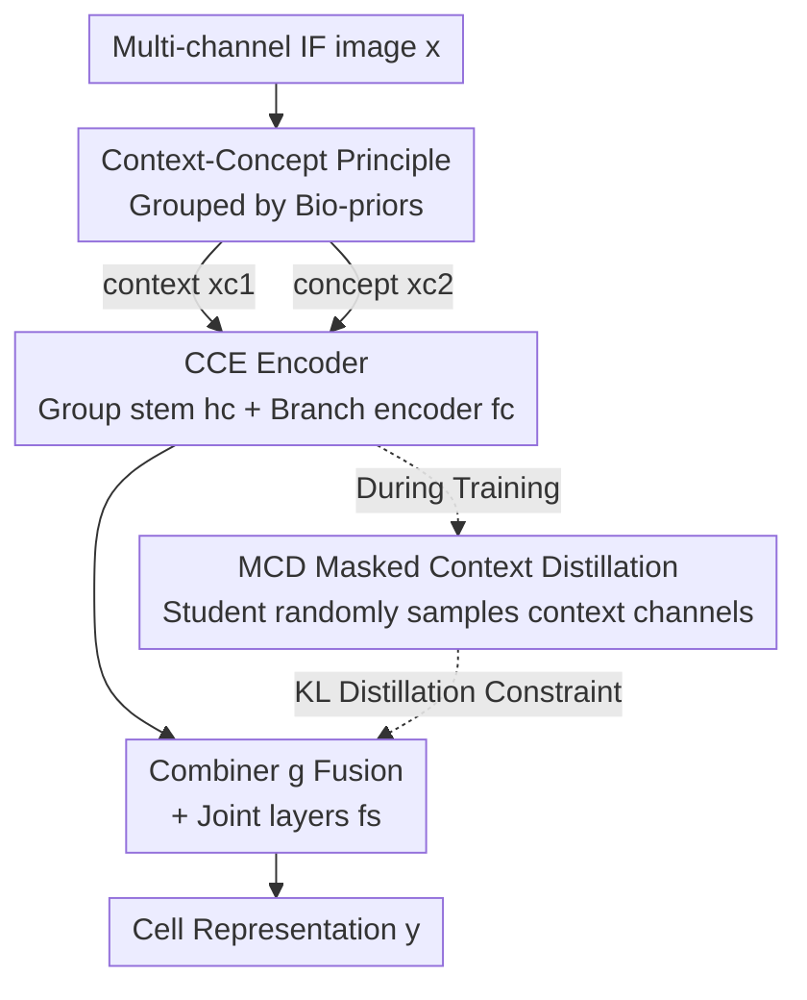

# Building Robust Vision Encoders for Cross-Dataset Evaluation in Immunofluorescent Microscopy

**Conference**: CVPR 2026  
**Paper**: [CVF Open Access](https://openaccess.thecvf.com/content/CVPR2026/html/Marikkar_Building_Robust_Vision_Encoders_for_Cross_Dataset_Evaluation_in_Immunofluorescent_Microscopy_CVPR_2026_paper.html)  
**Code**: https://github.com/umarikkar/C3R  
**Area**: Medical Imaging / Self-Supervised Representation Learning  
**Keywords**: Immunofluorescence microscopy, cross-dataset generalization, channel-adaptive encoder, masked distillation, cellular representation

## TL;DR
Addressing the inconsistency in channel counts and configurations across immunofluorescence (IF) microscopy laboratories, which prevents existing models from migrating to "unseen channel combinations," this paper proposes C3R. It leverages biological priors to split channels into "context" and "concept" groups. By utilizing the CCE architecture with group-independent encoding and the MCD (Masked Context Distillation) pre-training strategy, the frozen encoder achieves SOTA performance on OOD datasets with unseen channel configurations without retraining.

## Background & Motivation
**Background**: Immunofluorescence images reveal subcellular structures and functions, serving as critical data sources for tasks such as disease prediction, subcellular localization, and drug perturbation prediction. The current mainstream paradigm involves self-supervised learning (SSL, e.g., DINO, iBOT) on IF datasets followed by evaluation on In-Distribution (ID) and Out-of-Distribution (OOD) tasks to measure the performance of vision foundation models in this domain.

**Limitations of Prior Work**: Staining protocols vary across laboratories, resulting in **different channel counts and channel semantics** (HPA has 4 channels, JUMP-CP has 5, and WTC-11 differs again), whereas typical image encoders assume a fixed number of channels. Existing channel-adaptive methods (ChannelViT, DiChaViT, ChAdaViT), though trainable on multiple channels, treat channels as independent tokens and assign dedicated parameters to each. Consequently, they **can only handle channels seen during training**—once a new channel configuration appears in an evaluation dataset, they cannot migrate directly and must be retrained. Single-channel methods (processing each channel independently) allow for direct migration but discard inter-channel dependencies.

**Key Challenge**: There is a tension between "cross-dataset transferability" and "capturing inter-channel dependencies." Fixed-channel encoders are expressive but tied to specific channels; per-channel processing allows transfer but isolates channel relationships. Prior work has neither provided an OOD evaluation mechanism for unseen channels nor utilized the inherent structure of IF image channels.

**Key Insight**: The authors observe an **intrinsic grouping** in IF dataset channels that reflects experimental design habits. Certain "context" channels (e.g., markers for Nucleus, Microtubules, ER) are highly consistent across images within a dataset, providing structural references. Other "concept" channels (e.g., target proteins, perturbation phenotypes) carry experiment-specific semantic information and must be interpreted relative to the context. Critically, while the specific context/concept assignment is **dataset-dependent** (e.g., a Nucleus channel might be a concept in WTC-11 but context in HPA), the principle of "dividing into two groups where concepts depend on context" is consistent across all IF datasets.

**Core Idea**: Inject the "context-concept principle" into both the **architecture** and **pre-training**. Architecturally, groups are encoded independently and then fused (CCE). During pre-training, the concept channels learn to contribute to representations even under "limited context" (MCD). At inference, when encountering new channels, one simply assigns them to the context or concept group, allowing evaluation without retraining the frozen encoder.

## Method

### Overall Architecture
C3R (Channel-Conditioned Cell Representations) is a framework built on the "context-concept principle" consisting of two components: a **channel-adaptive encoder architecture CCE** and a **Masked Context Distillation pre-training strategy MCD**. The backbone is a ViT, and the base pre-training pipeline utilizes iBOT with a SubCell antibody weak-supervision loss.

The input is a multi-channel IF image $x = [x_{c1}, x_{c2}]$, where $x_{c1} \in \mathbb{R}^{C_1 \times h \times w}$ is the context group and $x_{c2} \in \mathbb{R}^{C_2 \times h \times w}$ is the concept group ($C_1, C_2$ are the channel counts for each group, determined by the experimental design). CCE first applies group-wise convolutional stems and lightweight branch encoders to both groups to obtain intermediate intra-group representations. These are fused by a combiner and passed through joint encoding layers to produce the global representation $y$. During pre-training, MCD forces the student network to **randomly drop a portion of the context channels** while the teacher sees the full context, using KL distillation to compel the student to rely on concept channels when the "context is incomplete." During inference, new channels from unseen datasets are manually assigned to one of the two groups for a direct forward pass without retraining.

### Key Designs

**1. Context-Concept Principle: Segmenting IF Channels by Biological Semantics**

**Mechanism**: This principle addresses the limitation where existing methods treat all channels equally and thus become locked into specific training configurations. The authors categorize IF channels into two types: context channels serve as structural/positional references (e.g., Nucleus, Microtubules, ER), are visually stable across samples within a dataset, and provide spatial references for segmentation and registration. Concept channels carry "readout" signals (e.g., antibody targets, compound MoA, genotypes), which vary based on the biological focus and **must be interpreted relative to the context**.

**Design Motivation**: While assignments are dataset-specific, the structure of "two groups + concept depending on context" is universal. By learning "how to handle the relationship between groups" rather than "how to handle specific channels," the model becomes transferable. This reduces a high-dimensional channel configuration problem into a stable two-group problem.

**2. CCE (Context-Concept Encoder): Group-Independent Encoding and Fusion**

**Mechanism**: CCE resolves the contradiction between capturing dependencies and remaining transferable by **encoding groups separately before fusion**. Group-specific convolutional stems ($h_{c1}, h_{c2}$) and lightweight branch encoders ($f_{c1}, f_{c2}$) are used to tokenize and encode each group independently to a certain depth.

**Function**: Tokenization and intra-group encoding:

$$\tilde{x}^i_{c1} = h_{c1}(x^i_{c1}) \in \mathbb{R}^{N \times d}, \quad \hat{x}^i_{c1} = f_{c1}(\tilde{x}^i_{c1}) \in \mathbb{R}^{N \times d}$$

Fusion and joint encoding:

$$\hat{x} = g\big(\{\hat{x}^i_{c1}\}_{i=1}^{C_1}, \{\hat{x}^j_{c2}\}_{j=1}^{C_2}\big) \in \mathbb{R}^{N \times D}, \quad y = f_s(\hat{x}) \in \mathbb{R}^{D}$$

where $D = 2d$. Unlike ChannelViT, which concatenates all channels into long sequences resulting in **quadratic complexity**, CCE processes channels through branch encoders independently, achieving **linear complexity** relative to channel count. Crucially, CCE learns group-specific distinctions that allow the global representation $y$ to transfer directly to unseen datasets.

**3. MCD (Masked Context Distillation): Forcing Independence via "Limited Context"**

**Mechanism**: MCD is a pre-training strategy that ensures concept channels can support representations even when the context is incomplete. Building on iBOT's teacher-student distillation, it introduces a **context channel sampling strategy**: given two augmented views $u$ and $v$, the student receives view $u$ with a **randomly sampled subset of $c$ context channels** ($1 \le c \le C_1$), while the concept group remains intact. The teacher receives the full context from view $v$.

$$u_{s,c1\text{-}smp} = \text{sample}(u_{c1}, c), \quad u_s = [u_{c1\text{-}smp}, u_{c2}], \quad v_t = [v_{c1}, v_{c2}]$$

The distillation loss is the KL divergence between the student's and teacher's projections $z_s, z_t$:

$$L_{MCD} = L_{KL}(z_t \,\|\, z_s) = \sum_{k=1}^{K} z_t(k) \log \frac{z_t(k)}{z_s(k)}$$

**Design Motivation**: The student is forced to align with a teacher that sees the full context despite having reduced context itself. This compels the model to extract more information from concept channels, resulting in "concept-driven" and robust representations.

### Loss & Training
Pre-training is conducted on the HPA training set (~800k images) using iBOT and SubCell antibody losses. C3R utilizes ViT-S and ViT-B backbones. Branch encoders $f_c$ have a depth of 2, while the joint layer $f_s$ has a depth of 11. Total parameters and FLOPs are aligned with baselines for fair comparison. MCD channel sampling occurs before the forward pass, and dropping channels solely on the student side yielded the best results.

## Key Experimental Results

### Main Results
ID evaluation uses HPA-Loc (protein localization, mAP). OOD evaluation (channel-level) uses JUMP-Ret (zero-shot compound retrieval) and CHAMMI-FE (frozen encoder evaluation). C3R is pre-trained on 4-channel HPA images and **not retrained for target datasets**; conversely, Base-CP* and SubCell* are retrained to match target channel configurations.

| Dataset / Setting | Metric | C3R (ViT-B) | Retrained Baseline Base-CP* / SubCell* | Channel-Agnostic Baseline ChannelViT |
|------|------|------|------|------|
| HPA-Loc (ID) | mAP-31 | **0.548** | SubCell* 0.519 | 0.438 (ViT-S) |
| HPA-Loc (ID) | mAP-19 | **0.737** | SubCell* 0.695 | 0.602 (ViT-S) |
| JUMP-Ret (OOD) | mAP | **0.363** | Base-CP* 0.355 | 0.345 (ViT-S) |
| JUMP-Ret (OOD) | kNN | **0.530** | Base-CP* 0.513 | 0.503 (ViT-S) |
| CHAMMI-FE | CPS | 0.543 (ViT-S) | — | 0.472 |

**Key Takeaways**: In zero-shot retrieval (JUMP-Ret), C3R matches or exceeds Base-CP* without retraining. On CHAMMI-FE (CPS score), C3R (ViT-S) significantly outperforms ChannelViT (0.543 vs. 0.472).

### Ablation Study
Incremental component addition (ViT-B, Table 5):

| Configuration | HPA-Loc mAP-31 | JUMP-Ret mAP | Notes |
|------|------|------|------|
| Base-SC | 0.385 | 0.339 | Single-channel baseline |
| + Group stem $h_c$ | 0.529 | 0.344 | ID improves significantly; OOD barely exceeds single-channel |
| + Branch encoder $f_c$ | 0.531 | 0.358 | OOD improves significantly, matching/exceeding Base-CP |
| + MCD | **0.548** | **0.363** | Full C3R, further ID/OOD gains |

**MCD Ablation**: Without MCD, the CPS score on CHAMMI-FE drops to 0.338 compared to 0.543 with MCD—indicating massive gains in tasks requiring learnable adapters (MLP).

### Key Findings
- **"Grouping" $\neq$ "Distinguishing"**: Grouped stems ($h_c$) only improve ID performance. Significant OOD jumps require the deeper **branch encoders $f_c$** to learn group-specific features.
- **Group Flipping Degrades Performance**: Swapping context/concept assignments leads to consistent performance drops, which intensify as the depth of $f_c$ increases, proving the encoders learn group-specific information.
- **Unseen Channels in the Concept Branch**: On WTC-11, treating Nucleus as a concept yields F1 0.551, while flipping it to context drops it to 0.536. Since the concept branch never saw Nucleus during HPA pre-training, it suggests the branch learns "conceptual signals" rather than specific channel patterns.
- **MCD Gains Depend on Learnable Adapters**: MCD improves performance in 3 out of 4 evaluations (HPA-ID, CHAMMI-FE, JUMP-TRex) but stays flat on the purely zero-shot JUMP-Ret. This suggests MCD gains often require downstream probes (e.g., MLPs) to be fully realized.

## Highlights & Insights
- **Transforming Domain Priors into Transferable Inductive Biases**: Instead of creating a "generic" encoder for arbitrary channels, recognizing that IF channels are always "reference + readout" allows for a stable dual-group structure that only requires assignment rather than retraining.
- **Linear Complexity Scaling**: Branch encoders allow for independent per-channel encoding, making the model more scalable than quadratic-complexity models like ChannelViT.
- **MCD as "Inverse Dropout" Distillation**: While standard distillation uses augmentation for variance, MCD specifically "cripples" the student's context to force concept independence. This asymmetric masking based on semantic groups is a transferable idea for any multi-channel domain (e.g., remote sensing) with stable reference channels.
- **Frozen Encoder Evaluation (CHAMMI-FE)**: Testing with a fixed backbone and a 2-layer MLP (prohibiting stem/encoder fine-tuning) effectively simulates encountering unseen channels, providing a more rigorous measure of transferability.

## Limitations & Future Work
- **Ineffectiveness in Pure Zero-Shot Retrieval**: MCD's benefits are largely realized through learnable adapters; its performance on zero-shot JUMP-Ret is comparable to models without MCD.
- **Manual Group Assignment**: Assigning new dataset channels to context/concept groups still requires domain expertise and is not yet automated.
- **Domain-Specific Validation**: The "context-concept principle" has only been validated in IF/cell microscopy and requires testing in other domains like histopathology or remote sensing.
- **Dependence on Pre-training Pipelines**: C3R relies on the availablity of antibody-based weak supervision signals (SubCell), which might limit application in less-annotated scenarios.

## Related Work & Insights
- **vs. ChannelViT / DiChaViT / ChAdaViT**: These methods assign specific parameters to each channel and suffer from quadratic token growth. C3R uses a "two-group" abstraction that is linear and transferable to unseen channels.
- **vs. SubCell / DINO4Cells**: These require retraining or specific channel duplication to match target datasets. C3R achieves parity or superiority with a frozen encoder and zero retraining.
- **vs. Single-channel methods (Base-SC)**: While transferable, single-channel models lose inter-channel dependencies; C3R recovers this information via joint encoding layers while maintaining transferability.

## Rating
- Novelty: ⭐⭐⭐⭐⭐ 
- Experimental Thoroughness: ⭐⭐⭐⭐ 
- Writing Quality: ⭐⭐⭐⭐ 
- Value: ⭐⭐⭐⭐ 

<!-- RELATED:START -->

## Related Papers

- [\[CVPR 2026\] MuViT: Multi-Resolution Vision Transformers for Learning Across Scales in Microscopy](muvit_multi-resolution_vision_transformers_for_learning_across_scales_in_microsc.md)
- [\[CVPR 2026\] Are General-Purpose Vision Models All We Need for 2D Medical Image Segmentation? A Cross-Dataset Empirical Study](are_general-purpose_vision_models_all_we_need_for_2d_medical_image_segmentation_.md)
- [\[CVPR 2026\] MambaLiteUNet: Cross-Gated Adaptive Feature Fusion for Robust Skin Lesion Segmentation](mambaliteunet_cross-gated_adaptive_feature_fusion_for_robust_skin_lesion_segment.md)
- [\[AAAI 2026\] Bridging Vision and Language for Robust Context-Aware Surgical Point Tracking: The VL-SurgPT Dataset and Benchmark](../../AAAI2026/medical_imaging/bridging_vision_and_language_for_robust_context-aware_surgical_point_tracking_th.md)
- [\[CVPR 2026\] X-WIN: Building Chest Radiograph World Model via Predictive Sensing](x-win_building_chest_radiograph_world_model_via_predictive_sensing.md)

<!-- RELATED:END -->
