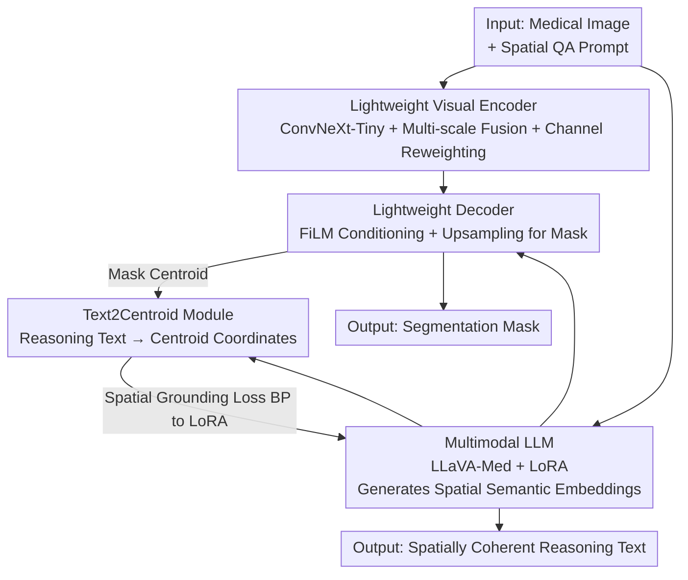

# CG-Reasoner: Centroid-Guided Positional Reasoning Segmentation for Medical Imaging with a Robust Visual-Text Consistency Metric

**Conference**: CVPR 2026  
**Paper**: [CVF Open Access](https://openaccess.thecvf.com/content/CVPR2026/html/Polamreddy_CG-Reasoner_Centroid-Guided_Positional_Reasoning_Segmentation_for_Medical_Imaging_with_a_CVPR_2026_paper.html)  
**Code**: https://github.com/lpmm2025/CGReasoner  
**Area**: Medical Imaging  
**Keywords**: Medical Image Segmentation, Positional Reasoning, Multimodal LLM, Centroid Guidance, Cross-modal Evaluation  

## TL;DR
CG-Reasoner integrates a lightweight encoder-decoder with LLaVA-Med and introduces a Text2Centroid module that regresses reasoning text into lesion centroid coordinates. This enables the model to produce spatially grounded, interpretable reasoning text alongside segmentation masks. Additionally, the proposed PRScore measures semantic, spatial, and visual consistency, achieving performance close to or exceeding SOTA across six medical imaging modalities.

## Background & Motivation
**Background**: Mainstream medical image segmentation relies on fully supervised pixel-level networks such as U-Net, nnU-Net, or Swin-UNet. Recently, foundation models like MedSAM and SAM-Med2D (supporting point/box prompts) and works like BiomedParse (using text prompts for shape/position inference) have emerged.

**Limitations of Prior Work**: These methods optimize solely for pixel overlap (Dice/IoU) and lack the ability to describe the relative anatomical position of lesions in natural language. Clinical radiology reports depend heavily on such spatial descriptions (e.g., "lesion in the upper right lobe"). Even VLM-based solutions that combine segmentation and language often suffer from a spatial disconnect between the generated text and the actual lesion mask.

**Key Challenge**: Reasoning (text) and segmentation (geometry) are treated as independent tasks without explicit spatial constraints. Consequently, the model might describe a lesion as being in the "top-left" while the mask is in the bottom-right. Metrics like Dice/IoU do not account for text, while BLEU/ROUGE only measure n-gram overlap rather than geometry. Previous efforts like PRS-Med used ChatGPT for binary Yes/No correctness judgments, which were coarse and failed to capture fine-grained semantic-spatial discrepancies.

**Goal**: (1) Simultaneously produce accurate masks and spatially coherent reasoning text within a unified framework; (2) Provide an objective, reproducible metric to evaluate semantic faithfulness, spatial reasoning, and visual grounding.

**Key Insight**: The authors observe that the **centroid coordinates** of a mask serve as the most natural bridge connecting "spatial terms in language" to "actual positions in images." Regressing reasoning text to a normalized 2D centroid allows geometric distance to supervise language, ensuring descriptions like "top-right" correspond to the actual top-right region.

**Core Idea**: The Text2Centroid module maps reasoning text to centroid coordinates, backpropagating spatial alignment signals into the LLM's LoRA adapters to ground linguistic reasoning geometrically. PRScore is then constructed using the same centroid-based logic for evaluation.

## Method

### Overall Architecture
CG-Reasoner unifies vision and linguistic reasoning in a framework composed of four components: a **lightweight visual encoder** for multi-scale anatomical features; a **multimodal LLM (LLaVA-Med + LoRA)** that processes spatial Question-Answering (QA) prompts to produce spatial-semantic embeddings; a **lightweight decoder** that fuses linguistic embeddings with visual features via cross-modal attention to generate precise masks; and the **Text2Centroid (T2C) module**, which regresses reasoning text into lesion centroids. This centroid serves as a geometric supervision signal to align language reasoning with visual localization. The input is a medical image and a spatial QA prompt; the output is a segmentation mask and spatially coherent reasoning text. LLM parameters are fine-tuned using LoRA (rank=16) to avoid retraining the entire model.

### Key Designs

**1. Lightweight Visual Encoder: Recovering Anatomical Boundaries from Shallow Layers**

To address the trade-off between boundary precision and computational cost, the encoder uses ConvNeXt-Tiny as a backbone with three enhancements: feature refinement, multi-scale fusion, and channel attention. For each selected ConvNeXt stage $i$ ($i\in\{1,2,3\}$), a "Conv-BN-ReLU" block produces $R_i$ to recover fine boundaries and textures lost in deeper layers, followed by bilinear upsampling and residual fusion:

$$F_{\text{fused}} = R_1 + \text{Up}(R_2) + \text{Up}(R_3)$$

where $\text{Up}(\cdot)$ denotes bilinear interpolation for spatial alignment. The fused features undergo adaptive channel reweighting (Global Average Pooling + non-linear transformation) to emphasize useful channels. This results in boundary-aware visual embeddings with low computational overhead across various modalities (CT/MRI/X-ray).

**2. Lightweight Decoder: FiLM for Modulating Linguistic Intent into Vision**

The decoder bridges language and pixels in three steps. First, it performs prompt projection: given LLM prompt embeddings $P\in\mathbb{R}^{B\times T\times d_p}$, each token is projected to visual dimension $d_v$ and averaged across $T$ tokens:

$$\mathbf{z}_p = \frac{1}{T}\sum_{t=1}^{T} \phi\!\left(\mathrm{LN}(\mathbf{P}_t \mathbf{W}_p)\right)$$

where $\mathbf{W}_p\in\mathbb{R}^{d_p\times d_v}$ is a learnable projection matrix, $\mathrm{LN}$ is Layer Normalization, and $\phi$ is GELU. Next, **FiLM (Feature-wise Linear Modulation)** is applied: a lightweight MLP transforms the prompt descriptor $\mathbf{z}_p$ into per-channel scaling and bias parameters to modulate visual features. These features undergo spatial interaction via depthwise separable convolutions and MixFFN blocks before being upsampled into a mask via transposed convolutions and a sigmoid head.

**3. Text2Centroid (T2C) Module: Grounding Positional Terms in Geometry**

The T2C is a lightweight regression network designed to bridge the gap between language and masks. During training, each reasoning sentence $T_i$ is paired with the centroid $(x_c,y_c)$ of its corresponding mask $M_i$. Coordinates are normalized to $[-1,1]$. The architecture consists of a **frozen Sentence-BERT** encoder followed by a multi-layer regression head, optimized with Smooth L1 loss:

$$\mathcal{L}_{\text{T2C}} = \frac{1}{N}\sum_{i=1}^{N} \mathcal{S}_{\text{L1}}\!\left((\hat{x}_{c,i}, \hat{y}_{c,i}), (x_{c,i}, y_{c,i})\right)$$

This module is pre-trained independently and then **frozen** within the framework. During end-to-end fine-tuning, the spatial alignment signal is **backpropagated into the LoRA adapters of LLaVA**, ensuring linguistic reasoning is geometrically grounded.

### Loss & Training
The total loss jointly optimizes for visual accuracy and spatial interpretability:

$$\mathcal{L}_{total} = \lambda_{seg}\mathcal{L}_{seg} + \lambda_{txt}\mathcal{L}_{txt} + \lambda_{spatial}\mathcal{L}_{spatial}$$

where $\mathcal{L}_{seg}$ consists of Dice and BCE losses for boundary precision; $\mathcal{L}_{txt}$ is the cross-entropy loss for clinical text coherence; and $\mathcal{L}_{spatial}$ is the T2C-derived loss forcing geometric alignment between language and localization. Training utilized 2×A100 GPUs for 20 epochs with AdamW ($lr=1e-4$).

### PRScore: A Unified Metric for Semantic, Spatial, and Visual Consistency
PRScore decomposes consistency into three components normalized to $[0,1]$. Let $\operatorname{ncos}(\mathbf{u},\mathbf{v})=\tfrac{1}{2}(\operatorname{cos}(\mathbf{u},\mathbf{v})+1)\in[0,1]$. Semantic score $S_{\text{sem}}$ uses SBERT to calculate sentence similarity. The spatial score $S_{\text{spatial}}$ combines direction and distance consistency:

$$S_{\text{spatial}} = \tfrac{1}{2}\big[\operatorname{ncos}(\mathbf{p}_{\text{gt}},\mathbf{p}_{\text{pred}}) + (1 - d(\mathbf{p}_{\text{gt}},\mathbf{p}_{\text{pred}}))\big]$$

where $\mathbf{p}$ is the T2C coordinate embedding. The visual grounding score $S_{\text{vis}}$ aligns the predicted text coordinate with the **generated mask centroid** $\mathbf{m}$:

$$S_{\text{vis}} = \tfrac{1}{2}\big[\operatorname{ncos}(\mathbf{p}_{\text{pred}},\mathbf{m}) + (1 - d(\mathbf{p}_{\text{pred}},\mathbf{m}))\big]$$

The final score is $\text{PRScore} = \alpha S_{\text{sem}} + \beta S_{\text{spatial}} + \gamma S_{\text{vis}}$ with $\alpha=\beta=\gamma=\tfrac{1}{3}$.

## Key Experimental Results

### Main Results (Segmentation: mDice/mIoU across Six Modalities)

| Dataset | Metric | CG-Reasoner | PRS-Med | BiomedParse |
|--------|------|------|---------|-------------|
| Lung X-ray | mDice / mIoU | **0.977 / 0.958** | 0.969 / 0.942 | 0.972 / 0.949 |
| Lung CT-Scan | mDice / mIoU | **0.970 / 0.948** | 0.968 / 0.943 | 0.088 / 0.061 |
| Brain MRI | mDice / mIoU | **0.819 / 0.731** | 0.803 / 0.757 | 0.294 / 0.245 |
| Skin RGB | mDice / mIoU | 0.904 / 0.840 | 0.875 / 0.799 | **0.924 / 0.867** |
| Breast Ultrasound | mDice / mIoU | 0.765 / 0.669 | **0.817 / 0.729** | 0.783 / 0.698 |
| Polyp Endoscopy | mDice / mIoU | 0.716 / 0.636 | **0.843 / 0.791** | 0.824 / 0.774 |

### Reasoning Results (PRScore)

| Method | Breast US | Brain MRI | Lung CT | Lung X-ray | Polyp | Skin RGB |
|------|-----------|-----------|---------|------------|-------|----------|
| LISA-7B | 0.361 | 0.406 | 0.694 | 0.356 | 0.304 | 0.236 |
| PRS-Med | 0.729 | 0.712 | 0.830 | 0.697 | **0.734** | **0.735** |
| CG-Reasoner | **0.755** | **0.722** | **0.847** | **0.728** | 0.732 | 0.730 |

### Ablation Study

| Configuration | Breast US | Brain MRI | Lung CT | Lung X-ray | Polyp | Skin RGB |
|------|-----------|-----------|---------|------------|-------|----------|
| w/o Text2Centroid | 0.721 | 0.705 | 0.832 | 0.700 | 0.723 | 0.719 |
| Full (with T2C) | 0.755 | 0.722 | 0.847 | 0.728 | 0.732 | 0.730 |

### Key Findings
- **T2C is the primary source of reasoning quality**: Removing it drastically reduces PRScore, indicating that geometric grounding—rather than model size—is critical for positional reasoning.
- **Lightweight efficiency**: CG-Reasoner outperforms heavier models like LISA-13B and G-Dino+SAM-Med2D in several categories while only fine-tuning via LoRA.
- **Modality gap**: Performance is near-saturated on high-contrast modalities like Lung X-ray/CT but lower on fuzzy boundaries like Ultrasound/Endoscopy.

## Highlights & Insights
- **Centroid as the Language-Geometry Interface**: Using a 2D centroid to represent a sentence is a simple yet effective bridge that enables both training supervision and evaluation.
- **Self-consistent Metric**: PRScore penalizes spatial contradictions directly, filling the gap left by Dice and BLEU.
- **Transferability**: The strategy of regressing output to geometric anchors for language supervision can be extended to remote sensing, document layout analysis, or robotics.

## Limitations & Future Work
- The current reasoning is limited to "absolute" positions (e.g., top-right) rather than complex relative anatomical reasoning.
- T2C's single-centroid approach is less effective for multi-target or non-convex lesions where the centroid may lie outside the mask.
- PRScore shares the same spatial prior (T2C) as the model, posing a potential risk of circular dependency in evaluation.

## Related Work & Insights
- **vs PRS-Med**: Both perform positional reasoning segmentation; however, PRS-Med relies on subjective ChatGPT-as-Judge evaluations. CG-Reasoner introduces the reproducible PRScore and explicit T2C grounding.
- **vs LISA/PixelLM**: These general-domain models do not prioritize medical-spatial tokens; CG-Reasoner incorporates spatial consistency into the loss function directly.

## Rating
- Novelty: ⭐⭐⭐⭐ Innovative use of Text2Centroid for both grounding and evaluation.
- Experimental Thoroughness: ⭐⭐⭐⭐ Strong results across six modalities, though lacks analysis of multi-lesion scenarios.
- Writing Quality: ⭐⭐⭐⭐ Clear framework and formulas.
- Value: ⭐⭐⭐⭐ Spatially aware segmentation addresses a critical clinical need for interpretable report generation.

<!-- RELATED:START -->

## Related Papers

- [\[ICLR 2026\] Towards Text–Mask Consistency in Medical Image Segmentation](../../ICLR2026/medical_imaging/towards_text-mask_consistency_in_medical_image_segmentation.md)
- [\[CVPR 2026\] OmniFM: Toward Modality-Robust and Task-Agnostic Federated Learning for Heterogeneous Medical Imaging](omnifm_toward_modality-robust_and_task-agnostic_federated_learning_for_heterogen.md)
- [\[CVPR 2026\] Simple-ViLMedSAM: Simple Text Prompts Meet Vision-Language Models for Medical Image Segmentation](simple-vilmedsam_simple_text_prompts_meet_vision-language_models_for_medical_ima.md)
- [\[CVPR 2026\] VoxTell: Free-Text Promptable Universal 3D Medical Image Segmentation](voxtell_free-text_promptable_universal_3d_medical_image_segmentation.md)
- [\[CVPR 2026\] PGR-Net: Prior-Guided ROI Reasoning Network for Brain Tumor MRI Segmentation](pgr-net_prior-guided_roi_reasoning_network_for_brain_tumor_mri_segmentation.md)

<!-- RELATED:END -->
