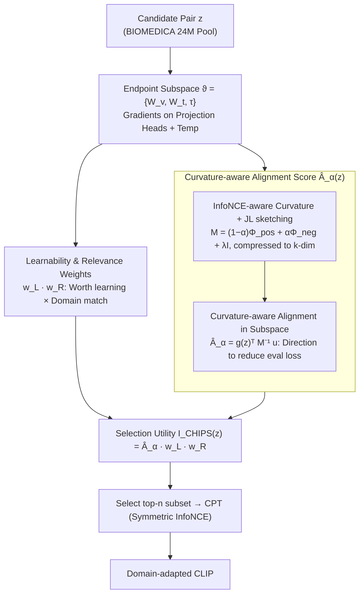

# CHIPS: Efficient CLIP Adaptation via Curvature-aware Hybrid Influence-based Data Selection

**Conference**: CVPR 2026  
**arXiv**: [2511.18519](https://arxiv.org/abs/2511.18519)  
**Code**: [Available](https://github.com/mihara-bot/CHIPS)  
**Area**: Medical Imaging  
**Keywords**: CLIP Adaptation, Data Selection, Curvature-aware, Continued Pre-training, Medical Imaging  

## TL;DR

Ours proposes CHIPS, a data selection method based on curvature-aware hybrid influence. It calculates Newton-style alignment scores in the CLIP endpoint subspace and combines them with learnability and domain relevance weights. With only 30% of the data, it matches the effect of continued pre-training (CPT) on the full dataset, achieving SOTA across 17 medical benchmarks.

## Background & Motivation

### 1. Background

Vision-language models like CLIP exhibit strong zero-shot recognition capabilities in general domains but suffer sharp performance drops in vertical domains (e.g., medical imaging, biology) where vocabularies, acquisition protocols, and label systems shift significantly. Currently, adapting CLIP to vertical domains follows two paradigms: **model-centric** methods (modifying training/parameterization strategies like probabilistic fine-tuning or PEFT variants) and **data-centric** methods (CPT on large-scale domain data ranging from millions to hundreds of millions of samples).

### 2. Limitations of Prior Work

Data-centric methods face severe **data efficiency** issues: collecting, labeling, and processing large-scale domain datasets is extremely costly. Furthermore, indiscriminately increasing data volume may introduce redundant or inefficient samples, harming learning outcomes.

### 3. Key Challenge

The contradiction between scale and efficiency—is extreme data scale truly necessary for effective CPT? Existing data attribution methods (e.g., TracIn, TRAK) are designed for supervised classification on single-tower models. Applying them directly to CLIP faces three fundamental mismatches:

- **(A) Cross-modal curvature of dual encoders**: CLIP's dual encoders produce non-block-diagonal second-order curvature. Block-diagonal proxies ignore this coupling, leading to incorrect sample ranking.
- **(B) Non-local gradients under InfoNCE**: The gradient of each sample depends on the softmax normalizer of the entire negative sample set, making influence batch/global dependent rather than sample-wise additive.
- **(C) Dominance of endpoint projection heads**: Projection heads and temperature parameters drive the early shifts in similarity distribution. Full-parameter influence calculation is unnecessary for CLIP.

### 4. Goal

Design a CLIP-specific data selector to achieve domain adaptation effects comparable to or better than full-scale CPT using a small data volume, while preserving general domain capabilities.

### 5. Key Insight

Starting from the perspective of **data attribution**, data selection is modeled as selecting samples that maximize the reduction in target domain evaluation loss after a single update step. The key insight is that computing this alignment score in the CLIP endpoint subspace (projection heads + temperature) is sufficient.

### 6. Core Idea

Ours proposes CHIPS (Curvature-aware Hybrid Influence in Projection Subspace). It calculates a curvature-aware Newton-style alignment score in the CLIP endpoint geometric space, combining an InfoNCE-aware curvature estimator (accelerated by JL sketching) and selection-aware domain relevance weights. The final selection utility score for each sample is the product of these components.

## Method

### Overall Architecture

CHIPS addresses a practical question: is it necessary to stack tens of millions of samples to adapt CLIP to the medical domain via CPT? Its solution is to calculate a "selection utility score" for each candidate sample and pick only the highest-scoring batch for training. The utility score is defined as the product of three weights: $\mathcal{I}_{\text{CHIPS}}(z) = \hat{A}_\alpha(z) \cdot w_L(z) \cdot w_R(z)$. The first term $\hat{A}_\alpha(z)$ measures "whether a gradient step on this sample pushes the model toward lower evaluation loss"; the second term $w_L(z)$ assesses "whether the sample is not yet learned and worth learning"; the third term $w_R(z)$ evaluates "whether it resembles target domain data." High scores require all three conditions to be met. All scores are computed only on CLIP's "endpoint" parameters (projection heads + temperature), allowing them to be cached and reused across different architectures or pre-training scales.

### Key Designs

**1. Curvature-aware Alignment in Endpoint Subspace: Newton direction on projection heads to avoid full-parameter second-order costs**

Modeling data selection as data attribution, the cleanest criterion is the Newton-style alignment score $A(z) = g_\vartheta(z)^\top M^{-1} u_\vartheta$. A larger inner product between the sample gradient $g_\vartheta(z)$ (corrected by curvature matrix $M$) and the evaluation loss gradient $u_\vartheta$ indicates that this update step pushes the model toward lower loss on the evaluation set. Since computing $M$ as a Hessian proxy for full parameters in CLIP is infeasible, CHIPS observes that early shifts in similarity distribution are driven by endpoint parameters $\vartheta = \{W_v, W_t, \tau\}$. Theorem 1 provides a lower bound for the Pearson correlation between endpoint and full-parameter alignment scores. Experiments confirm a Spearman correlation of 0.83, showing that the endpoint ranking preserves the order of full-parameter ranking while significantly reducing dimensionality and computation.

**2. InfoNCE-aware Curvature Estimation + JL sketching: Reincorporating negative sample coupling into curvature**

Standard InfoNCE softmax normalizers couple each positive pair with a whole batch of negative samples, creating significant off-diagonal mass in the true curvature. Methods like TracIn ignore this by using only the diagonal outer product of positive gradients. CHIPS decomposes curvature into positive-pair self-curvature $\Phi_{\text{pos}}$ and negative-pair cross-curvature $\Phi_{\text{neg}}$, reincorporating the latter via a mixing coefficient $\alpha$:

$$M = (1-\alpha)\Phi_{\text{pos}} + \alpha\Phi_{\text{neg}} + \lambda I$$

Johnson–Lindenstrauss (JL) random projection then compresses the dimensionality to $k$ for a fast-computable sketched score $\hat{A}_\alpha(z)$. Theorem 2 decomposes the estimation error into projection variance (shrinking with $O(1/k)$) and curvature bias—where $\alpha > 0$ compensates for off-diagonal mass, reducing bias. Experiments identify the optimal range at $\alpha \in [0.6, 0.8]$.

**3. Learnability and Domain Relevance Weights: Assessing utility beyond directional alignment**

Alignment scores alone cannot distinguish between samples the model has already mastered and those representing distribution gaps. CHIPS adds two multiplicative weights. Learnability $w_L(z) = (1 - p_{\text{corr}}(z))(1 + \sigma(-m(z)))$ uses the average correct probability $p_{\text{corr}}(z)$ and the margin $m(z)$ of the hardest negative sample. Samples with high confidence ($p_{\text{corr}} \approx 1$) are suppressed, while boundary samples with low or negative margins are emphasized. Domain relevance $w_R(z) = \sigma((1-\beta)\cos(\hat{x}, \mu_x) + \beta\cos(\hat{y}, \mu_y))$ compares sample embeddings with the evaluation set's mean embeddings $\mu_x, \mu_y$. The sigmoid scales this to $[0.27, 0.73]$ for soft re-weighting rather than hard filtering, avoiding excessive deviation from the target distribution to mitigate catastrophic forgetting ($\beta=0.5$ yields maximum gain).

### Loss & Training

CHIPS is a data selection method rather than a training method. The selected subset is used for CPT with standard symmetric InfoNCE loss:

- Optimizer: AdamW ($\beta_1=0.9, \beta_2=0.98, \epsilon=10^{-6}$)
- LR Schedule: Cosine annealing (initial $10^{-6}$)
- Batch Size: 32,768
- Epochs: 5
- Hardware: 8×NVIDIA H200 (141GB)

Calculated scores can be cached and reused for different models.

## Key Experimental Results

### Main Results

CPT results on BIOMEDICA (24M samples) using MetaCLIP-B16-400M across medical tasks:

| Method | r=10% Medical Avg | r=20% Medical Avg | r=30% Medical Avg | r=10% General CLS |
|------|:---:|:---:|:---:|:---:|
| Full Dataset | 31.51 | 31.51 | 31.51 | 49.72 |
| Random | 24.78 | 25.00 | 26.28 | 52.21 |
| CLIPScore | 24.16 | 20.01 | 19.01 | 53.39 |
| TracIn | 26.46 | 26.63 | 25.68 | 47.26 |
| TRAK | 25.19 | 24.54 | 23.54 | 48.24 |
| **CHIPS** | **27.03** | **28.20** | **29.96** | 47.88 |

Key data: CHIPS at 10% (27.03) outperforms 50% Random (26.26); CHIPS at 30% (29.96) reaches 95.1% of full CPT performance and slightly exceeds the specialized medical model BMCLIP (29.86).

Cross-architecture generalization (10% retention, reused CHIPS scores):

| Model | Medical CLS | General CLS | General RET |
|------|:---:|:---:|:---:|
| B32-400M Random | 27.15 | 49.31 | 27.33 |
| B32-400M CHIPS | **27.83** | 47.90 | 25.65 |
| L14-400M Random | 29.33 | 57.07 | 33.35 |
| L14-400M CHIPS | **29.73** | 53.65 | 28.17 |
| H14-CC Random | 35.23 | 61.36 | 32.82 |
| H14-CC CHIPS | **35.48** | 58.24 | 32.09 |

CHIPS achieved the best medical performance across all 7 architecture/pre-training settings, exceeding TracIn by 0.20-2.65 points.

### Ablation Study

Incremental component testing on MetaCLIP-B16-400M:

| Variant | r=10% Med | r=20% Med | r=30% Med | r=10% Gen CLS |
|------|:---:|:---:|:---:|:---:|
| Alignment-only | 25.98 | 27.52 | 27.84 | 48.33 |
| Alignment+Margin | 25.95 | 27.92 | 28.50 | 48.41 |
| **CHIPS (full)** | **27.03** | **28.20** | **29.96** | 47.88 |

The three-component product was optimal under all budgets. At r=30%, it outperformed Alignment+Margin by +1.46 points, highlighting the importance of domain relevance at larger budgets. General CLS gap was ≤0.53, and RET gap narrowed as r increased, indicating controlled specialization rather than catastrophic forgetting.

### Key Findings

1. **Extreme Data Efficiency**: 10% of data outperforms 50% random samples; 30% data achieves 95% of full dataset performance.
2. **Reliable Endpoint Subspace Proxy**: Spearman correlation of 0.83; the text projection head is most critical (Text-only maintains 99.7%), while the vision head is complementary (98.7%).
3. **Sweet Spot for $\alpha$**: $\alpha \in [0.6, 0.8]$ is optimal, validating the importance of negative coupling in InfoNCE curvature.
4. **Transferable Scores**: Scores computed on B16-400M are directly reusable for B32/L14/H14 architectures.
5. **Computational Cost**: Comparable to TRAK (50.95 vs 50.95 ×10^15 FLOPs) and 3.1% lower than TracIn.

## Highlights & Insights

- **Data-centric Perspective on CLIP Adaptation**: First systematic introduction of data selection for CLIP CPT, proving that "curating few" can replace "stacking many."
- **Solid Theoretical Support**: Theorem 1 proves the correlation lower bound for endpoint proxies; Theorem 2 provides error decomposition for curvature mixing and JL projection.
- **Engineer-friendly**: One-time score calculation is cross-architecture reusable, significantly reducing iteration costs in deployment.
- **Elegant Three-factor Design**: The product of Alignment (Directional Utility) × Learnability (Boundary Samples) × Relevance (Domain Match) ensures orthogonal components complement each other.

## Limitations & Future Work

1. **Dependency on Target Validation Distribution**: Requires a labeled $\mathcal{D}_{\text{eval}}$ for evaluation gradients, which is restrictive in label-scarce scenarios.
2. **Architecture Focus**: Only validated on CLIP; not yet extended to SigLIP, EVA-CLIP, etc.
3. **Domain Focus**: Primarily tested in medicine; validation in other vertical domains (remote sensing, industrial inspection) is needed.
4. **Hyperparameter Tuning**: $\alpha, \beta$ were tuned; different domains might require searches.
5. **Unlabeled Target Signals**: Potential exploration of unlabeled or distribution-shift robust target signals.

## Related Work & Insights

- **TracIn / TRAK**: Standard data attribution on single-tower models; CHIPS optimizes this for CLIP with curvature estimation and endpoint subspaces.
- **BIOMEDICA / MedTrinity**: Large-scale medical multimodal datasets; CHIPS validates data efficiency on these.
- **Johnson-Lindenstrauss Lemma**: Classical dimensionality reduction tool used to lower $O(d^2)$ complexity to near-linear.
- **Inspiration**: Data selection can be combined with model-centric methods (e.g., PEFT) to form a "curated data + efficient tuning" dual-efficiency strategy.

## Rating

⭐⭐⭐⭐ A data-centric CLIP adaptation work with solid theory and comprehensive experiments. The three-component design is clear and elegant. The result of matching full CPT with 30% data is impressive and offers high practical value for domain adaptation in data-scarce scenarios.

<!-- RELATED:START -->

## Related Papers

- [\[CVPR 2026\] MedCLIPSeg: Probabilistic Vision-Language Adaptation for Data-Efficient and Generalizable Medical Image Segmentation](medclipseg_probabilistic_vision-language_adaptation_for_data-efficient_and_gener.md)
- [\[CVPR 2026\] Ultrasound-CLIP: Semantic-Aware Contrastive Pre-training for Ultrasound Image-Text Understanding](ultrasound-clip_semantic-aware_contrastive_pre-training_for_ultrasound_image-tex.md)
- [\[CVPR 2026\] Personalized Longitudinal Medical Report Generation via Temporally-Aware Federated Adaptation](personalized_longitudinal_medical_report_generation_via_temporally-aware_federat.md)
- [\[CVPR 2026\] Cross-Modal Guided Visual Synthesis for Data-Efficient Multimodal Depression Recognition](cross-modal_guided_visual_synthesis_for_data-efficient_multimodal_depression_rec.md)
- [\[CVPR 2026\] CoFiDA-M: Concept-Aware Feature Modulation for Cross-Domain Adaptation with Image-Only Inference](cofida-m_concept-aware_feature_modulation_for_cross-domain_adaptation_with_image.md)

<!-- RELATED:END -->
