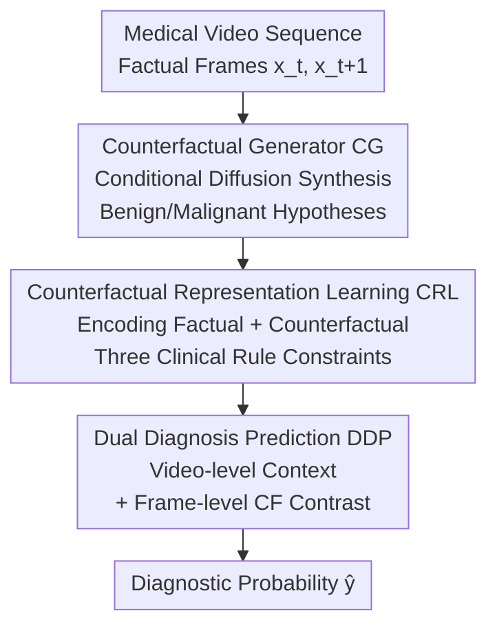

# Clinically-Grounded Counterfactual Reasoning for Medical Video Diagnosis

**Conference**: CVPR 2026  
**Paper**: [CVF Open Access](https://openaccess.thecvf.com/content/CVPR2026/html/Gao_Clinically-Grounded_Counterfactual_Reasoning_for_Medical_Video_Diagnosis_CVPR_2026_paper.html)  
**Code**: [Project Page](https://gaozzzz.github.io/MedVCR/) (Project Site)  
**Area**: Medical Imaging  
**Keywords**: Counterfactual Reasoning, Medical Video Diagnosis, Diffusion Models, Clinical Priors, Spatiotemporal Representation Learning  

## TL;DR
MEDVCR enables medical video diagnosis models to perform counterfactual reasoning similar to physicians (i.e., "how would this tissue look if it were benign?"). It utilizes diffusion models to synthesize tissue evolution under different pathological hypotheses, constrains representation learning with three clinical rules, and integrates the comparison of "factual observation vs. counterfactual hypothesis" into predictions. It improves Recall@1 / AP to 93.0% (+10.2%) and 94.8% (+2.6%) on hysteroscopic biopsy localization and colonoscopic polyp detection, respectively.

## Background & Motivation
**Background**: Many diseases (e.g., cervical cancer, colorectal cancer) are diagnosed via video-level examinations. Physicians observe the dynamic response of tissues across different stages of the examination (e.g., saline $\rightarrow$ acetic acid $\rightarrow$ iodine staining in hysteroscopy) to determine pathology. Recent automated methods use spatiotemporal backbones like I3D, SlowFast, or ViViT for end-to-end learning, mapping "visual sequences" directly to "diagnostic outputs."

**Limitations of Prior Work**: This purely data-driven paradigm suffers from three major issues. First, **misinterpretation of pathological evolution**—models focus on pixel-level changes without modeling how tissue "evolves across stages" (e.g., transient responses to acetic acid/iodine). Second, **neglect of clinical principles**—lack of explicit clinical knowledge leads to conflating diagnostic cues with non-pathological variations like lighting drift, reagent color differences, or camera motion. Third, **absence of hypothesis-driven reasoning**—models merely correlate observed patterns with outputs, whereas physicians mentally simulate "what if this tissue were benign instead of malignant?", comparing hypothetical scenarios with real observations.

**Key Challenge**: Existing methods conflate "causal pathological cues" with "accidentally correlated confounders," making them unreliable in data-scarce clinical scenarios. Physicians rely on counterfactual thinking to extract generalizable cues from few samples, effectively separating true signals from confounders.

**Goal**: To build a unified framework that simultaneously models "pathology-conditioned tissue evolution," encodes clinical diagnostic principles as explicit constraints, and performs contrastive reasoning across "factual vs. hypothetical" observations.

**Key Insight**: Implementing a triad of "explicit counterfactual tissue synthesis + clinical rule constraints + factual/counterfactual contrastive prediction" to transfer the physician's hypothesis-driven counterfactual reasoning into medical video diagnosis models.

## Method

### Overall Architecture
The input to MEDVCR is a medical video $V=\{x_t\}_{t=1}^T$ recording tissue changes across stages. Each frame $x_t$ is influenced by its stage $s_t$, latent health state $h \in \{\text{benign}, \text{malignant}\}$, and noise factors (lighting/motion). The output is the diagnostic probability $\hat{y} \in [0, 1]^P$. The pipeline consists of three modules: a **Counterfactual Generator (CG)** that synthesizes how a frame would look in the next stage under a specific health state; **Counterfactual Representation Learning (CRL)** that encodes factual and counterfactual frames under three clinical rule constraints; and **Dual Diagnosis Prediction (DDP)** that fuses video-level temporal context with frame-level counterfactual contrast for the final diagnosis.

### Key Designs

**1. Counterfactual Generator (CG): Synthesizing "What If" via Conditional Diffusion**

Clinical diagnosis involves comparing observed evolution with alternative outcomes under different pathological states. CG externalizes this implicit process using a **conditional diffusion model** $G$. Given a reference frame $x_t$ at stage $s_t$ and a target health state $h$, it estimates the tissue appearance $\tilde{x}^h_{t+1}$ at the next stage $s_{t+1}$. The forward process is a fixed Markov chain $q(\epsilon_k \mid x_{t+1}) = \mathcal{N}(\epsilon_k; \sqrt{\bar\alpha_k} x_{t+1}, (1-\bar\alpha_k)I)$. The reverse process uses a U-Net $F_u$ to predict noise $\hat\epsilon_k = F_u(\epsilon_k, x_t, h, k)$, where $h$ is projected into a latent vector modulating pathological expression. During sampling:

$$\tilde{x}^h_{t+1} = G(x_t, h) = F_{u, 1:k}(\epsilon_k; x_t, h)$$

By generating both benign and malignant variants, the model simulates two distinct diagnostic trajectories. Unlike standard data augmentation, this produces **clinically plausible tissue evolution** conditioned on specific pathology.

**2. Counterfactual Representation Learning (CRL): Encoding Clinical Principles as Constraints**

CRL employs a hierarchical video learner: "Visual Encoder $F_e$ (I3D) + Temporal Transformer $F_t$." Three clinical rules are enforced via Mutual Information ($M(\cdot; \cdot)$) constraints on the representations of factual pairs $(x_t, x_{t+1})$ and counterfactual frames $\tilde{x}^h_{t+1}$:

- **Rule 1: Temporal Consistency**: The pathological identity of a tissue region should remain stable across stages, meaning diagnostic information should be invariant to stage factors: $M(F_t; h) \approx M(F_{t+1}; h) \gg M(F_t, F_{t+1}; s_t, s_{t+1})$.
- **Rule 2: Pathological Separability**: Benign and malignant states stem from different biological processes and should be clearly separable in the representation space: $M(h; F^{ben}_{t+1}) + M(h; F^{mal}_{t+1}) \gg M(F^{ben}_{t+1}; F^{mal}_{t+1})$.
- **Rule 3: Counterfactual Alignment**: Factual observations should align with "pathologically consistent counterfactuals" and diverge from "incompatible hypotheses": $M(F^h_{t+1}; \tilde{F}^h_{t+1}) \gg M(F^h_{t+1}; \tilde{F}^{\bar h}_{t+1})$ ($\bar h$ is the opposite state).

These map to specific losses: temporal contrastive loss $\mathcal{L}_{temp}$, soft separability loss $\mathcal{L}_{sep}$, and a triplet-style alignment loss $\mathcal{L}_{align} = \max(0, m + F_{sim}(F^h_{t+1}, \tilde{F}^{\bar h}_{t+1}) - F_{sim}(F^h_{t+1}, \tilde{F}^h_{t+1}))$.

**3. Dual Diagnosis Prediction (DDP): Differential Diagnosis via Video Context + Frame Contrast**

DDP follows a hierarchical clinical approach. The video-level path yields logits $z^v = F_p(F^v)$ from the sequence $F^v$. The frame-level path analyzes the factual keyframe $x^h_{t+1}$ and its counterfactual counterpart $\tilde{x}^{\bar h}_{t+1}$ to obtain $z^h_{t+1}$ and $z^{\bar h}_{t+1}$. The final fusion is a **differential** form:

$$\hat{y} = F_\sigma(z^v + z^h_{t+1} - z^{\bar h}_{t+1}) \in [0, 1]^P$$

This adds frame-level evidence supporting the factual pathology while subtracting cues aligned with the alternative hypothesis, achieving "differential diagnosis" at the prediction level.

### Loss & Training
A two-stage strategy is used: First, pre-train the generator $G$ using the noise reconstruction loss $\mathcal{L}_{gen} = \mathbb{E}[\|\epsilon_k - \hat\epsilon_k\|_2^2]$. Second, freeze $G$ and train the video learner and diagnostic head using the clinical rule losses ($\mathcal{L}_{temp}, \mathcal{L}_{sep}, \mathcal{L}_{align}$) combined with the binary cross-entropy diagnostic loss $\mathcal{L}_{diag}$. Implementation uses U-Net for CG with $K=1000$ diffusion steps; $F_e$ is initialized with pre-trained I3D.

## Key Experimental Results

### Main Results
Evaluation was conducted in two settings: fully supervised (hysteroscopy biopsy localization, 623 cases) and weakly supervised (colonoscopy polyp detection, HyperKvasir + LDPolypVideo).

**Main Results: Hysteroscopy (Table 1, 5-fold CV, Recall@1)**

| Category | Method | Recall | Precision | Acc. | Recall@1 |
| :--- | :--- | :--- | :--- | :--- | :--- |
| General | TimeSformer (ICML21) | 54.8 | 57.9 | 25.6 | 70.4 |
| General | VideoMAEv2 (CVPR23) | 65.3 | 65.9 | 33.5 | 77.6 |
| Medical | SurgFormer (MICCAI24) | 70.1 | 66.8 | 41.2 | 82.8 |
| Medical | STDDNet (ICCV25) | 66.8 | 67.1 | 38.1 | 82.3 |
| — | **Ours (MEDVCR)** | **80.3** | **74.4** | **55.0** | **93.0** |

MEDVCR achieves 93.0% Recall@1, outperforming the strongest prior method SurgFormer by 10.2%.

**Main Results: Colonoscopy (Table 2, 5-fold CV)**

| Category | Method | AP | AUC |
| :--- | :--- | :--- | :--- |
| General | RTFM (ICCV21) | 78.0 | 96.3 |
| General | UR-DMU (AAAI23) | 79.3 | 93.7 |
| Medical | Endo-FM (MICCAI23) | 89.2 | 97.6 |
| Medical | TEmory (MICCAI25) | 92.2 | 99.4 |
| — | **Ours (MEDVCR)** | **94.8** | **99.6** |

### Ablation Study

**Module Effectiveness (Table 3, CRs = Clinical Rules, DDP = Dual Diagnosis Prediction)**

| Configuration | CRs | DDP | Hysteroscopy Recall@1 | Colonoscopy AP |
| :--- | :--- | :--- | :--- | :--- |
| #1 Baseline (Video Learner only) | ✗ | ✗ | 77.9 | 82.8 |
| #2 | ✓ | ✗ | 89.4 | 91.6 |
| #3 | ✗ | ✓ | 80.2 | 85.5 |
| #4 Full Model | ✓ | ✓ | **93.0** | **94.8** |

### Key Findings
- **Clinical Rules (CRs) provide the highest contribution**: Adding CRs alone improved hysteroscopy Recall@1 from 77.9% to 89.4% (+11.5), significantly exceeding the gain from DDP alone (80.2%).
- **"Counterfactual Alignment" is the most critical rule**: Enabling only the alignment loss improved Recall@1 by 10.6% compared to the baseline, confirming that linking factual representations with pathology-consistent counterfactuals is the core of counterfactual reasoning.
- **CRs and DDP are complementary**: The best performance is achieved when both are active, suggesting that clinical priors in the representation layer and factual/counterfactual contrast in the prediction layer provide orthogonal gains.
- **Backbone Impact**: Spatiotemporal backbones significantly outperform image-only backbones (e.g., I3D at 93.0% vs. CLIP-ViT/B at 84.5%), indicating that temporal modeling is essential for capturing diagnostic evolution.

## Highlights & Insights
- **Turning the "Physician’s Counterfactual Question" into Computable Differential Prediction**: The formula $\hat{y} = \sigma(z^v + z^h - z^{\bar h})$ elegantly implements differential diagnosis at the logit level, providing a transparent and interpretable mechanism.
- **Diffusion for Counterfactual Supervision, Not Just Augmentation**: Instead of random perturbations, CG generates "clinically plausible alternatives." Combined with triplet alignment, the generative model becomes a source of material for diagnostic reasoning.
- **Unified Mathematical View of Clinical Rules**: Expressing temporal consistency, pathological separability, and counterfactual alignment through the language of mutual information provides both theoretical rigor and engineering feasibility.
- **Clever Inference Protocol**: By treating observed tissue as "suspected malignant" for falsification and setting the counterfactual target to benign, the model avoids the "chicken and egg" problem of needing ground truth labels during inference.

## Limitations & Future Work
- **Reliance on Binary Health State Assumption**: The model assumes a binary $h$ (benign/malignant), which may be insufficient for continuous pathology spectrums or multi-class grading (e.g., different grades of intraepithelial neoplasia) ⚠️.
- **Generator Quality as a Bottleneck**: The effectiveness of counterfactual supervision depends on the clinical plausibility of CG's synthesized frames. Synthetic distortions in rare pathologies could lead to misleading alignment.
- **Data Scaling**: The hysteroscopy dataset is a single-center self-collected set (623 cases). Cross-center and cross-device generalization remains to be validated.

## Related Work & Insights
- **vs. Mainstream Spatiotemporal Diagnostics (SurgFormer/Endo-FM)**: While existing works rely on data-driven correlations, MEDVCR explicitly models pathology-conditioned evolution and performs counterfactual contrast, introducing causal-style reasoning that is more robust under data scarcity.
- **vs. Medical Counterfactual Generation**: Prior works mainly used counterfactuals for single-image explainability. This work extends the paradigm to **medical video**, performing counterfactual reasoning on temporal tissue evolution across examination stages.
- **vs. General Counterfactual Reasoning**: Instead of explicitly solving Structural Causal Models (SCM), the authors use clinical rules as a practical proxy for causal constraints to guide representations.

## Rating
- Novelty: ⭐⭐⭐⭐⭐ 
- Experimental Thoroughness: ⭐⭐⭐⭐ 
- Writing Quality: ⭐⭐⭐⭐⭐ 
- Value: ⭐⭐⭐⭐⭐ 

<!-- RELATED:START -->

## Related Papers

- [\[CVPR 2026\] EMAD: Evidence-Centric Grounded Multimodal Diagnosis for Alzheimer's Disease](emad_evidence-centric_grounded_multimodal_diagnosis_for_alzheimers_disease.md)
- [\[CVPR 2026\] MedTVT-R1: A Multimodal LLM Empowering Medical Reasoning and Diagnosis](medtvt-r1_a_multimodal_llm_empowering_medical_reasoning_and_diagnosis.md)
- [\[CVPR 2026\] X-PCR: A Benchmark for Cross-modality Progressive Clinical Reasoning in Ophthalmic Diagnosis](x-pcr_a_benchmark_for_cross-modality_progressive_clinical_reasoning_in_ophthalmi.md)
- [\[CVPR 2026\] TRCoRSurg: Temporal-Relational Co-Reasoning for Surgical Video Triplet Recognition](trcorsurg_temporal-relational_co-reasoning_for_surgical_video_triplet_recognitio.md)
- [\[ICLR 2026\] CARE: Towards Clinical Accountability in Multi-Modal Medical Reasoning with an Evidence-Grounded Agentic Framework](../../ICLR2026/medical_imaging/care_towards_clinical_accountability_in_multi-modal_medical_reasoning_with_an_ev.md)

<!-- RELATED:END -->
