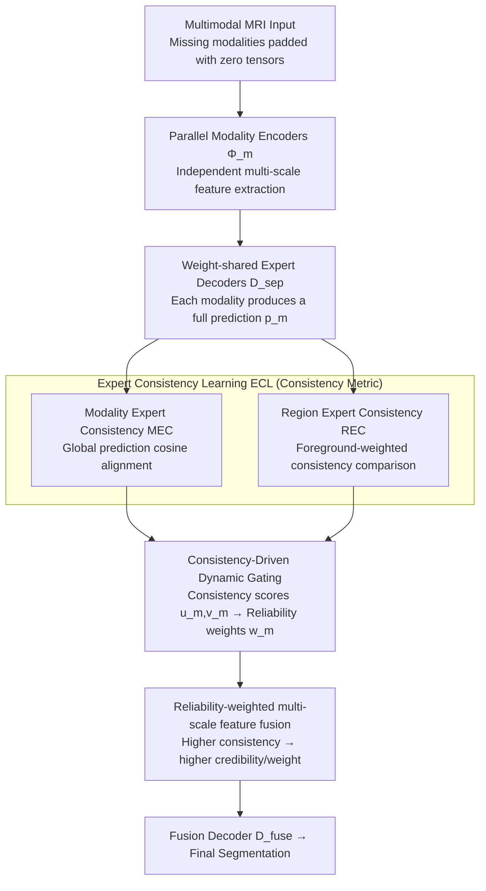

# CLoE: Expert Consistency Learning for Missing Modality Segmentation

**Conference**: CVPR 2026  
**arXiv**: [2603.09316](https://arxiv.org/abs/2603.09316)  
**Code**: None  
**Area**: Medical Images  
**Keywords**: Missing modality, Multimodal segmentation, Consistency learning, Brain tumor segmentation, Reliability gating

## TL;DR

Propose CLoE (Consistency Learning of Experts), which models the missing modality robustness problem as expert consistency control at the decision level. It utilizes dual-branch constraints—Modality Expert Consistency (MEC) and Region Expert Consistency (REC)—to reduce expert drift, and implements reliability-weighted fusion via a consistency-score-driven gating network.

## Background & Motivation

Multimodal MRI segmentation (e.g., brain tumors) frequently faces missing modalities in clinical practice (due to equipment failure, differing scanning protocols, etc.). Limitations of prior work:

- **Generative methods** (GAN-based synthesis of missing modalities): Generation quality is unstable and inevitably introduces artifacts.
- **Fixed-weight fusion/Attention mechanisms** (e.g., SE, CBAM): When missing modalities are padded with zero tensors, attention mechanisms become ineffective—magnitude-based attention cannot produce meaningful weights for zero inputs.
- **Consistency learning** (e.g., Mean Teacher): Suffers from background dominance in volumetric MRI—global consistency can be satisfied without aligning small tumor regions.

**Key Challenge**: Prior work lacks an explicit mechanism to determine "which modality expert should be trusted for the current case and region." Different modalities provide unequal evidence, yet fusion does not differentiate between them.

**Key Insight** of CLoE: **Redefine missing modality robustness as a decision-level consistency problem**—if predictions from different modality experts are consistent, the fusion result is stable; inconsistency indicates that certain experts are unreliable and should be down-weighted.

## Method

### Overall Architecture

CLoE addresses two symptoms of the same issue: when modalities are missing, who fills the gap and why should the remaining experts be trusted. The pipeline is divided into three steps: "independent processing, then aggregation by reliability." Each modality first passes through a parallel modality encoder $\Phi_m$ to extract multi-scale features, which are then fed into a set of weight-shared expert decoders $D^{\text{sep}}$. This allows each modality to **independently** provide a complete segmentation prediction—ensuring that even if a modality is absent, the remaining experts still have individual outputs. Then, the core module appears: instead of comparing feature magnitudes, it horizontally compares whether these expert predictions "agree." Modality Expert Consistency (MEC) and Region Expert Consistency (REC) quantify discrepancies from global and foreground perspectives, respectively. These consistency scores are then converted into reliability weights for each expert by a dynamic gating network. Multi-scale features are fused according to these weights and sent to the fusion decoder $D^{\text{fuse}}$ for the final result. In other words, fusion is no longer blind addition but follows the principle: "the more consistent, the more credible; the more credible, the higher the weight."

### Key Designs

**1. Modality Expert Consistency (MEC): Using inter-expert discrepancy as a handle for robustness**

The danger of missing modalities lies in the fact that if remaining experts provide conflicting predictions, fusion amplifies these discrepancies into errors. MEC transforms this "discrepancy" into an optimizable signal: for all available modality pairs $(a,b)$, it compares the cosine similarity of their prediction maps—the more similar, the better. The loss is defined as:

$$\mathcal{L}_{\text{MEC}} = \frac{1}{|\mathcal{P}|}\sum_{(a,b)\in\mathcal{P}}\bigl(1 - \mathcal{S}(\mathbf{p}^{(a)}, \mathbf{p}^{(b)})\bigr)$$

where $\mathcal{S}$ is cosine similarity and $\mathcal{P}$ is the set of available modality pairs. It constrains the alignment of global prediction distributions, suppressing case-wise expert drift—ensuring experts within the same case do not provide contradictory overall judgments.

**2. Region Expert Consistency (REC): Forcing consistency constraints onto small tumor regions**

Relying solely on global consistency has a hidden risk: background pixels dominate brain MRI. As long as experts agree on large background areas, $\mathcal{L}_{\text{MEC}}$ will be low, while the critical Enhancing Tumor (ET) regions—which are extremely small—hardly contribute to the constraint. This is the "background dominance" issue common to global consistency methods like Mean Teacher in volumetric MRI. REC calculates a learnable foreground region map $r = \sigma\!\bigl(\pi(\tfrac{1}{|\mathcal{A}|}\sum_{m\in\mathcal{A}}f_1^{(m)})\bigr)$ from the shallow features of available modalities. It then weights the predictions $\mathbf{p}_r$ before comparing consistency:

$$\mathcal{L}_{\text{REC}} = \frac{1}{|\mathcal{P}|}\sum_{(a,b)\in\mathcal{P}}\bigl(1 - \mathcal{S}(\mathbf{p}_r^{(a)}, \mathbf{p}_r^{(b)})\bigr)$$

This explicitly mandates that "experts must agree on the foreground." Removing REC in ablations leads to a 3.41% drop in ET, proving it is essential for aligning small targets.

**3. Consistency-Driven Dynamic Gating: Using consistency metrics directly as fusion weights**

The previous designs produce the degree of agreement between experts; this step translates that into "who to trust." For each modality $m$, its global consistency $u_m$ and regional consistency $v_m$ with other experts are aggregated and fed into a lightweight gating network $\mathcal{G}$. Softmax normalization yields reliability weights $w_m = \text{softmax}(\mathcal{G}(u_m, v_m))$, which are used to fuse multi-scale features: $f_\ell = \sum_m w_m \odot f_\ell^{(m)}$. The benefit is natural handling of missing data: absent modalities have no comparison targets and zero consistency, thus the gating automatically suppresses their weights to 0 without extra detection logic. Intuitively, if only T1 and FLAIR remain and agree on the tumor region, the gating assigns high weights. If an outlier expert is added, its low consistency with others results in a lower $w_m$, weakening its contribution. This "inconsistency implies untrustworthiness" chain is more logical than magnitude-based attention (SE/CBAM), which fails to calculate meaningful weights for zero-padded inputs.

### Loss & Training

The total loss is the sum of three terms:

$$\mathcal{L}_{\text{total}} = \mathcal{L}_{\text{seg}} + \alpha \mathcal{L}_{\text{ECL}} + \beta \mathcal{L}_{\text{contrast}}$$

- $\mathcal{L}_{\text{seg}}$: Segmentation loss for fused features (WCE + Dice).
- $\mathcal{L}_{\text{ECL}}$: Independent supervision for each expert + $\eta(\mathcal{L}_{\text{MEC}} + \lambda_{\text{rec}}\mathcal{L}_{\text{REC}})$.
- $\mathcal{L}_{\text{contrast}}$: Contrastive representation learning loss (SSIM for content alignment + Cosine for style alignment + KL regularization).

Training: Adam, lr=0.0002, weight decay=0.0001, 500 epochs, batch size=1. Modalities are randomly dropped during training to simulate missing data.

## Key Experimental Results

### Main Results

**BraTS 2020 (15 missing modality combinations, Average Dice %)**

| Region | Metric | CLoE | DC-Seg | M³AE | Gain (vs DC-Seg) |
| :--- | :--- | :--- | :--- | :--- | :--- |
| WT | Avg Dice | **88.09** | 87.54 | 86.90 | +0.55 |
| TC | Avg Dice | **80.23** | 79.63 | 79.10 | +0.60 |
| ET | Avg Dice | **65.06** | 65.00 | 61.70 | +0.06 |

**MSD Prostate PZ (3 modality combinations)**

| Setting | CLoE | DC-Seg | RFNet |
| :--- | :--- | :--- | :--- |
| T2 | **80.33** | 79.21 | 75.18 |
| ADC | **77.12** | 75.89 | 72.07 |
| T2&ADC | **82.91** | 81.67 | 78.00 |
| Average | **80.12** | 79.59 | 77.35 |

### Ablation Study

| Configuration | WT Dice | TC Dice | ET Dice | Description |
| :--- | :--- | :--- | :--- | :--- |
| w/o MEC | 87.75 | 80.01 | 63.50 | Moderate contribution of global consistency |
| w/o REC | 86.40 | 79.39 | 61.65 | ET drops by 3.41%; regional consistency is key |
| w/o Gating | 87.99 | 80.08 | 63.90 | Gating provides fine-tuning |
| w/o Weight Fusion | 86.52 | 78.33 | 61.10 | ET drops by 3.96%; fusion is most critical |
| **CLoE (full)** | **88.09** | **80.23** | **65.06** | — |

### Key Findings

- REC and Weight Fusion are the two most critical components; removing either leads to a significant drop in ET (the most difficult small region).
- Removing MEC alone has a smaller impact, suggesting that global consistency constraints are less precise than regional ones.
- A single model can handle all 15 missing modality combinations without needing separate training for each set.

## Highlights & Insights

- Reformulates missing modality robustness as a consistency control problem, which is conceptually clear and actionable.
- The foreground-weighting strategy in REC effectively solves background dominance, significantly improving small target segmentation (ET).
- The "Consistency → Reliability → Fusion Weight" chain is logically sound, and the lightweight gating network adds no significant inference overhead.
- Cross-dataset generalization: Proves effective from BraTS (4 modalities) to MSD Prostate (2 modalities).

## Limitations & Future Work

- Average Dice for ET is still only 65%, indicating that small target segmentation under missing modalities remains an open problem.
- The gating network input consists of only two scalars ($u_m, v_m$), which may provide limited information; richer features could be considered.
- Validation is limited to BraTS and Prostate datasets; other organ/modality combinations are not covered.
- Despite the reliance of MedSAM on bounding boxes, no complete comparison with SAM-based methods was conducted.

## Related Work & Insights

- Complementary to DC-Seg (latent disentanglement): CLoE emphasizes decision-level consistency, while DC-Seg focuses on representation-level decoupling; they target different levels.
- The consistency learning approach (Mean Teacher), successful in semi-supervised learning, is adapted here for missing modalities while solving background dominance.
- General insight for multimodal fusion: Assessing the reliability of each modality before fusion is more rational than blind attention weighting.

## Rating

- **Novelty**: ⭐⭐⭐⭐ The formulation of Consistency → Reliability is novel; REC solves a real-world problem.
- **Experimental Thoroughness**: ⭐⭐⭐ BraTS + Prostate are sufficient but the number of datasets is small.
- **Writing Quality**: ⭐⭐⭐⭐ Method motivation is well-explained; ablations are logically designed.
- **Value**: ⭐⭐⭐⭐ Missing modalities represent a critical clinical need; the method is practical and conceptually clear.

<!-- RELATED:START -->

## Related Papers

- [\[CVPR 2026\] Virtual Nodes Guided Dynamic Graph Neural Network for Brain Tumor Segmentation with Missing Modalities](virtual_nodes_guided_dynamic_graph_neural_network_for_brain_tumor_segmentation_w.md)
- [\[CVPR 2026\] Uni-Encoder Meets Multi-Encoders: Representation Before Fusion for Brain Tumor Segmentation with Missing Modalities](uni-encoder_meets_multi-encoders_representation_before_fusion_for_brain_tumor_se.md)
- [\[CVPR 2026\] MUST: Modality-Specific Representation-Aware Transformer for Diffusion-Enhanced Survival Prediction with Missing Modality](must_modality-specific_representation-aware_transformer_for_diffusion-enhanced_s.md)
- [\[CVPR 2026\] SemiGDA: Generative Dual-distribution Alignment for Semi-Supervised Medical Image Segmentation](semigda_generative_dual-distribution_alignment_for_semi-supervised_medical_image.md)
- [\[CVPR 2026\] PGR-Net: Prior-Guided ROI Reasoning Network for Brain Tumor MRI Segmentation](pgr-net_prior-guided_roi_reasoning_network_for_brain_tumor_mri_segmentation.md)

<!-- RELATED:END -->
