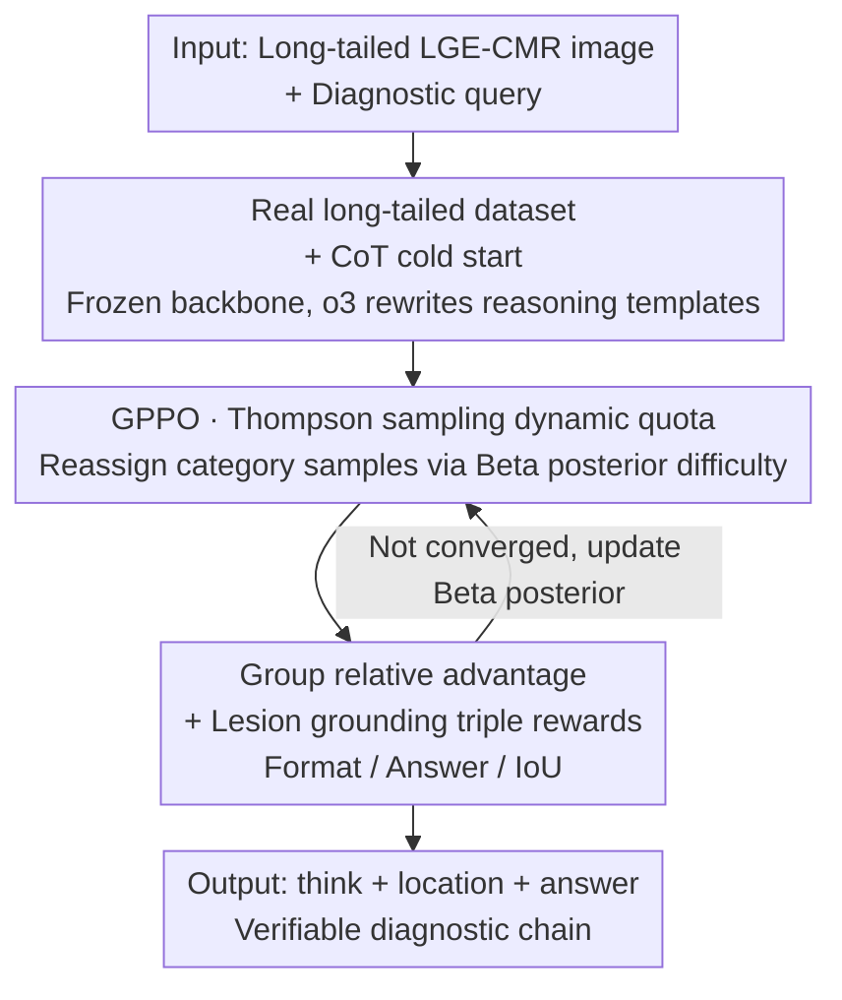

# CMR-RD: Long-Tailed Adaptive VLM for Explainable CMR Diagnosis

**Conference**: CVPR 2026  
**Paper**: [CVF Open Access](https://openaccess.thecvf.com/content/CVPR2026/html/Li_CMR-RD_Long-Tailed_Adaptive_VLM_for_Explainable_CMR_Diagnosis_CVPR_2026_paper.html)  
**Code**: None  
**Area**: Medical Imaging  
**Keywords**: CMR Diagnosis / Long-tailed VLM / Reinforcement Learning Post-training / Thompson Sampling / Lesion Grounding  

## TL;DR
CMR-RD is the first vision-language model for explainable cardiac magnetic resonance (CMR) diagnosis. It establishes a foundation through "medical alignment + Chain-of-Thought (CoT) cold start," then actively strengthens rare disease categories using GPPO—a multi-phase reinforcement learning algorithm with Thompson sampling for dynamic quota allocation. By incorporating lesion IoU grounding into the reward function, it achieves the highest accuracy and the most reliable reasoning chains across six types of heart disease.

## Background & Motivation
**Background**: Cardiac magnetic resonance is the clinical gold standard for cardiovascular disease assessment, but interpretation relies heavily on expert experience. Recently, general VLMs (Qwen2.5-VL, InternVL3) and medical VLMs (LLaVA-Med, MedGemma, HuatuoGPT-Vision) have been applied to medical VQA and report generation. Some works (MedVLM-R1, PathVLM-R1) also introduce CoT and RL post-training to enhance professional performance.

**Limitations of Prior Work**: Direct application of these models to CMR diagnosis faces two specific gaps. First, **reasoning opacity**—most models stop at answer-level supervision and fail to provide explicit, verifiable chains of "observed lesion → location → differential diagnosis," hindering clinical auditing. Second, **poor rare disease recognition**—medical data is naturally long-tailed, while mainstream RL post-training (such as GRPO) is dominated by majority classes in sampling and value estimation. This leads to high variance in advantage/value estimation for rare classes and diluted gradient contributions, biasing the model toward common diseases.

**Key Challenge**: The conflict between long-tail distribution and the "dynamics" of RL post-training. Static methods like category-balanced sampling, loss re-weighting, or feature compensation do not adapt to training stages. Since the model's mastery of different categories varies between early and late training, fixed weights either over-compensate for rare classes at the expense of overall performance or provide insufficient compensation, making it difficult to achieve simultaneous optimality across all categories.

**Goal**: To create a specialized CMR VLM that outputs explicit diagnostic chains aligned with imaging evidence and accurately diagnoses rare high-risk diseases (e.g., Cardiac Amyloidosis (CAM), Left Ventricular Non-Compaction (LVNC)) under long-tailed distributions.

**Key Insight**: The authors explicitly model the decision of "how many training samples to allocate to each category" as a **Bayesian decision process with uncertainty**. By dynamically allocating sampling quotas for each phase based on the current accuracy (and posterior uncertainty) of the model in each category, the model is encouraged to "actively explore" the categories it has not yet mastered.

**Core Idea**: Replace static long-tail strategies with "phased online RL + Thompson sampling dynamic quotas" and directly incorporate lesion localization IoU into the rewards, shifting the model from "guessing diseases from the whole image" to "explainable decision-making based on evidence grounding."

## Method

### Overall Architecture
CMR-RD uses Gemma-4B as the backbone and follows a two-stage training process: **Stage 1 involves medical alignment + CoT cold start**, enabling the general VLM to "understand" CMR terminology and reason step-by-step like a physician. **Stage 2 focuses on reasoning enhancement** using the proposed GPPO (Group-Phased Policy Optimization), which decomposes RL into multi-phase online updates. At the start of each phase, Thompson sampling reallocates quotas according to "difficulty," followed by strategy optimization using group relative advantage and triple rewards (format/answer/IoU) to specifically strengthen rare and underperforming categories. Inputs consist of Late Gadolinium Enhancement (LGE) CMR images and diagnostic queries; outputs are three-part verifiable diagnostic chains: `<think>reasoning</think><location>lesion box</location><answer>disease name</answer>`.

### Key Designs

**1. Real Clinical Long-Tailed Dataset + Diagnostic CoT Cold Start: Teaching the VLM to "Understand CMR and Think"**

To address the gap in reasoning transparency and CMR priors, Stage 1 uses a two-step foundation. First, **medical alignment**: cross-modal alignment is performed using the open-source medical corpus PMC-VQA (227k Q&A, 149k images) plus 7k CMR image-text pairs to inject imaging terminology and professional knowledge. To save costs and preserve base capabilities, **both the vision tower and LLM are frozen, with only the projector mapping visual features to language space being fine-tuned**. Second, **cold start**: cardiac radiologists selected representative cases from routine LGE-CMR reports and used OpenAI o3 to rewrite raw reports into reasoning templates matching clinical workflows (lesion observation → localization description → differential diagnosis). These templates served as cold-start data after clinical quality control, at which point the projector and LLM were unfrozen for training. The value of this step is that it teaches the model the "way a doctor thinks" rather than just providing answers, providing a starting point for Stage 2 RL. Ablations show that with only Stage 1, ACC is just 0.261, but it serves as the essential foundation for subsequent RL gains.

**2. GPPO: Thompson Sampling-Driven Multi-Phase Dynamic Quotas to Actively Support Rare Classes**

This is the core of the paper, directly addressing the conflict where long-tail distributions bias RL toward majority classes. GPPO splits RL into online multi-phase updates. Before each phase begins, **Thompson sampling** is used to redistribute sample quotas. Specifically, the true accuracy $\theta_c$ for each category $c$ is treated as a hidden variable with a Beta prior $\theta_c \sim \text{Beta}(\alpha_{c,0},\beta_{c,0})$ (initially $\alpha_{c,0}=\beta_{c,0}=1$). After round $t$, success/failure counts $n^+_{c,t}, n^-_{c,t}$ for that category are calculated on an independent test set to update the posterior:

$$\alpha_{c,t}=\alpha_{c,0}+\sum_{s=1}^{t} n^+_{c,s},\qquad \beta_{c,t}=\beta_{c,0}+\sum_{s=1}^{t} n^-_{c,s}.$$

Before the next round, $\tilde\theta_{c,t}\sim\text{Beta}(\alpha_{c,t},\beta_{c,t})$ is sampled independently for each class. The **difficulty weight** is defined as $w_{c,t}=1-\tilde\theta_{c,t}$—a high weight indicates either low accuracy or high posterior uncertainty, both justifying more sampling. For a batch size $B$, the quota for category $c$ is assigned by normalized difficulty $q_{c,t}=\lfloor \frac{w_{c,t}}{\sum_{c'} w_{c',t}} B \rfloor$. This is combined with a "**bucket-refill**" strategy: if the remaining pool $|P_{c,t}|<\tau$, the category is treated as a minority class and sampled with replacement to avoid depletion; otherwise, it is sampled without replacement. This dynamically links the "sampling strategy" to the "current model capability"—Thompson sampling naturally balances "exploitation (sampling known weak classes)" and "exploration (sampling classes with uncertain posteriors)," which is better suited for evolving RL training than static methods.

**3. Group Relative Advantage + Lesion Grounding Triple Rewards: Anchoring Accuracy to Evidence**

To combat VLM hallucinations and misalignment between text and lesion locations, triple rewards are used for RL. **Format Reward**: Requires the output to strictly match the `<think>…</think><location>[x1,y1,x2,y2]</location><answer>…</answer>` template (reward 1.5 if matched, 0 otherwise). **Answer Reward**: If the format is correct, `<answer>` is compared with the ground truth (reward 2.0 if correct). The authors intentionally prompt the model for the **disease name** rather than A/B/C/D options, as the semantic information of the labels aids training. **IoU Reward**: Encourages spatial consistency via $\text{IoU}=\frac{|B_1\cap B_2|}{|B_1\cup B_2|}$. However, because IoU is zero for most steps, its sparsity can slow convergence. A sparse-dense hybrid reward is created via linear transformation with threshold $\tau$:

$$r_{\text{IoU}}=\begin{cases}0,& \text{IoU}<\tau,\\[2pt]\dfrac{\text{IoU}-\tau}{1-\tau},&\text{otherwise.}\end{cases}$$

Optimization follows the GRPO mindset without a separate value network: a group of outputs $g\in G$ is sampled for each input (each category forms a group), using the group mean $\bar R_g=\frac{1}{|g|}\sum_{j\in g} R_j$ as a baseline for the group relative advantage $A^{GR}_i=R_i-\bar R_{g(i)}$. This eliminates systemic bias and suppresses the high reward variance common in medical VLMs. The final objective adds KL penalty and entropy reward to a PPO-style clipped surrogate:

$$J(\theta)=L^{\text{GRPO}}_{\text{clip}}(\theta)+\beta_{\text{KL}}\,\text{KL}(\pi_{\theta_{\text{old}}}\Vert\pi_\theta)-\beta_{\text{ent}}\,H(\pi_\theta).$$

### Loss & Training
Backbone: Gemma-4B; RL framework: Verl. GPPO is divided into 5 sub-phases, each with 2 epochs and decaying learning rates. Images are resized to $256\times256$. Training used 4x A800 GPUs with a per-card batch size of 2 and 4 candidate reasoning paths per sample. Results are averaged over 3 independent runs.

## Key Experimental Results

Dataset CMR-VQA: 411 high-quality cold-start samples + training data for five heart diseases (HCM 6,645, DCM 3,192, MI 2,833, LVNC 465, NOR 488, CAM 146—highlighting the long-tail nature of CAM/LVNC). 30 cases per class were used for an independent test set, with MI featuring expert-level lesion box annotations. Metrics: ACC / AUC / F1.

### Main Results: Category-wise Comparison (Partial ACC, Table 1)
| Model | HCM | DCM | CAM (Rare) | LVNC (Rare) | MI | NOR |
|------|-----|-----|-----------|------------|-----|-----|
| Qwen2.5-3B | 0.261 | 0.178 | 0.033 | 0.000 | 0.586 | 0.035 |
| MedGemma-4B | 0.076 | 0.261 | 0.192 | 0.000 | 0.269 | 0.524 |
| HuatuoGPT-7B | 0.300 | 0.079 | 0.555 | 0.000 | 0.214 | 0.125 |
| Seed1.5-VL | 0.000 | 0.211 | 0.800 | 0.000 | 0.312 | 0.400 |
| **Ours** | **0.641** | **0.622** | 0.574 | **0.582** | 0.611 | **0.633** |

Key finding: Baselines largely failed on the two rare categories—**all comparison models reached 0.000 ACC on LVNC**, while CMR-RD achieved 0.582. While Seed1.5-VL reached 0.800 on CAM due to chance, its performance collapsed to 0 on HCM/LVNC, whereas CMR-RD remained balanced and achieved the highest overall AUC/F1.

### Ablation Study (Table 5, Two Stages)
| Configuration | ACC | F1 | AUC | Note |
|------|-----|-----|-----|------|
| W/o S1 & S2 | 0.212 | 0.244 | 0.494 | General VLM baseline |
| S1 only | 0.261 | 0.288 | 0.521 | Alignment + Cold start only |
| S2 only | 0.493 | 0.512 | 0.683 | GPPO only |
| **S1 + S2** | **0.610** | **0.639** | **0.703** | Full model |

### Key Findings
- **GPPO (Stage 2) is the primary driver of improvement**: S2 alone increased ACC from 0.212 to 0.493, far exceeding the 0.261 from S1 alone. However, the S1 foundation is essential; the combination reached 0.610, suggesting RL performs best starting from a baseline of "basic reasoning."
- **Long-tail gains are concentrated at the tail**: Visualizations (Fig.5) show that under full-batch training, LVNC/CAM quickly hit performance ceilings. With Thompson Sampling (TS), their frequency in each mini-batch increased significantly, allowing the model to establish clearer decision boundaries.
- **IoU Reward reduces hallucinations**: Adding IoU constraints prevents the model from mislabeling the posterior wall as an enhancement zone and improves localization and clinical explainability (Table 4). 
- **Reasoning quality endorsed by experts**: In double-blind evaluations with GPT-4o and radiologists (Fig.3), CMR-RD outperformed other VLMs in reasoning accuracy, coherence, and readability.

## Highlights & Insights
- **Modeling "sampling quotas" as Bayesian decisions** is ingenious. Using Beta posteriors to capture both "low accuracy" and "high uncertainty" into a single difficulty weight $w=1-\tilde\theta$ unifies exploration and exploitation in a way that is more suitable for RL evolution than static weighting.
- **Sparse-dense hybrid IoU rewards** address the engineering hurdle of sparse signals slowing convergence. This approach can be reused in any task using sparse spatial metrics as RL rewards.
- **Prompting for disease names rather than ABCD options** is a counter-intuitive but effective detail. The semantic information of the labels themselves aids learning, suggesting that output space design affects convergence in medical RL.

## Limitations & Future Work
- **Localization ceiling**: The authors acknowledge that VLMs are not naturally suited for precise localization; even with IoU optimization, predicted boxes tend to be too large.
- **Small data scale and single-center risk**: The test set has only 30 cases per class, and CAM training relies on only 146 samples. The statistical robustness of the tail findings needs validation with larger samples ⚠️; cross-center generalization remains untested.
- **Heavy reliance on o3 and experts**: Generating cold-start templates via OpenAI o3 and clinical quality control poses reproduction and cost challenges.
- **Future Directions**: The authors aim to expand the VLM into a medical agent with external tools and extend the TS quota mechanism to more disease categories and longer-tail scenarios.

## Related Work & Insights
- **vs. GRPO / MedVLM-R1**: These RL post-training methods are dominated by majority classes and suffer from sparse rewards for rare classes. CMR-RD uses GPPO to decompose RL into phases and uses TS for dynamic reapportionment—essentially adding a long-tail adaptive wrapper to GRPO.
- **vs. Static Long-Tail Methods**: Static strategies do not adjust as training progresses. CMR-RD's TS quotas update online, and Table 2 proves that dynamic sampling consistently outperforms static balancing for rare categories.
- **vs. General/Medical VLMs**: Other models lack CMR-specific alignment and verifiable reasoning. CMR-RD uses medical alignment and CoT cold start for domain priors and anchors descriptions to lesions through IoU grounding.

## Rating
- Novelty: ⭐⭐⭐⭐ First VLM for explainable CMR diagnosis; the combination of TS dynamic quotas and lesion grounding is novel, though the GRPO framework is established.
- Experimental Thoroughness: ⭐⭐⭐ Detailed category comparisons and ablation studies, but limited by small test sets (30/class) and single-center data.
- Writing Quality: ⭐⭐⭐⭐ Clear logic from motivation to experiment; GPPO formulas and reward designs are well-explained.
- Value: ⭐⭐⭐⭐ Addresses high-clinical-value rare disease diagnosis in CMR; explainable diagnostic chains have practical clinical significance.

<!-- RELATED:START -->

## Related Papers

- [\[CVPR 2026\] Clinically-Grounded Counterfactual Reasoning for Medical Video Diagnosis](clinically-grounded_counterfactual_reasoning_for_medical_video_diagnosis.md)
- [\[ICCV 2025\] GEMeX: A Large-Scale, Groundable, and Explainable Medical VQA Benchmark for Chest X-ray Diagnosis](../../ICCV2025/medical_imaging/gemex_a_large-scale_groundable_and_explainable_medical_vqa_benchmark_for_chest_x.md)
- [\[CVPR 2026\] MedTVT-R1: A Multimodal LLM Empowering Medical Reasoning and Diagnosis](medtvt-r1_a_multimodal_llm_empowering_medical_reasoning_and_diagnosis.md)
- [\[CVPR 2026\] EMAD: Evidence-Centric Grounded Multimodal Diagnosis for Alzheimer's Disease](emad_evidence-centric_grounded_multimodal_diagnosis_for_alzheimers_disease.md)
- [\[CVPR 2026\] X-PCR: A Benchmark for Cross-modality Progressive Clinical Reasoning in Ophthalmic Diagnosis](x-pcr_a_benchmark_for_cross-modality_progressive_clinical_reasoning_in_ophthalmi.md)

<!-- RELATED:END -->
