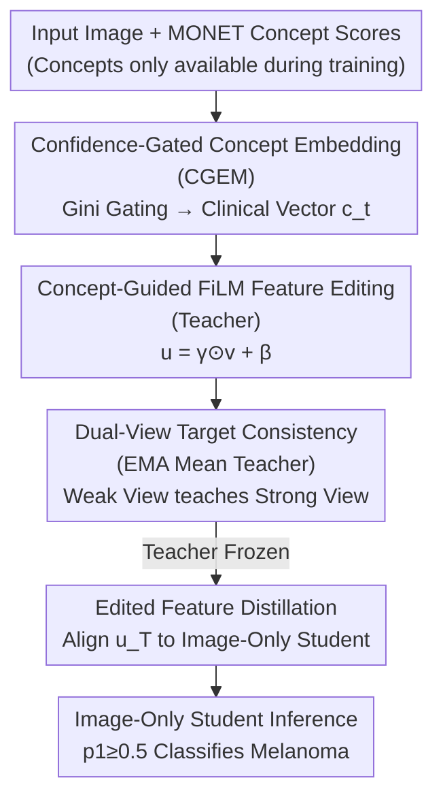

# CoFiDA-M: Concept-Aware Feature Modulation for Cross-Domain Adaptation with Image-Only Inference

**Conference**: CVPR 2026  
**arXiv**: [2605.31591](https://arxiv.org/abs/2605.31591)  
**Code**: Yes (Implementation code available at GitHub, ⚠️ Refer to the original paper for the specific repository)  
**Area**: Medical Imaging / Domain Adaptation / Knowledge Distillation  
**Keywords**: Skin Cancer Screening, Privileged Information, FiLM Feature Modulation, Concept Guidance, Teacher-Student Distillation

## TL;DR
To address the domain shift between "expert dermoscopic images" and "handheld clinical images," CoFiDA-M uses MONET clinical concept scores (privileged information) to guide FiLM-based visual feature editing during **training**, creating a "clinically reasoning" teacher. The teacher's **edited features** are then distilled into an **image-only** student. This allows the student to maintain high AUROC and melanoma recall across six unseen datasets without relying on any concept metadata during deployment.

## Background & Motivation

**Background**: AI-based skin cancer screening models are typically trained on dermoscopic (specialized equipment, close-up, clear texture) images. Mainstream cross-domain approaches use Unsupervised Domain Adaptation (UDA)—aligning feature distributions of source and target domains via adversarial training (DANN) or statistical moment matching (CORAL, MMD) to learn a unified feature space.

**Limitations of Prior Work**: Model performance drops significantly when deployed on consumer-grade clinical images (mobile phones, messy lighting, hairs/rulers/shadows). Simply retraining with more clinical images is insufficient as every new camera, lighting condition, or population constitutes a new domain where models fail on unseen distributions. Crucially, global distribution alignment **ignores semantic invariants**: high-level clinical concepts like "ulceration" or "pigment network" remain consistent across both dermoscopic and clinical images. Models that only align global statistics are neither robust nor interpretable.

**Key Challenge (Deployment Paradox)**: The new foundation model MONET can provide dense, probabilistic clinical concept scores (e.g., ulceration=0.83) for every image. This is a much richer supervisory signal than a simple text prompt. However, **this metadata is unavailable at test time**—patients cannot provide expert-level concept labels during self-screening. This creates a mismatch between privileged information available during training and the image-only requirements during inference.

**Goal**: ① Utilize technical "noisy, probabilistic" metadata like MONET concepts during training to guide cross-domain semantic alignment; ② Ensure the final deployed model is image-only and does not depend on concept inputs.

**Key Insight & Core Idea**: This problem is framed within the **Privileged Information (PI)** framework—auxiliary data visible during training but invisible during inference. Existing PI solutions like DALUPI use two-stage "hallucination" pipelines (learning to reconstruct PI before predicting). Instead, the authors propose a more direct **Teacher-Student** approach: the teacher uses MONET probabilities via FiLM to directly modulate ("edit") the visual feature space, and the student learns to replicate the teacher's **entire edited feature representation** (not just the final prediction), effectively baking "clinical reasoning" into the student's weights.

## Method

### Overall Architecture
CoFiDA-M is a three-stage pipeline: **Phase 1: Concept-Aware Teacher Training** → **Phase 2: Distilling Teacher into Image-Only Student** → **Phase 3: Image-Only Student Inference**. The backbone is EfficientNet-B2 (outputting $d=1408$ dimensional features $\mathbf{v}=f_\theta(x)$ from the penultimate layer).

The teacher branch first compresses MONET concept probabilities $s_a$ into a 256-dimensional clinical conditional vector $\mathbf{c}_t$ via "Confidence-Gated Concept Embedding" (CGEM). This vector generates affine parameters through FiLM to scale and shift the image features $\mathbf{v}$, resulting in "clinically edited" features $\mathbf{u}=\boldsymbol{\gamma}\odot\mathbf{v}+\boldsymbol{\beta}$ for final classification. The teacher is jointly trained on **labeled source data** (Focal Loss + Editing Regularization) and **unlabeled target data** (EMA Mean Teacher + Weak/Strong dual-view consistency). Once trained, the teacher is frozen. The student shares the same backbone and classification head but replaces FiLM with a residual editing head $\boldsymbol{\psi}_{\mathrm{edit}}$ that predicts edits **from images alone**. Distillation aligns the student's logits and features with the teacher's edited representation $\mathbf{u}_T$. During inference, only the image-only student is deployed.

### Key Designs

**1. Confidence-Gated MONET Concept Embedding (CGEM): Preventing "Ambiguous" Concepts from Interfering**

MONET provides clinical concepts as noisy probabilities. Directly feeding scalar $s_a$ into the network loses information about the "absence" of a concept and treats $s_a\approx0.5$ (where the model is uncertain) as a certain signal. The authors expand each concept into a dual-state probability vector $\mathbf{q}_a=[\,1-s_a,\ s_a\,]^\top$ and construct a confidence gate $g_a=s_a^2+(1-s_a)^2$ using Gini impurity. Gating values $g_a$ are high when $s_a$ is near 0 or 1 (certain) and low when near 0.5 (uncertain). Each concept uses a learnable embedding table $\mathbf{E}_a\in\mathbb{R}^{2\times32}$. The vectors are projected by $\mathbf{q}_a$, multiplied by $g_a$, and concatenated through a two-layer MLP to obtain:
$$\mathbf{c}_t=\mathrm{MLP}\!\big(\mathrm{concat}_a\{\,g_a(\mathbf{E}_a^\top\mathbf{q}_a)\,\}\big)\in\mathbb{R}^{256}.$$
Uncertain concepts are automatically attenuated. Ablation shows that removing this gating causes melanoma recall to crash from 86.36 to 43.20 (clinical domain), proving that filtering noisy scores is vital.

**2. Concept-Guided FiLM Feature Editing (Teacher): "Rewriting" Rather Than "Concatenating" Features**

To ensure external clinical concepts influence internal representations without altering backbone weights, the authors use FiLM (Feature-wise Linear Modulation). A conditioning function $\boldsymbol{\psi}:\mathbb{R}^{256}\!\to\!\mathbb{R}^{2d}$ predicts $\boldsymbol{\gamma},\boldsymbol{\beta}=\mathrm{split}(\boldsymbol{\psi}(\mathbf{c}_t))$ to perform channel-wise editing: $\mathbf{u}=\boldsymbol{\gamma}\odot\mathbf{v}+\boldsymbol{\beta}$. The edit vector is $\mathbf{e}=\mathbf{u}-\mathbf{v}$. To prevent FiLM from "cheating" by merely amplifying discriminative directions, two regularizations are added: orthogonality constraint $\mathcal{L}_\perp=\mathrm{MSE}((\mathbf{e}\mathbf{W}_{\mathrm{cls}}^\top)\mathbf{W}_{\mathrm{cls}},\mathbf{0})$ to penalize edits aligned with the classifier's decision direction, and a soft-norm constraint $\mathcal{L}_{\mathrm{norm}}=\max(0,\|\mathbf{e}\|_2-R_{\max})$ ($R_{\max}=2.0$) to keep edits small and controlled. Replacing FiLM with simple concatenation drops clinical recall from 86.36 to 73.86.

**3. Dual-View Target Consistency (EMA Mean Teacher): Stabilizing Adaptation on Unlabeled Clinical Images**

Since the target domain lacks labels, the model relies on weak/strong augmentation of target images. An EMA teacher (exponential moving average of online parameters, $\alpha_{\mathrm{ema}}=0.999$) processes weak views to provide stable pseudo-labels. Consistency is enforced across three levels: Symmetric KL for logits ($\tau=0.6$ sharpening), MSE for edited features $\mathbf{u}$, and MSE for edit vectors $\mathbf{e}$. A dynamic confidence threshold starting at $t(0)=0.95$ and decaying to 0.70 is used to filter early pseudo-label noise.

**4. Distilling Edited Features to Image-Only Student: Baking "Reasoning" into Weights**

This solves the deployment paradox. Once the teacher is frozen, the student shares the same backbone but replaces the FiLM module with an image-only residual editing head: $\mathbf{u}_S=\mathbf{v}_S+\boldsymbol{\psi}_{\mathrm{edit}}(\mathbf{v}_S)$. The distillation loss aligns temperature-softened ($\tau=2.0$) logits via KL and matches the **edited features**:
$$\mathcal{L}_{\mathrm{distill}}=\mathrm{KL}(p_S\|p_T)\,\tau^2+\lambda_{\mathrm{feat}}\,\mathrm{MSE}(\mathbf{u}_S,\mathbf{u}_T),\quad\lambda_{\mathrm{feat}}=0.1.$$
The student learns "how to reason" by mimicking the feature representation *after* clinical adjustment, rather than just "what to answer." Ablation confirms that distilling only logits is insufficient (Clinical AUROC 64.10) compared to aligning the edited features $\mathbf{u}_T$ (67.50).

### Loss & Training
- Teacher Total Loss: $\mathcal{L}_{\mathrm{teacher}}=\mathcal{L}_{\mathrm{source}}+\mathcal{L}_{\mathrm{target}}$.
- Source Domain: $\mathcal{L}_{\mathrm{source}}=\mathcal{L}_{\mathrm{sup}}+\lambda_\perp\mathcal{L}_\perp+\lambda_{\mathrm{norm}}\mathcal{L}_{\mathrm{norm}}$. $\mathcal{L}_{\mathrm{sup}}$ is Focal Loss ($\gamma_f=1.5$, class weights $\alpha_1=0.9$ to handle imbalance). $\lambda_\perp=\lambda_{\mathrm{norm}}=0.01$.
- Target Domain: $\mathcal{L}_{\mathrm{target}}=w_{\mathrm{kl}}\mathcal{L}_{\mathrm{KL}}+w_{\mathrm{feat}}\mathcal{L}_{\mathrm{feat}}+w_{\mathrm{edit}}\mathcal{L}_{\mathrm{edit}}$ ($w_{\mathrm{kl}}=0.6, w_{\mathrm{feat}}=w_{\mathrm{edit}}=0.1$).
- Training: EfficientNet-B2, AdamW (lr $3\times10^{-4}$), batch size 32, cosine annealing to $10^{-6}$, max 50 epochs with early stopping.

## Key Experimental Results

**Protocol**: Training is conducted only on a single source-target pair (MILK Dermoscopic → MILK Clinical). The frozen image-only student is then evaluated **directly** on 6 unseen external datasets (out-of-domain). Metrics include AUROC and Melanoma Recall (Sensitivity).

### Main Results

Macro-average AUROC / Recall (%, mean of 5 seeds) against 14 baselines:

| Metric (Domain Avg) | Source-Only | TENT | DALUPI(PI) | MeanTeacher | **CoFiDA-M** | Gain vs Source |
|--------|------|------|------|------|------|------|
| AUROC Clinical | 58.39 | 62.32 | 54.54 | 48.91 | **67.50** | +9.11 |
| AUROC Dermoscopic | 69.96 | 69.70 | 76.07 | 55.97 | **76.50** | +6.54 |
| Recall Clinical | 55.77 | 55.65 | 9.72 | 77.67 | **77.89** | +22.12 |
| Recall Dermoscopic | 63.55 | 65.74 | 40.11 | 64.02 | **84.92** | +21.37 |

CoFiDA-M significantly outperforms TENT (top TTA baseline) and DALUPI (PI baseline) in clinical AUROC. While Mean Teacher shows high recall (77.67%), its AUROC is near random (48.91), indicating it sacrifices precision for recall. CoFiDA-M improves both AUROC and recall simultaneously.

### Ablation Study

| Sec | Configuration | AUROC_d | AUROC_c | Recall_d | Recall_c | Description |
|----|------|------|------|------|------|------|
| A | Source-Only | 69.96 | 58.39 | 63.55 | 55.77 | Baseline |
| A | Standard UDA (No MONET) | 76.07 | 62.32 | 69.50 | 77.67 | Unlabeled only |
| A | **Ours Student (Image-Only)** | 76.50 | 67.50 | 84.92 | 77.89 | Full Method |
| B | Full Teacher | 85.35 | 83.81 | 87.81 | 86.36 | Upper bound |
| B | w/o Confidence Gating | 78.32 | 75.24 | 47.70 | 43.20 | Recall crash |
| B | w/o FiLM (concat instead) | 84.18 | 81.51 | 80.68 | 73.86 | Edit > Concat |
| C | Logit KD Only | 63.80 | 64.10 | 72.49 | 64.53 | Insufficient |
| C | + Align v_T (pre-edit) | 70.68 | 66.45 | 79.12 | 75.74 | Improvement |
| C | + Align u_T (post-edit) | 76.50 | 67.50 | 84.92 | 77.89 | Best |

### Key Findings
- **Confidence gating is critical**: Removing it causes a recall crash (86.36 to 43.20), proving it is a prerequisite for using noisy PI.
- **Post-edit feature alignment is essential**: Aligning $\mathbf{u}_T$ (67.50 AUROC) outperforms aligning $\mathbf{v}_T$ (66.45), validating the hypothesis that students should mimic the concept-adjusted representation.
- **Gains stem from semantic editing, not the distillation pipeline**: A sanity check with random-weight (RT) or zero-weight (ZT) teachers yields random-level performance (FT ≫ RT ≈ ZT).
- **Implicit concept learning**: The student's self-generated edit magnitude $\|\mathbf{u}_S-\mathbf{v}_S\|_2$ strongly correlates with MONET concept ground truths (Fig.5a).

## Highlights & Insights
- **Distilling the "Inference Process" over "Conclusions"**: By treating FiLM edits as a distillable intermediate representation, the student learns *why* the teacher makes a decision, not just *what* the decision is. This paradigm is transferable to any scenario where a modulation module uses privileged info during training.
- **Gini Confidence Gating**: Using $s^2+(1-s)^2$ is a near-zero-cost way to handle noisy probabilistic metadata.
- **Orthogonality and Soft-Norm Regularization**: Explicitly penalizing edits aligned with the classifier's decision direction forces the model to encode clinical semantics rather than "cheating" to improve scores.
- **Counterfactual Sanity Check**: Proving that a random-weight teacher fails to provide gains confirms that the model's success is due to the learned clinical semantics, not just distillation regularization.

## Limitations & Future Work
- **Dependence on Concept Quality**: The framework's ceiling is determined by MONET's accuracy. If the foundation model fails in a specific domain, the privileged signal degrades. Future work could include end-to-end concept learning.
- **Limited Training Variety**: Training only on MILK Dermoscopic→Clinical might limit robustness to larger distribution shifts, despite success on 6 external sets.
- **Inconsistent Superiority**: On specific dermoscopic datasets (e.g., D7d), it occasionally lags behind DALUPI, suggesting gains are more pronounced in clinical domains.
- **Binary Limitation**: Currently focuses only on "Melanoma vs. Others." Multi-class diagnostic expansion is pending.

## Related Work & Insights
- **vs. DALUPI**: Both use PI, but CoFiDA-M is a single-stage direct modulation/distillation approach. DALUPI's clinical AUROC (54.54) is lower than CoFiDA-M (67.50).
- **vs. Language-Guided DA (PØDA/LAGUNA)**: Those require target domain captions. CoFiDA-M uses calibrated probability scores, offering finer-grained supervision without requiring captions at test time.
- **vs. Concept Bottleneck Models**: CBMs often require concept inputs during testing. CoFiDA-M transfers this capability into a concept-agnostic student, a key differentiator.

## Rating
- Novelty: ⭐⭐⭐⭐ (Clean integration of PI, FiLM, and feature distillation to solve the deployment paradox).
- Experimental Thoroughness: ⭐⭐⭐⭐ (Robust validation across 14 baselines and 6 unseen sets).
- Writing Quality: ⭐⭐⭐⭐ (Clear motivation and alignment between components and results).
- Value: ⭐⭐⭐⭐ (Practical范式 for using noisy/non-inferable metadata in specialized domains like medicine).

<!-- RELATED:START -->

## Related Papers

- [\[CVPR 2026\] SHAPE: Structure-aware Hierarchical Unsupervised Domain Adaptation with Plausibility Evaluation for Medical Image Segmentation](shape_structure-aware_hierarchical_unsupervised_domain_adaptation_with_plausibil.md)
- [\[CVPR 2026\] Keep It Frozen: Domain-Routed Conditional Residual Modulation for Multi-Domain Vision Transformers](keep_it_frozen_domain-routed_conditional_residual_modulation_for_multi-domain_vi.md)
- [\[CVPR 2026\] Cross-domain Dual-stream Feature Disentanglement for Brain Disorder Prediction with Sparsely Labeled PET](cross-domain_dual-stream_feature_disentanglement_for_brain_disorder_prediction_w.md)
- [\[CVPR 2026\] CRFT: Consistent-Recurrent Feature Flow Transformer for Cross-Modal Image Registration](crft_consistent-recurrent_feature_flow_transformer_for_cross-modal_image_registr.md)
- [\[CVPR 2026\] Interpretable Cross-Domain Few-Shot Learning with Rectified Target-Domain Local Alignment](interpretable_cross-domain_few-shot_learning_with_rectified_target-domain_local_.md)

<!-- RELATED:END -->
