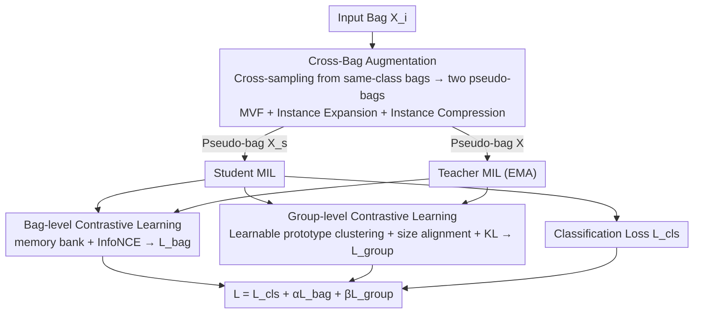

# Contrastive Cross-Bag Augmentation for Multiple Instance Learning-based Whole Slide Image Classification

**Conference**: CVPR 2026  
**Paper**: [CVF Open Access](https://openaccess.thecvf.com/content/CVPR2026/html/Zhang_Contrastive_Cross-Bag_Augmentation_for_Multiple_Instance_Learning-based_Whole_Slide_Image_CVPR_2026_paper.html)  
**Code**: https://github.com/weiaicunzai/mixup (Note: Repository name differs from method name, refer to the original paper)  
**Area**: Medical Image  
**Keywords**: Whole Slide Image Classification, Multiple Instance Learning, Pseudo-bag Augmentation, Cross-bag Sampling, Contrastive Learning  

## TL;DR
Addressing the restricted diversity issue in weak-supervised WSI classification where pseudo-bag augmentation "only samples within one or two bags," C2Aug constructs pseudo-bags by sampling instances across all same-class bags in the dataset (addition-and-merge rather than reduction-and-merge). It utilizes bag-level and group-level contrastive learning to mitigate the side effect of "reduced small tumor region samples," achieving superior AUC over existing augmentation methods on CAMELYON-16, TCGA-LUNG, and TCGA-BRCA datasets.

## Background & Motivation
**Background**: Whole Slide Images (WSI) feature high resolutions of approximately $100,000 \times 100,000$ pixels. Pixel-level annotation of tumor regions is extremely costly. Consequently, Multiple Instance Learning (MIL) is the standard approach: a slide is partitioned into numerous patches, each encoded as an instance, and all instances from a slide constitute a "bag." Supervision is provided only at the bag level (e.g., "contains tumor or not"). Since WSI data is often locked in hospitals and public datasets are small, MIL models are prone to overfitting, leading researchers to use pseudo-bag augmentation to expand samples.

**Limitations of Prior Work**: Existing pseudo-bag augmentations fall into two categories: self-augmentation (sampling/generating instances only within the input bag) and Mixup-style augmentation (mixing two bags). Both suffer from **limited diversity** as pseudo-bags are sampled from only one or two bags, resulting in a small pool of combinable instances. Furthermore, most methods follow a "reduction-and-merge" strategy, selecting key instances via attention/prediction scores before fusion. This selection process introduces instance-level noise and risks discarding critical tumor instances.

**Key Challenge**: The most direct way to enhance pseudo-bag diversity is to expand the sampling pool (cross-bag sampling). However, inserting more tumor instances across bags causes a side effect: **"pseudo-bags containing only a few tumor instances" become rarer during training**. Real-world test slides contain many cases where the tumor area is $<1\%$ (positive slides in CAMELYON-16 often have $<10\%$ tumor area). The mismatch between training distribution and these hard samples degrades model performance on small tumor regions. A tension exists between diversity and small tumor region separability.

**Goal**: (1) Maximize pseudo-bag diversity without losing instances or introducing noise; (2) Compensate for the side effect of "diluted" small tumor area samples.

**Key Insight**: The authors observe that "all bags under the same bag-level label" naturally form a noise-free instance pool. As long as the bag-level label is consistent during sampling, instances from other bags will not contaminate the label. Thus, the sampling scope is expanded from "one or two bags" to "all same-class bags in the entire dataset," while maintaining the **original input bag** (addition-and-merge) instead of replacing it.

**Core Idea**: Replace "intra-bag/dual-bag selection + fusion" (reduction-and-merge) with "sampling across all same-class bags + merging into the original bag" (addition-and-merge). Simultaneously, bag-level and group-level contrastive learning are applied to pull semantically similar features closer in the embedding space to specifically rescue small tumor region slides.

## Method

### Overall Architecture
C2Aug is an augmentation and contrastive learning framework that **operates only during training** (inference uses the original bag without augmentation). Given an input bag $X_i$, it first uses Cross-Bag Augmentation to sample instances from the same-class bag pool, generating two different pseudo-bags $X_s$ and $X$. These are fed into student and teacher MIL models, respectively; the teacher parameters are updated via Exponential Moving Average (EMA) of the student. Bag-level representations from both branches are used to compute a bag-level contrastive loss $\mathcal{L}_{bag}$ via a memory bank. Instance outputs are compressed into group-level representations using "learnable prototype clustering + size alignment" to compute a group-level contrastive loss $\mathcal{L}_{group}$. The student branch also computes a classification loss $\mathcal{L}_{cls}$. The three losses are weighted and combined for joint training.

### Key Designs

**1. Cross-Bag Augmentation: Sampling across all same-class bags, addition-and-merge for pseudo-bags, with three sub-augmodules managing instance and bag length diversity.**

This is the core of the paper, addressing the "small sampling pool and limited diversity." It samples instances from **all bags with the same label as $X_i$** and merges them into the original bag, coordinated by three sub-modules:

- *Multi-View Fusion (MVF, Instance-level Augmentation)*: For the $j$-th instance $x_{i,j}$ in the original bag, $m$ "corresponding position" instances $\{v_{1,j},\dots,v_{m,j}\}$ are sampled from other same-class bags to form a multi-view set. Cross-Attention is used to fuse them into $x_{i,j}$, where $Q$ comes from the original instance and $K/V$ from external instances:

$$\text{CrossAttention}(Q,K,V)=\text{Softmax}\!\left(\frac{QK^\top}{\sqrt{d}}\right)V$$

The bag length remains unchanged, but each instance is "infused" with multi-view information, increasing **single instance diversity**. To allow different numbers of fused views $m'$ for different instances (ranging from $1\sim m$), masked positions in $QK^\top$ are set to $-9999$ to zero out weights after Softmax. Masking uses three strategies: element-wise random (masked number follows binomial distribution $P(m_j')=\binom{m}{m_j'}p^{m_j'}(1-p)^{m-m_j'}$), row-wise random ($m_j'$ follows uniform distribution $P=1/m$), and Top-k random (masking based on attention scores).
- *Instance Expansion (IE, Lengthening Bags)*: $n_e$ instances are sampled from same-class bags and appended to the original bag, where $n_e\sim \text{Uniform}[0,\,n_{max}-n]$ ($n_{max}$ is the maximum bag length in the training set). This produces a pseudo-bag of length $n+n_e$, introducing variable-length diversity.
- *Instance Compression (IC, Shortening Bags)*: The bag is split into $C=\lceil n/C_r\rceil$ folds based on a compression ratio $C_r$. Each fold is compressed into one instance using a **shared learnable query** via Cross-Attention, resulting in a pseudo-bag of length $C$. $\tilde C_r$ is uniformly sampled from $[2, C_r]$ each round to increase diversity.

These three modules cover "instance-level representation / bag lengthening / bag shortening." The key difference is that while old methods use sampling-based subtraction (selecting instances and dropping others), which loses key instances and introduces noise, C2Aug uses **compression-based** transformations and **consistently preserves the original input bag** (addition-and-merge). This preserves class-relevant features while expanding the sampling scope to the entire dataset.

**2. Bag-level Contrastive Learning: Student-teacher dual branches pulling semantically similar bag representations together.**

As cross-bag augmentation increases tumor instances, "small tumor pseudo-bags" decrease. It is necessary to actively pull same-class bags together in the representation space. Using a student-teacher framework similar to DINO, two bag representations $z_i, z_i'$ (MIL output via projection head + L2 normalization) are obtained for the same $X_i$ using different augmentations. The teacher is updated via EMA and generates the positive sample $z_i^+$; negative samples are representations of other bags in the teacher branch stored in a memory bank of capacity $k$. The loss follows the InfoNCE format:

$$\mathcal{L}_{bag}=-\log\frac{\exp(\text{sim}(z_i,z_i^+)/\tau)}{\sum_{j=1}^{k+1}\exp(\text{sim}(z_i,z_j)/\tau)}$$

where $\text{sim}(\cdot)$ is cosine similarity and $\tau$ is temperature. t-SNE shows that with $\mathcal{L}_{bag}$, tumor bag features cluster significantly, whereas they are scattered without it—proving it recovers separability for small tumor regions.

**3. Group-level Contrastive Learning: Learnable prototype clustering + size alignment to avoid instance-level contrastive noise.**

Direct instance-level contrastive learning problematic: semantically similar instances from different bags (which should be positive) might be treated as negative pairs, introducing noise. Instead, semantically similar instances are grouped before contrastive learning. Specifically, $C$ **learnable prototypes** are initialized. The cosine similarity matrix between instances and prototypes is used to assign each instance to the most similar prototype. Each group is compressed into a group representation using Cross-Attention (prototypes as $Q$, instances as $K/V$), effectively **aligning the sizes** of student/teacher instance outputs (originally $n_s\neq n_t$) to $g_s, g_t \in \mathbb{R}^{C \times d}$. Centering and sharpening are applied to teacher group representations to prevent collapse, and group representations are converted to probability distributions $P_s^c, P_t^c$ to be minimized via KL divergence:

$$\mathcal{L}_{group}=\sum_{c=1}^{C}P_s^c\log\frac{P_s^c}{P_t^c}$$

Compared to RetCCL which uses K-means for non-trainable centers, these prototypes are learnable and more expressive.

### Loss & Training
The total loss is the sum of the classification loss and two contrastive losses:

$$\mathcal{L}=\mathcal{L}_{cls}+\alpha\mathcal{L}_{bag}+\beta\mathcal{L}_{group}$$

where $\alpha, \beta$ are weighting hyperparameters. The teacher branch uses EMA updates and stop-gradient. C2Aug is only active during training; during inference, the original bag is processed without augmentation, meaning no additional inference overhead. It can be integrated as a plug-and-play module into any MIL backbone (DSMIL / TransMIL / DTFD-MIL).

## Key Experimental Results

### Main Results
Three datasets (CAMELYON-16, TCGA-LUNG, TCGA-BRCA), three MIL backbones, and two feature extractors (ResNet50 / Prov-Gigapath) were evaluated using five-fold cross-validation. Representative AUC results (%) for TransMIL + ResNet50:

| Dataset | vanilla | RankMix | AugDiff | PRDL | C2Aug (Ours) |
|--------|---------|---------|---------|------|--------------|
| CAMELYON-16 | 89.9 | 90.4 | 91.4 | 91.2 | **94.7** |
| TCGA-LUNG | 91.3 | 91.9 | 92.5 | 93.2 | **94.1** |
| TCGA-BRCA | 88.4 | 89.0 | 91.2 | 90.8 | **92.5** |

With Prov-Gigapath features + TransMIL, the AUC on CAMELYON-16 reached **98.9%** (vanilla 95.1%, Gain +3.8), and ACC was 97.3% (Gain +3.4 over vanilla). On CAMELYON-16, which is dominated by small tumor regions, C2Aug improved TransMIL AUC by 5.6% relative to the baseline, the largest gain—validating its design motivation for small tumor regions.

### Ablation Study
Ablation of Cross-Bag sub-modules (TransMIL, CAMELYON-16, AUC %):

| Configuration | ResNet50 AUC | Prov-Gigapath AUC | Description |
|------|--------------|-------------------|------|
| C2Aug (Full) | 94.7 | 98.9 | All modules |
| w/o CB | 90.9 | 96.7 | Largest drop, cross-bag is fundamental |
| w/o MVF | 91.5 | 97.2 | No instance-level aug, second largest drop |
| w/o IC | 91.9 | 97.6 | No instance compression |
| w/o IE | 19.5 | 97.8 | No instance expansion, smallest drop |

Stratified ablation of contrastive losses by tumor percentage (CAMELYON-16 ACC %):

| Configuration | <1% | 1%~10% | Normal | Total |
|------|-----|--------|--------|-------|
| C2Aug | **82.4** | **91.4** | 93.8 | **91.9** |
| w/o $\mathcal{L}_{bag}$ | 81.3 | 90.0 | 93.4 | 90.4 |
| w/o $\mathcal{L}_{group}$ | 81.1 | 90.3 | 92.8 | 90.1 |
| w/o $\mathcal{L}_{bag}+\mathcal{L}_{group}$ | 80.6 | 89.5 | 92.7 | 89.4 |

### Key Findings
- **Cross-bag sampling is fundamental, followed by instance-level augmentation**: Removing the entire Cross-Bag module caused the largest drop (ResNet50 AUC 94.7 → 90.9). Among sub-modules, MVF (instance-level) caused the largest drop, while IE (lengthening) caused the smallest, indicating that "enriching single instance diversity" is more critical than "changing bag length."
- **Contrastive loss rescues small tumor regions**: Removing $\mathcal{L}_{bag} + \mathcal{L}_{group}$ resulted in the heaviest drops in tumor groups $<1\%$ (-1.8) and $1\% \sim 10\%$ (-1.9), while the normal group was nearly unaffected. This proves contrastive losses are key to compensating for the "dilution" side effect.
- **More and more random sampling is better**: AUC increased monotonically as the number of sampled bags went from 4 → 16 → 64 → All. "Random quantity per bag" outperformed "fixed quantity per bag" (ResNet50 +0.8 under full sampling), as the latter is a less diverse special case.
- **Preserving original bag is mandatory**: Replacing the original bag in MVF with random samples dropped normal slide AUC by 3.2%. Cross-class sampling tends to push the tumor percentage of every pseudo-bag toward the global average (~20%), smoothing out diversity; preserving the original bag maintains the semantic distribution.
- **Row-wise masking is optimal**: Among MVF masking strategies, Row-wise was best (uniform distribution of views, high diversity), element-wise (binomial) second, and no masking (fixed) worst.

## Highlights & Insights
- **Broadening sampling scope as a first-class citizen**: Unlike previous augmentations preoccupied with "how to select instances," this work shifts the dimension—expanding the sampling pool to all same-class bags and relying on bag-level label consistency to avoid noise.
- **Honestly addressing self-introduced side effects**: The authors did not ignore the dilution of small tumor cases caused by cross-bag sampling. Instead, they compensated with bag-level and group-level contrastive learning and provided stratified evidence—a closed-loop of "propose method → expose side effect → targeted fix."
- **Addition-and-merge vs. Reduction-and-merge Paradigm**: Preserving all input instances while adding more vs. selecting and discarding. This distinction from RankMix/DPBAug is clear and transferable to any "sample-and-fusion" augmentation.
- **Learnable Prototypes replacing K-means**: Using learnable prototypes + Cross-Attention for size alignment solves the engineering issue of unequal instances in student-teacher branches and is more expressive than fixed clustering centers in RetCCL.

## Limitations & Future Work
- **Questionable code link**: The provided repository `github.com/weiaicunzai/mixup` has a name inconsistent with the method, possibly a placeholder or error. Reproducibility is TBD.
- **Incomplete sensitivity analysis**: Sensitivity analysis for hyperparameters like $\alpha, \beta$, prototype count $C$, compression ratio $C_r$, and memory bank size $k$ was not fully detailed in the main text.
- **Dependence on large same-class pools**: Diversity gains depend on having many same-class bags; benefits might diminish in extremely small or highly imbalanced datasets.
- **Verification limited to binary/subtyping**: Experiments focused on 2-class tasks; effectiveness on multi-class or survival prediction remains unknown.
- **Increased training overhead**: The dual branches, memory bank, and three augmentations make training heavier, though inference remains zero-cost.

## Related Work & Insights
- **vs RankMix / DPBAug (Mixup-style Reduction-and-merge)**: These select key instances from 1-2 bags based on scores, dropping others and introducing noise. C2Aug samples across all same-class bags and preserves the original bag (addition-and-merge), offering higher diversity without label noise.
- **vs AugDiff / PRDL (Self-augmentation)**: These rely on instance-level generation/augmentation within the input bag, where diversity is capped by the single bag. C2Aug draws diversity from across the dataset and manages side effects via contrastive learning.
- **vs RetCCL (Bag-level + Group-level Contrastive)**: While both use two-level contrastive learning, RetCCL uses K-means with non-trainable centers, whereas C2Aug uses learnable prototypes and Cross-Attention for size alignment, which is more expressive and naturally handles varying instance counts.
- **vs DINO**: The student-teacher + EMA + centering/sharpening for bag representations is borrowed from DINO. The contribution here is migrating it to MIL bag representations and adding a memory bank for negative samples.

## Rating
- Novelty: ⭐⭐⭐⭐ Upgrading pseudo-bag augmentation from "intra/dual-bag" to "all same-class cross-bag sampling + addition-and-merge" with honest side-effect compensation.
- Experimental Thoroughness: ⭐⭐⭐⭐⭐ 3 datasets × 3 backbones × 2 features + 5-fold cross-validation. Detailed ablation of every sub-module and stratified tumor percentage analysis.
- Writing Quality: ⭐⭐⭐⭐ Clear logic loop (motivation-side effect-remedy); excellent visuals; minus point for the suspicious code link.
- Value: ⭐⭐⭐⭐ Plug-and-play, zero inference cost, significant gains for small tumor regions; highly practical for WSI weak-supervised classification.

<!-- RELATED:START -->

## Related Papers

- [\[CVPR 2026\] Universal-to-Specific: Dynamic Knowledge-Guided Multiple Instance Learning for Few-Shot Whole Slide Image Classification](universal-to-specific_dynamic_knowledge-guided_multiple_instance_learning_for_fe.md)
- [\[ICLR 2026\] ASMIL: Attention-Stabilized Multiple Instance Learning for Whole-Slide Imaging](../../ICLR2026/medical_imaging/asmil_attention-stabilized_multiple_instance_learning_for_whole-slide_imaging.md)
- [\[CVPR 2026\] MUSE: Harnessing Precise and Diverse Semantics for Few-Shot Whole Slide Image Classification](muse_harnessing_precise_and_diverse_semantics_for_few-shot_whole_slide_image_cla.md)
- [\[CVPR 2026\] Dual-Level Hypergraph Generation for Addressing Feature Scarcity in Whole-Slide Image Classification](dual-level_hypergraph_generation_for_addressing_feature_scarcity_in_whole-slide_.md)
- [\[CVPR 2026\] TopoSlide: Topologically-Informed Histopathology Whole Slide Image Representation Learning](toposlide_topologically-informed_histopathology_whole_slide_image_representation.md)

<!-- RELATED:END -->
